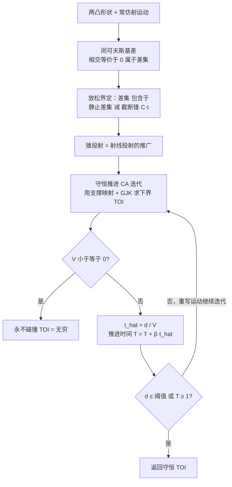

## 一句话总结

本文提出一种面向**凸形状 + 仿射运动**的连续碰撞检测（CCD）算法 C5D，用"锥投射（cone casting）"把两个仿射运动物体的求交问题化归为守恒推进（conservative advancement）迭代，在单线程上即可比图元级基线 ACCD 快约 10 倍，特别适合缺乏高端 GPU 的资源受限场景（如机器人策略训练中成千上万个实例并行仿真）。

## 研究背景

刚体或近刚体的物理仿真中，碰撞处理往往是性能瓶颈，尤其当需要严格保证"无穿透"约束时。主流思路有两条：

- **增量势能接触（IPC）** 及其刚体扩展 Rigid-IPC，用势垒函数强制无穿透，配合 CCD 过滤的投影牛顿求解器，能稳健地做到无穿透仿真。但经典刚体运动在时间步之间是**弯曲轨迹**，导致每次牛顿迭代都要做全局 CCD、计算撞击时间（TOI）的代价很高。
- **仿射体动力学（ABD）** 把刚性放松为仿射子空间内的小形变，使物体在步间呈**分段线性运动**，从而可以直接使用常规线性 CCD，是 ABD 相对 Rigid-IPC 大幅加速的关键。

问题在于：无论 IPC 还是 ABD，都依赖**图元级 CCD**（顶点-三角形、边-边对），通过解三次多项式求 TOI。其性能取决于图元对的数量——即使用哈希网格、BVH 做了粗筛，复杂场景仍会产生海量碰撞对，只能靠硬件并行硬扛。然而高端 GPU 并非随处可得：渲染要占用 GPU，机器人仿真中上千个实例并行时，实例间的并行是"免费"的，真正决定整体性能的是**每个实例的单线程执行效率**。

本文的切入点：不去逐个处理海量图元，而是用近似凸分解（ACD/CoACD）把碰撞形状拆成**少量凸代理**，在凸代理层面做**形状级 CCD**——这正是 Bullet、MuJoCo 等实时仿真器的常见做法。把它套进 ABD 会带来一个此前未被解决的新问题：**仿射运动下凸形状之间的 CCD**。

## 方法

### 问题设定

两个凸物体 $B_1(t)$、$B_2(t)$ 各自做**常仿射运动**：

$$B(t) = (I + tA)\bar{B} \oplus \{t v\}$$

其中 $\bar{B}$ 是静止形状，$A$ 是线性速度矩阵，$v$ 是平移速度向量，$\oplus$ 是闵可夫斯基和。带非平凡初始变换的一般仿射运动可以通过变量替换化归到上式的简化形式。CCD 目标是求撞击时间（TOI）：

$$t^* = \min\{t \ge 0 \mid B_1(t) \cap B_2(t) \neq \emptyset\}$$

为抵抗浮点数值不稳定，实践中求一个守恒估计 $\hat{t}^* \in (0, t^*]$，并维持形状间一个小间隙作为最小分离量。

### 核心思路：锥投射（Cone Casting）

用闵可夫斯基差把"两形状相交"等价改写为"差集是否包含原点"：

$$B_1 \cap B_2 \neq \emptyset \Leftrightarrow 0 \in B_1 \ominus B_2 \Leftrightarrow d(B_1 \ominus B_2) = 0$$

其中距离 $d(B) = \|c(B)\|$，最近点 $c(B)$ 可用 GJK 算法高效求得。随时间演化的闵可夫斯基差可以被一个更大的集合放松界定：

$$B_1(t) \ominus B_2(t) \subseteq (\bar{B}_1 \ominus \bar{B}_2) \ominus C(t)$$

其中 $C(t) = t\bar{C}$，$\bar{C} = A_2 \bar{B}_2 \ominus A_1 \bar{B}_1 \oplus \{v_{12}\}$。这给出 TOI 的一个下界：

$$t^*(B_1, B_2) \ge t^*(\bar{B}_1 \ominus \bar{B}_2,\ C)$$

几何直观：把 $\hat{t}^*$ 理解为静止形状 $\bar{B}_1 \ominus \bar{B}_2$ 被一个**截断锥** $\{sx \mid 0 \le s \le t,\ x \in \bar{C}\}$ 击中的最早时刻。这是渲染/游戏中常用**射线投射（ray casting）**的推广——当两个线性速度矩阵 $A_1, A_2$ 都为零时，锥退化为射线（沿 $v_{12}$ 出发），放松界取到等号，问题正好回到已有的射线投射 CCD。

### 守恒推进求解锥投射（C5D-Linear）

借助支撑映射 $s_B(v)$（把方向 $v$ 映射到 $B$ 在该方向上最远的点），对任意单位向量 $\hat{n}$，$s_B(-\hat{n}) \cdot \hat{n}$ 给出 $d(B)$ 的一个下界；取 $\hat{n}^* = c(\bar{B}_1 \ominus \bar{B}_2)/d(\bar{B}_1 \ominus \bar{B}_2)$ 时可得：

$$d\big((\bar{B}_1 \ominus \bar{B}_2) \ominus C(t)\big) \ge d(\bar{B}_1 \ominus \bar{B}_2) - tV$$

其中相对速度分量

$$V = \big(A_2 s_{\bar{B}_2}(A_2^\top \hat{n}^*) - A_1 s_{\bar{B}_1}(-A_1^\top \hat{n}^*) + v_2 - v_1\big) \cdot \hat{n}^*$$

- 若 $V \le 0$：形状永不碰撞，$t^* = +\infty$；
- 若 $V > 0$：$\hat{t}^* = d(\bar{B}_1 \ominus \bar{B}_2)/V$ 是一个守恒估计。

关键观察：单次锥投射迭代得到的 $\hat{t}^*$ **本身就是最终目标 $t^*(B_1,B_2)$ 的守恒下界**，因此无需内层多次迭代精修锥投射本身——推进当前时间到 $\hat{t}^*$、把运动重写为新的起点形式（用一次变量替换），再进入下一次 CA 迭代即可。实践中约 60 次迭代能给出足够精确的 TOI 估计。

### 近似相对运动（C5D-Quad / C5D-Quad-Pw）

C5D-Linear 对两个运动物体各做了一次放松，共两次。如果**只让一个物体动、另一个静止**，放松次数可减到一次，得到更紧的界、更快的收敛。自然想法是在 $B_1$ 的参考系里观察 $B_2$ 的相对运动，但相对变换 $T_{2[1]}(t)$ **不是关于 $t$ 线性的**，即相对运动不再是常仿射运动。

- **C5D-Quad**：对 $T_{2[1]}(t)$ 做一阶泰勒展开近似，误差用一个二次项 $t^2 S(R_2)$（半径 $R_2$ 的球）界定。此时下界变为二次不等式 $d(\bar{B}_1 \ominus \bar{B}_2) - tV - t^2 R_2 = 0$，恰有一个正根作为守恒 $\hat{t}^*$。由于两个参考系（在 $B_1$ 或 $B_2$ 中观察）会给出不同估计，方法**每次迭代交替切换参考系**以兼取两者之长。
- **C5D-Quad-Pw**：当形状是凸多面体时，进一步做**逐顶点（point-wise）**处理——对 $B_2$ 每个顶点分别解一个二次不等式得到逐点 TOI，取最小值作为全局守恒估计。这给出最紧的界、最少的迭代次数。

## 实验结果

实验在 Intel Core i9-13900KS 上进行，C++ 用 GCC -O2 编译。

### 合成数据（各 10000 组随机凸多面体对）

$N_{\text{raw}}$ 表示采样点数（凸包顶点数 $N_{\text{cvx}}$）。忠实摘录主表关键数字：

低分辨率 $N_{\text{raw}}=10$（$N_{\text{cvx}}=8.2$）：

- ACCD：迭代 $76.4 \pm 93.8$（最差图元对），耗时 $60 \pm 16\ \mu s$
- C5D-Linear：迭代 $32.9 \pm 40.9$，耗时 $20 \pm 26\ \mu s$
- C5D-Quad：迭代 $27.5 \pm 29.3$，耗时 $42 \pm 45\ \mu s$
- C5D-Quad-Pw：迭代 $16.3 \pm 10.6$，耗时 $25 \pm 16\ \mu s$

高分辨率 $N_{\text{raw}}=256$（$N_{\text{cvx}}=28.2$）：

- ACCD：迭代 $103.9 \pm 119.5$，耗时 $719 \pm 141\ \mu s$
- C5D-Linear：迭代 $40.9 \pm 55.3$，耗时 $48 \pm 60\ \mu s$
- C5D-Quad：迭代 $34.2 \pm 37.0$，耗时 $73 \pm 75\ \mu s$
- C5D-Quad-Pw：迭代 $14.3 \pm 7.9$，耗时 $32 \pm 16\ \mu s$

结论：所有 C5D 变体在运行时间上都优于 ACCD（避免了遍历图元对）。C5D-Quad-Pw 迭代次数最少、最稳定；但在低分辨率子集上 C5D-Linear 反而更快——因为其单次迭代更简单、更易被编译器优化。ACCD 的短板在于少数"困难图元对"会拖垮整体均值。

### 集成到 ABD 仿真（每步 CCD 性能，忠实摘录）

选取碰撞最密集的 20 个连续时间步取平均。Time 为每步 CCD 运行时间：

- **Dummies**（900 体，45K 顶点，901 凸块）：ACCD $9461.2$ ms → C5D-Linear $547.9$ ms（约 17 倍加速），C5D-Quad-Pw $1094.4$ ms
- **Bunnies**（54 体，64K 顶点，275 凸块）：ACCD $1129.2$ ms → C5D-Linear $210.6$ ms（约 5 倍），C5D-Quad-Pw $265.3$ ms
- **Gears**（14 体，11K 顶点，396 凸块）：ACCD $71.9$ ms → C5D-Linear $5.3$ ms（约 14 倍），C5D-Quad-Pw $9.8$ ms
- **Gachapon**（11 体，3K 顶点，129 凸块）：ACCD $209.6$ ms → C5D-Linear $16.8$ ms（约 12 倍），C5D-Quad-Pw $32.4$ ms
- **Wrecking Ball**（518 体，5K 顶点，519 凸块）：ACCD $291.5$ ms → C5D-Linear $44.3$ ms（约 5 倍），C5D-Quad-Pw $114.9$ ms
- **Pick**（6 体）单线程：ACCD $5.81$ ms → C5D-Linear $0.57$ ms

其中 CCD 查询数对比极其悬殊：以 Dummies 为例，ACCD 每步约 $2.6 \times 10^7$ 次图元级查询，而 C5D 只有约 $9.4 \times 10^4$ 次凸对查询。

**多线程（Pick 场景，24 核 CPU）**：

- 图元级并行 ACCD-prim：$2.28$ ms（约 2.5 倍加速，受线程通信开销限制）
- 场景级并行 ACCD-scene：$0.40$ ms（约 14.5 倍加速）
- C5D-Linear（场景级并行）：$0.043$ ms
- C5D-Quad-Pw（场景级并行）：$0.092$ ms

综合来看，C5D-Linear 在总运行时间上最优，约为 ACCD 的 10 倍、C5D-Quad-Pw 的 2 倍。原因是实际 ABD 仿真中每个子步的运动往往很简单（近似平移甚至静止），多数查询一两次 CA 迭代就收敛，此时 C5D-Quad-Pw 的二次保守界反而"用力过猛"，常需两次迭代而变慢。

## 亮点与局限

亮点：

- **换维度解决问题**：从"海量图元对"转向"少量凸代理 + 形状级 CCD"，从根子上砍掉了查询数量（可见几个数量级的查询数下降）。
- **锥投射是优雅的理论推广**：把仿射运动 CCD 统一到射线投射的框架下，$A=0$ 时自然退化为已有方法，理论自洽且附录给出了收敛性证明。
- **单线程高效 + 天然可扩展**：不依赖 GPU，单线程就有 10 倍级加速；再叠加场景级并行，对机器人策略训练这类"多实例并行"场景是理想搭配。
- **无缝接入 ABD**，且已开源实现。

局限（作者明确指出）：

- **凸性假设**：对高度非凸物体（如管道、环面），凸分解可能需要大量凸块才能逼近，削弱优势。
- **仿射运动假设**：对布料、绳索这类高度可形变物体不适用；当两个物体都可形变时，方法退化为类似 ACCD 的图元级 CCD，失去效率优势（仿射体与可形变体之间的耦合仍可处理，把可形变物体的每个图元当作一个凸块）。
- C5D-Quad-Pw 在简单运动占多数的真实场景中被 C5D-Linear 全面超越，其价值主要体现在合成数据里的困难样本上。

## 延伸思考

- 论文把加速的关键归结到"单线程效率"，这是一个值得注意的价值取向：在 GPU 稀缺或被渲染/训练占满的现实约束下，"能在一根线程上跑快"比"堆并行"更有工程意义。这对具身智能/机器人大规模仿真训练（成千上万实例）是直接利好。
- 作者提出的后续优化方向也很实在：用空间数据结构加速支撑映射计算、跨 CA 迭代复用 GJK 单纯形并加早停判据——这些都是把凸-凸 CCD 推向更高分辨率网格的自然路径。
- 一个开放问题：锥投射框架能否进一步推广到"分段仿射 + 有界二次残差"的更一般运动类别，从而在保持守恒性的同时逼近可形变体？C5D-Quad 的泰勒展开思路已经暗示了这条路径。
