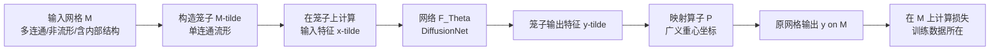

## 一句话总结

CageNet 提出一个可配置的"元框架"：用一个单连通、流形的笼子（cage）把结构复杂的"野生网格"包起来，借助广义重心坐标在笼子与原始网格之间建立可微映射，从而让原本只能处理干净流形网格的通用网络（如 DiffusionNet）直接在多连通、非流形、含内部结构的网格上完成分割、蒙皮权重等学习任务。

## 研究背景

神经网络已经成为几何处理的主力工具，广泛用于形状分类、分割、对应、变形等任务。这些方法中有一类"通用框架"特别受欢迎——它们对不同应用只需替换输入特征和损失函数即可复用，DiffusionNet 就是典型代表。

问题在于，现实中艺术家制作或数据集里存在的网格常常"不干净"：它们有多个连通分量、包含非流形元素、连通性被破坏、甚至混有非三角面。作者把这类网格称为"野生网格"（meshes in the wild）。现有的网格网络架构大多假设输入是流形单连通的，例如 MeshCNN 的卷积模板假设每条边只连接两个面，一旦遇到非流形边就失效；DiffusionNet 在多连通分量上表现也很差，因为信息无法在分离的组件之间传播。

已有的应对思路各有短板：逐问题定制几何算子（如非流形拉普拉斯算子）需要为每种缺陷单独改写网络并重训练，不具可扩展性；先做网格修复再送网络，则常常丢失表面属性或降低几何质量。作者的目标是提供一个通用、可复用的机制，让现成的网格架构无需改造就能直接作用于野生网格。

## 方法

### 整体框架

CageNet 的核心思路是"绕开"难处理的原始几何：不直接在野生网格 $$M$$ 上跑网络，而是构造一个干净的笼子 $$\tilde{M}$$，在笼子上运行网络，再把结果映射回原网格。给定一个把顶点/面上输入特征 $$x$$ 映射为输出特征 $$y$$ 的网络 $$F_\Theta$$，其流程为：为 $$M$$ 构造单连通流形笼子 $$\tilde{M}$$，定义一个可微映射算子 $$P$$ 把笼子上的函数映射到 $$M$$ 上；训练与测试都在笼子上应用 $$F_\Theta$$，再用 $$P$$ 把输出投影回 $$M$$，损失在原始网格 $$M$$ 上计算（训练数据就定义在 $$M$$ 上）。值得注意的是，从 $$M$$ 到 $$\tilde{M}$$ 的反向映射并不需要。

### 关键设计

**笼子构造。** 笼子需满足四个必要条件：流形、单连通、几何上贴近 $$M$$（减少细节损失）、全自动生成。另有两个"锦上添花"的性质：与输入拓扑等价、$$M$$ 位于笼子内部（利于良态权重）。由于现有笼子生成方法都无法同时满足这些必要约束，作者采用了一个朴素方案：计算输入形状的无符号距离场，用 Marching Cubes 抽取 $$\varepsilon$$ 等值面；通过对其他组件计算缠绕数（winding number）去除内部组件；若结果仍是多个不相连的分量，则以更大的偏移 $$\varepsilon_{new}=\varepsilon_{old}+\tfrac{1}{2}d_{max}$$ 重复，其中 $$d_{max}$$ 是两个分离组件间的最大距离，从而保证新等值面单连通；最后用二次误差边坍缩简化到 $$\tilde{m}$$ 个面，多数网格取 $$\tilde{m}=12K$$，若未能包住输入则可增至 $$\tilde{m}=24K$$。实验显示结果对面数不敏感。

**映射算子 $$P$$。** 作者用广义重心坐标构造一个线性映射。对原网格上任一点 $$p\in M$$，其相对于笼子的广义重心坐标为 $$\{\lambda_1(p),\lambda_2(p),\dots,\lambda_{\tilde{n}}(p)\}$$ 且 $$\sum_j \lambda_j=1$$。映射算子定义为 $$P(M,\tilde{M},\tilde{y})=C_{\tilde{M}}(X_M)\tilde{y}$$，其中 $$X_M$$ 是原网格顶点坐标，$$C_{\tilde{M}}$$ 是 $$n\times\tilde{n}$$ 矩阵，第 $$(i,j)$$ 个元素为 $$\lambda_j(p_i)$$。因此 $$y$$ 是笼子函数值 $$\tilde{y}$$ 的重心坐标加权平均。作者比较了三类坐标：均值坐标（MVC）有闭式表达、无需包裹式笼子、计算高效；调和坐标（harmonic）与双调和坐标（biharmonic）需要包裹式笼子、无闭式解、要解 PDE 优化，代价高。表达力上 MVC 与双调和相近，而调和坐标由于函数由边界值决定，难以表达内部结构的不同函数值。综合表达力与效率，全部实验采用 MVC。

**训练与测试。** 底层网络采用 DiffusionNet（因其对笼子网格剖分鲁棒，且框架本身通用可换其他网络）。训练前预先算好所有网格的笼子与广义重心坐标。关键点在于损失直接定义在原始数据上：把笼子输出经 $$P$$ 映射到原网格顶点，若标注在边或面上则再平均到边/面并施加末端激活。CageNet 能"从干净网格训练、在野生网格测试"实现泛化。

## 实验结果

作者在两个应用上验证框架：人体分割与蒙皮权重预测。实现基于 PyTorch，训练在单张 NVIDIA RTX A4500（20GB 显存）、128GB 内存的机器上完成。

### 人体分割

在 Maron 等人的人体分割基准（全为单连通网格）上，CageNet 与其所基于的 DiffusionNet 精度持平，说明"套笼子"不损害干净网格上的表现；而在人为制造的多连通分量网格上（去掉部分面），CageNet 泛化明显更好（DiffusionNet 从 93.9% 跌至 68.7%，CageNet 保持 93.5%）。在把每个测试模型打散为三角汤并随机翻转一半法线的"souped"数据集上，CageNet 仍取得 91.7%，与干净数据集一致。

下表汇总了基准上的分割精度（%）：

| 方法 | 精度 | 方法 | 精度 |
| --- | --- | --- | --- |
| GCNN | 86.4 | MeshWalker | 92.7 |
| ACNN | 83.7 | CGConv | 89.9 |
| Toric Cover | 88.0 | FC | 92.5 |
| PointNet++ | 90.8 | DiffusionNet | 91.7 |
| MDGCNN | 88.6 | MeshMAE | 90.0 |
| DGCNN | 89.7 | SubdivNet | 93.0 |
| SNGC | 91.0 | SieveNet | 93.2 |
| PFCNN | 91.5 | CageNet（本文，无增强） | 90.4 |
| HSN | 91.1 | CageNet（本文） | 91.7 |
| PD-MeshNet | 86.9 | CageNet（本文，Souped 数据集） | 91.7 |

作者还引入笼子偏移增强：为每个训练网格在偏移 0.005、0.01、0.015、0.02 处生成多个笼子（模型归一化到单位盒），每个 epoch 随机选一个，测试时用最小偏移。该增强提升了对拓扑噪声的鲁棒性（无增强时精度降至 90.4%），且不增加训练循环时间与推理时间。

### 蒙皮权重

数据集为 753 个艺术家制作的双足角色（来自 Roblox 平台），保留 75 个作为测试集，所有网格共享同一姿态、朝向与骨架拓扑。输入特征为笼子顶点坐标以及笼子顶点到骨骼的体积测地距离；对每个顶点权重施加 softmax 以满足非负且和为 1。损失由 KL 散度、鼓励稀疏的 $$L_p$$ 项与鼓励对称的对称损失组成：$$L=\text{KL}(\hat{s},s)+\lambda_p L_p(\hat{s})+\lambda_{sym}\text{Sym}(\hat{s},s)$$，取 $$p=0.3$$、$$\lambda_p=0.1$$、$$\lambda_{sym}=0.05$$。

与 BBW、GeoVoxel（GV 为默认参数，GV* 为推荐参数）、RigNet 对比，评价指标包括平均 $$L_1$$ 误差（越低越好）、精确率、召回率、$$F_1$$ 分数、动画帧平均顶点距离与最大顶点距离。"Ours-S"表示对小于 0.2 的权重阈值置零以增强稀疏性。

| 方法 | 平均 $$L_1$$ | 精确率 | 召回率 | $$F_1$$ | 平均距离 | 最大距离 |
| --- | --- | --- | --- | --- | --- | --- |
| BBW | 0.575 | 45.80 | 97.06 | 56.58 | 0.009 | 0.410 |
| GV | 0.687 | 42.14 | 99.99 | 55.54 | 0.009 | 0.658 |
| GV* | 0.645 | 75.11 | 89.24 | 76.80 | 0.008 | 0.7046 |
| RigNet | 0.153 | 98.11 | 87.17 | 90.41 | 0.002 | 0.697 |
| Ours | 0.124 | 88.70 | 98.78 | 91.72 | 0.002 | 0.692 |
| Ours-S | 0.135 | 98.09 | 88.85 | 91.53 | 0.002 | 0.697 |

CageNet 在平均 $$L_1$$ 误差和 $$F_1$$ 分数上均最优，平均顶点距离与 RigNet 并列最佳；最大顶点距离由 BBW 取得（因其不受"欧氏近而测地远"区域的影响）。值得强调的是，RigNet 是专门为蒙皮权重设计的网络，而 CageNet 用的是通用网络就达到了相当甚至更好的结果。作者还展示了对三角汤、加噪三角汤与随机翻转法线的鲁棒性，预测结果与原网格基本一致。

消融实验（Roblox 数据集）表明：完整配置（MVC + 全部损失项）平均 $$L_1$$ 最优（0.124），紧随其后的是调和坐标（0.127）；去掉 $$L_p$$ 损失会因权重不再稀疏导致精确率大幅下降（$$F_1$$ 降至 71.15）；去掉对称损失会破坏权重对称性并抬高误差。

## 亮点与局限

亮点：这是一个"元框架"，把处理野生网格的难题从"逐缺陷改写网络"转化为"统一套一个笼子"，让现成的网格网络零改造直接适用，配置成本极低（只需定义输入特征与损失）。用广义重心坐标构造的可微线性映射简单且高效，MVC 在表达力与速度上取得很好折中。据作者所知，这也是首个用通用网格网络处理蒙皮权重问题的方法（在已知固定骨架的前提下）。

局限：对于存在自交的网格，若相交区域标签或特征值不同则会出问题，因为体积标量函数在同一空间点无法取多值，未来可考虑多值函数（如用多项式系数表示多项式根）；尽管有笼子偏移增强，方法对笼子生成带来的拓扑不一致仍有一定敏感性，更鲁棒的笼子生成或自适应偏移有望改善；框架目前以 DiffusionNet 为例，结合其他网络架构与其他广义重心坐标是有前景的方向；蒙皮应用目前限定于固定骨架拓扑。

## 延伸思考

CageNet 的价值在于提供了一个"适配层"思路：与其不断为脏数据打补丁，不如把脏数据投影到一个干净的代理域上处理，再映射回来。这种"包裹—映射—回投"的范式本质上是把几何的拓扑复杂性与网络的学习能力解耦，笼子承担了"规整化"的角色。它天然适合体积型标量场任务（分割、蒙皮），但对需要保留精细表面细节或多值信息的任务（如自交区域的差异化标注）就会受限——这也提示笼子的"包裹粒度"与"表达力"之间存在根本权衡。若能把笼子生成本身做成可学习、拓扑自适应的模块，并支持向量场或多值场，这个框架的适用面还能进一步扩大。
