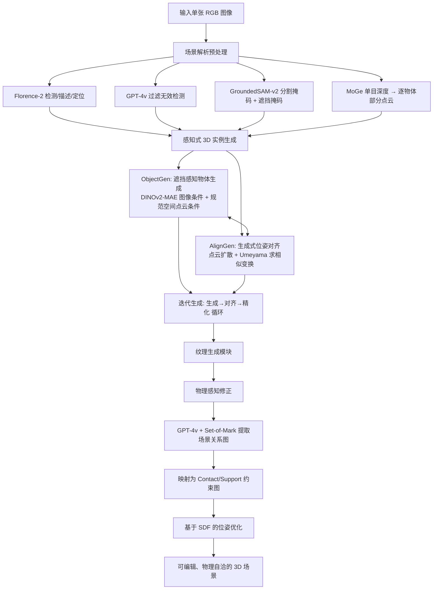

## 一句话总结

CAST 把单张 RGB 图像拆成一个个物体，用「遮挡感知的原生 3D 生成 + 生成式位姿对齐 + 物理感知修正」三段式流水线，逐个生成高保真网格并对齐到场景，最终得到可编辑、物理上自洽的组件化 3D 场景。

## 研究背景

从单张图像恢复高质量 3D 场景是计算机图形学的经典难题。把成熟的单物体生成方法简单地"逐个生成再拼装"到整个场景，会遇到两类根本性障碍：

- 位姿估计不准。现有方法常假设物体是"视角对齐"的正面朝向，但真实场景中物体受设计、物理和遮挡约束，朝向千差万别。多数方法重视几何保真度，却忽视了位姿对齐这一关键环节。
- 缺乏物体间空间关系。即使位姿准确，生成的场景也常出现物理上不合理的瑕疵：物体互相穿插、悬空漂浮、该接触的地方没接触。这些错误源于没有显式建模把物体绑定在一起的空间与物理约束。

已有工作要么用编码器-解码器隐式编码空间关系但局限于室内等特定域（如 InstPIFu），要么在全局坐标系里摆放物体却忽略相对位姿与依赖关系（如 Gen3DSR），要么依赖固定数据集做检索（如 ACDC）导致域外场景失效。CAST 的目标是在开放词表设定下，只用单张图像，重建出几何精细、纹理生动、且物体之间空间与物理关系正确的可编辑场景。

## 方法

CAST 的核心思路是"分而治之再对齐"：不直接生成整场景网格，而是逐个物体在规范空间内生成，再通过精确的关系对齐组合起来。整体流程分为三大阶段。

### 预处理：场景解析

用 Florence-2 识别物体、生成描述并给出包围框；GPT-4v 过滤掉虚假检测、保留有意义的组成物体，实现不受预定义类别限制的开放词表识别；GroundedSAM-v2 为每个物体 $\boldsymbol{o}_i$ 产生精细分割掩码 $\boldsymbol{M}_i$ 与遮挡掩码；同时用 MoGe 生成像素对齐的逐物体部分点云 $\boldsymbol{q}_i$ 与全局相机参数，为后续几何对齐提供结构参考。

### 阶段一：感知式 3D 实例生成

基础生成模型沿用 3DShape2VecSet / CLAY 的原生 3D 生成范式。几何 VAE 把表面采样点云编码为无序潜码，再解码为 SDF：

$$\boldsymbol{Z} = E(\boldsymbol{X}), \quad D(\boldsymbol{Z}, \boldsymbol{p}) = \mathrm{SDF}(\boldsymbol{p})$$

图像条件用 DINOv2 编码，几何潜扩散模型（LDM）形式为：

$$\epsilon_{\text{obj}}(\boldsymbol{Z}_t; t, \boldsymbol{c}) \rightarrow \boldsymbol{Z}$$

**遮挡感知物体生成（ObjectGen）**：真实场景常有遮挡，直接用 3D 生成模型会退化。CAST 借助 DINOv2 的 MAE 能力——推理时给编码器同时输入图像 $\boldsymbol{I}$ 和遮挡掩码 $\boldsymbol{M}$，让它推断被遮挡区域的隐特征：

$$\boldsymbol{c}_m = E_{\text{DINOv2}}(\boldsymbol{I} \odot \boldsymbol{M})$$

**规范空间点云条件**：高层图像特征难以保证像素对齐几何，于是额外用规范坐标下的部分点云做条件。训练时用多视角渲染 + MoGe/Metric3D 深度估计模拟真实部分扫描，并在真值点云 $\boldsymbol{p}_{\text{gt}}$ 与估计点云 $\boldsymbol{p}_{\text{est}}$ 之间做插值增广：

$$\boldsymbol{p}_{\text{disturb}} = \alpha \cdot \boldsymbol{p}_{\text{gt}} + (1-\alpha) \cdot \boldsymbol{p}_{\text{est}}$$

加上点云条件后的生成器为：

$$\epsilon(\boldsymbol{Z}_t; t, \boldsymbol{c}, \boldsymbol{p}_{\text{disturb}}) \rightarrow \boldsymbol{Z}$$

关键设计是保持增广点云与几何的对齐（不做随机缩放/平移/旋转），从而让模型紧贴物体真实尺度与局部细节。

**生成式位姿对齐（AlignGen）**：生成的物体处于规范姿态，需要对齐回场景。传统 ICP 缺乏语义、易陷局部极小。CAST 用点云扩散 Transformer，把场景空间部分点云 $\boldsymbol{q}$ 映射到规范空间的 $\boldsymbol{p}$：

$$\epsilon_{\text{align}}(\boldsymbol{p}_t; t, \boldsymbol{q}, \boldsymbol{Z}) \rightarrow \boldsymbol{p}$$

因为 $\boldsymbol{q}$ 与 $\boldsymbol{p}$ 点点对应，再用 Umeyama 算法恢复相似变换（缩放、旋转、平移），比直接回归变换参数在数值上更稳定。对于对称或重复几何导致的多解，通过多次采样噪声并聚合，选取最一致的结果。

**迭代生成流程**：生成与对齐交替进行。第 $k$ 步先用图像特征与规范点云生成几何潜码（点云条件缩放因子 $\beta^{(k)}$ 从 0 逐步增到 1）：

$$\boldsymbol{z}^{(k)} = \text{ObjectGen}(\boldsymbol{c}, \boldsymbol{p}^{(k)} \otimes \beta^{(k)})$$

再用对齐模块预测更新的规范空间部分点云：

$$\boldsymbol{p}^{(k+1)} = \text{AlignGen}(\boldsymbol{q}, \boldsymbol{z}^{(k)})$$

如此循环直到变换参数变化低于阈值或达到最大迭代次数。最后用纹理生成模块绘制 UV 纹理。

### 阶段二：物理感知修正

单独生成的物体拼在一起可能穿插或悬空。CAST 不做完整刚体动力学模拟（部分场景、几何瑕疵、初始穿透都会让标准模拟器失稳），而是把修正表述为优化问题，最小化物体间成对约束代价：

$$\min_{\mathcal{T}=\{T_1,\dots,T_N\}} \sum_{i,j} C(T_i, T_j; \boldsymbol{o}_i, \boldsymbol{o}_j)$$

关系分两类，均用 SDF $D_i(p)$ 定义。**Contact（接触）** 是双向约束，要求无穿透（$D_j(p)<0$ 表示穿插要惩罚）且至少一个接触点；**Support（支撑）** 是单向约束，被支撑物 $\boldsymbol{o}_j$ 的位姿优化、支撑物 $\boldsymbol{o}_i$ 视为静止：

$$C(T_i, T_j) = \vert \min_{p \in \partial \boldsymbol{o}_j} D_i(p(T_j))\vert , \quad \text{若 } \boldsymbol{o}_i \text{ 支撑 } \boldsymbol{o}_j$$

对地面、墙面等平坦支撑面，还对接触区域附近的 SDF 值做正则，以处理只重建了部分几何（如只有两个轮子的货车）的情形。

**场景关系图**：用 GPT-4v 配合 Set-of-Mark（随机着色 + 编号）视觉提示来识别关系，并采用集成策略——多次采样，出现超过半数才认定关系可靠。不直接问 Support/Contact，而是先让 GPT-4v 输出更细粒度的六类接触关系（Stack、Lean、Hang、Clamped、Contained、Edge/Point），再映射到 Support 与 Contact 上，减少二分类的歧义。SDF 用 Open3D 计算，PyTorch 自动微分损失。

## 实验结果

**开放词表场景对比（Tab. 1）**：与检索式 ACDC、生成式 Gen3DSR 相比，CAST 在四项指标上全面领先。

| 方法 | CLIP↑ | GPT-4↓ | 视觉质量 VQ↑ | 物理合理性 PP↑ |
|------|-------|--------|------|------|
| ACDC | 69.77 | 2.7 | 5.58% | 22.86% |
| Gen3DSR | 79.84 | 2.175 | 6.35% | 5.72% |
| CAST（本文） | **85.77** | **1.125** | **88.07%** | **71.42%** |

用户研究中，CAST 在视觉质量和物理合理性上分别获得 88.07% 和 71.42% 的偏好率，遥遥领先。

**3D-Front 室内数据集定量对比（Tab. 2）**：为公平起见，其他方法的分割模块统一替换为真值掩码。CAST 在物体级和场景级几何质量上都最优。

| 方法 | CD-S↓ | FS-S↑ | CD-O↓ | FS-O↑ | IoU-B↑ |
|------|-------|-------|-------|-------|--------|
| ACDC | 0.104 | 39.46 | 0.072 | 41.99 | 0.541 |
| InstPIFu | 0.092 | 39.12 | 0.103 | 38.29 | 0.436 |
| Gen3DSR | 0.083 | 38.95 | 0.071 | 39.13 | 0.459 |
| CAST（本文） | **0.052** | **56.18** | **0.057** | **56.50** | **0.603** |

**模块消融（Tab. 3）**：从 Vanilla 逐步叠加各组件，指标持续改善，验证每个模块都有贡献。

| 方法 | CD-S↓ | FS-S↑ | CD-O↓ | FS-O↑ | IoU-B↑ |
|------|-------|-------|-------|-------|--------|
| Vanilla | 0.079 | 53.38 | 0.069 | 52.83 | 0.515 |
| + MAE | 0.064 | 53.79 | 0.066 | 54.32 | 0.548 |
| + PCD（点云条件） | 0.056 | 53.91 | 0.060 | 54.60 | 0.582 |
| + iter.（迭代精化） | **0.052** | **56.18** | **0.057** | **56.50** | **0.603** |

定性消融进一步说明：去掉 MAE，被遮挡物体（如飞船、杯子）会破碎缺失；去掉点云条件，物体数量和尺度（如六本堆叠书）会出错；对齐模块优于 ICP 和可微渲染；去掉关系图约束会出现物体掉落或错位。

**实现规模**：ObjectGen 用 24 层 Transformer、约 15 亿参数，在约 50 万筛后的 Objaverse 资产上预训练，条件模块用 20 万精选数据训练 3000 epoch、64 张 A800 约一周。AlignGen 约 1.5 亿参数，训练约两天。推理时单物体生成约 7 秒、纹理约 10 秒、位姿对齐约 1 秒（A6000）。

## 亮点与局限

亮点：

- 组件化、分而治之的思路把成熟的单物体原生 3D 生成能力迁移到场景级，天然支持开放词表、可编辑网格、UV 与可分解材质，契合传统生产管线。
- 用"生成"的方式做位姿对齐（AlignGen + Umeyama），比直接回归位姿更稳定，也能通过多采样处理对称/重复几何的多解。
- 遮挡感知（DINOv2-MAE）+ 规范空间点云条件的双重设计，同时保证视觉一致性与几何尺度精度。
- 物理修正没有硬套完整刚体模拟，而是借助 VLM 常识关系图构造 SDF 约束优化，规避了部分场景、几何瑕疵、初始穿透带来的模拟失稳。

局限（作者自述）：

- 场景质量强依赖底层物体生成模型，细节与精度仍不足，会影响对齐与空间关系。
- 网格表示难以刻画织物、玻璃、透明材质，常显得不自然。
- 缺少光照估计与背景建模，目前靠现成全景 HDR 工具 + Blender 手动预设光照来补足视觉真实感。
- 复杂场景（密集物体、复杂布局）下性能会有所下降。

## 延伸思考

CAST 展示了一条把"物体级基础生成模型"组合成"场景级重建"的清晰路径，核心贡献其实是两块黏合剂：生成式位姿对齐把规范空间物体贴回真实场景，VLM 关系图 + SDF 优化把物体间的物理关系补齐。这种解耦让系统既能吃到大规模单物体生成的红利，又能保留可编辑、物理自洽的下游价值（机器人 real-to-sim、游戏关卡、影视布景）。

值得进一步探索的方向包括：把光照与背景纳入统一生成框架，让重建结果不再依赖手工打光；用可微或物理更完备的关系推理替代 VLM 采样投票，减少对 GPT-4v 常识的依赖；以及利用 CAST 批量产出的场景反哺训练全学习式的场景/视频生成模型，形成数据飞轮。透明与织物材质的表达则需要在网格之外引入更合适的表示（如 volumetric 或 BSDF 感知的生成）。
