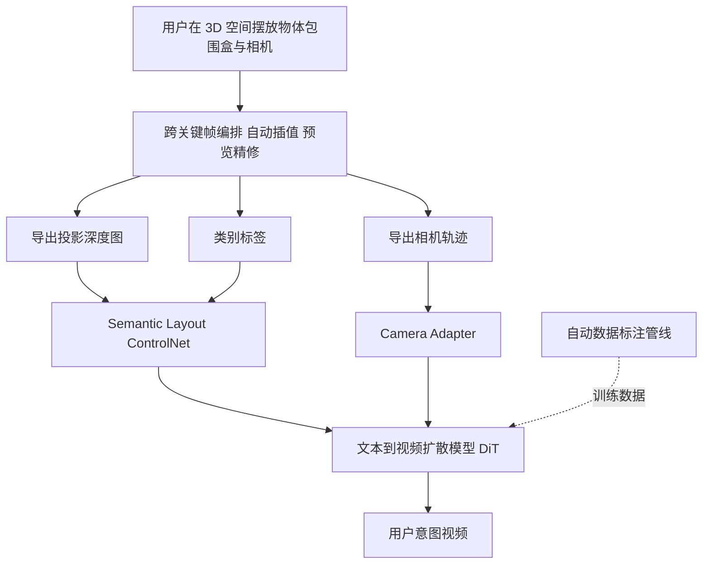

## 一句话总结

本文提出 CineMaster，一个 3D 感知的可控文本到视频生成框架：先让用户在 3D 空间中像电影导演一样摆放物体包围盒、设计相机运动，再把渲染出的深度图、相机轨迹与类别标签作为条件注入文本到视频扩散模型，从而实现对物体运动与相机运动的联合可控生成。

## 研究背景

- 领域现状：随着扩散模型和大规模预训练的发展，文本到视频生成（T2V）快速进步，用户仅凭文本提示就能生成质量可观的视频；随之而来的是对生成过程进行细粒度控制的需求，可控视频生成受到越来越多关注。
- 核心痛点：现有可控方法离"像专业导演一样操控"的理想仍有差距。早期工作把图像域的 ControlNet 扩展到视频，用深度图、语义图、光流、canny 边缘等条件图引导，但这些条件图通常依赖已有视频获取，难以从零创建；MotionCtrl、Direct-A-Video 等虽能同时控制物体与相机运动，却只支持 2D 物体控制，与创作者在 3D 空间规划拍摄的方式不符；更新的 3D 感知方法要么只面向图像到视频，要么依赖 Unreal Engine 合成数据，泛化受限。此外，带有 3D 物体运动与相机位姿标注的真实视频数据极度稀缺。
- 本文 idea：设计一个 3D 原生的交互式工作流，让用户直接在 3D 空间摆放物体包围盒与相机、跨关键帧编排运动；把工作流导出的投影深度图、相机轨迹、类别标签作为强条件送入 T2V 扩散模型；同时构建一条自动数据标注管线，从大规模真实视频中提取 3D 包围盒与相机轨迹，解决训练数据缺失问题。

## 方法

### 整体框架

CineMaster 分两个阶段。第一阶段是交互式工作流：用户在 3D 场景中用带语义标签的 3D 包围盒表示主要物体，跨关键帧调整包围盒与相机的位置、姿态，系统自动插值中间帧并提供渲染预览，反复精修直到满意，最终导出相机轨迹与逐帧投影深度图。第二阶段是条件视频生成：把深度图、相机轨迹、类别标签作为控制信号，微调一个文本到视频扩散模型来生成用户想要的视频。为解决训练数据缺失，作者还设计了自动标注管线来构造带 3D 包围盒和相机位姿标注的大规模数据集。

### 关键设计

基座模型。方法建立在一个预训练文本到视频基座上，由 3D VAE、T5 文本编码器和基于 Transformer 的潜空间扩散模型组成，每个 Transformer 块依次是 2D 空间自注意力、3D 时空自注意力、文本交叉注意力与前馈网络。训练采用 Rectified Flow，定义干净数据 $$z_0$$ 与加噪数据 $$z_t$$ 之间的直线路径 $$z_t=(1-t)z_0+t\epsilon$$（其中 $$\epsilon\in N(0,I)$$），去噪由常微分方程 $$dz_t=v_\Theta(z_t,t,c_{text})dt$$ 描述，并用条件流匹配损失回归速度场 $$L_{LCM}=\mathbb{E}_{t,\epsilon,z_0}\left[\|(z_1-z_0)-v_\Theta(z_t,t,c_{text})\|_2^2\right]$$ 。

Semantic Layout ControlNet（语义布局控制网）。从基座模型复制 $$N/2$$ 个 DiT 块构成 ControlNet。投影深度图能表达场景空间布局，但当文本提示里出现多个主体时，仅靠文本难以指定每个实体的位置。为此引入语义注入器（Semantic Injector）：用文本编码器把 $$n$$ 个实体类别标签编码为文本嵌入 $$l\in\mathbb{R}^{n\times L}$$，再按下采样后的实体掩码 $$m$$ 把这些嵌入散布（scatter）到对应空间位置；投影深度图经 3D VAE 得到潜表示 $$d$$，与语义嵌入沿通道维拼接后由 MLP 融合。ControlNet 的隐状态叠加进基座模型，为生成提供语义布局引导。这样既能精确控制每个实体在 3D 中的位置，也能把类别信息绑定到正确位置。

Camera Adapter（相机适配器）。只靠 3D 包围盒会带来物体运动与相机运动的歧义——例如气球包围盒上移，可能是气球上升、相机下移或二者兼有。为消解歧义，额外注入显式相机位姿。每个相机位姿由 $$3\times3$$ 旋转矩阵和 $$3\times1$$ 平移矩阵表示，取相机位姿序列 $$RT=\{RT_0,RT_1,\cdots,RT_{F-1}\}\in\mathbb{R}^{F\times12}$$ 作为输入，先用 MLP 对齐到 token 维度，再把相机特征加到隐状态的每个 token 上，送入自注意力注入相机运动信息，并通过残差连接再次引入。适配器嵌在每个 DiT 块的自注意力与时间注意力之间，从而支持物体运动与相机运动的联合控制。

自动数据标注管线。为弥补带 3D 包围盒与相机位姿标注数据的缺失，管线从真实视频中提取类别标签、相机轨迹与投影深度图，分四步：其一，实例分割——用 Qwen2 生成前景实体描述，引导 Grounding DINO 产生 2D 框与类别标签，再驱动 SAM 2 做视频分割，并用框 IOU 过滤和特征相似度校验做后处理；其二，相机轨迹——用 MonST3R 估计整段视频的相机位姿；其三，深度与 3D 框——用 DepthAnything V2 生成度量深度图，假设每个实体体积恒定，选取实体最完整可见的最优帧，结合分割掩码与深度反投影得到点云，再用最小体积法求 3D 包围盒；其四，实体跟踪与逐帧调整——用 SpatialTracker 做 3D 点跟踪，以各特征点的平均帧间位移 $$\{\Delta x_{ij},\Delta y_{ij},\Delta z_{ij}\}$$ 作为该物体 3D 框的空间移动，算出所有帧所有物体的 3D 框，最后投影到图像空间渲染成深度图。

## 实验结果

训练分三步：先在 16.7 万条带稠密深度图的网络视频上训练 DiT-based ControlNet；再用标注管线构造的 15.6 万视频与 11.8 万图像（图像来自 COCO 与 Object365）适配 Semantic Layout ControlNet；最后在带 3D 框与相机位姿的合并数据（含从自建数据标注的 9.96 万视频，并按 3:1 混入相机运动更大的 RealEstate10K，得 1.04 万样本）上联合训练语义布局控制网与相机适配器。模型基于约 10 亿参数的内部 T2V 模型，用 24 张 A800 训练，视频段 77 帧、15 fps，三步分别 12000、7000、6000 步；推理用 classifier-free guidance 尺度 12.5、DDIM 50 步。

主实验为与基线的定量对比。评测物体框对齐用 mIoU 与轨迹偏差 Traj-D，视频质量用 FVD、FID 与 CLIP-T。由于 MotionCtrl 仅用点轨迹指定位置、忽略空间尺寸，故不计其 mIoU：

| 方法 | mIoU ↑ | Traj-D ↓ | FVD ↓ | FID ↓ | CLIP-T ↑ |
|------|--------|----------|-------|-------|----------|
| MotionCtrl | − | 94.82 | 2163.0 | 201.6 | 0.302 |
| Direct-A-Video | 0.332 | 83.53 | 1966.3 | 183.5 | 0.273 |
| Ours | 0.551 | 66.29 | 1530.9 | 175.9 | 0.321 |

CineMaster 在全部指标上领先。MotionCtrl 无法把多条轨迹关联到各自物体，且存在相机与物体运动耦合问题，Traj-D 不理想；Direct-A-Video 的物体控制是训练无关的推理期调制，偏离原始分布导致质量下降，且缺乏联合训练带来训练-推理鸿沟，mIoU 与 Traj-D 都偏弱。定性对比在"动物静止相机运动""静止物体相机上摇+推近""物体与相机同时运动"三种设定下，CineMaster 都能更好地分别或联合控制物体与相机运动。

消融实验验证训练范式的设计。"w/o stage 1"跳过稠密深度图预训练，深度控制精度（Depth-D）平庸；"w/o semantic"去掉语义注入器、只能靠文本指定物体位置，mIoU、Traj-D、CLIP-T 明显变差；"Isolated S,C"把语义布局控制网与相机适配器分开训练再拼用，存在训练-推理不一致、FVD 与 FID 退化；"Fix S train C"先训好并冻结语义布局控制网再训相机适配器，无法消除已在冻结网络中学到的运动耦合；"Joint Train"（最终版本）联合训练两模块，在所有指标上最优。

## 亮点与局限

亮点：提出 3D 原生的交互式工作流，让用户像导演一样在 3D 空间摆放物体与相机、编排运动，摆脱了对已有视频提取条件图的依赖；强调把投影深度图作为强视觉控制信号，显式编码逐帧 3D 布局；语义注入器把类别标签绑定到空间位置、解决多主体定位歧义，相机适配器注入显式位姿以区分物体与相机运动；建立自动标注管线，构建了同时带 3D 包围盒与 3D 相机轨迹标注的大规模真实视频数据集，支撑物体运动与相机运动的联合训练。

局限：作者指出 3D 包围盒理论上能精确控制物体在空间中的朝向（如旋转人物的 3D 框应生成人物转身的视频序列），但当前社区缺乏准确的开集物体位姿估计模型，因此把这一功能留作未来工作。

## 延伸思考

CineMaster 的核心价值在于把"3D 场景规划"前置为可交互的条件构造环节，用深度图这一稠密、几何显式的中间表示，充当 3D 意图与 2D 视频生成之间的桥梁——相比 2D 框或点轨迹，深度图天然携带层次与遮挡关系，这也是它在 mIoU 与 Traj-D 上大幅领先的原因之一。

数据标注管线本身也颇具启发：把 Qwen2、Grounding DINO、SAM 2、DepthAnything V2、MonST3R、SpatialTracker 等现成模型串成流水线，从无标注真实视频中"蒸馏"出 3D 结构标注，是缓解 3D 感知视频任务数据稀缺的通用思路，其质量上限受制于这些基础模型的精度与"实体体积恒定"等假设。

未来若能补上开集物体位姿估计，把 3D 框的旋转维度也纳入可控范围，这套框架就能从"平移+相机"扩展到完整的 6-DoF 物体朝向控制，向真正的"虚拟片场"更近一步。
