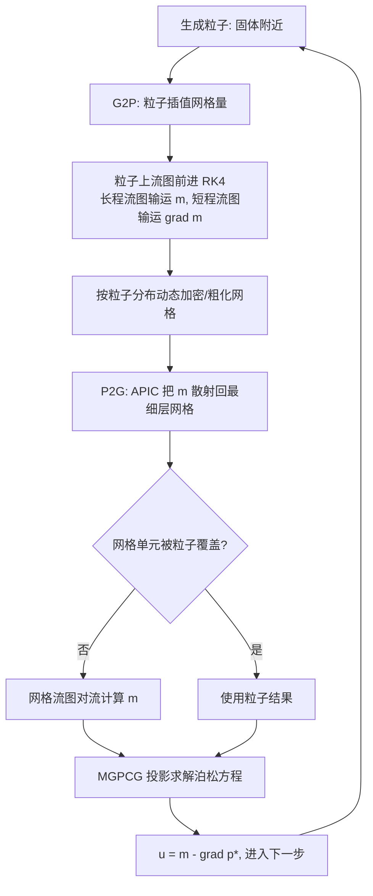

## 一句话总结

提出"自适应混合粒子-网格流图（adaptive hybrid particle-grid flow map）"方法，用拉格朗日粒子同时承担冲量输运和网格加密指示两项任务，并在 GPU 上实现了名为 Cirrus 的八叉树自适应网格流体框架，在单张 RTX 4090 上达成最高 $512\times512\times2048$ 的有效分辨率。

## 研究背景

流图（flow map）方法近年成为降低数值耗散、保留细小涡结构的有力工具。其中 Particle Flow Map（PFM）借助 APIC 方案用移动粒子在背景网格上输运冲量，取得了当时最优的涡量保持效果。但 PFM 存在明显瓶颈：它需要在所有网格单元维持一套稠密粒子系统来输运冲量场及其梯度，内存开销巨大，通常只能停留在 $256^3$ 的均匀网格分辨率上。

自适应网格（八叉树、AMR）本可以通过分层结构在不同区域分配不同尺寸的单元，大幅降低计算开销，但把它落地——尤其在 GPU 上——仍很困难：

- 基于网格的加密判据往往依赖网格上的物理量（如涡量强度、到边界距离），而这些量本身又依赖网格，形成"鸡生蛋"的循环，加密算法难以设计。
- 混合粒子-网格系统在跨层做粒子-网格插值时容易引入数值不稳定，实现复杂。
- 计算机图形学里少有可用的 GPU 自适应网格流体模拟器。

作者据此归纳出三个核心挑战：设计鲁棒的动态加密机制、为自适应网格上的流图设计对流格式、构建高效易用的 GPU 自适应网格框架。

## 方法

### 物理模型

采用无粘、不可压的冲量形式方程。冲量 $\boldsymbol{m}$ 通过标量规范变量 $\varphi$ 与速度场 $\boldsymbol{u}$ 关联：

$$\boldsymbol{m} = \boldsymbol{u} + \nabla\varphi$$

演化方程为：

$$\frac{D\boldsymbol{m}}{Dt} = -(\nabla\boldsymbol{u})^{T}\boldsymbol{m}, \qquad \nabla^{2}\varphi = \nabla\cdot\boldsymbol{m}$$

由于 $\boldsymbol{u}$ 无散，可通过 Helmholtz 分解从 $\boldsymbol{m}$ 中去掉旋量部分恢复速度。

### 流图与雅可比行进

前向流图 $\boldsymbol{\phi}^{[a,b]}$ 把起点 $\boldsymbol{x}^a$ 映到终点 $\boldsymbol{x}^b$，其雅可比 $\mathcal{F}^{[a,b]} = \partial\boldsymbol{\phi}^{[a,b]}/\partial\boldsymbol{x}^a$。对雅可比取物质导数得到两个行进方程：

$$\frac{D\mathcal{F}^{[a,b]}}{Dt_b} = \nabla\boldsymbol{u}^{b}\,\mathcal{F}^{[a,b]}, \qquad \frac{D\mathcal{F}^{[a,b]}}{Dt_a} = -\mathcal{F}^{[a,b]}\,\nabla\boldsymbol{u}^{a}$$

从单位阵初始条件出发用 RK4 沿速度场积分即可得到流图及其雅可比。冲量及其梯度按下式随流图前推（沿用 PFM，通常省略 Hessian 项而不影响质量）：

$$\boldsymbol{m}(\boldsymbol{x}^b,t_b) = \left(\mathcal{F}^{[b,a]}(\boldsymbol{x}^b)\right)^{\top}\boldsymbol{m}(\boldsymbol{\phi}^{[b,a]}(\boldsymbol{x}^b),t_a)$$

### 核心思想：粒子的双重角色

作者的关键观察是：粒子既可以在关键区域输运冲量，又可以充当网格加密指示器。粒子只在固体物体附近生成（距最近固体小于 $\phi_g = 5\Delta x$）并存活一段时间；有粒子的区域网格加密到最高分辨率，其他次要区域则用省内存的网格对流。加密目标函数直接定义为：

$$F(T) = \begin{cases} L, & \text{若 } T \text{ 内含粒子} \\ 0, & \text{否则} \end{cases}$$

用粒子作为判据，一举绕开了尺寸函数对网格自身的依赖，以及跨层插值对网格结构的敏感。

### 自适应网格结构

- 瓦片（tile）为最小内存管理单元，每个瓦片是 $8\times8\times8$ 单元块；第 $l$ 层单元尺寸 $h_l = 1/2^{l+3}$。
- 三种瓦片：leaf（叶，持有活跃计算单元，用 MAC 网格）、inner（内部节点）、ghost（幽灵，处理 T-junction）。
- 相邻叶瓦片最大层差限制为 1；层差为 1 时在细侧建 ghost 瓦片，避免跨层访问、降低泊松求解在 T-junction 处的开销。
- 加密/粗化各只调整一层，需迭代执行 Alg. 2 才能动态调整拓扑。

### 混合流图对流

粒子采用 PFM 的长短流图：冲量 $\boldsymbol{m}$ 用 $k=5$ 步长程流图算，梯度 $\nabla\boldsymbol{m}$ 用 1 步短程流图算：

$$\boldsymbol{m}^b = \left(\mathcal{F}^{[b,a]}\right)^{\top}\boldsymbol{m}^a, \qquad \nabla\boldsymbol{m}^b = \left(\mathcal{F}^{[b,e]}\right)^{\top}\nabla\boldsymbol{m}^e\,\mathcal{F}^{[b,e]}$$

粒子只驻留在最细层，因此 G2P 本质等同于均匀网格上的 G2P。无粒子区域用网格版行进方程，插值时从最细层开始逐级回退，直到 $3\times3\times3$ 模板被合法单元填满。

### GPU 实现要点

- 网格存储借鉴 Instant-NGP 的哈希表，每层一张表，用线性探测保证唯一入口并支持删除；最细层哈希表规模 $M=18$，其余 $M=16$。
- 每个瓦片按 AoSoA 布局存 $m\times729$ 数组，CUDA block 用 128 线程处理，重复四次覆盖整块。
- G2P/P2G 用直方图排序 + 共享内存优化：G2P 建 $3\times12^3$ 共享缓冲，P2G 建 $6\times11^3$ 缓冲，并用 warp 级 `__shfl_down` 取代昂贵的原子操作。
- 泊松求解用 MGPCG（多重网格预条件），相对容差 $10^{-6}$；自适应网格上多重网格退化为 Full Approximation Scheme（FAS）V-cycle，用红黑 Gauss-Seidel 平滑（每层前后各 1 次红黑迭代，第 0 层 10 次）。T-junction 处用积分形式的拉普拉斯算子并借助 ghost 单元避免跨层访问，跨层距离取 $1.5h$。

## 实验结果

硬件为 RTX 4090 GPU + Intel i9-14900KF。

数值精度方面，流图对流在自适应网格上达到二阶收敛，最细单元尺寸 $1/512$ 时逼近单精度机器精度；误差主要来自 T-junction 附近的层切换。MGPCG 求解器在简单 Grid A 上二阶精度（收敛阶 1.90），在复杂 Grid B 上退化为一阶（0.94）；采用 Losasso 等人的平均通量方案后两种网格均恢复二阶（Avg A 1.97、Avg B 1.76），但迭代次数明显增加（Avg B 在 $1/256$ 需 577 次，而作者原方法仅 24 次），故作者保留原方案。

G2P/P2G 优化对比（Table 2）：G2P 从朴素实现 115ms 降到 14ms，吞吐 139.13M/s→1142.86M/s，加速 **8.21×**；P2G 从 74ms 降到 39ms，吞吐 216.22M/s→410.26M/s，加速 **1.90×**。

效率对比（Table 3，吞吐单位 M/s）：

| 方法 | Cells | Projection | Active | Effective |
|------|-------|-----------|--------|-----------|
| SPGrid | 135M | 0.26 | 0.23 | 3.56 |
| Taichi(2019) | 16M | 14.16 | — | — |
| PFM (GPU) | 2M | 24.39 | 7.04 | — |
| PFM (CPU) | 2M | 5.97 | 0.36 | — |
| UAAMG | 89.41M | 41.59 | 10.23 | — |
| Ours (PFM) | 2M | 90.90 | 15.87 | — |
| Ours (sphere) | 1.60M | 133.33 | 10.32 | 825.81 |
| Ours (aircraft) | 21.49M | 36.42 | 11.65 | 168.78 |

在相同硬件上，作者对原 PFM 的稠密网格优化实现取得对 GPU-PFM 的 **2×** 加速；完整自适应算法对 GPU-PFM 取得 **1.5×** 加速；再借助自适应网格，有效分辨率吞吐额外获得一到两个数量级的提升。

单步耗时（Table 4，部分场景）：球体场景在 $512^3$ 有效分辨率（80.17× 稀疏比）下总计 155ms；飞机 $512\times512\times1024$（48.32M 粒子）总计 1845ms；三角翼 $512\times512\times1024$ 总计 2743ms；赛车 2533ms；火烈鸟群 $512\times512\times2048$ 总计 3012ms。消融显示：完整自适应比 2/3 层自适应更快且质量相当（如球体 2 层需 3328ms、3 层 344ms，而全自适应仅 155ms）；粒子寿命 $L$ 越长涡量保持越久；用 Semi-Lagrangian 只得层流，用 10 次 Jacobi 迭代替代 MGPCG 会因速度场可压缩而出现明显伪影。

作者还展示了三角翼（30 度攻角，涡升力效应）、赛车、飞行的火烈鸟群、带 4 个旋转螺旋桨的飞机（清晰的翼尖涡管）、扑翼蝙蝠等复杂网格与运动物体的算例。内存对比印证了自适应的必要性：$512\times512\times2048$ 若用稠密网格需 40GB，稠密粒子系统更高达 240GB，远超 RTX 4090 容量。

## 亮点与局限

亮点：
- 用粒子同时充当"冲量载体"和"加密指示器"，优雅化解了自适应网格尺寸函数依赖网格自身的循环难题——下一步的网格加密可直接由当前粒子分布确定。
- 粒子只驻留最细层，使 G2P/P2G 与均匀网格无异，天然易于 GPU 优化（共享内存 + warp 级归约），并保持算法简洁可扩展。
- 首个完全自适应的、基于流图的流体模拟框架，在消费级单卡上把流图法推到 $512\times512\times2048$ 有效分辨率。

局限（作者自述）：
- 缺乏完整的时间自适应：大小单元共用同一流图长度和统一时间步，未按单元尺寸分配不同时间步。
- 跨层不连续：模板缺值时回退到粗层带来更高对流误差，T-junction 处的数值不连续可能显著削弱涡量保持，使固体尾涡长度依赖粒子寿命。
- T-junction 处理用常压插值且仅限体素化固体边界，复杂网格上会退化为一阶收敛，收敛速度慢于均匀网格 MGPCG 和 AMG，可能在自由表面场景引入伪影。

## 延伸思考

这项工作最有启发的是"用一个可移动的拉格朗日实体去打破自适应加密的自指循环"——传统上"网格加密判据依赖网格量、网格量又依赖网格"，作者把判据外置到与网格解耦的粒子上，既解决了加密的因果依赖，又顺带复用粒子做低耗散冲量输运，一举两得。这种"让同一套载体同时服务两个正交目标"的设计思路，在其他自适应求解（如自适应有限元、神经场分辨率调度）中或许同样适用。

顺着作者列出的局限，两个方向值得关注：一是时空联合自适应（大小单元用不同时间步），这与流图法固有的"长短流图"温度自适应思想天然契合；二是把网格流图的跨层对流精度提上来，从根本上消除对粒子寿命的依赖，让稀疏区域也能长时间保持涡量——否则当前"粒子区高保真、网格区易耗散"的二元结构会限制方法在无固体边界持续供涡场景（如自由湍流、自由表面）的表现。此外，把 Cirrus 扩展到自由表面与多相流、并与固体做双向耦合，是把它从"烟雾涡结构展示"推向通用工业流体求解器的关键一步。
