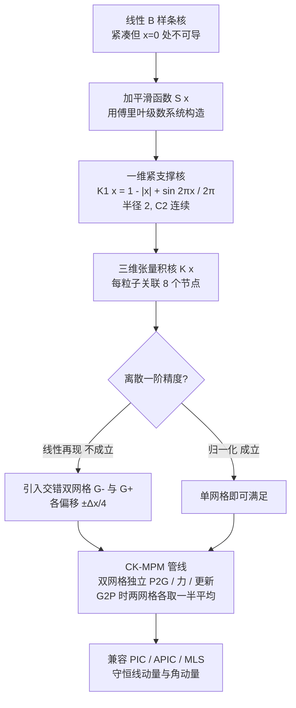

## 一句话总结

提出一个半径仅为 2、且 $C^2$ 连续的紧支撑核函数，配合"交错双网格"框架，让每个粒子只关联所在单元的网格节点，从而在稳定性、精度与效率之间取得独特平衡：相比二次 B 样条核，关联节点数减半、数值耗散更低，还能提速。

## 研究背景

物质点法（MPM）是物理仿真的基石，广泛用于地质力学与计算机图形学，可模拟颗粒流、粘弹性、断裂、雪、固液耦合、相变乃至燃烧与爆炸。它是一种拉格朗日-欧拉混合方法：用拉格朗日粒子追踪几何形状，用欧拉背景网格计算力并做时间积分。

原始 MPM 采用与 PIC 相同的分段线性传递核。但 MPM 需要核函数的梯度来计算力，而线性核在节点处梯度不连续，粒子跨越网格单元时会引发数值不稳定，即"跨单元不稳定"（cell-crossing instability），严重时甚至导致数值爆炸。

现有方案大多用更光滑的形函数（如二次/三次 B 样条）来缓解，但代价有两方面：

- 更大的支撑域带来更严重的数值耗散（velocity 场被平均化，丢失尖锐特征，例如碰撞前就出现接触间隙、高频振动模态被抹平）。
- 更大的支撑域带来更高计算成本：三维二次 B 样条核每个粒子关联 27 个网格节点，是线性核（8 个节点）的三倍多，加剧了写冲突和内存带宽压力。

作者要回答的问题是：能否设计一个既像线性核一样紧凑、又足够光滑（避免跨单元不稳定）的核，兼得稳定、精度与效率？

## 方法

### 整体思路

核心分两步：先构造一个半径为 2、$C^2$ 连续的一维紧支撑核（在离散设置下单独用无法保证一阶精度），再引入"交错双网格"系统来恢复一阶精度。二者结合即 CK-MPM，且天然兼容 PIC / APIC / MLS-MPM 三种传递方案。

### 关键设计一：紧支撑核的构造

出发点是修补线性 B 样条核在 $x=0$ 处不可导的问题，同时保留其它良好性质。写成：

$$K(x) = 1 - \vert x\vert  + S(x)$$

作者要求核函数满足七条性质：归一化、单调性、非负性、紧支撑性（$|x|\ge 1 \Rightarrow K(x)=0$）、收敛到狄拉克函数、$C^2$ 连续、单位分解（$K(x)+K(1-x)=1$）。线性核除"$C^2$ 连续"外全部满足，因此平滑函数只需满足：

$$\int_0^1 S(x)\,dx = 0, \qquad S(0)=S(1)=S(-1)=0$$

由于边界条件天然适合周期函数，作者把 $S(x)$ 用傅里叶正弦级数展开，并逐条施加约束（消去 $x=0$ 处左右导数的不匹配、保证 $|x|=1$ 处梯度光滑、级数收敛），最终得到只保留一项的最简形式。一维核为：

$$K_1(x) = 1 - \vert x\vert  + \frac{1}{2\pi}\sin(2\pi\vert x\vert )$$

三维核用张量积构造：

$$K(\mathbf{x}) = \prod_{\beta=0}^{2} K_1(x^{\beta})$$

由于半径为 2，每个粒子只关联 8 个网格节点——仅为二次 B 样条核（27 个）的一小部分，只比线性核多一倍关联（双网格所致）。

### 关键设计二：交错双网格恢复一阶精度

离散设置下，归一化条件（$\sum_i K = 1$）借助单位分解性质可直接成立；但线性再现条件

$$\sum_i x_i^{\alpha}\,K\!\left(\frac{\mathbf{x}_p - \mathbf{x}_i}{\Delta x}\right) = x_p^{\alpha}$$

一般不成立。为此引入三套网格 $\{G_0, G_-, G_+\}$：$G_0$ 是概念上的初始网格（不存储），$G_-$ 与 $G_+$ 分别在各轴方向相对 $G_0$ 偏移 $-\tfrac14\Delta x$ 与 $+\tfrac14\Delta x$。粒子位置存于 $G_0$，两套偏移网格作为交错网格。作者证明在双网格系统中，通过对两网格结果取平均，线性再现条件得以恢复：

$$\frac{1}{2}\sum_{k\in\{\pm1\}}\sum_i x_{i,G_k}^{\alpha}\,K\!\left(\frac{\mathbf{x}_{G_0} - \mathbf{x}_{i,G_k}}{\Delta x}\right) = x_{G_0}^{\alpha}$$

### 关键设计三：双网格 MPM 管线

质量与动量分别向两套网格传递（P2G）；应力在 $G_0$ 上计算（与经典 MPM 一致），力则分别在每套网格上求得；两套网格各自独立做网格更新；传回粒子（G2P）时从两套网格各取一半再求和平均。作者进一步给出与 APIC、MLS-MPM 的适配公式，并在补充材料中证明了 PIC 方案守恒线动量、APIC/MLS 方案同时守恒线动量与角动量。一个细节是：MLS 下由于双网格，动量矩阵 $M(\mathbf{x}_{G_0})$ 无法化为闭式，需要对每个粒子每步单独求解。

### 工程实现

- CUDA 版基于 Wang 等人（2020）的开源 GPU MPM 框架，沿用其 G2P2G 融合算法与 AoSoA 数据结构，扩展为双网格存储（把来自不同网格的两个 block 分组）。
- Taichi 版实现标准 P2G / 网格更新 / G2P 流程（非融合），整套实现与对比不到 300 行 Python 代码。

## 实验结果

硬件：Intel Core i9-12900KF + NVIDIA RTX 3090（压力测试改用 Xeon w7-3455 + RTX 6000 Ada），CUDA 12.4。

单元测试（守恒性验证，采用 Fixed Corotated 模型，双精度）：

- 线动量守恒：两球对撞，每球线动量约 $2905.69\ \mathrm{kg\cdot m/s}$，系统总动量初值为零。仿真 5 秒后，$x$ 分量总动量最大仅 $0.0309\ \mathrm{kg\cdot m/s}$，$L_\infty$ 误差率约 $1.063\times10^{-5}$。
- 角动量守恒：旋转杆仿真 5 秒，各分量近乎恒定，$z$ 分量相对 $0.01\ \mathrm{kg\cdot m/s}$ 的最大偏差约 $6\times10^{-5}$，$L_\infty$ 误差率约 $6\times10^{-3}$。

效率对比（G2P2G 约占每子步 80% 计算量，MLS-MPM，网格分辨率 $256^3$，单位毫秒）：

| 例子 | Wang et al. [2020] | 本文 |
|---|---|---|
| Two Dragons Falling | 0.7 | 0.64 |
| Fluid Dam Break（4 百万） | 3.7 | 2.9 |
| Fluid Dam Break（8 百万） | 7.2 | 5.7 |
| Sand Armadillos | 0.74 | 0.66 |

CUDA + MLS 下 G2P2G 约提速 10%。Taichi + PIC 标准管线下提速更明显（P2G 关联节点数减少 40%）：Jelly Falling 733.4s vs 1088.7s（1.48×），Fruit Falling 165.8s vs 242.8s（1.46×），平均约 1.5×。作者解释 CUDA+MLS 提速较小的原因是 MLS 需要矩阵求逆、且实现缺乏充分的 GPU 专项优化。

内存代价：因需维护额外的交错网格，网格存储约翻倍。例如 Two Dragons Falling 网格内存从 11.7 MB 增至 23.4 MB，Fluid Dam Break 从 97.7 MB 增至 195.3 MB（假设每单元最多 64 粒子）。这是"内存换效率与精度"的权衡。

行为分析：

- 断裂行为：因核半径更小，紧支撑核在碰撞时更易产生断裂（Pumpkin Smash、Oreo Drop 中紧支撑核碎裂，二次核则弹性回弹/保持原状）。这带来一个额外好处——无需相场模型即可产生断裂。
- 断裂抑制：对不希望断裂的弹性物体（扭转弹性杆），提高每单元粒子采样密度可缓解意外断裂（27 粒子/单元的杆与二次核一样保持连接）。
- 接触精度：小核半径带来更精确的接触。空心圆柱内小球下落测试中，1.5Δx 间隙下紧支撑核可自由下落回弹，二次核则被卡在顶部。
- 数值耗散：给定高频初速度 $0.2\sin(500 z_p)$，紧支撑核能量衰减明显更慢，数值耗散更低。

压力测试（稳定性与规模）：

| 例子 | 平均 秒/帧 | 粒子数 | 网格分辨率 |
|---|---|---|---|
| Fluid Flush with Two Loongs | 16.662 | 84,404,827 | (1024, 512, 256) |
| Bullet Impact on Tungsten | 4.847 | 8,655,462 | (1024, 1024, 1024) |
| Sand Castle Crashing | 6.96 | 45,958,733 | (2048, 1024, 1024) |
| Fire Hydrant Pumping | 26.462 | 7,333,580 | (512, 768, 512) |

其中"子弹撞钨块"测试了极端刚度（钨块杨氏模量 $4.5\times10^{11}$ Pa）与高速冲击（子弹 300 m/s）下的稳定性；"消防栓"测试了金属断裂 + 压缩流体喷出的多材料复杂场景。

## 亮点与局限

亮点：

- 用一条清晰的数学推导（傅里叶级数 + 逐条约束）系统构造出一个既紧凑又 $C^2$ 连续的核，思路优雅且可扩展。
- 交错双网格是关键创新，用"翻倍网格"这一相对轻量的代价换回一阶精度，同时把每粒子关联节点数控制在 8（对比二次核的 27）。
- 兼容主流 PIC/APIC/MLS 方案且守恒线动量与角动量，落地友好（可用 Taichi 或现有 GPU 框架实现），代码开源。
- 紧支撑核天然带来更低数值耗散、更精确接触，且无需相场模型即可产生断裂。

局限（作者坦诚指出）：

- 交错网格增加实现复杂度，网格内存约翻倍，大规模场景下内存成为瓶颈。
- 依赖精确的 $\sin/\cos$ 函数以保证守恒性；更快的 CUDA 内建三角函数 `__sinf`/`__cosf` 精度不足，只能用较慢的版本。
- 小核半径易促发断裂，对需要"无断裂大变形"的场景是把双刃剑，需靠提高采样密度缓解。

## 延伸思考

- 作者提出的与 PolyPIC 结合以获得更高阶传递精度、以及利用核结构在隐式 MPM 时间积分中独立求解子系统，都是很有潜力的方向；事实上后续已出现"隐式 CK-MPM"用于计算固体力学的工作。
- "内存换效率"的取舍在超大规模仿真里可能反转：作者建议解耦 P2G 与 G2P、对每套网格独立传递以降低内存，这在多 GPU/多节点环境下值得深挖。
- 更本质地看，本文说明了"核的支撑域大小"直接耦合了稳定性、耗散、接触精度与断裂倾向这几件事，紧支撑高阶核提供了一个新的设计维度——它把过去被二次 B 样条"锁死"的离散化空间重新打开了。
