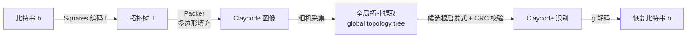

# Claycode: Stylable and Deformable 2D Scannable Codes

## 一句话总结

Claycode 把要编码的比特串映射到一棵**拓扑树**，再以"颜色区域层层嵌套"的方式绘制进任意目标多边形内，从而得到一种既能高度风格化、又能承受剧烈形变的二维可扫描码——在传统 QR 码普遍失效的弯折、遮挡等场景下依然可读。

## 研究背景

二维可扫描码（以 QR 码为代表）已经渗透到票务、移动支付、广告、博物馆导览、增强现实等日常场景。但它们受严格的算法约束，外观呆板、缺乏美感，往往与精心设计的海报或艺术品格格不入。为迎合视觉适配需求，业界出现了 Spotify Codes、App Clips 以及各类"美化 QR 码"服务，学术界也尝试用图像变形、模块重排乃至神经风格迁移、扩散模型（ArtCoder、GladCoder 等）把图案嵌入 QR 码。然而这些方法有一个共同代价：**为了美观往往损伤码本身的鲁棒性**——美化与可靠性在 QR 码里是此消彼长的关系。

另一条相关线索是拓扑基准标记（fiducial marker），如 D-Touch、reacTIVision、TopoTag、Seedmarkers 等。它们利用区域的拓扑关系来构建标记，但这些工作主要面向位姿估计，且**无法携带任意比特载荷**。

本文提出的 Claycode 是首个能承载任意比特序列的拓扑码。它有三个突出优势：

- **可深度风格化**，能把信息以美观的方式嵌入艺术作品；
- **高度可形变**，即便印在织物、皮肤等弹性表面，或以大角度扫描仍可读；
- **不受预定义外形约束**，可以嵌入形状受限的空间（如电子元件）里。

## 方法

整体是一条端到端的"编码—绘制—扫描"流水线：比特串先经 **Bit-Tree 编码**变成拓扑树，再由 **Packer** 把树绘制进目标多边形得到 Claycode；扫描端 **Scanner** 从相机流实时地做逆向恢复。

### 关键设计一：Bit-Tree 编码（Squares 编码）

工作对象是**有根、无标签、有序但兄弟顺序不可见**的树。由于 Claycode 无法在视觉上编码兄弟节点的先后次序，编码必须对兄弟置换保持不变，即要求一对函数 $(f,g)$ 满足：

$$g(f(b)) = b,\quad \forall b\in\{0,1\}^{*}$$

$$T\sim T' \Rightarrow g(T)=g(T'),\quad \forall T,T'\in\mathcal{T}$$

作者用**足迹（footprint）**来刻画"码占多大空间"这一非平凡指标。因为绘制时每个父节点要包住全部后代，嵌套越深越费空间。单节点足迹定义为：

$$F(T) = 1 + \vert D(T)\vert $$

节点总足迹是自身足迹加上所有后代足迹之和，它随树深呈平方增长、随树宽呈线性增长，与生成码的视觉复杂度经验上强相关。基于此，作者提出四条编码要求：(R1) 最小化生成树的总足迹；(R2) 总足迹要与消息长度强相关；(R3) 总足迹与消息中 1 的比例要低相关（避免短消息占用超大空间）；(R4) 数百比特的消息要在毫秒级、商用硬件上可算。

现有基于后继函数或质因数分解的树排名/生成方法，在百比特量级（$2^{100}$ 种组合）下完全不可行。作者受 Abe(1994) 启发，设计了 **Squares 编码**：先把比特串双射为自然数 $n$，再把 $n$ 贪心地分解成"平方和"：

$$n = 1 + n_1^2 + n_2^2 + \dots + n_k^2$$

每次取当前数的最大平方 $\lfloor\sqrt{n}\rfloor$（可用二分在任意精度整数上实现），为分解出的每一项生成一个子节点并递归。加法交换律天然保证兄弟置换不改变编码结果，且每个 $n_i$ 严格小于 $n$ 保证终止。相比 Abe 编码，Squares 的中位足迹大 1.34~1.67 倍、标准差高 1.75~2.28 倍，但能轻松扩展到数千比特，满足 (R4)；作者共评估了 15 种编码，最终选定 Squares。

### 关键设计二：Packer（多边形填充）

Packer 把拓扑树绘制进输入多边形，支持凸/非凸（无自交、无孔洞）多边形，能在数秒内绘出上千节点的可扫描码。它对树做深度优先遍历，每次调用绘制一个颜色区域，核心是两步操作：

- **Padding（内缩）**：把多边形边界均匀向内偏移，参数 $\phi$ 定义每个区域的最小厚度。每个打包步骤做两次 $\phi/2$ 的 padding——单次 padding 会让相邻区域间距变成 $2\phi$ 造成厚度不均，两次则保证一致；对叶节点做第二次 padding 也用于强制其最小厚度。实际运行时从较大 $\phi$ 开始，逐步降低直到打包成功，且全程保持 $\phi$ 恒定（动态调整会产生可读性不均的码）。
- **Partitioning（分割）**：把多边形划分成互不重叠的子多边形分给各兄弟节点。这被建模为多边形分解优化，权衡两条原则：

**面积正比**——子多边形面积应正比于对应兄弟的足迹：

$$A^{*}(P_i) = A(P)\cdot\frac{F(T_i)}{\sum_{j=1}^{k}F(T_j)}$$

**圆度最大化**——用圆度衡量区域是否规整（完美圆为 1，细长/畸形趋近 0）：

$$R(P) = \frac{4\pi A(P)}{L(P)^{2}}$$

两者通常冲突，合并为带权最小化问题（$\alpha$ 固定为 0.6，偏向面积正比）：

$$\min_{[P_1,\dots,P_k]\in\mathcal{P}}\ \sum_{i=1}^{k}\alpha\big\vert A(P_i)-A^{*}(P_i)\big\vert  + (1-\alpha)\big(1-R(P_i)\big)$$

作者先解二元（两兄弟）情形，再逐步提升到一般情形；二元切割用**直线切割 + 随机搜索**（上限 400 个解、收敛则提前停止）求解。相比 Seedmarkers 用加权 Voronoi（面向位姿估计、叶子恒为圆、在高度凹形上会失败），Claycode 的 Packer 专注于最大化复杂拓扑的可扫描性。

### 关键设计三：Scanner（扫描与解码）

由于 Claycode 没有 QR 码那样的固定外形和定位图案，扫描器**不先定位码再解码**，而是先把整幅图像转成**全局拓扑树**（global topology extraction），假设"若画面中含 Claycode，其拓扑必是全局树的子树"。流程：灰度化 → 双边滤波（保边去噪）→ 自适应阈值二值化：

$$B(x,y)=\begin{cases}1,& I_{bil}(x,y)>\tau(x,y)\\0,&\text{otherwise}\end{cases}$$

其中局部阈值 $\tau(x,y)=\frac{1}{n}\sum_{(i,j)\in N(x,y)} I_{bil}(i,j)-K$。随后用 Suzuki-Abe 轮廓提取算法把连通区域边界组织成层级，得到全局拓扑树 $T_f$（在测试手机上常含数千节点）。

**Claycode 识别**：先用启发式筛候选根 $\mathcal{T}=\{T\in D(T_f):|D(T)|>n\}$（实现取 $n=10$，因为不会有 Claycode 简单到只含十个节点），可剪除 99% 以上噪声节点（真实拓扑绝大多数很扁平）。对每个候选用 $g(T)$ 解出比特串，再用附加的 **16 比特 CRC**（采用 CRC-15/CAN 的多项式 0x4599）校验过滤。作者在数千次扫描中未出现一次误报，这在拓扑码里是重要成果。

**冗余方案**：CRC 只能检错不能纠错，而传统纠错码（如 Reed-Solomon）不适用——拓扑树上单个错误经树→比特函数会传播成多个比特翻转甚至改变消息长度。作者利用扫描器天然并行处理多候选的特点，把编码改为生成 $C(T_R)=[f(b),f(b)]$ 的新树，即在码内放多份副本，用**冗余级别 $R$**（默认 1）来换取抗遮挡能力，代价是数据容量下降。

## 实验结果

**扫描延迟**（测试机 Google Pixel 8 Pro，1920×1920 拍摄，目标平均延迟 100ms、约 10 次/秒）：

- 无码场景（失败尝试）10,335 个样本，平均延迟 90.2ms，标准差 18ms，最小 42ms、最大 196ms。
- 成功扫描随码尺寸近似线性增长：56 比特约 97ms，456 比特约 148ms，极值介于 67~270ms。

**受控对比实验**：对比 6 类码——Claycode($R=1$)、Claycode($R=2$)、风格化 Claycode($R=2$)、高纠错 QR、风格化高纠错 QR、Code128 条形码。生成 10 个随机字符串 × 6 类 = 60 个码，用 3D 纹理平面网格模拟扫描角度（$\pm10°\sim\pm20°$）、波形形变（振幅 $\omega\in[0,1]$）和遮挡（红方块占比 $\psi$）。

- **实验 1（仅形变，600 次）**：Claycode 几乎全程成功，直到 $\omega=1$ 才出现轻微退化；QR 码在 $\omega=0.3$ 开始下滑，$\omega\ge0.7$ 时几乎全失败；风格化 QR 表现最差（$\omega=0.1$ 时成功率仅 70%，$\omega\ge0.7$ 归零）。
- **实验 2（仅遮挡，600 次，$\psi\in\{0.01,0.04,0.09,0.16,0.25\}$）**：$R=1$ 的 Claycode 不能容忍任何遮挡，但 $R=2$ 时几乎总优于 QR。有趣的是**风格化 Claycode 反而优于非风格化**——因为遮挡方块有时盖住的是艺术部分而非载荷。
- **实验 3（形变+遮挡，固定 $\omega=0.2$）**：该形变量对非风格化 QR 单独无影响，但叠加遮挡后进一步压低了 QR 成功率，说明两种损伤在 QR 上会叠加放大；而 Claycode 几乎不受这一形变影响。

**物理介质与光照实验**：印制 4 个 QR 码与 8 个 Claycode（哑光/亮光纸），在 7 种真实场景下由真人扫描，判定成功（3 秒内无需调整）、部分成功（需重定位）或失败（10 秒内扫不出）。结论（对应结果表）：

- 自然光（室内外）与低照度不均光下所有码都可靠，Claycode 少数部分成功源于相机对焦，属实现层面问题。
- **黑暗**场景多个 Claycode 失败，低对比配色更差；高冗余 $R$ 反而更易失败，因为冗余增加了视觉复杂度、暗光下更难解码。
- **强反光**下哑光/亮光差异显著；眩光类似遮挡，高冗余码反而更抗。
- **玻璃水瓶（内弯/外弯）**对两类码都最难（畸变+部分遮挡+半透明噪声+阴影）；QR 主要受畸变影响、调整角度后多可扫出，Claycode 低对比时较差但通常可从多角度扫到。

此外作者把设计印在棉质 T 恤、陶瓷马克杯、金属钥匙扣上验证：自然光下均可扫；织物表现尤佳，扫描器基本不受自然褶皱影响，无需手动抚平即可扫出。

## 亮点与局限

亮点：

- 提出首个能承载**任意比特载荷的拓扑码**，从原理上把"信息"编码进颜色区域的嵌套关系而非像素矩阵，天然抗形变。
- **风格化不损可靠性**：所有实验中风格化 Claycode 表现都不逊于甚至优于非风格化版本，与"QR 越美越脆"形成鲜明对比。
- 工程闭环完整：Squares 编码兼顾空间效率与毫秒级可算，Packer 支持凹多边形且秒级绘制上千节点，Scanner 用 CRC 实现零误报的实时识别。

局限：

- $R=1$ 时**完全不能抗遮挡**，需靠增大冗余 $R$ 换取，但冗余会增加视觉复杂度、在暗光下更难解码。
- **暗光、强反光、半透明弯曲介质**仍是弱项，且低对比配色显著拉低表现。
- 冗余属重复副本、非真正纠错——拓扑上单点错误会引发多比特翻转，传统纠错码难以直接套用。
- 数据容量受限于当前 UTF-8 编码与 Squares 足迹开销。

## 延伸思考

作者规划了几条改进方向：放弃 UTF-8 改用多模态字符编码、设计更省空间的 bit-tree 编码、以及超越"拓扑重复"的真正纠错方案；并计划借鉴用于 QR 码的神经技术（如 CNN 检测）来应对模糊、弱光，甚至在部分遮挡下推断拓扑，从而让 $R=1$ 的无冗余码也更鲁棒。

更广地看，Claycode 把"可扫描码"从矩阵范式解放到拓扑范式，为可穿戴/弹性介质、异形空间嵌入、艺术化品牌标识打开了新设计空间。它同时也提示一个有趣的权衡：视觉冗余（副本）与解码鲁棒性的关系并非单调——在暗光等条件下过度冗余反而有害，如何让冗余"自适应场景"是值得深挖的问题。若能引入神经拓扑补全，拓扑码或有望在保持零误报的同时兼得高容量与强抗损。
