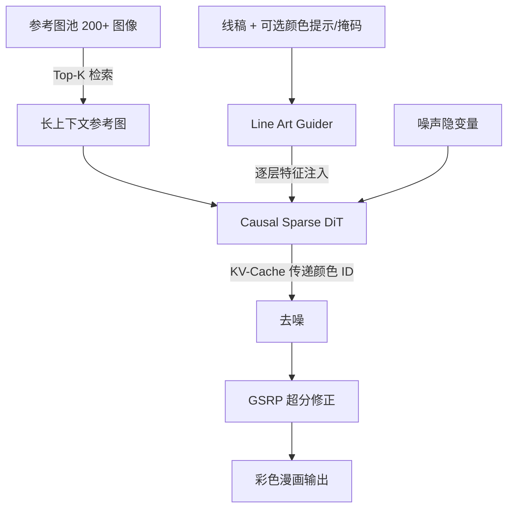

## 一句话总结

Cobra 通过 Causal Sparse DiT 架构，让扩散模型能够在低延迟下利用 200 张以上参考图完成漫画线稿上色，同时保持角色与物体的颜色身份一致性，并支持颜色提示交互。

## 研究背景

漫画产业需要高精度、高效率、上下文一致且可灵活控制的参考式线稿上色。一张漫画页往往包含多样的角色、物体和背景，颜色信息分散在不同页面且高度依赖上下文，因此保持颜色身份（Color ID）一致需要长上下文参考。

早期线稿上色方法依赖调色板、颜色提示或文本控制：调色板保证一致性但难以适应多样漫画风格；颜色提示灵活但缺乏工业级自动化；文本控制直观但文本编码器计算昂贵且对输入敏感。

已有的参考式上色方法则受限于参考图数量、推理速度慢，以及难以处理复杂的上下文依赖漫画页。例如 ColorFlow 采用三阶段双分支框架但参考图上限为 12 张，AniDoc 聚焦单角色动画视频上色。这些方法在参考图数量、推理时间和输入格式支持上都难以满足实际工业需求。

## 方法

### 整体框架

Cobra 是一个高效的长上下文细粒度 ID 保持框架。给定一张待上色线稿 $$L$$ 和一个参考图池 $$R = \{r_1, r_2, \dots, r_n\}$$，模型从池中检索相关参考图来指导上色，用户还可叠加颜色提示进行细化。架构由三个核心组件构成：Causal Sparse DiT、Localized Reusable Position Encoding（局部可复用位置编码）和 Line Art Guider（线稿引导器）。

### 关键设计

1. **Causal Sparse DiT 与因果稀疏注意力**：全注意力的计算复杂度为 $$O(T \times (S_l^2 + 2N \times S_l \times S_r + N^2 \times S_r^2))$$，随参考图数量 $$N$$ 增长迅速膨胀。Cobra 先剔除参考图之间的两两注意力计算得到稀疏注意力，再将参考图与噪声隐变量之间的双向注意力改为单向因果注意力，使复杂度降为 $$O(T \times (S_l^2 + N \times S_l \times S_r) + N \times S_r^2)$$。由于参考图是干净且预先存在的，只需在时间步 0 做一次去噪，并用 KV-Cache 存储逐层的键值，为噪声隐变量提供稳定的颜色 ID 引导。

2. **局部可复用位置编码**：网格拼接会限制参考图数量，横/纵向拼接则导致极端长宽比削弱空间对应。Cobra 将线稿分为四个空间块（左上、左下、右上、右下），为每块检索 Top-k 相似参考图，并把形状为 $$(d, h, 2w)$$ 的位置编码拆成中心区域与四个环绕区域，让参考特征复用局部位置编码而不改动预训练 DiT 的 2D 编码，从而支持任意数量（甚至超过 200 张）的参考图。

3. **Line Art Guider**：将线稿隐变量与颜色提示隐变量拼接作为输入，特征逐层注入主干分支。由于只接收图像型控制条件，去掉了交叉注意力层仅保留自注意力层以减少参数。此外引入线稿风格增强（随机混合两个不同风格线稿提取器的输出）和颜色提示点采样策略（约束提示点内 RGB 方差不超过 0.01，避免落在边缘交叉处）。

4. **训练与超分**：训练时随机从每个参考集采样，将参考总数固定为 3、6 或 12 以增强适应性。并沿用 ColorFlow 的引导式超分辨率流程 GSRP 修正 VAE 重建带来的结构畸变。

## 实验结果

在 Cobra-Bench（30 个漫画章节，每章 100 张参考图与 50 张线稿页）上，与最先进方法进行定量对比。所有图像统一缩放到 512×800，Cobra 与 ColorFlow 均使用 10 步推理，Cobra 固定 24 张参考图。

| Method | Reference-based | 线稿 CLIP-IS↑ | 线稿 FID↓ | 线稿 PSNR↑ | 线稿 SSIM↑ | 线稿 AS↑ | 带阴影 CLIP-IS↑ | 带阴影 FID↓ | 带阴影 PSNR↑ | 带阴影 SSIM↑ | 带阴影 AS↑ |
|---|---|---|---|---|---|---|---|---|---|---|---|
| MC-v2 | - | - | - | - | - | - | 0.8635 | 44.09 | 15.57 | 0.7630 | 4.531 |
| IP-Adapter | ✓ | 0.8284 | 76.01 | 8.111 | 0.5561 | 4.511 | - | - | - | - | - |
| ColorFlow | ✓ | 0.9030 | 26.29 | 15.20 | 0.8045 | 4.630 | 0.9198 | 21.79 | 18.49 | 0.8631 | 4.657 |
| Cobra | ✓ | 0.9176 | 20.98 | 16.08 | 0.8141 | 4.641 | 0.9264 | 18.84 | 18.96 | 0.8694 | 4.674 |

Cobra 在所有五项指标上均取得最佳成绩。消融实验进一步表明：参考图数量从 4 增至 36，各项指标稳步提升（例如 CLIP-IS 从 0.9083 升至 0.9183），验证了广泛上下文参考的重要性；在 24 张参考图、FP16 精度下，因果稀疏注意力每步耗时仅 0.35 秒、计算量 9.0 TFlops，相比全注意力（1.99 秒、38.2 TFlops）大幅加速，在 64 张参考图时约快 15 倍。用户研究收集超过 4000 张有效投票，Cobra 在颜色 ID 一致性（79.1%）、颜色合理性（69.3%）与整体美学质量（73.2%）三个维度上均显著优于 ColorFlow。

## 亮点与局限

**亮点**：
- 首次将扩散模型的参考式线稿上色扩展到 200 张以上长上下文参考，贴合工业级漫画生产需求。
- Causal Sparse DiT 结合稀疏注意力、因果注意力与 KV-Cache，把全注意力的二次复杂度降为近似线性，兼顾效率与质量。
- 局部可复用位置编码在不改动预训练 2D 位置编码的前提下支持任意数量参考图。
- 同时支持颜色提示交互，并建立了 Cobra-Bench 基准。

**局限**：
- 模型专为同一角色的颜色身份迁移设计。当参考图描绘的是不同角色时无法泛化，难以完成跨身份的风格迁移。

## 延伸思考

Cobra 把语言模型中长上下文推理的思路（因果注意力、KV-Cache）迁移到扩散上色任务，说明"长上下文 + 稀疏化"的范式在视觉生成中同样有价值，尤其适合角色/资产需要跨页一致的连载漫画与动画场景。其局部可复用位置编码提供了一种在不重训基座位置编码的情况下扩展参考数量的通用手段，可能启发其他需要多参考条件的生成任务（如多资产合成、多视角一致性生成）。而"仅支持同角色一致迁移、无法跨身份泛化"的局限，也提示未来工作可探索显式的身份解耦与检索机制，让模型在保持一致性的同时具备风格迁移能力。
