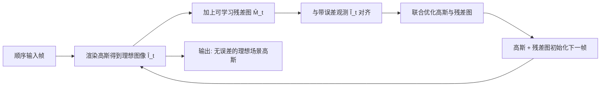

## 一句话总结

针对在线动态场景重建在静态区域出现的时间闪烁问题，本文指出根因是观测图像中不可避免的时变误差（如传感器噪声），并提出为每个视角、每帧额外学习一张残差图来吸收这些误差，使高斯只重建"理想场景"，从而同时提升时间一致性与渲染质量。

## 研究背景

- 领域现状：动态场景重建近年从 NeRF 转向 3D Gaussian Splatting，因其训练快、可实时渲染。但主流方法多为离线重建，需要完整视频序列、结果不可流式传输，难以支持直播式的自由视点视频。在线重建则逐帧顺序优化模型，天然支持不定长的流式输入与模型流式传输。
- 核心痛点：以往在线重建方法只关注每帧的效率与画质，忽视了时间一致性，导致静态区域出现明显的闪烁伪影。作者发现这源于观测本身：即便是静态区域，相邻帧观测之间也存在非零差异（多数在 8-bit 图像里小于 4，几乎不可察觉），这些时变误差来自传感器噪声等因素。离线方法因容量有限会收敛到多帧平均值，自然抹平了误差；而在线方法每次只能看到单帧，会过拟合到当帧的时变误差上，于是产生时间上不一致的结果。
- 本文 idea：把观测显式建模为"理想观测 + 误差"，用一张可学习的残差图单独承接误差，让高斯专注重建不含误差的理想场景。该模块可即插即用地叠加到多种在线重建基线上。

## 方法

整体框架：把带误差的观测 $$\tilde{I}_t$$ 分解为渲染出的理想图像 $$\hat{I}_t$$ 与估计的残差图 $$\hat{M}_t$$ 之和。训练时对每个相机视角额外维护一张与图像等尺寸的可学习残差图 $$\hat{M}_t^v \in \mathbb{R}^{3\times H\times W}$$，与高斯参数一起用 Adam 联合优化；下一帧时高斯和残差图都用上一帧的值初始化，从而顺序推进。

关键设计：

1. 可学习残差图分离误差。核心分解为 $$\tilde{I}_t = I_t + M_t = \hat{I}_t + \hat{M}_t$$，优化步为 $$G_t, \hat{M}_t \leftarrow \text{Adam}(\nabla L_{total}(\tilde{I}_t, \hat{I}_t + \hat{M}_t))$$。为什么有效：多视角不一致、时间不一致的高频噪声，用一张 2D 残差图去拟合比用一套 3D 高斯去拟合容易得多，也比在已训练好的上一帧高斯上微调容易。于是残差图"抢走"了误差，高斯得以收敛到干净的真实场景。

2. 首帧重建与正则。首帧从 SfM 点初始化高斯、残差图初始化为零，并在高斯开始致密化前把残差图冻结在零，避免残差图主导重建。同时对不透明度施加 L1 正则 $$L_{opa} = \sum_i \lVert \sigma_t^i \rVert_1$$（因为 3DGS 原本的不透明度重置会破坏残差图的稳定优化），并对残差图施加 L1 正则 $$L_{res} = \lVert \hat{M}_t^v \rVert_1$$ 防止其过拟合视角相关颜色。首帧总损失为 $$L_{total} = (1-\lambda)L_1 + \lambda L_{D\text{-}SSIM} + \lambda_{opa}L_{opa} + \lambda_{res}L_{res}$$。

3. 传播新增高斯。仅在单帧使用新增高斯 $$G_t^{new}$$ 后丢弃会损害动态区域的时间一致性，本文把新增与形变后的高斯一起传播到后续帧：$$G_{t+1} \leftarrow (G_t, G_t^{new})$$。后续帧不再使用 $$L_{opa}$$ 以与基线公平比较，总损失为 $$L_{total} = (1-\lambda)L_1 + \lambda L_{D\text{-}SSIM} + \lambda_{res}L_{res}$$。

4. 副作用是更省。由于误差本会抬高像素空间梯度、诱发多余的高斯致密化，把误差交给残差图后可显著减少高斯数量（首帧 $$G_0$$ 降到约 0.69 倍，序列帧新增高斯降到约 0.28 倍），训练与渲染更快、显存更低；残差图仅训练时使用、不存储。

## 实验结果

在 Neural 3D Video 与 MeetRoom 两个真实数据集上，把本方法叠加到三种在线重建基线（Dynamic3DG†、3DGStream、HiCoM）上均一致提升 PSNR/SSIM 并大幅降低 mTV（静态区域时间一致性指标，越低越好），同时减少高斯数量、缩短训练时间。下表为 Neural 3D Video 数据集上的主对比：

| 方法 | PSNR↑ | SSIM↑ | mTV×100↓ | 高斯数↓ | 训练时间↓ |
|------|-------|-------|----------|---------|-----------|
| Dynamic3DG† | 32.48 | 0.960 | 0.153 | 315K | 136 秒/帧 |
| Dynamic3DG† + 本文 | 33.03 | 0.961 | 0.053 | 246K | 130 秒/帧 |
| 3DGStream | 32.58 | 0.960 | 0.178 | 315K | 13.3 秒/帧 |
| 3DGStream + 本文 | 33.13 | 0.961 | 0.103 | 268K | 13.1 秒/帧 |
| HiCoM | 32.09 | 0.956 | 0.164 | 307K | 11.0 秒/帧 |
| HiCoM + 本文 | 32.46 | 0.957 | 0.118 | 218K | 10.2 秒/帧 |

其余实验：在 Sync-NeRF 合成数据集上，用带噪观测训练、对干净真值评估，本方法（39.16 / 0.987 / 0.318）优于原始 3DGStream 与"先用去噪模型预处理再重建"的方案；且通过从观测中减去残差图可把训练视角观测恢复到真值，PSNR 提升约 2.58。消融显示：去掉残差图 mTV 从 0.103 恶化到 0.161；SH 阶数设为 3 优于 1（残差图吸收误差后，高斯可安全用满更高容量）；复用新增高斯也带来一致性提升。

## 亮点与局限

- 亮点：
  - 找到了在线重建时间不一致的根因——观测中不可察觉但时变的误差，并用合成数据的可控实验（有/无噪声）予以验证。
  - 方案简洁、即插即用：一张 2D 残差图即可叠加到多种基线，均获稳定增益。
  - 反直觉的"双赢"：分离误差后不仅质量更好，高斯数量还更少、训练更快、显存更低，多次运行方差也更小（更稳定）。
- 局限：
  - 对运动模糊、稀疏视角、严重噪声、快速运动等"正交于时间一致性"的困难场景无能为力（如快速运动伪影不会被修复）。
  - 方法假设场景本身已被较好地重建，在上述退化场景中收益下降。
  - 对噪声之外的其他时间不一致成因、以及不同噪声类型的影响缺乏更深入分析，作者留作未来工作。

## 延伸思考

- 把误差建模为逐视角 2D 残差图，本质上和 NeRF-W 系列的"每图外观/瞬态嵌入"、RawNeRF 的"真实图像皆含噪声"思路一脉相承，区别在于本文不假设特定噪声形式、直接以像素残差兜底，适配真实录制中多样且模糊的误差来源。
- 残差图只在训练期存在、推理不落地，这点很关键：它是一种"训练期的误差旁路"，避免误差污染几何/外观，值得迁移到其他对观测噪声敏感的重建任务（如在线 SLAM 式建图）。
- 一个自然的追问：残差图目前是自由参数，是否可以引入低秩/时序平滑先验或轻量网络预测，进一步区分"真实的视角相关效应"与"随机噪声"，避免误吸收有用信号，这也呼应了作者提到的过拟合视角相关颜色风险。
