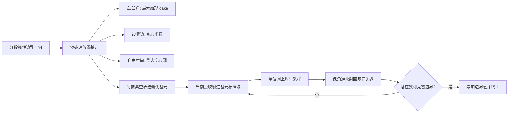

## 一句话总结

本文提出一种无需 epsilon 壳的递归首次通过（first passage）算法，用半圆与扇形（作者称之为 cake）等与边界共享多点的几何基元替代 Walk On Spheres 的空心圆，借助保角映射把这些基元上的出射概率解析地转到单位圆求解，从而在二维拉普拉斯方程（如扩散曲线渲染）上大幅减少游走步数、消除近边界偏差。

## 研究背景

- 领域现状：许多物理现象可由线性椭圆偏微分方程描述（热传导、牛顿引力、电荷密度、流体压强修正等），在图形学里也广泛出现于几何建模、渲染、流体模拟、矢量图形与可视化。近年无网格蒙特卡洛方法进入图形学，能在复杂域上求解偏微分方程而不需网格离散化，其中 Walk On Spheres（WoS）通过在当前点放置最大空心球、对边界积分方程做递归随机采样来求解。
- 核心痛点：WoS 的步长由到最近狄利克雷边界的距离决定，越靠近边界步长越小，理论上需无穷多步才能触边。实践中当游走进入边界周围的 epsilon 壳时就强行终止并吸附到最近边界点，这会引入偏差，收敛率仅为 $$O(1/\log \epsilon)$$ ，形成精度与性能的两难。问题的根源在于：球与边界通常只共享一个点，随机样本极难恰好落在该点附近，于是需要大量步数。
- 本文 idea：不再放置最大空心圆，而是沿分段线性边界放置最大可能的半圆，在凸角与凹角处放置最大可能的扇形（cake），远离边界的自由区域则用空心圆覆盖。这些基元与边界共享不止一个点，显著提高一步直接跳到边界的概率。基元上所需的采样概率即布朗运动的出射概率（首次通过问题），利用拉普拉斯方程在保角映射下不变的性质，把单位圆上已知的格林函数与泊松核映射到这些基元上求解。

## 方法

整体框架：先在预处理阶段一次性用半圆、扇形、圆填满整个域（放置策略）；随机游走时对每个像素查表选出最优基元，把当前点变换进对应基元的标准域，在单位圆上均匀采样后经保角逆映射得到基元边界上的下一个采样点，若落在狄利克雷边界上则累加边界条件值并终止，否则递归继续。

关键设计：

- 边界积分方程与保角基础：拉普拉斯方程的通解由直接边界积分方程给出，含格林函数 $$G$$ 与泊松核 $$P = \partial G / \partial n_z$$ ，但二者只在简单域上有闭式解。对二维球，格林函数与泊松核为 $$G_B(c, x) = \frac{1}{2\pi}\log\left(\frac{R}{r}\right)$$ 、 $$P_B(c, x) = \frac{1}{2\pi r}$$ 。作者利用一个关键事实：拉普拉斯方程在保角映射下不变，且由黎曼映射定理，圆、半圆、扇形等单连通开集之间都存在保角映射，因此可以把单位圆上已知的解搬到其他基元上。

- 半圆基元：把带半径、位置、朝向的半圆归一化为单位半圆（单位圆右半）。通过一串保角映射（单位半圆到上半平面 $$F_0$$ 、上半平面到单位圆 $$F_1$$ 、以及把任意点搬到圆心的偏移映射 $$F_3$$ ）组合出 $$G(c, z) = F_3(F_2(c), F_2(z))$$ ，它把单位半圆映到单位圆，并保证半圆内给定点 $$c$$ 落到圆心（这是格林函数已知的构型）。采样时先在单位圆边界均匀取点 $$z_{k+1} = G^{-1}(z_k, \cos(2\pi\eta) + i\sin(2\pi\eta))$$ ，再逆映射回半圆，得到的分布天然服从泊松核。泊松核经链式法则求得 $$P_Z(c, z) = \frac{\partial G_B(0, x)}{\partial x}\big\vert _{x=G(c,z)} \cdot \frac{\partial G(c, z)}{\partial z} \cdot n_z$$ 。边界积分被拆成直边上的直接积分与圆弧上的递归积分两部分；直接命中直边的概率由把直边两端点映到单位圆后所张的有符号夹角除以 $$2\pi$$ 得到。

- 扇形（cake）基元：单位扇形由半角 $$\alpha$$ 参数化，先用 $$F_4(\alpha, w) = w^{\frac{\pi}{2\alpha}}$$ 把扇形映到半圆，再复用半圆的映射链得到扇形到单位圆的映射 $$H$$ 。采样、泊松核与两条边的命中概率的推导都与半圆类似。扇形专门用于覆盖凸角与凹角，是本文相较于以往首次通过工作（Given 等 1997 用镜像法）的新贡献；作者用保角映射而非镜像法推导，形式与推导过程显著不同，且据其所知扇形基元此前未被使用。

- 几何放置策略：分三步。先为每个角（凸/凹）生成最大可能的扇形，且不得与除该角两条边以外的几何相交；再对每条边贪心放置一个或多个半圆，从两端点出发以半边长为半径试放，若与几何相交则缩小半径，若某半圆完全包含另一个基元则可安全删除冗余者，并在两个已有半圆相遇处强制生成额外半圆以增加覆盖；最后为每个像素选出最有可能把该像素中心导向直边的重叠基元（可用命中概率，简化实现中选半径离像素中心最远者），若找不到好基元则退回最大空心圆。整套放置只做一次，而 WoS 每步都要重新生成圆。

## 实验结果

测试场景取自 Orzan 等（2008）的扩散曲线数据。方法在 CUDA 上实现，配合带表面积启发式的 BVH 加速最近点查询，测试平台为 AMD Ryzen 9 7950X 加 NVIDIA RTX 4090。

正确性验证：在半圆与扇形上分别用布朗运动、Walk On Spheres 与本文保角首次通过采样出射点、归一化直方图后与解析概率分布对比。布朗运动随参数 $$h \to 0$$ 收敛到真值，WoS 的 epsilon 壳过大时会扭曲分布，二者均有偏；而本文方法无偏，紧贴解析真值。

基元消融（平均路径长度，越低越好）：

| 配置 | 半圆数 | 扇形数 | 空心圆数 | 平均路径长度 |
| --- | --- | --- | --- | --- |
| 无扇形 | 2,881 | 0 | 611,712 | 4.8 |
| 无额外半圆 | 1,620 | 1,286 | 514,973 | 3.8 |
| 全部基元 | 2,054 | 1,286 | 477,995 | 3.6 |

半圆主要降低平均路径长度，扇形在角落与线段端点处帮助尤为明显，在两半圆相遇处补充额外半圆带来适度提升。

各场景平均/最大步数对比（分辨率 1024 × 1024，WoS 用 $$\epsilon = 0.0027$$ ）：

| 场景 | 初始线段数 | CFP 平均步数 | CFP 最大步数 | WoS 平均步数 | WoS 最大步数 |
| --- | --- | --- | --- | --- | --- |
| Poivron | 450 | 3.3 | 102 | 6.1 | 114 |
| Lady Bug | 704 | 4.5 | 121 | 6.1 | 117 |
| Drape | 453 | 3.7 | 95 | 6.4 | 113 |
| Zephyr | 1299 | 3.8 | 112 | 5.3 | 125 |

在所有场景中，本文方法的平均路径长度显著低于 WoS，最大步数也普遍更少（有时优势较小）。等时收敛曲线（log-log）显示本方法在相同时间内 RMSE 更低、收敛更快。为了在等时条件下追平本方法性能，WoS 平均需要把 epsilon 放大约 32 倍，但这会在边界处造成明显的视觉误差。预处理时间与半圆、扇形数量近似线性相关（从 Poivron 的 1,812 个基元 30 毫秒到 Zephyr 的 5,840 个基元 170 毫秒）。近边界处，本方法因无需 epsilon 壳，偏差更小，还能减少会导致颜色泄漏的数值误差。

## 亮点与局限

亮点：

- 用与边界共享多点的半圆与扇形基元替代只共享一点的空心圆，从原理上提高一步触边的概率，彻底去掉 epsilon 壳及其带来的偏差与精度性能两难。
- 首次把保角映射与首次通过结合，解析地推导半圆、扇形上的格林函数与泊松核，并给出可实用的扇形基元处理凸凹角。
- 基元预计算一次即可复用，随机游走时只需查表；无偏性不依赖基元放置质量，这与边界元法和网格方法中离散化影响结果的特性形成对比。

局限：

- 仅针对二维、分段线性边界、纯狄利克雷条件的拉普拉斯方程；圆形/椭圆边界虽有保角映射但尚未实现。
- 泊松方程在保角映射下不变，作者给出了通过在单位圆内采样并做变量替换来扩展的思路与结果，但仍是初步。
- 诺伊曼与罗宾边界条件尚未支持，作者设想类似反射的做法或与 Walk On Stars 结合作为未来工作。
- 需要预处理放置基元，虽然扩散曲线颜色交互修改时几何不变可复用基元，但相比 WoS 多了这一步开销。
- 依赖二维保角映射，受刘维尔定理约束，向三维推广困难。

## 延伸思考

- 无偏性对基元放置不敏感这一点很关键：它意味着放置策略可以只追求性能（更少步数、更好覆盖）而不必担心破坏正确性，这与需要精心离散化的 BEM/FEM 形成鲜明对比，为后续用更强的放置优化（甚至学习式放置）留出空间。
- 扇形之外，等边三角形等其他有已知格林函数的基元（Johnston 等 2005）也可能进一步提升域覆盖；把首次通过基元库做大，或许能让每一步都更接近"直接命中"。
- 与 Walk On Stars 的结合值得期待：WoS 系方法在诺伊曼边界附近步长塌缩，若能把本文在狄利克雷边界的大步优势与 Walk On Stars 在诺伊曼/轮廓点的处理拼接起来，有望得到对混合边界都高效的统一无网格求解器。
- 三维受限于保角映射的刚性，或许需要另辟蹊径（如放弃全局保角、局部近似，或改用其他已知格林函数的三维基元），这可能是该方向最有挑战也最有价值的下一步。
