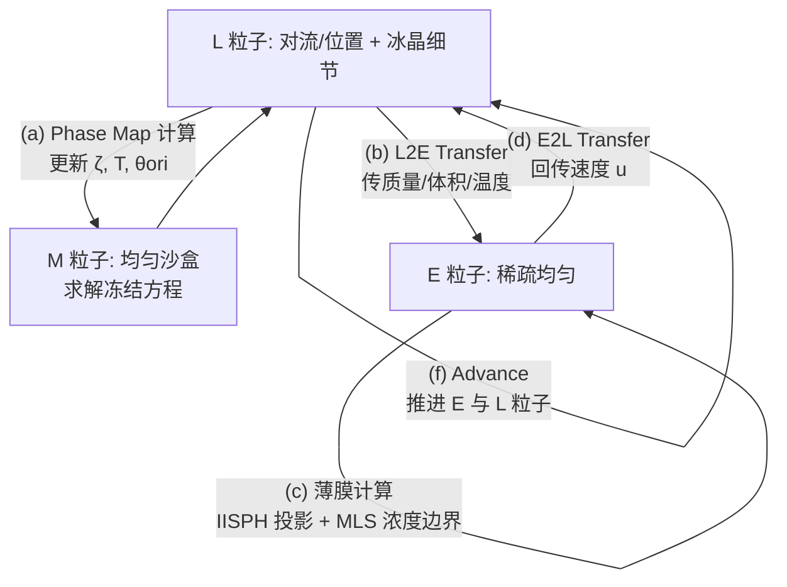

## 一句话总结

在无网格的 Moving Eulerian-Lagrangian Particles（MELP）薄膜框架上，引入温度方程与一套全新的"相图（Phase Map）"机制，首次实现了肥皂泡与薄膜冻结过程的物理仿真——既能重现"雪球效应"般旋转飞舞的冰晶（Marangoni 冻结），又能对枝晶花纹进行精确的艺术化控制。

## 研究背景

薄膜与肥皂泡的冻结是极具视觉张力的自然现象。与水滴或水洼从单一冻结前沿推进不同，肥皂泡冻结时会有大量冰晶在膜面上旋转生长，形成宛如雪球（snow globe）的奇观。前人研究揭示了两种典型冻结条件：等温条件下产生上述旋转雪球效应；室温条件下则形成自底向上、最终因导热不良而停滞的冻结前沿。

要仿真这一过程，需同时解决三个难点：一是包含相变与热传导的冻结动力学，二是冰与流体两相的耦合，三是冻结花纹的控制。此前图形学与计算物理各有积累但相互割裂：薄膜仿真方面有动态网格法、粒子法等，其中 MELP 用两层欧拉/拉格朗日粒子分别追踪薄膜形变与表面流动，是捕捉膜面细腻旋转运动的当前最优无网格框架，但它缺少温度方程，无法处理冻结；枝晶仿真方面有基于相场理论的方法，并被扩展出取向场（orientation field）以实现任意花纹控制，但这些结晶在空间上是静态的，无法表现 Marangoni 冻结与剧烈旋转的膜面冰晶。本文正是把二者打通。

## 方法

### 整体框架

本文在 MELP 的两层粒子（稀疏欧拉粒子 E 表示几何与投影，稠密拉格朗日粒子 L 表示对流与细节）之上，做了三件事：重新推导带可变温度 $T$ 的薄膜控制方程；引入第三类粒子 M 组成的"相图"机制在均匀分布的"沙盒"里计算枝晶；推导用于 MELP 的 MLS 浓度边界以提升复杂边界下的稳定性。

### 关键设计一：含温度的综合冻结动力学模型

MELP 原模型将温度忽略或视为常数，而本文指出：凝固释放的潜热引起温度变化，进而产生表面张力梯度，即 Marangoni 流，正是驱动冰晶旋转的关键。表面张力系数与表面活性剂浓度 $\Gamma$ 和温度 $T$ 相关：

$$\sigma = \sigma_0 - \bar{R} T \Gamma$$

由此得到表面张力梯度（Marangoni 效应）：

$$\nabla_s \sigma = -\bar{R}(T \nabla_s \Gamma + \Gamma \nabla_s T)$$

在此基础上补充厚度 $\eta$、浓度 $\Gamma$ 的守恒方程与温度 $T$、相场 $\zeta$ 的演化方程，构成综合冻结动力学模型，其切向动量方程为：

$$\frac{D \boldsymbol{u}^{\top}}{D t} = -\frac{2\bar{R}}{\rho \eta}(T \nabla_s \Gamma + \Gamma \nabla_s T) + \frac{1}{\rho}\boldsymbol{f}^{\top}_{ext}$$

为求解，作者把切向方程整理成关于 $\Gamma$ 的隐式方程，并用 IISPH 求解，从而更新切向速度。相比 MELP，该模型能在大温度梯度下保持稳定（MELP 会崩溃）。

### 关键设计二：基于取向的枝晶相场模型

沿用取向场枝晶方法，用相场值 $\zeta \in [0,1]$ 表示相态（0 液、1 固），在薄膜局部标架下的相场演化方程为：

$$\frac{\partial \zeta}{\partial t} = M_{\zeta}\left[\nabla_s \cdot (\varepsilon^2 \nabla_s \zeta) - \frac{\partial}{\partial u}\left(\varepsilon \frac{\partial \varepsilon}{\partial \boldsymbol{\theta}} \frac{\partial \zeta}{\partial v}\right) + \frac{\partial}{\partial v}\left(\varepsilon \frac{\partial \varepsilon}{\partial \boldsymbol{\theta}} \frac{\partial \zeta}{\partial u}\right) - g'(\zeta) - p'(\zeta)(f_s - f_l + f_{ori})\right]$$

其中 $\varepsilon$ 为各向异性函数。取向场演化：

$$\frac{\partial \boldsymbol{\theta}_{ori}}{\partial t} = -M_{ori} J (1 - p(\zeta)) \nabla_s \cdot \left(p(\zeta)\frac{\nabla_s \boldsymbol{\theta}_{ori}}{\vert \nabla_s \boldsymbol{\theta}_{ori}\vert }\right)$$

温度演化（含牛顿冷却与潜热项）：

$$\frac{\partial T}{\partial t} = a^2 \nabla_s^2 T + K \frac{\partial \zeta}{\partial t} + \frac{1}{\tau}(T_{env} - T)$$

### 关键设计三：Phase Map（相图）沙盒机制

直接把枝晶相场方程算在 L 或 E 粒子上都会失败：E 太稀疏无法重现细枝；L 虽稠密但其任意运动导致粒子分布不均、梯度错误，且 L 的动量运动不考虑粒子旋转，会在固液界面改变冻结前沿方向，导致枝晶扭曲成"拖尾状"分叉。

解法是借鉴 MELP"按任务分离粒子"的思想，引入第三类均匀分布、位置固定的 M 粒子。为每个冰晶 $C$ 关联一个由 M 粒子组成的块 $\Omega$，作为独立"沙盒"。初始随机采样结晶中心作为锚点，把 M 块中心链接到结晶中心，再通过 E 表示的形变面把 M 与真实膜面用映射的位置与旋转关联，从而保证准确的 SPH 离散和稳定的全局取向。

四个子步骤：(a1) Phase Mapping——把 $C$ 及其周围粒子对齐到 $\Omega$，计算 2D 旋转角与映射位置；(a2) L2M Transfer——用空间加权平均把 $\zeta, T$ 传到 M，并把 M 分为模板部分 $M_t$（不收集环境量以免破坏晶形）与环境部分 $M_e$（接收环境量保证多冻结前沿相遇时正确冻结）；(a3) Freezing Computation——在 $M_t$ 上求解相场/取向/温度方程；(a4) M2L Transfer——把结果回传给 L。这一"沙盒"让结构化枝晶能在无结构的移动粒子上正确生长。

### 关键设计四：艺术化花纹控制

除编辑取向场控制枝晶走向外，借助 Phase Map 还可用带符号距离函数（SDF）指定任意冰晶形状：去掉 M2L 步与相场方程求解，把负 SDF 值取反归一化到 $[0,1]$ 作为相场，正值丢弃且相场值不允许下降以防闪烁。由此可让冰晶长成爱心、花朵等造型。

### 关键设计五：MLS 浓度边界

MELP 用多层边界粒子解决边界处粒子不足，但无法物理地处理流固耦合。冻结引入了流体、枝晶与边界的复杂耦合。作者受 SPH 的 MLS 压力边界启发，因表面活性剂浓度 $\Gamma$ 在动力学中的关键作用，为 MELP 推导 MLS 浓度边界：对每个边界粒子 $B$ 用线性基拟合，最小化邻域 E 粒子上的加权残差：

$$\text{minimize} \sum_{E \in N_E(B)} a_E \left(\tilde{\Gamma}_B(\boldsymbol{x}_E) - \Gamma_E\right)^2 W_{BE}$$

解出 $3\times 3$ 系统得到 $\Gamma_B$，用作近边界求解时的伪浓度，同时以类似方式近似伪压力使 E 粒子均匀分布，显著提升复杂边界与外力条件下的稳定性。

### 实现要点

用 IISPH 在稀疏 E 上求投影，用 APIC 做 E 与 L 间的物质与动量传递。冻结计算需要更小时间步，故每个 MELP 步内嵌入若干（通常 10）冻结子步。M 粒子总数/面积需初始化为 L 的 2.5～3.5 倍以保证冗余。用阈值 $\varphi_{den}$（通常 0.1）区分固液相，把每个冰晶 $C$ 当作刚体处理，相对速度足够小时合并相邻枝晶以防剧烈运动。

## 实验结果

实验在 NVIDIA GeForce RTX 4080 GPU、Intel Core i9-13900K CPU 上并行实现。所有例子环境温度 -20 ℃，$J = 10^{-5}$，帧长 0.004 s。各例计算开销如下：

| 示例 | #L | #M | #E | 每帧耗时 (s) |
|------|------|------|------|------|
| 漂浮气泡（球） | 320k | 1M | 19k | 1.77 |
| 漂浮气泡（椭球） | 320k | 1M | 19k | 1.72 |
| 摇曳穹顶气泡 | 1.5M | 2.6M | 87k | 37.9 |
| 悬链面 | 164k | 493k | 9k | 1.36 |
| 对称破缺 | 320k | 1M | 19k | 2.09 |
| 螺旋枝晶 | 416k | 1.6M | 25k | 2.33 |
| 五角星薄膜 | 73k | 1M | 5k | 1.30 |
| 气泡上的爱心 | 320k | 914k | 19k | 0.89 |
| 薄膜上的花朵 | 80k | 640k | 5k | 0.49 |

典型场景：半径 0.1 m 的漂浮气泡（球形与椭球形，椭球设 8 重花纹，$K=3.7$ 生成细枝），枝晶随流动明显旋转移动且保持花纹细节；半径 0.26 m 的摇曳穹顶气泡（前 250 帧施加水平扫风，4 重花纹，分辨率提高到 150 万 L 粒子后细节更好但耗时最高 37.9 s）；两平行圆环间的悬链面（颈半径 0.07 m、高 0.18 m），可视化显示冰晶附近表面活性剂浓度下降；对称破缺（5 重花纹，$M_{ori}=2500$ 制造明显不对称，使冻结更真实）；螺旋枝晶（用灰度图固定取向场，冰晶在运动中长成螺旋）；五角星薄膜（外接圆半径 0.2 m，前 300 帧旋转风场，$K=3.0$ 抑制分枝，MLS 边界体现鲁棒性）；用随时间变化的 SDF 让冰晶长成爱心与花朵，后者还展现与 Rayleigh-Taylor 不稳定性的相互作用。

对比验证：不用 Phase Map 时枝晶被任意粒子分布扭曲，用后恢复正确细节晶形；不用 MLS 浓度边界会在边界附近出现明显伪影，用后消除。等温与室温两种条件下的气泡温度分布与渲染结果，与真实世界的热成像/照片相比吻合良好（室温例：冷基底 40 ℃、环境 20 ℃、3/4 气泡底部四层粒子初始 $\zeta=1$，重现自底向上并停滞的冻结前沿）。

## 亮点与局限

亮点：首次在物理仿真层面攻克薄膜/肥皂泡冻结这一未被专门研究的问题；把温度与 Marangoni 效应引入 MELP，重现了旋转雪球效应；"相图沙盒"巧妙地在无结构移动粒子上保住了结构化枝晶花纹，兼顾物理真实与艺术可控（取向场 + SDF 双通道控制）；MLS 浓度边界显著提升了复杂边界与外力下的稳定性；与真实热成像和照片的对比增强了说服力。

局限：作者坦承三点——相间耦合仍可改进，无法重现 Marangoni 流导致的冰晶从接触线脱离；虽然 MELP 支持多气泡，但本方法尚未在 Multi-MELP 上验证，连通气泡间冰晶转移的现象有待探索；当前实现内存效率较低，需研究更省内存的方案。

## 延伸思考

这项工作的核心方法论价值在于"用固定的均匀辅助粒子集为移动的物理粒子提供结构化计算基底"——当细节场（枝晶）对离散均匀性敏感、而载体（膜面）又必须自由运动时，把二者解耦到独立坐标系再双向映射，是很通用的思路，可迁移到布料表面纹理生长、流体表面刻蚀、生物膜图案等场景。取向场加 SDF 的双控制通道也提示：物理仿真的"可控性"可以分层设计，一层管物理走向、一层管目标形状。局限中提到的多气泡冻结与冰晶脱离，本质是更复杂的固-固/固-液拓扑耦合，若结合更精确的接触与断裂模型，有望进一步逼近真实世界那些"难得一见"的冻结奇观。内存效率问题则指向无网格冻结仿真在工业落地时的现实瓶颈。
