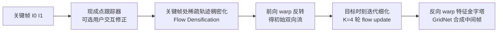

## 一句话总结

本文提出一种基于稀疏点轨迹（point tracks）的视频插帧方法：先用现成点跟踪器自动估计并插值轨迹、再允许用户手动修正，从而在提升插帧质量的同时让艺术家能控制中间帧的运动与外观，并通过推理时的低秩权重调整实现"清晰/模糊"的连续可调。

## 研究背景

- 领域现状：视频插帧（VFI）近年在运动估计、运动补偿与帧合成上进步很大，能在多数场景给出高质量中间帧；与此同时，稀疏点对应估计与全视频点跟踪（如 CoTracker、TAPIR 等）也快速发展。
- 核心痛点：其一，现有方法在大位移、复杂运动场景仍难以找到正确对应并补偿运动；其二，VFI 本质是病态问题，通常只输出一个固定结果，用户无法控制，难以嵌入影视制作流程；其三，训练时普遍假设简单（线性）运动模型，导致预测帧与真实参考帧存在时间错位。此外，成熟的点跟踪信息此前尚未被用于改善插帧。
- 本文 idea：把点跟踪与非线性运动估计连接起来。用稀疏点轨迹作为输入，先稠密化成关键帧到目标帧的光流，再反转、细化为用于合成的光流；轨迹既可全自动获取，也可由用户交互修正（补漏点、改轨迹）。因为训练时从包含目标帧的完整序列提取轨迹，模型能重建真实（可非线性）运动、避免与参考帧错位。再额外提供一个类 LoRA 的清晰度控制维度。

## 方法

整体框架：给定两张关键帧 $$I_0, I_1$$，目标是重建中间帧 $$I_t$$。流程为——用现成点跟踪器得到（可被用户修正的）稀疏轨迹 → 在关键帧处把稀疏轨迹稠密化为近似前向光流 → 前向 warp 得到初始双向流 $$F^0_{t\to\{0,1\}}$$ → 在目标时刻迭代细化光流 → 用细化后的光流反向 warp 关键帧特征金字塔并合成最终帧。

关键设计：

1. **轨迹获取与非线性插值**：默认用 CoTracker2 在整段序列上跟踪点，每条轨迹记录各帧位置与可见性 $$v\in\{0,1\}$$。取目标时刻位置时对轨迹位置插值，可见性取两端关键帧的最小值（只有两端都可见才算可见）。由于点是在整段视频上被跟踪的，可以用三次样条（cubic splines）等高阶插值来更准确地表达真实运动——这正是相比"线性运动假设"取得大幅提升的关键。训练时因目标帧已知，从所有输入帧提取轨迹，让输出与参考帧空间对齐，得到更好的监督信号。

2. **轨迹稠密化（Flow Densification）**：仅用最近邻或重心插值把稀疏位移铺成稠密流，与图像内容无关、误差较大。本文的做法是先用 DOT 细化出关键帧间的稠密流 $$\tilde{F}_{0\to1} = \text{DOT}(\bar{F}_{0\to1}, I_0, I_1)$$，再借助"关键帧运动相似度"把像素与轨迹点关联起来查询中间流：对每个像素 y，在其 $$K=16$$ 个最近可见邻居中，选取关键帧位移 $$(P^l_1-P^l_0)$$ 与细化流 $$\tilde{F}_{0\to1}[y]$$ 最匹配的轨迹，取其目标时刻位移作为 $$\hat{F}_{0\to t}[y]$$。即"轨迹点运动更可靠、细化关键帧流更懂像素邻域关系"，两者结合得到更好的稠密化。

3. **光流反转、细化与帧合成**：用前向 warp 把 $$\hat{F}_{i\to t}$$ 反转成从目标帧指向关键帧的初始流；因非线性运动无法用亮度恒常，改用基于 Depth Anything V2 单目深度的深度感知加权（再用小网络细化）。随后构建 5 层尺度无关特征金字塔，在 $$K=4$$ 轮迭代里对底部三层做反向 warp，用多层复用的循环更新块在 1/4 分辨率更新光流并维护隐状态。最后反向 warp 关键帧特征、对无有效前向 warp 的像素做遮挡掩膜置零，再用 $$3\times6$$ 的 GridNet 合成中间帧。

4. **低秩清晰度适配器（Low-Rank Sharpness Adapter）**：纯像素损失易糊，而感知/风格损失又可能产生幻觉伪影，有时"糊"反而更可取。本文先只用像素损失训练，再冻结原卷积、只微调帧合成网络里各卷积的低秩更新（加 VGG 特征差异损失）。每个卷积输出改写为 $$y = \Phi(x) + w\cdot\Delta\Phi_r(x)$$，其中 $$\Delta\Phi_r$$ 是先降到 r 维再升回 d 维的低秩卷积，控制权重 $$w$$ 训练时从 $$U[0,1]$$ 均匀采样。推理时可动态调 $$w$$ 在"清晰/幻觉"与"模糊"间连续折中，无需重训，还能按空间位置做局部控制。

## 实验结果

在 Vimeo-90K（256p）三元组测试与更具挑战的 DAVIS（1080p）上评测，插值每序列第 4 帧。下面是与代表性方法的无用户输入对比（DAVIS 更能体现难度差异，$$S_w$$ 为清晰度控制值）：

| 方法 | Vimeo PSNR↑ | Vimeo LPIPS↓ | DAVIS PSNR↑ | DAVIS LPIPS↓ |
|------|------|------|------|------|
| FILM-L$$_S$$ | 35.86 | 0.0132 | 27.22 | 0.0970 |
| PerVFI | 34.02 | 0.0179 | 27.38 | 0.0912 |
| GIMM（并行工作） | 35.74 | 0.0122 | 28.77 | 0.0738 |
| 本文 Ours-S0.0 | 35.74 | 0.0212 | 28.16 | 0.1176 |
| 本文 Ours-S1.0 | 35.49 | 0.0142 | 27.98 | 0.0839 |
| 本文 Ours-S0.0 + 三次样条 | n/a | n/a | 29.30 | 0.1123 |
| 本文 Ours-S1.0 + 三次样条 | n/a | n/a | 28.95 | 0.0791 |

要点：即便零用户输入，本文基础模型在 DAVIS 上已达到与最优相当水平，定量上仅次于并行工作 GIMM；一旦用整段四帧做非线性（三次样条）运动估计，DAVIS PSNR 提升到 29.30，明显超过所有先前方法（Vimeo 只有三帧故不适用）。

运动控制方面，随着提供的参考轨迹数增加，插帧质量持续提升：DAVIS 上从 0 条（PSNR 27.84）增至 512 条时 PSNR 达 31.66、SSIM 0.925、LPIPS 0.0645，验证了"用户修正错误对应点即可显著改善结果"。消融显示：用七帧且非线性（lin=0%）数据训练优于纯线性假设；去掉深度加权会严重掉点（DAVIS PSNR 从 28.16 跌到 25.04）；本文稠密化优于最近邻/重心插值。用户研究中 26 名用户投出 1598 票，辅助版（平均每序列交互约 6 分钟）相对最强先前方法 GIMM 获 91.4% 偏好、相对自身无辅助版获 83.7% 偏好。

## 亮点与局限

- 亮点：
  - 首个能利用稀疏点轨迹做运动估计的插帧架构，把成熟的点跟踪能力引入 VFI。
  - 训练与推理都支持非线性运动（三次样条轨迹），有效消除与参考帧的时间错位，在难数据上大幅领先。
  - 提供两类实用可控性：轨迹级的运动/外观修正，以及类 LoRA 的清晰度连续调节（可空间局部化），契合影视制作流程。
  - 基础（无输入）模型本身即达 SOTA 级别，用户研究偏好度压倒性。

- 局限：
  - 优先质量与可控性而非效率，交互开销大（单序列平均交互约 6 分钟；整段插帧约 0.80 秒，4K 需约 24GB 显存）；低倍率预览与高帧率成片可能不一致。
  - 交互界面仍偏手工，改一个物体轨迹需手动选中所有相关点；缺少对深度与遮挡值的控制，某些序列难以改好。
  - 基于显式光流表示，对无法用单一位移向量近似的复杂元素（如体积/烟雾）会失效。

## 延伸思考

- 与并行工作 GIMM 的关系值得关注：GIMM 用隐式运动建模，本文作者也指出把隐式运动建模引入光流反转有望进一步提升；二者可能是"可控显式流"与"隐式运动"的互补路线。
- 可控性思路可迁移：把"用户修正稀疏轨迹 → 稠密化 → 合成"这套范式与分割/跟踪基础模型结合，用分割自动圈定编辑区域，能大幅降低交互成本。
- 清晰度 LoRA 的"训练时采样控制权重、推理时连续调"是一种通用的可控生成技巧，适用范围不止插帧，可推广到超分、修复等对"保真-感知"权衡敏感的任务。
- 效率是落地关键：若能在不牺牲质量的前提下加速，使高帧率成片可交互预览，将显著提升该方法在实际后期流程中的可用性。
