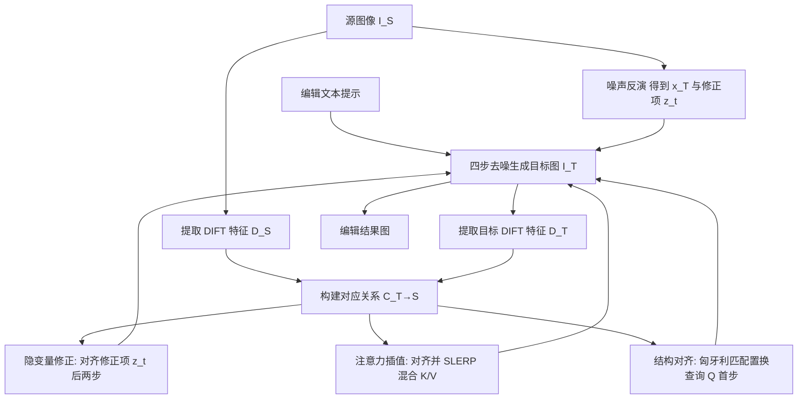

## 一句话总结

Cora 在四步扩散模型之上，通过对应关系感知的噪声修正与注意力插值，让快速图像编辑既能保留源图的结构、纹理与身份，又能在需要时生成全新内容，支持姿态改变、物体增删等大幅结构性编辑。

## 研究背景

图像编辑在计算机图形学、视觉与影视特效中都是重要任务。基于扩散模型的少步（few-step）编辑方法显著加速了这一过程，可以在数步之内完成快速且高质量的编辑。然而，超出像素颜色改动的结构性编辑（如非刚性形变、物体增删、内容生成）对扩散模型依然困难。

现有少步编辑方法存在两类典型缺陷。其一，以 TurboEdit 为代表、依赖噪声修正的方法常产生无关纹理伪影，且难以保持源图的身份或关键属性（如姿态）。根本原因在于：这些噪声修正项假设编辑后的图像与源图仍逐像素对齐，而一旦发生结构性形变，源图与目标图不再像素对齐，修正项被强行注入到错位的位置，导致纹理错配、轮廓裂缝与不该出现的内容重现。其二，像 MasaCtrl 那样只把源图的键（key）和值（value）注入自注意力，虽然能保留外观与身份，却会把源图纹理错误地复制到目标图中本无对应关系的区域，也限制了新内容的生成。

Cora 的思路是：用语义对应把源图与目标图的像素、纹理、结构对齐起来，从而在对齐的前提下做纹理迁移，并在缺乏对应时改由文本驱动生成新内容。

## 方法

### 整体框架

Cora 构建在少步文生图模型 SDXL-Turbo 之上，源图反演与目标图生成均使用四步去噪。它包含三个核心模块：对应关系感知的隐变量修正（correspondence-aware latent correction）、对应关系感知的注意力插值（correspondence-aware attention interpolation）以及结构对齐（structural alignment）。三者分别作用于去噪过程的不同阶段，共同实现结构、纹理与身份的平衡保留。

### 关键设计

**1. 对应关系感知的隐变量修正。** 噪声反演把输入图 $$x_0$$ 映射为 $$\{x_T, z_{T-1}, \dots, z_1, z_0\}$$，其中修正项 $$\{z_t\}$$ 在文本不变时保证逐像素完美重建。当编辑要求大幅形变时，这些修正项与生成图不再对齐。Cora 用 DIFT 特征 $$D_S$$、$$D_T$$ 在后两步去噪中建立源目标对应图：

$$C_{T\to S}(p) = \arg\max_{q \in I_S} \mathrm{sim}(D_T(p), D_S(q))$$

再据此重排修正项 $$z_t^{\mathrm{aln}}(p) = z_t(C_{T\to S}(p))$$，让噪声修正跟随编辑后的几何。由于逐像素 DIFT 特征可能含噪，Cora 改用重叠分块（patch）对应：拼接块内像素特征算余弦相似度，多块重叠贡献取平均；随着去噪推进特征更可靠，块尺寸从 5×5 逐步减小到 3×3，使对应越来越精细。

**2. 对应关系感知的注意力插值。** 只用源图 K/V（MasaCtrl 式）会 $$f_e = \mathrm{Attention}(Q_T, K_S, V_S)$$，保住外观却难生成新内容；简单拼接 K/V 又会造成"外观泄漏"（如红车元素渗进白色公交车）。Cora 先按对应对齐源图 K/V，再做插值。相比线性插值 LERP，它采用球面线性插值 SLERP 兼顾向量方向：

$$Q(v_1, v_2; \alpha) = \frac{\sin((1-\alpha)\theta)}{\sin(\theta)} \cdot \frac{v_1}{\vert v_1\vert } + \frac{\sin(\alpha\theta)}{\sin(\theta)} \cdot \frac{v_2}{\vert v_2\vert }$$

再单独对模长插值 $$M(v_1, v_2; \alpha) = (1-\alpha)\vert v_1\vert  + \alpha\vert v_2\vert $$，合成 $$MQ = M \cdot Q$$ 后代入自注意力。参数 $$\alpha$$ 提供外观过渡控制：$$\alpha=0$$ 完全取源图外观，$$\alpha=1$$ 完全遵循编辑提示。

**3. 内容自适应插值。** 当提示要求插入新物体或造成明显遮挡消失时，并非每个目标像素都能在源图找到对应。Cora 用双向匹配识别"新像素"：源块 $$s$$ 的 top-k 目标块记为 $$K(s)$$，目标块 $$t$$ 的 top-k 源块记为 $$K(t)$$，若 $$t \in K(s)$$ 且 $$s \in K(t)$$ 则视为双向匹配，用用户设定的 $$\alpha$$；对无匹配且匹配分数低于 $$\gamma$$ 分位阈值 $$\tau_\gamma$$ 的目标块（论文取 $$\gamma=3\%$$），令 $$\alpha=1$$ 使其纯由文本驱动。

**4. 结构对齐。** 自注意力中的查询 $$Q$$ 决定生成图结构。Cora 在首步去噪对源目标查询做匈牙利匹配以取得一一置换 $$\pi^*$$，权重矩阵由两项线性组合：促进源对齐的 $$C_{SA}[i,j] = 1 - \mathrm{sim}(q_s[i], q_t[j])$$ 与促进目标一致性的 $$C_{TC}[i,j] = \sqrt{\vert i-j\vert }$$，即 $$C = (1-\beta)\,\mathrm{normalize}(C_{SA}) + \beta\,\mathrm{normalize}(C_{TC})$$。调节 $$\beta$$ 可在保留源结构（$$\beta \approx 0$$）与更遵循文本布局（$$\beta \approx 1$$）之间过渡。

实现上，Cora 沿用 TurboEdit 的时移反演、末步范数裁剪与文本引导；并借鉴 FlexiEdit 在首步对隐变量做高频抑制以放宽刚性约束；可选地用掩码隐变量混合来保护不该改动的背景。

## 实验结果

论文在真实图像上展示了非刚性形变、插入新物体、替换物体等多种编辑，并与少步基线（TurboEdit、InfEdit）及多步框架（MasaCtrl、DDPM 反演、Prompt-to-Prompt、Plug-and-Play、InstructPix2Pix、StyleDiffusion 等）对比。

由于 PSNR、LPIPS 等标准指标难以捕捉大幅形变编辑的视觉质量，论文以用户研究为主要评估。51 名参与者在提示对齐与源图保留两个维度上按 1（最差）到 4（最佳）打分，Cora 平均排名 3.29，显著领先其他少步方法：

| Method | 平均排名 ↑ |
|---|---|
| MasaCtrl | 1.02 |
| DDPM Inversion | 1.78 |
| InfEdit | 1.67 |
| TurboEdit | 2.24 |
| Cora（Ours） | 3.29 |

针对注意力混合策略的另一项用户研究表明，对应关系对齐后的 SLERP 插值效果最佳：

| Method | 平均排名 ↑ |
|---|---|
| Mutual | 0.40 |
| Concatenation | 1.71 |
| LERP | 2.08 |
| LERP+DIFT | 2.58 |
| SLERP+DIFT | 3.23 |

在补充材料的定量对比中（背景区域衡量内容保留，CLIP 相似度衡量文本对齐）：

| Method | PSNR（背景）↑ | LPIPS（背景）↓ | MSE（背景）↓ | SSIM（背景）↑ | CLIP Sim.（整图）↑ | CLIP Sim.（编辑区）↑ |
|---|---|---|---|---|---|---|
| Prompt2prompt | 19.9 | 153.98 | 188.94 | 79.58 | 24.87 | 22.35 |
| Plug-and-play | 24.88 | 80.86 | 72.53 | 86.25 | 25.13 | 22.08 |
| NTI | 29.92 | 36.68 | 25.18 | 91.02 | 24.18 | 21.09 |
| StyleDiffusion | 28.65 | 45.16 | 34.53 | 89.6 | 24.02 | 21.28 |
| InstructPix2Pix | 22.47 | 145.50 | 241.69 | 80.38 | 21.54 | 19.80 |
| DDPM inversion | 24.09 | 110.68 | 220.50 | 84.65 | 23.35 | 20.40 |
| MasaCtrl | 24.47 | 82.81 | 78.44 | 87.01 | 23.99 | 21.00 |
| TurboEdit | 27.95 | 44.98 | 37.87 | 89.82 | 24.79 | 22.44 |
| InfEdit | 25.51 | 123.76 | 370.24 | 80.21 | 23.34 | 20.08 |
| Cora（Ours） | 28.02 | 50.57 | 38.03 | 89.39 | 24.91 | 22.69 |

Cora 在两项 CLIP 文本对齐指标上均取得最佳，同时在背景保留指标上保持有竞争力的水平，说明它在遵循编辑提示与保留源图内容之间取得了良好平衡。消融实验进一步确认：结构对齐对保留背景细节与源图姿态至关重要，隐变量修正对避免大幅形变下的错位伪影不可或缺，去掉注意力的对应对齐会带来更多伪影。

## 亮点与局限

**亮点**：
- 指出并解决了少步编辑中噪声修正项"假设像素对齐"这一根本缺陷，提出对应关系感知的隐变量修正，用分块 DIFT 对应把修正项重排到编辑后的几何位置。
- 用 SLERP 注意力插值替代只用源图 K/V 或简单拼接的做法，既能精确迁移纹理又能按需生成新内容，避免了外观泄漏与错位伪影。
- 通过 $$\alpha$$、$$\beta$$ 两个可调参数分别控制外观与结构的保留程度，因只需四步去噪，用户可低成本快速试参，实现从微调到大幅变换的连续控制。
- 仅四步扩散即可完成大幅结构性编辑，在速度上远快于多步方法而质量相当或更优。

**局限**：
- 文本提示可能改动图像中不该改动的部分（如改变车身颜色时也影响到背景）。论文指出可用交叉与自注意力自动获取掩码来缓解，但在仅四步去噪的设定下实现有挑战，留作未来工作。
- 尚未扩展到视频编辑，非线性注意力插值的其他形式也有待探索。

## 延伸思考

Cora 的核心洞见是：把扩散特征中蕴含的语义对应（DIFT）显式地引入编辑流程，用来对齐"错位"的噪声修正与注意力键值。这提示我们，许多少步/快速编辑方法的伪影并非模型能力不足，而是源自"编辑前后像素对齐"这一被隐含却常被打破的假设。一旦用对应关系补上这一环，快速模型也能胜任大幅结构性编辑。

其"对齐后再插值"的思路（先建立语义对应，再在对齐空间做 SLERP 混合）具有通用性，可能迁移到视频编辑的时序一致性、多视角一致生成，或需要跨图纹理迁移的任务中。而用 $$\alpha$$、$$\beta$$ 把"生成"与"保留"解耦为可调旋钮的做法，也为可控编辑提供了直观的交互范式，尤其契合少步模型低延迟、可快速迭代试参的特点。
