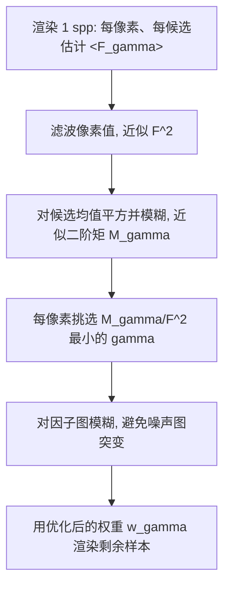

## 一句话总结

针对多重重要性采样（MIS）中平衡启发式（balance heuristic）在低方差技术、样本相关性、未知 PDF 三类场景下表现不佳的问题，本文提出一种通用、简单、实用的"权重修正"方案：在任意基线 MIS 权重上乘以一组通过直接搜索在线优化得到的修正因子，从而在等时间预算下稳定地降低估计噪声。

## 研究背景

MIS 是几乎所有渲染算法的核心工具，它把多种蒙特卡洛采样技术组合成一个联合算法，用加权求和的方式让每种场景都能找到至少一种合适的技术。MIS 估计器写作：

$$\langle F\rangle_{\mathrm{MIS}}=\sum_{t\in\mathcal{T}}\sum_{i=1}^{n_t}w_t(x_{t,i})\frac{f(x_{t,i})}{n_t\,p_t(x_{t,i})}$$

其中权重函数 $w_t(x)$ 的选择直接决定性能。最常用的平衡启发式为：

$$w_t^{\mathrm{bal}}(x)=\frac{n_t\,p_t(x)}{\sum_k n_k\,p_k(x)}\propto n_t\,p_t(x)$$

它只依赖样本数与 PDF，计算便宜、且方差有理论上界。但它是通过最小化"每技术单样本二阶矩之和"来工作的，在以下三种情形该项不再主导真实方差，平衡启发式就会失灵：

- 低方差技术：当某技术方差接近零时，其单样本二阶矩会远大于真实方差，平衡启发式会误以为它很差，给它分配过低的权重。这正是 power/maximum/cut-off 启发式以及方差感知 MIS（VA-MIS）的出发点。
- 样本相关性：平衡启发式的误差界建立在样本独立假设上。光子映射类方法会在数百万条完整路径间复用同一条相机前缀路径，引入正协方差，使真实方差多出一项 $\mathrm{Cov}$。相关性越强，平衡启发式越差。
- 未知 PDF：MCMC 和重采样（如 RIS、ReSTIR）方法只能渐近逼近目标分布，有限候选下的真实密度不可计算，且目标密度往往只知道到一个归一化常数。

已有工作分别针对某个子问题给出解法（最优 MIS 权重、CA-MIS、Nabata 等的插值），但都是问题特定、常常应用特定，且通常次优。最优 MIS 权重虽好，却要求样本独立且所有 PDF 有闭式，限制了适用性。本文追求一个能同时应对三类挑战的通用实用方案。

## 方法

核心思想：在任意基线启发式 $\beta_t(x)$（可以是平衡、power、CA-MIS 的 $c_t$、VA-MIS 的 $v_t$ 等）之上再乘一个可优化的修正因子 $\gamma_t$：

$$w_t(x)\propto \gamma_t\,\beta_t(x)\,n_t\,p_t(x)$$

其中 $\gamma_t$ 对每个技术（或每组技术）取常数。目标是找到使 MIS 估计器方差最小的一组因子：

$$\{\gamma_t^{\mathrm{opt}}\}\approx\arg\min_{\{\gamma_t\}}\;\mathbb{V}\!\left[\langle F\rangle_{\mathrm{MIS}}\right]$$

作者不用梯度法，而是在极小的候选因子集合上做直接搜索。三点理由：方差本身易于估计而其梯度因协方差变得棘手；直接搜索支持单步优化；只要候选集合里包含 $\gamma_t=1$，就能保证结果不会比原始平衡启发式更差。

关键设计：

- 小候选集：实践中每个因子只用四个候选值 $\{0.01,0.1,0.5,1.0\}$。作者发现更细粒度、更宽范围的候选池即使在精确预计算下也几乎没有额外收益，而在单样本实用场景下反而放大估计噪声、导致更差结果。
- 降维：把相似技术分组共享同一因子（例如 VCM 中所有 merging 技术共用一个 $\gamma_m$）；再利用因子比值等价性进一步减少维数——对两组技术施加因子 $a$、$b$ 等价于只对其一施加比值 $c=a/b$：

$$\frac{a\,p(x)}{a\,p(x)+b\,q(x)}=\frac{c\,p(x)}{c\,p(x)+q(x)},\quad c=\frac{a}{b}$$

- 先验剪枝：利用已有认知只修正最容易出问题的技术（VCM 中只修正 merging 与 light tracing），且已知这些技术权重通常偏大，于是只考虑 $\gamma_t\le 1$。
- 方差估计支持相关样本：不使用平衡启发式的单样本公式，而直接估计整体二阶矩。由于第一矩平方 $F^2$ 对 $\gamma$ 为常数可忽略，只需估计

$$M_\gamma=\mathbb{E}\!\left[\left(\sum_{t\in\mathcal{T}}\sum_{i=1}^{n_t}w_{t,\gamma}(x_{t,i})\frac{f(x_{t,i})}{n_t\,p_t(x_{t,i})}\right)^2\right]$$

- 滤波流水线（实用关键）：从单样本出发，先对 $\langle F_\gamma\rangle^2$ 做高斯模糊；再改为模糊"相对矩"——用滤波后图像平方近似 $F^2$，用它去除二阶矩，既改善不连续处又因两个相关量相除降低噪声；最后对选出的因子图再做模糊，避免噪声模式突变。VCM 用 8 像素半径，重采样用 32 像素半径。

## 实验结果

平台为 AMD Ryzen 9 5900X，图像 640×480，最大路径长度 10。误差用相对均方误差（relMSE），加速比以基线为 1.00x。

应用一 VCM（双向渲染）：优化两个独立因子——直接光照的光线追踪因子 $\gamma_l$ 与所有 merging 技术的联合因子 $\gamma_m$，均建立在 CA-MIS 之上。

- 等采样、20k spp 预计算的加速比：Cornell Box 1.92x、Duck 2.56x、Veach Bidir 2.08x、Spheres 1.71x、Rough Glasses 1.16x、Stage Night 2.56x、RGB Sofa 1.20x、Target Practice 1.46x、Bookshelf 1.09x。
- 实用单样本滤波版加速比：分别为 1.83x、2.25x、1.83x、1.57x、1.07x、1.52x、1.17x、1.41x、0.98x——即使因子远未收敛，仍能识别最需修正的区域。最差场景 Bookshelf 出现刚可测的 0.98x 轻微退化。
- 等时间 30 秒对比（相对 CA-MIS）：Veach Bidir 全图 relMSE 从平衡启发式的 0.24（0.08x）改善到本文 0.0112（1.78x）；Stage Night 本文 0.04（1.55x）对 CA-MIS 0.07；Spheres 本文 9.38e-03（1.49x）；Target Practice 本文 1.09e-02（1.27x）。
- 灵活性研究（Veach Bidir，等时间 10 秒）：平衡启发式 0.622（1.00x），VA-MIS 0.525（1.18x），Ours+Balance 0.130（4.80x），CA-MIS 0.057（10.85x），VA+CA-MIS 0.053（11.70x），Ours+CA-MIS 0.036（17.51x）。本文方法叠加在最好基线上得到最优结果。
- 低方差直接光照（Spheres，10 秒）：平衡 2.03e-03（1.00x），VA-MIS 仅作用于 LT 0.76x，VA-MIS 完整 11.16x，Ours 仅作用于 LT 1.71e-04（11.88x）——用更少因子达到与完整 VA-MIS 相当效果。
- 开销约相当于 1–2 次 VCM 迭代，相对可得加速可忽略。

应用二 RIS（重采样直接光照）：BSDF 采样与光源采样组合，光源用 32 个候选做均匀面积采样后重采样一个，目标函数为无遮挡的 BSDF 加权贡献 $p^*(y|x,\omega_o)=L_e(y\to x)\,G(x,y)\,B(x,y,\omega_o)$。基线为使用候选 PDF 的平衡启发式，在 BSDF 权重上乘 $\gamma_r\in\{0.01,0.1,0.5,1.0\}$。

- Modern Hall 等时间 5 秒：平衡 2.9e-01（1.00x），VA-MIS 2.4e-01（1.22x），Nabata 等 8.1e-02（3.56x），Ours 6.9e-02（4.19x）；20 spp 预计算下 Ours 8.3e-02（5.54x）略优于 Nabata 5.52x。
- RGB Sofa 等时间：平衡 5.4e-03（1.00x），VA-MIS 4.1e-03（1.33x），Nabata 7.2e-03（0.75x，反而变差），Ours 4.0e-03（1.35x），与 VA-MIS 持平。
- Veach MIS（暴露局限）：等时间 Nabata 1.3e-02（3.57x）略优于 Ours 1.4e-02（3.31x）；本文粗糙滤波对反射锐边不敏感，且只考虑降低 BSDF 权重而此处恰恰需要提高 BSDF 权重。

总体上，没有任何一个先前方案在所有场景都令人满意，而本文方法在每个场景都能与当场最佳方案持平，是唯一能一致性改进平衡启发式的方案。

## 亮点与局限

亮点：

- 通用性强：作为"修正因子"可叠加在任意 MIS 启发式之上（平衡、power、CA-MIS、VA-MIS 均可），单独使用或组合使用皆可。
- 因为包含 $\gamma_t=1$ 候选，理论上保证不劣于基线；直接搜索绕开了非凸性与协方差带来的梯度难题。
- 直接估计整体二阶矩而非单样本公式，天然支持相关样本，这是最优 MIS 权重无法处理的情形。
- 极其实用：单样本 spp 加上滤波即可在线优化，开销仅 1–2 次迭代。

局限：

- 强依赖滤波：单样本方差估计噪声大，滤波是关键也是主要开销来源，而"更准"与"更省"两个目标相互矛盾。
- 候选集需人工设计：过多带来开销，方向错误的权重增大会损害图像，每个应用都需谨慎挑选候选。
- 只处理像素内相关，不处理像素间相关（MCMC、时空复用的斑块伪影无法应对）。
- 单样本优化在自适应算法（路径引导、MCMC、时序复用）或低差异序列下可能不足，需要迭代刷新。
- 实践中未发现负权重带来收益，作者推测负权重的收益可能只在权重编码控制变量时出现。

## 延伸思考

这篇工作体现了一种"务实的优化观"：与其追求闭式最优权重（需要苛刻假设），不如在一个极小候选集上做鲁棒的直接搜索，用"保证不变差"的下界换取工程可用性。四个候选值 $\{0.01,0.1,0.5,1.0\}$ 的粗粒度反而比细粒度更稳，是很有启发性的反直觉发现——它说明在噪声估计主导的场景里，优化空间的"平滑保守"比"精确"更重要。

自然的延伸方向包括：把修正因子从图像空间移到 3D 场景空间以获得更细控制；用现代去噪器替换简单高斯滤波；引入 Nelder-Mead 等自适应候选搜索与卡方检验来防止选中被严重低估方差的坏候选；以及将方法推广到 ReSTIR 等实时管线（需要精心设计的时序复用与更廉价的滤波）。而作者留下的最大开放问题依旧诱人：当样本在技术内部与技术之间都相关时，真正最优的 MIS 权重究竟是什么，以及是否值得彻底放弃 balance 风格的权重形式。
