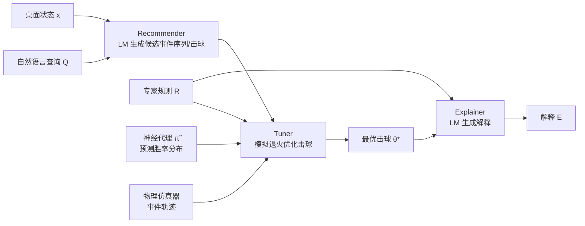

## 一句话总结

CueTip 把一个现成的语言模型和一个台球物理仿真器组成闭环，做出一个能用自然语言交互、依据领域专家规则给出可解释理由、且策略能力可插拔替换的台球教练助手。

## 研究背景

- 领域现状：台球一直是 AI 研究的试验场，早年出现过不少高水平对弈智能体（如计算台球锦标赛的冠军 Poolmaster）。近年又兴起用语言模型做规划与推理，以及对可解释性的追求。
- 核心痛点：语言模型擅长对话，却天生不擅长对物理系统的动力学做推理——即便把初始状态、击球参数、物理常数都精确描述给它，它仍很可能"幻觉"出物理上不成立的预测。同时，已有可解释性方法（特征归因、扰动、梯度等）跨领域泛化差，也不适合在线决策。
- 本文 idea：与其试图把台球物理知识硬塞进庞大的语言模型，不如给物理仿真器"埋点"，让它在输出传统状态轨迹的同时，输出一串用自然语言描述的简单事件。这种事件轨迹天然适合语言模型解读，语言模型于是成为助手的交互接口；再用一个小神经网络把"战术选择"与"交互性、可解释性"解耦。

## 方法

CueTip 的总体流程是：给定桌面状态和用户的自然语言查询，先由 recommender（推荐器）调用现成语言模型生成若干候选击球，再由 tuner（调优器）结合专家规则与神经代理网络把候选击球优化到最佳，最后由 explainer（解释器）依据专家规则生成解释。核心创新在于用一个小型 MLP 作为任意对弈智能体的"神经代理"，把战术强度和系统的交互/解释能力分离开。

关键设计：

1. **事件化的仿真轨迹**：作者改造仿真器，让它除了状态轨迹外，还输出一串预定义事件，每个事件由字符串 token 拼成，主要有三类——`ball-ball-<bid1>-<bid2>`（两球相撞）、`ball-cushion-<bid>`（球撞库边反弹）、`ball-pocket-<bid>-<pid>`（球落袋）。这层抽象丢弃了几何与速度、旋转等细节，虽有损，却让语言模型能对不同击球的"定性结果"做比较。

2. **三段式可解释智能体**：定义智能体 $$\Pi: X \times L \to \Theta \times L$$，输入状态和查询、输出击球与解释。recommender 用思维链提示让语言模型先规划再产出目标事件序列 $$L$$；随后寻找 $$N_r$$ 个候选击球 $$\hat\theta_k$$，使其仿真事件序列尽量匹配 $$L$$，具体通过模拟退火最小化 $$d_L(L, L_k) - \lambda(\vert L_k\vert  + \|\hat\theta_k\|)$$，其中 $$d_L$$ 是与 $$L$$ 首事件对齐的最长公共有序子序列。每个候选还带有策略标签（进攻/防守/无）和难度标签（易/中/难/无）。

3. **神经代理与不确定性**：为任意智能体 $$\pi$$ 训练一个经验代理 $$\tilde\pi$$，它不是从 $$(x,\theta)$$ 出发，而是从规则评估向量 $$r \in [0,1]^m$$ 映射到胜率分布的 $$n$$ 个分箱，即 $$\tilde\pi: [0,1]^m \to [0,1]^n$$。这样解释才能扎根于专家规则。训练时对击球注入高斯噪声 $$\epsilon \sim N(0, \sigma^2)$$ 模拟执行误差，用蒙特卡洛模拟整局对局统计胜率直方图作为标签。网络是六层、每层 256、ReLU 的 MLP。分布的期望高说明收益好，方差小说明对执行误差鲁棒。

4. **策略与难度打分**：定义进攻/防守规则的二值向量 $$w_o, w_d$$，据此算策略得分 $$v_s$$（防守时 $$v_s = (w_d - w_o) \cdot r_t$$，进攻时反之）；难度得分 $$v_d = H_{max} - \vert h_t - h_d\vert $$ 用价值分布的熵来度量。tuner 最终对每个候选最大化目标 $$E[\tilde p] + v_s + v_d$$ 选出 $$\theta^*$$。

## 实验结果

作者在自建的 3Pool 环境（两人、6 颗色球、9 球变体）里让六个智能体两两对弈，每对 100 局。主实验的胜率对比（行为 Player 1，列为 Player 2，取部分关键列）如下：

| Player 1 \ Player 2 | $$\tilde\pi_{pm}$$ | $$\Pi_{pm}$$ | $$\pi_{pm}$$ | $$\pi_g$$ |
|------|------|------|------|------|
| $$\tilde\pi_{pm}$$（PoolMaster 代理） | - | 73 | 62 | 86 |
| $$\Pi_{pm}$$（CueTip PoolMaster） | 27 | - | 59 | 77 |
| $$\pi_{pm}$$（PoolMaster 本体） | 38 | 41 | - | 85 |
| $$\pi_g$$（贪心基线） | 14 | 23 | 15 | - |

关键结论：神经代理 $$\tilde\pi_{pm}$$ 表现最好，对其训练来源、锦标赛冠军 $$\pi_{pm}$$ 的胜率超过 50%（62%），说明带随机性与不确定性的优化甚至超过了训练它的智能体本身。交互版 $$\Pi_{pm}$$ 对 $$\pi_{pm}$$ 也有 59% 胜率，虽比非交互版略降，体现了"交互性 vs 性能"的取舍。潜球率方面 $$\Pi_{pm}$$ 最高（93%），但 $$\tilde\pi_{pm}$$ 潜球率仅 62% 却胜率最高，说明台球致胜靠的是攻守兼顾的策略而非一味潜球。

其余实验用文字概述：规则相关性实验中，把规则评估向量 $$r_r$$ 加入上下文后，语言模型对规则相关度的判断与真值的 Likert 距离平均 < 1，明显优于不带 $$r_r$$ 的对照；模型规模越大越准（70B 时带 $$r_r$$ 距离 0.43，不带为 1.95）。100 人的用户研究显示，CueTip 的解释在各经验层级评分都更高，且在高经验用户中差距最大（$$\Delta\mu = 1.11$$）。消融实验表明去掉神经代理、改用纯 LM 或启发式引导的 LM 决策，胜率会掉 40% 以上。

## 亮点与局限

- 亮点：
  - 用"给仿真器埋点、输出自然语言事件轨迹"这一巧思，绕开了让语言模型直接做物理推理的难题，思路简洁且可迁移。
  - 神经代理把战术能力与交互、解释解耦，可插拔地模仿任意对弈智能体，且更换底层智能体只需重训一个小 MLP，语言模型仍用现成的。
  - 解释扎根于领域专家规则而非语言模型自由发挥，配合规则评估向量，使解释更可靠、更受资深玩家认可。

- 局限：
  - 可解释性以需要为每条规则实现评估函数 $$r_i$$ 为代价，规则描述 $$R_i$$ 与其实现之间的不一致可能引入误差。
  - 用模拟退火做击球优化，没有全局最优性保证。
  - 部分设计（如关键事件的选取）是领域特定的，对其他物理系统的泛化能力尚难断言。
  - 缩小语言模型规模会明显拉低结果质量，对端侧部署是现实约束。

## 延伸思考

这套"仿真器产生结构化事件 + 语言模型做接口与解释 + 小网络做可插拔战术"的范式，思路上并不限于台球，理论上可推广到其他有清晰事件抽象的物理博弈或交互环境（作者也计划把 3Pool 作为开源基准）。值得追问的是：事件词表的粒度直接决定了可支持的查询空间与检索速度之间的取舍，如何自动地、自适应地扩充事件集合而不牺牲效率，是一个有意思的方向。另外，规则评估函数需要人工实现，若能让语言模型或数据驱动方式半自动地从专家文本生成并校准这些 $$r_i$$，可解释系统的搭建成本会大幅下降。
