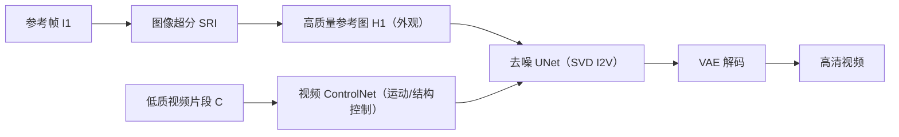

## 一句话总结

DAM-VSR 把视频超分拆成"外观增强"和"运动控制"两个子问题，用图像超分负责细节、用视频扩散模型（SVD）的图生视频先验负责时序传播，从而在真实世界和 AIGC 视频上生成兼具真实细节与时序一致性的高清视频。

## 研究背景

- 领域现状：真实世界视频超分（VSR）面对复杂且不可预测的退化。近年一批方法借助图像扩散模型逐帧超分，细节生成能力明显提升；也有方法转向视频扩散模型以改善时序一致性。
- 核心痛点：逐帧的图像扩散方案在相邻帧之间产生不一致的细节，破坏视频连贯性；而直接把 VSR 当成视频扩散训练任务的方法（如 SeedVR）需要海量数据与算力（约 1 亿图像、500 万视频，256 张 H100），代价过高。作者尝试用 SVD 配 ControlNet 直接做 VSR，但发现 SVD 本质是"参考图动画化"模型，整段视频的外观由参考图决定，而低质参考图缺乏细节，仅靠视频 ControlNet 无法有效补充外观。
- 本文 idea：既然外观由参考图主导、运动可由低质视频控制，那就把两者解耦。先用发展更成熟的图像超分（ISR）把参考帧做清晰，再借 SVD 的图生视频能力把细节传播到其余帧；低质视频只通过 ControlNet 提供运动与结构控制。这样既吃到视频扩散的时序先验，又吃到图像超分的细节生成能力，还免去大规模重训。

## 方法

整体框架：给定一段低质视频片段，取其参考帧（首帧）经图像超分得到高质量参考图，作为 SVD 图生视频的外观来源；低质视频本身经视频 ControlNet 注入，作为运动与结构条件。二者共同驱动去噪 UNet 预测噪声，最终解码出高清视频。为支持长视频，再叠加"运动对齐的双向采样"策略。

关键设计：

1. 外观与运动解耦（是什么/为什么/怎么做）。是什么：把 VSR 拆成参考图外观增强 $$H_1 = SR_I(I_1)$$ 与低质视频运动控制两路。为什么：SVD 的生成外观由参考图决定，低质参考图会拖累整段视频质量，而 ISR 在细节生成上已领先 VSR。怎么做：先对首帧做 ISR 得到富细节的 $$H_1$$，编码后重复 $$k$$ 次并与随机噪声在通道维拼接作为 UNet 与 ControlNet 的初始隐变量，同时 $$H_1$$ 经 clip 编码后通过 cross attention 注入；低质视频 $$C$$ 经若干视频嵌入层送入 ControlNet 提供运动控制。

2. 视频 ControlNet。在图像 ControlNet 基础上改造：复制原 UNet 编码器（含时序注意力与 3D 卷积层）及权重，新增视频嵌入层编码低质视频并与"隐变量噪声+参考图"特征相加，各层输出再加到原 UNet 解码器的跳连上，实现对时序动态的控制。

3. 运动对齐的双向采样（长视频）。SVD 单次只能生成固定帧数（本文 $$k=14$$），直接切片拼接会产生片间闪烁，自回归又会误差累积。做法：每一步同时跑"解耦前向生成"和"解耦后向生成"。前向以高质首帧 $$H_1$$ 和 $$C$$ 为条件预测噪声 $$p^f_t$$ 与时序注意力图 $$A_t$$；后向以尾帧 $$H_k$$ 和逆序低质片段 $$C'$$ 为条件，并把 $$A_t$$ 旋转 180 度得到 $$A'_t$$（满足 $$A'_{k-x,k-y}=A_{x,y}$$）替换生成路径中的注意力图，使前后向共享同一运动路径。最后把逆序还原后的后向噪声与前向噪声做平均混合 $$p_t = blending(reverse(p^b_t), p^f_t)$$。片段之间通过共享高质量的起止帧来消除拼接闪烁。

此外还微调了 VAE 解码器以提升保真度，并用 tile sampling 缓解高分辨率推理的显存压力。该解耦框架还可迁移到视频编辑与视频风格迁移（改用深度条件的 ControlNet，先编辑/风格化参考图再生成）。

## 实验结果

基座为 SVD，在 8 张 A100-80G 上训练；训练集为约 30 万段自采高分辨率视频片段。评测覆盖合成数据（UDM10、YouHQ40、REDS30）、真实世界数据（VideoLQ）与自建 AIGC 数据（AIGC29）。对合成数据用偏保真的 ResShift 作 ISR，对真实/AIGC 数据用生成力更强的 SUPIR、InvSR。

下表为真实世界 VideoLQ 上的主对比（无参考指标），也是本文最突出的结论所在——各项指标均领先：

| 方法 | MUSIQ↑ | CLIP-IQA↑ | BRISQUE↓ | DOVER↑ |
|------|--------|-----------|----------|--------|
| RealBasicVSR | 55.032 | 0.397 | 27.903 | 74.010 |
| Upscale-A-Video | 49.260 | 0.349 | 20.427 | 70.877 |
| StableVSR | 25.155 | 0.176 | 51.052 | 46.082 |
| MGLD-VSR | 50.943 | 0.346 | 25.936 | 74.450 |
| VEnhancer | 49.984 | 0.306 | 45.095 | 72.853 |
| 本文 | 58.409 | 0.475 | 9.190 | 74.563 |

其余结论用文字概述：在合成数据 UDM10、YouHQ40 上本文取得多数最优（如 UDM10 上 PSNR 27.011、SSIM 0.776）；REDS30 上因 RealBasicVSR、MGLD-VSR 直接在 REDS 上训练，本文屈居第二。VEnhancer 因具备时间维超分，在所有合成集上取得最好的流形变误差 $$E_{warp}$$。AIGC29 上本文全指标最优。消融实验（UDM10）显示：去掉解耦、去掉双向采样、去掉 VAE 解码器微调都会掉点，其中微调 VAE 解码器把 LPIPS 从 0.382 降到 0.311，完整模型达到 PSNR 27.011、SSIM 0.776、LPIPS 0.311。

## 亮点与局限

- 亮点：
  - 用"外观/运动解耦"巧妙复用了更成熟的 ISR 能力，把 VSR 的细节生成外包给图像超分，免去 SeedVR 式的海量数据与算力。
  - 框架可插拔不同 ISR，天然支持"高保真"与"高感知质量"的取舍，且 ISR 进步时无需重训即可提升 VSR。
  - 运动对齐的双向采样通过注意力图旋转与共享起止帧，有效缓解长视频闪烁与误差累积。
  - 解耦思路还能迁移到视频编辑、风格迁移。
- 局限：
  - 双向采样带来额外采样时间开销。
  - 生成质量强依赖参考帧 ISR 结果，ISR 失效时 VSR 也会失败——该框架成立的前提是"ISR 持续领先 VSR"。

## 延伸思考

- 把任务解耦成"单帧质量 + 时序传播"是一种很通用的范式，是否可换用更强的 DiT 类图生视频基座（如 CogVideoX、Hunyuan）替代 U-Net 版 SVD，进一步提升上限并放宽 14 帧的限制？
- 方法对参考帧 ISR 的强依赖是最脆弱的一环，能否引入多参考帧或帧间置信度加权，降低单帧失效带来的整段风险？
- 注意力图旋转来对齐反向运动的做法依赖时序自注意力能忠实反映运动，这一假设在剧烈运动或遮挡场景下是否仍稳健，值得进一步验证。
