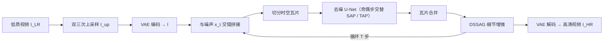

## 一句话总结

DC-VSR 首次把视频扩散先验（Stable Video Diffusion）用于视频超分，通过空间注意力传播（SAP）、时间注意力传播（TAP）在分块处理时跨块共享信息，再配合免额外算力的细节抑制自注意力引导（DSSAG），在任意长度、任意尺寸的低质视频上生成兼具真实纹理与时空一致性的高清结果。

## 研究背景

- 领域现状：视频超分（VSR）要从低分辨率视频重建高分辨率视频，核心难点是既要生成真实的高频细节，又要保持空间与时间一致性。近年基于图像扩散模型的方法（如 MGLD、Upscale-A-Video）借助强大的生成先验显著提升了细节质量。
- 核心痛点：图像扩散模型本质面向单帧、且受显存限制只能处理有限尺寸，为做 VSR 不得不叠加时序层、运动补偿传播、时间窗重叠，并把大帧切成重叠瓦片分别处理再合并。但扩散的固有随机性叠加这种分块策略，会在同一内容的不同瓦片、以及远距离帧之间产生不一致的细节，导致空间错位与时间闪烁。
- 本文 idea：直接引入视频扩散先验（SVD），让先验本身在一个时空瓦片内就利用时空相邻信息保证局部一致；再针对"瓦片之间"的一致性设计 SAP 与 TAP，把注意力信息高效地跨瓦片传播，从而在不牺牲预训练生成能力的前提下，处理长视频、大画幅。

## 方法

整体框架：给定低质视频，先双三次上采样到目标分辨率并用 VAE 编码得到隐变量 $$l$$；把当前噪声隐变量 $$x_t$$ 与 $$l$$ 沿通道交错拼接，切成 50% 重叠的时空瓦片（隐空间 $$64\times64\times14$$，对应图像空间 $$512\times512\times14$$）。每一步用去噪 U-Net 处理各瓦片后再合并（高斯权重 alpha 混合）。采样步在 SAP 与 TAP 之间交替进行以同时保障空间与时间一致性，每步之后再施加 DSSAG 强化细节，最终 $$x_0$$ 解码为高清视频。

关键设计：

1. 空间注意力传播 SAP（是什么/为什么/怎么做）。是什么：让每个瓦片的自注意力能"看到"整帧的信息。为什么：自注意力本可让画面各区域相互协调，但一旦切瓦片，各瓦片独立做注意力，远距离同类区域（如两片砖墙）就会生成互不匹配的纹理。怎么做：对每个瓦片在自注意力层算出键/值后，按采样率 $$s_{SAP}$$ 空间均匀下采样，并聚合所有瓦片得到代表整帧的下采样键值集 $$K_{t,n}, V_{t,n}$$；再把它与本瓦片自身的键值合并，做扩展自注意力 $$SA(\boldsymbol{Q}_{t,m,n}, \hat{\boldsymbol{K}}_{t,m,n}, \hat{\boldsymbol{V}}_{t,m,n})$$。这样避免了注意力的二次方复杂度，又注入了全局信息。仅作用于前两层与后两层空间自注意力（这些层对捕捉/合成高频细节最关键）。

2. 时间注意力传播 TAP。是什么：在时间上相邻的瓦片之间双向传递信息，保证远距离帧一致。怎么做：每个 TAP 采样步按前向或后向单向传播（以前向为例）：先处理前一时间瓦片 $$x'_{t,m,n-1}$$，从其自注意力层提取键值并采样子集 $$K'_{t,m,n-1}, V'_{t,m,n-1}$$，注入到后续瓦片 $$x'_{t,m,n}$$ 的自注意力中做合并扩展。子集选取上，挑选键的标准差最大的 $$L=4$$ 帧——因为细节更丰富、更锐利的帧会产生更有区分度的键（标准差更大）。同样只作用于前两/后两层空间自注意力。

3. 细节抑制自注意力引导 DSSAG。是什么：一种强化高频细节的扩散引导，类似 SAG/PAG 但更省算力。为什么：SAG 需额外检测高频区域并模糊，PAG 固定扰动强度难与 CFG 平衡，二者与 CFG 联用都要跑三次 U-Net。怎么做：把自注意力的缩放因子改造为 $$SA(\boldsymbol{Q},\boldsymbol{K},\boldsymbol{V},\gamma)=\mathrm{softmax}\left(\frac{\boldsymbol{Q}\boldsymbol{K}^\top}{\max(\gamma^2 qk,1)\sqrt{d}}\right)\boldsymbol{V}$$，其中 $$q,k$$ 为 $$\boldsymbol{Q},\boldsymbol{K}$$ 绝对值最大元素；$$\gamma$$ 越大越像非局部均值滤波、把不同区域信息更多混合，从而得到高频更少的模糊估计。用这个"退化版"去噪结果作为无条件项，与条件项之差放大高频细节，并可无缝并入 CFG 而不增加计算：$$\epsilon_{CFG\&DSSAG}(x_t)=\epsilon'_\theta(x_t)+(1+s)\left(\epsilon_\theta(x_t,c)-\epsilon'_\theta(x_t)\right)$$。$$\epsilon'_\theta$$ 与 $$\epsilon_\theta$$ 共享参数、无需训练。$$\gamma$$ 随噪声水平自适应：$$\gamma_t=\left(\frac{\ln\sigma_t-\ln\sigma_T}{\ln\sigma_0-\ln\sigma_T}\right)^{\rho}$$，$$\rho$$ 控制抑制强度（实验取 0.5），采样初期大、后期小。

模型以 Image-to-Video SVD 为基座（LDM 框架 + EDM 扩散机制），在 REDS 数据集上微调，用 Chan 等人的真实退化流程（随机模糊、缩放、噪声、JPEG 与视频压缩）构造训练/评测对。

## 实验结果

评测覆盖合成数据（REDS4、UDM10，有真值）与真实低质数据（VideoLQ，无真值）。合成集用 PSNR、SSIM、DISTS 衡量单帧质量，用 tOF、tLP 衡量时间一致性；真实集用无参考的 MUSIQ、DOVER。下表取 REDS4 主对比中最能体现本文核心主张（时间一致性 + 感知质量）的四项指标，其中 DOVER 为 ×100 后数值：

| 方法 | tOF↓ | tLP↓ | MUSIQ↑ | DOVER↑ |
|------|------|------|--------|--------|
| Bicubic | 2.91 | 1.97 | 24.71 | 11.91 |
| RealBasicVSR | 2.09 | 0.85 | 65.65 | 64.43 |
| RealViformer | 2.19 | 1.26 | 63.67 | 65.94 |
| Upscale-A-Video | 2.65 | 1.65 | 57.06 | 57.06 |
| MGLD | 3.48 | 3.01 | 65.20 | 68.83 |
| DC-VSR | 2.01 | 0.71 | 69.22 | 70.41 |

其余结论用文字概述：在时间一致性指标 tOF、tLP 上，DC-VSR 在 REDS4 与 UDM10 上均优于包括非生成式方法在内的所有对手，印证了视频先验与 TAP 的作用；MUSIQ、DOVER 等无参考质量指标在合成与真实数据上多数第一（VideoLQ 上 MUSIQ 58.14、DOVER 78.31 均为最佳）。PSNR/SSIM 上非生成式方法通常更高（因其不合成可能偏离真值的高频细节，但结果偏模糊），DC-VSR 在生成式方法中 SSIM 更优、PSNR 有竞争力，DISTS 位列第二。消融（REDS4）显示：单加 SAP 或 TAP 主要提升 DOVER；SAP+TAP+DSSAG 全开时 MUSIQ 69.22、DOVER 70.41 最佳；把 DSSAG 换成 SAG（68.30/69.43）或 PAG（71.24/68.55）均不如完整配置的综合表现，且 DSSAG 比 SAG/PAG 快 1.5 倍。

## 亮点与局限

- 亮点：
  - 首个把视频扩散先验引入 VSR 的工作，先验天然在时空瓦片内利用时空相邻信息，省去图像扩散方案繁琐的时序补偿模块。
  - SAP/TAP 通过下采样键值与跨瓦片注入，在避免注意力二次方复杂度的前提下解决了分块导致的空间错位与远帧不一致。
  - DSSAG 把高频增强融进自注意力的加权机制，能平滑调节强度、无缝并入 CFG，且不增加计算、比 SAG/PAG 快 1.5 倍。
  - 支持任意长度与尺寸输入，$$\rho$$ 可按退化程度灵活调节（重退化/动画用小 $$\rho$$，轻退化用大 $$\rho$$）。
- 局限：
  - 基于扩散模型，可能生成虚假细节，且难以实现实时 VSR。
  - TAP 主要依赖邻近瓦片传播，长视频中跨越很远的时间瓦片之间仍可能失去一致性。

## 延伸思考

- TAP 的"仅靠邻近瓦片传播"是长视频一致性的薄弱环节，能否引入关键帧锚定或全局记忆，把远距离时间瓦片也纳入一致性约束？
- DSSAG 把自注意力类比为双边/非局部均值滤波、用一个标量 $$\gamma$$ 调控高频，这一思路作为通用扩散引导（论文提到也适用于图像生成）是否能推广到其他生成任务，值得进一步验证。
- 基座是 U-Net 版 SVD 且瓦片固定 14 帧，若换成更强的 DiT 类视频扩散基座，是否能在放宽帧数限制的同时进一步提升上限并缓解实时性问题？

