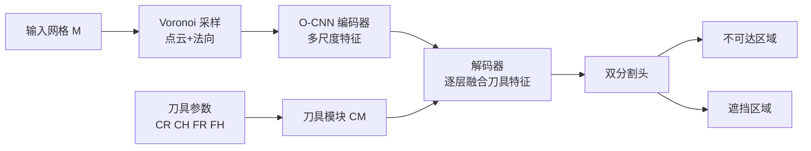

## 一句话总结

DeepMill 用一个"刀具感知"的八叉树卷积神经网络（O-CNN），在任意 CAD 与自由曲面网格上实时预测数控减材加工中的不可达区域与严重遮挡区域，把传统几何法需要数十秒到数分钟的可达性分析压缩到约 0.04 秒。

## 研究背景

- 领域现状：可制造性（manufacturability）是产品设计的关键约束，而其中"可达性"——加工刀具能否触及零件的所有表面与特征——是减材加工里的核心问题。传统几何可达性分析自 1990 年代发展至今，主要依赖可见性映射、配置空间、射线检测等几何计算方法。
- 核心痛点：几何法对复杂或高分辨率模型计算量巨大，分析一个精细零件可能耗时数小时，无法支撑设计阶段的快速迭代；已有的深度学习可制造性方法大多关注工艺规划、碰撞检测等流程性问题，忽略了可达性本身的几何难点，而且往往依赖基于特征的 CAD 模型，难以推广到自由曲面等复杂造型。
- 本文 idea：把不可达点与遮挡点的检测建模为一个"刀具感知"的三维几何分割问题，用八叉树卷积网络高效捕捉局部与全局几何特征，并在网络中嵌入刀具参数模块来学习刀具与模型之间的复杂碰撞关系，从而对任意网格做实时预测。

## 方法

整体框架：输入网格 $$M$$ 先经 Lloyd 松弛做 Voronoi 均匀采样，转成带法向的点云（每个点是一个 Voronoi 胞元的站点 $$s_i$$）。点云送入 U-Net 形态的 O-CNN：编码器逐级提取多尺度几何特征，解码器逐级恢复空间分辨率并在每一层融合刀具特征，最后由两个分割头分别输出每个点的"不可达"与"遮挡"标签。训练标签由第 4 节的几何碰撞检测法离线生成。

关键设计：

1. **八叉树 U-Net 主干**：用点云及其法向作为简洁输入，基于八叉树只对非空节点做卷积，避免稠密体素的巨大计算与显存开销。CAD 零件常见的孔洞、凹槽等稀疏几何特征恰好被八叉树高效捕捉；编码器-解码器加跳跃连接的结构同时保留局部细节与全局上下文，便于建模刀具在远距离处的全局碰撞。作者还与基于 GraphSAGE 的图神经网络方案做了对比分析，指出遮挡点与不可达点在拓扑上往往相距很远，图卷积难以有效捕捉这种关系，而三维空间的多尺度卷积更擅长表达距离较远位置之间的碰撞关系。

2. **刀具模块（Cutter Module）嵌入**：球头刀被简化为四个参数 $$\{CR, CH, FR, FH\}$$（两个半径、两个高度），编码为向量后经由若干 "Linear-ReLU-BN-Dropout" 子块映射成 256 维刀具特征，再拼接进解码器。作者把刀具特征放在解码器而非编码器，理由是解码器更靠近最终决策、可减少对前期几何学习的干扰；并且在解码器的每一层都注入刀具特征 $$f'_i = f_i \oplus f^c_i$$，让网络在不同尺度上都能学习刀具与模型的碰撞模式（局部碰撞与刀杆上方空间的全局碰撞）。

3. **双头分割与几何相关性共享**：遮挡点是在不可达点基础上计算出来的，二者由同一套几何碰撞算法得到，存在强几何关联。因此两个预测头在最后阶段完全共享特征，再分别输出两类标签；总损失为不可达与遮挡两部分交叉熵之和 $$L = L_I(\hat{y}_1, y_1) + L_O(\hat{y}_2, y_2)$$。

4. **几何法造数据集**：由于缺乏现成训练数据，作者基于站点级 Voronoi 采样改进了减材碰撞检测法，用 Fibonacci 球面采样刀具方向、加入检测盒预筛选来加速。不可达点定义为在所有刀具方向上都至少与一个站点碰撞的点；对每个点用"遮挡因子" $$\beta_i$$ 统计它遮挡了多少不可达点，取 $$\beta_i$$ 最高的前 10% 作为遮挡点。数据来自 ABC（CAD）与 Thingi10K（自由曲面），清洗掉非流形、非水密、多部件模型后使用。

## 实验结果

在不同数据集上，DeepMill 的预测精度与相对几何法的耗时优势如下（时间单位为秒，$$T$$ 为网络总时间，$$T_i$$/$$T_o$$/$$T$$ 为几何法计算不可达点、遮挡点及其总时间；复杂模型的遮挡几何计算过于耗时，原文未统计，以 "\\" 表示）。

| 数据集（平均顶点数） | 不可达 Acc | 不可达 F1 | 遮挡 Acc | 遮挡 F1 | 网络耗时 | 几何法总耗时 |
|------|------|------|------|------|------|------|
| CAD（7K） | 96.3% | 97.2% | 98.3% | 89.4% | 0.01 | 29.1 |
| CAD（15K） | 96.3% | 97.3% | 98.3% | 90.0% | 0.01 | 224.7 |
| Freeform（7K） | 92.8% | 93.7% | 97.5% | 86.5% | 0.01 | 46.7 |
| Freeform（15K） | 93.2% | 93.3% | 98.0% | 88.7% | 0.02 | 392.9 |
| Complex（10 万+） | 90.5% | 90.0% | \\ | \\ | 0.04 | 137.0（仅不可达） |

摘要汇报的平均精度为不可达区域 94.7%、遮挡区域 88.7%，复杂几何平均处理时间约 0.04 秒。在 15K 顶点的 CAD 上，DeepMill 仅需几何法约 0.004% 的时间；复杂模型上（仅算不可达）约为 0.029%。

消融方面，去掉刀具模块的基线在各种刀具尺寸测试集上均明显落后，尤其在"短刀""长刀""极端刀"这类偏离训练分布的设置下差距拉大（例如 Extreme 集遮挡 F1 从基线 0.388 提升到 0.537），说明刀具模块确实让网络学到了刀具尺寸对可达性的影响，而非退化为"平均尺寸刀具"的预测。作者进一步指出，把刀具模块加到解码器每一层比只加首层或末层效果更好。

## 亮点与局限

- 亮点：
  - 据作者所知，这是首个面向任意网格（含自由曲面）、支持通用刀具的学习式可达性分析框架，填补了以往方法只能处理特征化 CAD 模型的空白。
  - 实时性突出，把数十秒到数分钟的几何分析压到亚秒级，使得形状编辑过程中的即时可制造性反馈成为可能。
  - 刀具模块的设计让同一个网络泛化到不同刀具尺寸；并且构建并开放了首个带多样刀具参数的不可达/遮挡分析数据集。
  - 网络还表现出一个"意外"优点：能对几何对称的形状学习出更对称、更合理的不可达分布，缓解了几何法方向采样不对称带来的问题；框架也可迁移到体积（粗加工）可达性分析，精度可达 97.9%。

- 局限：
  - 遮挡区域由不可达区域派生，预测更难，精度普遍低于不可达区域；对偏离训练分布的非常规复杂结构（10 万+ 顶点）精度下降到 90% 左右。
  - 对极端长刀导致的大量局部碰撞遮挡预测偏弱，需要额外补充极端刀具尺寸的训练数据才能改善。
  - 训练标签依赖几何法离线生成，采样密度需满足与刀具半径相关的约束（相邻站点间距需小于球头半径），几何法本身仍有 $$O(mn^2)$$ 的最坏复杂度。

## 延伸思考

论文把"刀具-模型碰撞"这一带外部条件参数的几何判定，转化为条件化的三维分割任务，是"用神经网络给昂贵几何谓词做实时代理"的一个典型样例，思路可迁移到装配可达性、支撑结构判定、机器人抓取可行性等同样受"方向采样 + 碰撞检测"支配的问题。作者提出的未来方向包括引入注意力机制、注入对称/相似/拓扑等几何先验、支持异形刀具，以及把可达性预测接入下游的路径规划与"不可达到可达"的模型自动修正——后者若能闭环，将把这类分析工具从"诊断"推进到"自动纠正设计"。一个值得追问的点是：网络给出的是概率化预测而非严格几何保证，在真实加工这种对安全性要求高的场景中，如何与几何法做混合验证（快速网络筛选 + 局部精确复核）会是落地的关键。
