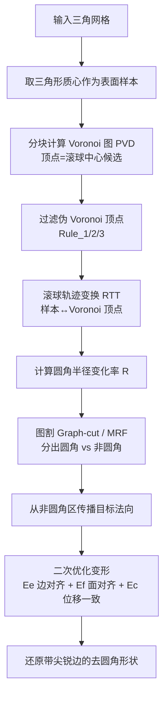

# DeFillet：多边形 CAD 模型中圆角区域的检测与去除

## 一句话总结

利用表面采样点的 Voronoi 图——其顶点会沿"滚球中心轨迹"高密度聚集这一观察——先精准识别多边形 CAD 模型上的圆角（fillet）区域，再把尖锐特征的重建建模为一个二次优化问题，从而把圆角化的网格模型还原回原始的带尖锐边的形态。

## 研究背景

圆角（filleting）是 CAD 系统里的基础操作：想象一个小球在两个相邻曲面之间滚动，滚过的轨迹形成一段平滑过渡曲面，把原本尖锐的棱边"磨圆"。这样做能降低应力集中、改善可制造性、提升美观度。本文关心的是它的逆操作——DeFillet，也就是把已经圆角化的模型还原成未圆角、带尖锐特征的原始形态。这一步对 CAE 分析和二次设计非常关键。

对参数化 CAD 模型（B-Rep），去圆角（又称 blending surface suppression）已有大量研究。但当输入退化为多边形网格模型（例如来自曲面重建或离散化流程）时，问题变得棘手得多：

- 圆角大多是以圆弧截面平滑过渡地衔接相邻曲面，与邻接面之间是 $G^1$ 连续，导致圆角区域与非圆角区域之间的边界很难界定。
- 现有的基元检测算法（识别平面、球、柱、锥、B 样条等）并非为此设计，很难定位圆角与邻接曲面的边界。作者指出：可靠的圆角检测其实是基元检测的一个前置步骤。
- 已有的特征保持重建 / 重网格方法能去掉小半径圆角，但当圆角半径变大、或半径沿边渐变时往往失败。

## 方法

### 核心洞察

对表面采样点计算三维 Voronoi 图，会发现一个稳定现象：Voronoi 顶点近似落在一条一维曲线上并呈现很高的密度，而这条曲线恰好就是定义圆角的"滚球中心轨迹"。即使把输入离散曲面的分辨率大幅降低，这个几何线索依然成立。

直觉上：把圆角沿滚球轨迹切成一圈圈圆截面，每个圆截面对应一个与曲面相切（osculating）的球，球心即滚球中心。圆角内的二维表面样本，被"压缩"成一维的 Voronoi 顶点集合，近似编码了滚球轨迹。因此，Voronoi 顶点可视为滚球中心的候选，再通过"圆角半径变化率"来验证某个顶点是否真的对应一个相切球。

### 关键设计一：圆角识别

滚球轨迹变换（RTT）。每个 Voronoi 顶点 $\textbf{v}_i$ 到其四个关联样本的距离为半径 $r_i$。引入容差 $\epsilon$（默认 0.006）把关联样本集放宽为

$$r_i \le \lVert s_j - \textbf{v}_i \rVert \le r_i + \epsilon.$$

记该样本集为 $\mathcal{S}^{\epsilon}_{\textbf{v}_i}$。反过来一个样本 $s_j$ 也关联到一组 Voronoi 顶点。RTT 把样本映射到其关联顶点中密度 $\rho$ 最大的那个：

$$\mathcal{T}(s_j) = \arg\max_{\textbf{v}_i \in \mathcal{V}_{s_j}} \rho(\textbf{v}_i).$$

密度估计借鉴 mean-shift，用 $k$ 近邻（$k=30$）加高斯核加权（带宽 $\sigma=1.0$）：

$$\rho(\textbf{v}_i) = \frac{\sum_{\textbf{v}_j \in \mathcal{N}_{\textbf{v}_i}} \exp\!\left(-\frac{\lVert \textbf{v}_j - \textbf{v}_i \rVert^2}{2\sigma^2}\right)}{\sum_{\textbf{v}_j \in \mathcal{N}_{\textbf{v}_i}} \lVert \textbf{v}_j - \textbf{v}_i \rVert \cdot \exp\!\left(-\frac{\lVert \textbf{v}_j - \textbf{v}_i \rVert^2}{2\sigma^2}\right)}.$$

圆角半径变化率。滚球半径 $r(\mathcal{T}(s_i))$ 在真正的圆角区内几乎恒定（变化率为 0），在非圆角区则很大。用样本 $s_i$ 与其三个邻居的半径变化率均值刻画（并截断到上限 1）：

$$\mathcal{R}(s_i) = \min\!\left(1,\ \frac{1}{3}\sum_{j=1}^{3}\frac{\lvert r(\mathcal{T}(s_i)) - r(\mathcal{T}(s_i^{(j)})) \rvert}{\lVert s_i - s_i^{(j)} \rVert}\right).$$

于是 $1-\mathcal{R}(s_i)\in[0,1]$ 即样本落在圆角区的概率。

图割分割。把圆角/非圆角的二值标注建模为马尔可夫随机场（MRF）能量最小化：

$$M(\{l_i\}) = \sum_{i \in F} M_d(l_i) + \lambda \sum_{\{i,j\}\in E} M_s(l_i, l_j),$$

数据项用 $\mathcal{R}(s_i)$，平滑项用共享边长度 $e_{ij}$ 惩罚边界长度（$\lambda=1.0$），用 Boykov–Kolmogorov 的 min-cut/max-flow 求解。

配套的三项工程化设计：

- 分块 Voronoi 图（PVD）：直接对全局所有样本算 Voronoi，内壁等结构会遮挡、导致顶点无法对齐滚球轨迹。改为用最远点采样取 1000 个种子、在 $R=\tfrac{1}{2}\pi r_{\max}$ 半径内扫出局部 patch 分别算 Voronoi 再合并（扫描不得跨越尖锐特征线）。
- 过滤伪顶点三规则：Rule_1 半径 $\ge r_{\max}$（默认 0.06）剔除；Rule_2 若关联样本的最小包围球半径 $< 0.1 r_i$（切点退化）剔除；Rule_3 要求 $\epsilon$-薄壳内样本构成一个拓扑圆盘（连续、无洞、不分裂）。三条规则总共滤掉 86.14% 顶点。
- 圆柱孔辨别：把 $\mathcal{S}^{\epsilon}_{\textbf{v}_i}$ 映到高斯球并加入关于球心的镜像点集，用球面 Voronoi 图划分区域。普通圆角截面角 $<\pi$、样本主导单一连通区；圆柱孔截面角 $>\pi$、主导两个及以上不连通区，据此区分，避免把孔误判为圆角。

### 关键设计二：圆角去除

把去圆角当作网格变形：为圆角区内每个三角形指定一个"目标法向"（从非圆角区沿测地最近点传播而来），再移动顶点让每个三角形达到目标法向。优化的变量是圆角区顶点，目标函数为

$$E = \beta_e E_e + \beta_f E_f + \beta_c E_c.$$

- 边对齐 $E_e$：相邻两面共享边 $v_i v_j$ 应同时垂直于两侧目标法向 $\vec{n}_1,\vec{n}_2$，即 $E_e = ((v_i-v_j)\cdot\vec n_1)^2 + ((v_i-v_j)\cdot\vec n_2)^2 = 0$。当两法向来自相反侧时，边会对齐到 $\vec n_1\times\vec n_2$，恰是特征线方向——这一项是生成尖锐边的关键。
- 面对齐 $E_f$：三角形质心沿目标法向应与最近非圆角顶点对齐，$E_f = ((\tfrac{v_i+v_j+v_k}{3}-v_{\text{nearest}})\cdot\vec n)^2 = 0$，防止形状塌陷。
- 位移一致 $E_c = \lVert v_i - v_i^{\text{old}}\rVert^2$，保证顶点位移协调、避免翻折。

用迭代求解，每步是一个二次规划 $\min \tfrac{1}{2}\textbf{x}_k^\top \textbf{H}\textbf{x}_k + \textbf{c}^\top(\textbf{x}_{k-1})\textbf{x}_k$；当 $\beta_c$ 足够大时 $\textbf{H}$ 正定，可直接用 $\textbf{x}_k = \textbf{x}_{k-1} - \textbf{H}^{-1}\textbf{c}(\textbf{x}_{k-1})$ 更新，直到 $\lVert \textbf{x}_k - \textbf{x}_{k-1}\rVert < 10^{-6}$。目标法向沿最近非圆角三角形的测地路径传播（测地求解用 Xin & Wang 2009）；为避免细长退化三角形，还用 BFS 逐顶点做局部目标法向微调（阈值 $\theta_{\min}=\pi/3$）。

## 实验结果

实现基于 C++，用 Easy3D 做网格处理、CGAL 做鲁棒 Voronoi 计算；CPU 为 i9-13900K、64GB 内存，学习类对比方法跑在 RTX 4090 上。评测数据包括自建 FreeCAD 模型（带原始未圆角真值）和 Fusion 360 Gallery 数据集中挑出的 100 个圆角模型。

去圆角定量对比（主表，50k 采样点，最优加粗）：

| 方法 | CD(×10³) ↓ | F1 ↑ | ECD(×10³) ↓ | EF1 ↑ |
|------|-----------|------|-------------|-------|
| VSR | 4.046 | 0.793 | 4.584 | 0.763 |
| RFEPS | 2.851 | 0.903 | 3.771 | 0.849 |
| DeFillet+KSR | 4.098 | 0.747 | 3.948 | 0.756 |
| **DeFillet（本文）** | **2.262** | **0.952** | **2.511** | **0.915** |

本文方法在整体形状（CD、F1）与尖锐边恢复（ECD、EF1）四项指标上全面领先。关键原因是：本文只变形被检测到的圆角区、非圆角区保持不变，而对比方法重建整个模型，连非圆角区都会引入误差。可视化对比显示，VSR 常把大半径圆角误做成倒角（chamfer），RFEPS 恢复了形状但尖锐特征不足，KSR 恢复了尖锐边但贴合原边不佳。

识别对比：与 E-RANSAC、QSE、ParSeNet、HPNet、SED-Net 等基元检测方法相比，这些方法本质是分解出球/柱/锥/环面等基元再拼装成圆角，属间接手段，遇到小半径、渐变半径、复杂滚球轨迹时精度骤降；本文专为圆角检测设计，能稳健处理变半径并避免把圆柱孔误判为圆角。

运行时与规模（自建数据集 5 个模型，样本量 71k~873k）：分割耗时 $T_s$ 约 3~36 秒，去除耗时 $T_r$ 从 9 秒到 334 秒不等，总耗时 $T$ 从 12 秒到约 342 秒。模型 #3 含渐变半径圆角仍成功还原（F1=0.932）。分步统计显示，圆角分割耗时与样本数近似成正比，去除耗时更取决于圆角面积；其中初始化 $T_4$（多源测地距离传播法向）通常占最大开销。

消融要点：Rule_1 单独就滤掉 53.67% 顶点、处理时间近乎减半，去掉它时间约增至 7 倍；$\lambda$ 太小（0.5）分割不完整，取 1.0 才完整；$\epsilon$ 需随网格分辨率调节（低分辨率时增大 $\epsilon$ 才能保住小圆角）；$E_e$ 缺失则无尖锐边、$E_f$ 缺失则形状塌陷，二者缺一不可；$\beta_c$ 过小（0.05）出现自交、取 0.5 最佳、过大（50）又丢尖锐边界。此外，作者还对比了"圆角半径变化率"与主曲率：主曲率对圆角半径和分段数（fillet segments）敏感、分段少时会丢大半径圆角并呈条纹状，而本文的半径变化率在不同半径与分段下都稳定、边界更清晰。

## 亮点与局限

亮点：

- 观察新颖且可操作：把"圆角=滚球轨迹"这一几何直觉，落到"Voronoi 顶点沿轨迹高密度聚集"这一可计算信号上，绕开了显式基元拟合。
- 半径变化率作为检测量比主曲率更稳健，对半径大小、渐变半径和网格分辨率都不敏感。
- 识别与去除解耦、去除阶段的二次优化收敛快，只动圆角区、非圆角区零误差。
- 附带能力丰富：支持按用户指定半径区间 $[r_{\min}, r_{\max}]$ 定制化去除；可作基元检测/CAD 分割的前置步骤显著提升 QSE 效果；支持二次设计（还原尖边后重新加不同半径圆角）；还能用 RTT 提取圆柱孔中心轴做孔定位。

局限：

- 带尖角的圆角（多方向圆角交汇于角点）在转角处的合并轨迹会变长，导致角点圆角识别不全；经验上当转角 $\ge 3\pi/5$ 才能完整识别（$\pi/3$、$\pi/2$ 时会漏检角点圆角）。
- 对采样策略敏感：Poisson-disk 采样会让 Voronoi 顶点分布混乱（过滤规则和 RTT 能部分缓解），作者建议发展沿主曲率方向对齐的"规则采样"来获得更整齐的顶点分布。
- 需要若干模型相关参数（$\epsilon$、$r_{\max}$ 等），虽多数无需频繁调整，但个别难例仍需针对性调参。

## 延伸思考

这项工作把一个偏工程的"逆特征"问题，转化成对中轴 / Voronoi 结构的利用，本质是"滚球扫掠曲面的中轴就是滚球轨迹"这一经典事实的离散化再发现。它给出的启发是：很多 CAD 逆向任务（去倒角、识别拉伸/旋转体、恢复布尔树）都可能存在类似的"中轴指纹"，值得系统地用 Voronoi/中轴信号去挖掘，而不必依赖端到端网络。

局限里暴露的两点也指向后续方向：一是角点处轨迹合并的病态，或许可以引入对滚球轨迹的显式拓扑建模（把轨迹当作带分叉的一维图去解析）来专门处理角点；二是采样敏感性，若能把"沿主曲率对齐的规则采样"与检测联合优化，Voronoi 顶点会更干净，检测阈值也能更少人工干预。此外，去除阶段是纯几何变形，若下游要保证 B-Rep 拓扑正确性，还需要把优化结果重新拟合回参数曲面，这块与 ComplexGen、Point2CAD 等重建方法的衔接是自然的落地路径。
