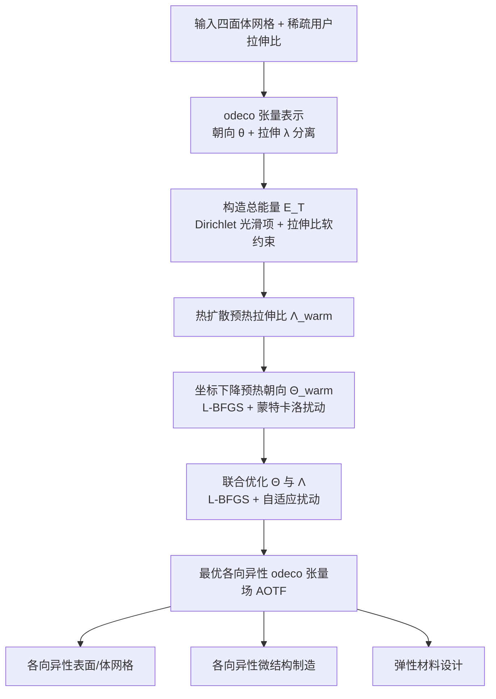

## 一句话总结

本文提出了首个面向三维体域的各向异性 odeco 张量场（AOTF）设计与优化框架，能够在四面体网格上生成既光滑、又能自动对齐边界法向与曲率、并保留几何特征的高各向异性张量场，用户只需稀疏地指定拉伸比即可，从而服务于各向异性网格生成、微结构制造与材料设计等下游任务。

## 研究背景

方向场（direction field）在图形学与工程中应用广泛，从纹理映射、变形到网格生成都离不开它。相比之下，表面上的张量场已被充分研究，但体域内部的三维张量场却少有人问津。既有的体积张量场方法（如基于八面体框架的方法）几乎都只关注各向同性（isotropic）张量，也就是只优化朝向而不考虑不同方向上的拉伸差异，因此无法生成实用的各向异性场。

这带来两个痛点。其一，各向异性问题的体积计算（如各向异性网格生成）以及微结构设计天然需要方向 + 拉伸比同时可控的张量场；其二，先前工作要么把朝向与拉伸比耦合在一起（如对称矩阵表示逐元素平滑，过渡不自然、靠强制修改实现法向对齐），要么虽然采用了 odeco 表示但只研究了近似均匀拉伸比的简单情形，一旦引入灵活的大拉伸比，其所依赖的投影操作会变得不稳定。

odeco（symmetric orthogonally decomposable，对称正交可分解）张量表示提供了一个关键突破口：它与齐次多项式之间存在一一对应，因此可以把一个张量干净地分解为"朝向"与"拉伸"两个分量，分别对应方向和各向异性。已有工作在二维平面框架场上验证了 odeco 的可积分设计，但将其推广到三维体域仍是开放难题。本文正是针对"带有较大拉伸比、且需兼顾边界特性"的三维各向异性 odeco 张量场设计问题。

## 方法

### 整体流程

### odeco 张量表示与朝向-拉伸分离

odeco 张量与齐次多项式一一对应，这让每个顶点上的张量 $f_i$ 可以被分解成一个朝向分量与一个拉伸分量：

$$f(\boldsymbol{\theta}_i, \boldsymbol{\lambda}_i) = e^{\theta_i^x L_x} e^{\theta_i^y L_y} e^{\theta_i^z L_z}\, \hat{f}(\boldsymbol{\lambda}_i)$$

其中 $\boldsymbol{\theta}_i=(\theta_i^x,\theta_i^y,\theta_i^z)$ 是控制朝向的欧拉角，$L_x,L_y,L_z\in\mathbb{R}^{15\times15}$ 是角动量算子（其指数给出 $\mathbb{R}^{15\times15}$ 的旋转矩阵），$\hat{f}(\boldsymbol{\lambda}_i)$ 是沿标准轴、只负责拉伸的规范 odeco 张量。直观上，就是把规范张量按 $\boldsymbol{\theta}_i$ 指定的旋转转到目标朝向。

规范张量本身由多项式 $h=\lambda_i^x x^4+\lambda_i^y y^4+\lambda_i^z z^4$ 投影到球谐（SH）基得到，这个投影是无损的，只用到 0、2、4 三个 band，于是可写成关于拉伸比的线性形式：

$$\hat{f}(\boldsymbol{\lambda}_i) = \boldsymbol{B}\boldsymbol{\lambda}_i$$

其中 $\boldsymbol{B}\in\mathbb{R}^{15\times3}$ 是由 SH 基导出的常数矩阵，最大拉伸比对应最主的 lobe。对边界顶点，为了让张量的一个 lobe 贴合表面法向 $\vec{n}_i$，把 z 轴先旋到法向、再只允许绕法向旋转，得到简化表达 $f(\theta_i^z,\boldsymbol{\lambda}_i)=\boldsymbol{R}_i e^{\theta_i^z L_z}\hat{f}(\boldsymbol{\lambda}_i)$，从而天然鼓励边界对齐。

### 优化目标

整体能量由 Dirichlet 光滑项与拉伸比软约束项组成：

$$\min_{\boldsymbol{\Theta},\boldsymbol{\Lambda}} E_T = E_s(\boldsymbol{\Theta},\boldsymbol{\Lambda}) + \psi E_{\boldsymbol{\Lambda}}(\boldsymbol{\Lambda})$$

$$E_s(\boldsymbol{\Theta},\boldsymbol{\Lambda}) = \sum_{i,j\in\Omega} w_{ij}\,\lVert f(\boldsymbol{\theta}_i,\boldsymbol{\lambda}_i) - f(\boldsymbol{\theta}_j,\boldsymbol{\lambda}_j)\rVert_2^2$$

$$E_{\boldsymbol{\Lambda}}(\boldsymbol{\Lambda}) = \sum_{i\in\Omega}\lVert \boldsymbol{\lambda}_i - \boldsymbol{\lambda}_i^{In}\rVert_2^2$$

$w_{ij}$ 是四面体网格上的余切权重，$\psi$（默认 50）控制向用户指定拉伸比 $\boldsymbol{\Lambda}^{In}$ 靠拢的强度。内部顶点拥有完整的三轴旋转 + 三轴拉伸自由度，边界顶点则只优化绕法向的旋转 $\theta_i^z$ 与拉伸比。

### 预热式联合优化

该能量非凸，直接从随机初值跑 L-BFGS 常陷入劣质局部极小。作者设计了三段式预热策略：

1. **预热拉伸比**：把稀疏的用户拉伸比 $\boldsymbol{\Lambda}^{In}$ 沿三个轴当作独立标量，用隐式欧拉法扩散到整个体域，得到 $\boldsymbol{\Lambda}_{warm}$。
2. **预热朝向**：固定 $\boldsymbol{\Lambda}_{warm}$，借鉴坐标下降只对朝向跑 L-BFGS，并结合蒙特卡洛式扰动反复迭代，因问题规模小而收敛快，且已"感知"到粗略的各向异性。
3. **联合优化**：以预热结果为初值，交替进行"L-BFGS 收敛 + 参数扰动"，直到总能量连续 5 个 trial 停滞。扰动量按顶点局部光滑能量自适应：

$$\gamma_i = \left(E_s^i / \max(E_s^i) + 1\right)^2\, \mathrm{rand}(-\epsilon,\epsilon)$$

其中噪声界 $\epsilon=0.15$。粗糙（高能量）区域扰动更大，这在奇异点附近表现尤佳，帮助跳出局部极小得到更光滑的结果。

### 形状贴合的理论分析

作者对边界光滑能量做了理论刻画。对法向对齐的 odeco 张量，其 Dirichlet 能量可写为：

$$\lVert\nabla f(\boldsymbol{\theta}_i,\boldsymbol{\lambda}_i)\rVert_2^2 = \big(\cos^2\phi\, g_1 + \sin^2\phi\, g_2\big)K_{max}^2 + \big(\sin^2\phi\, g_1 + \cos^2\phi\, g_2\big)K_{min}^2 + g_3(\boldsymbol{\lambda}_i)\,\omega$$

其中 $K_{max},K_{min}$ 是主曲率，$\omega$ 表征绕法向的内蕴切向扭转，$g_k(\boldsymbol{\lambda}_i)=\frac{64\pi}{315}\big(4(\lambda_i^{m_k}-\lambda_i^{n_k})^2+(\lambda_i^{m_k}+\lambda_i^{n_k})^2\big)$。由此得到两个命题：其一，若不加拉伸比约束，最小化该能量会自然导向小而均匀的拉伸比，因此必须靠用户指定 $\boldsymbol{\Lambda}^{In}$ 引入各向异性；其二，当 $\lambda_i^x\neq\lambda_i^y$ 且 $\lambda_i^z\neq\frac{5}{6}(\lambda_i^x+\lambda_i^y)$ 时，最小化外蕴曲率项会迫使 odeco lobe 对齐主曲率方向（且当 $\lambda_i^z<\frac{5}{6}(\lambda_i^x+\lambda_i^y)$ 时更大的 lobe 对齐最小主曲率方向），从而实现自动曲率对齐。此外，对相邻两张量距离的分析（命题 5.3）表明，最小化光滑能量会让主 lobe 自然沿共享的尖锐特征边对齐，带来天然的特征保持；对复杂特征另设"严格特征对齐"策略强制主 lobe 沿特征边。

## 实验结果

实验在 3.6GHz CPU、32GB 内存的 Windows 11 PC 上进行，模型取自 Thingi10k，四面体网格由 TetGen 生成，L-BFGS 用 MATLAB 的 fmincon 实现。多数模型的拉伸比落在 $[1,50]$，单个 trial 通常约 2 分钟完成，多数例子需 10~20 个 trial。

规模与耗时（部分，来自主表）：Lucy 模型 69,834 顶点、320,339 四面体、$\lambda_{max}=50$，总耗时约 808 秒；Armadillo 79,398 顶点、387,624 四面体，总耗时 957 秒；Budda 68,677 顶点、$\lambda_{max}=50$，总耗时 1,197 秒；Helmet 71,346 顶点，总耗时 1,085 秒；较小的 Octopus 10,523 顶点仅需 290 秒。

对比与应用上的关键数字：

- **用户约束下的光滑张量场设计（Dragon 模型）**：本文方法总光滑能量 $E_s=0.095$，显著优于 Palmer 等人 2020 的 $E_s=0.26$ 与 Palacios 等人 2016 的 $E_s=0.43$，过渡更光滑。
- **各向异性三角网格（对比曲率张量场）**：在相同输出顶点数下，用 Hausdorff 距离 $D_h$ 衡量保真度。过度平滑（$E_s$ 更小）反而可能带来更差的保真度和更大的 $D_h$；本文最优场在光滑度与保真度间取得更好平衡，例如某组结果 $E_s=16.10$、$D_h=0.0472$，另一组 $E_s=18.21$、$D_h=0.0170$，整体给出更小的 Hausdorff 距离与更高质量的网格。
- **应力张量场平滑与微结构制造（Helmet）**：本文 $E_s=2.72$、$E_{dis}=13.41$，比 Palacios 等人 2016 的 $E_s=4.36$、$E_{dis}=13.85$ 同时更光滑且更保真。
- **微结构静力学仿真（Block）**：两种微结构体积几乎相同（本文 0.0233 对原始 0.0237），均由 8,000 个 Voronoi 单元、同一梁厚构成。本文的最大 Von Mises 应力 $S_{max}=1.47\times10^6$ 低于基线的 $1.89\times10^6$，$P=6$ 范数应力 $S_{Pnorm}=2.38\times10^5$ 也低于基线的 $2.86\times10^5$，说明结构更稳定、受力更优。
- **弹性材料设计（Hand）**：通过构建微结构参数与数值均质化 Young's 模量之间的材料空间（Fibergen 库做 FFT 均质化），用户只需给出 Young's 模量的大小，朝向即可自动贴合形状，并支持关节处的朝向约束（如弯曲手指），生成的微结构满足设计需求且可 SLS 3D 打印、免支撑。

## 亮点与局限

亮点：

- 首个能设计三维体域内高各向异性、光滑 odeco 张量场的方法，把朝向与拉伸比彻底解耦，用户只需稀疏地给拉伸比就能引入各向异性。
- 边界法向对齐、曲率对齐与特征保持都有理论命题支撑，是"自动涌现"的性质而非强制修改，因此过渡自然、保真度高。
- 预热式联合优化（拉伸比扩散预热 + 朝向坐标下降预热 + 自适应扰动联合优化）有效缓解非凸问题的劣质局部极小，收敛更快更好。
- 下游应用覆盖面广：各向异性三角/四面体网格、应力对齐微结构制造、各向异性 Young's 模量弹性材料设计，且贴近可制造需求。

局限：

- 问题高度非凸，方法只能收敛到较好的局部极小，无法保证全局最优。
- 未对奇异点的拓扑与结构进行显式建模与控制，只能通过联合优化缓解高能量奇异区域。
- 目前基于 CPU 与 MATLAB 实现，单模型耗时数百到上千秒，速度有待提升。
- 尚未打通"从张量场生成各向异性六面体网格"这一关键环节。

## 延伸思考

这项工作最有价值的地方在于把"方向"和"拉伸"这两件事在体域里干净地拆开，而拆开的代价靠 odeco 与球谐的一一对应关系被压得很低。这提示我们：很多看似耦合的几何优化问题，选对表示（representation）往往比堆砌约束更关键。理论分析部分尤其漂亮——它没有把曲率对齐、特征保持当成额外的能量项硬加进去，而是证明了这些性质会从最朴素的 Dirichlet 光滑能量里自然浮现，这种"少即是多"的设计哲学值得借鉴。

面向未来，作者点名的各向异性六面体网格是块难啃的硬骨头：目前尚无成熟工具能从带大拉伸比的张量场生成各向异性 hex 网格，而本文的 AOTF 恰好提供了高质量的输入场，可能是打开这一方向的钥匙。另外，把非凸优化换成 GPU 或基于深度学习的求解器，既能大幅提速，也可能借助学习到的先验绕开劣质局部极小；奇异点拓扑的显式建模则是让结果更可控、更可用于结构化网格的必经之路。对做制造与仿真的读者而言，"给定 Young's 模量→检索微结构参数"的材料空间思路，是连接几何设计与物理功能的一个实用范式。
