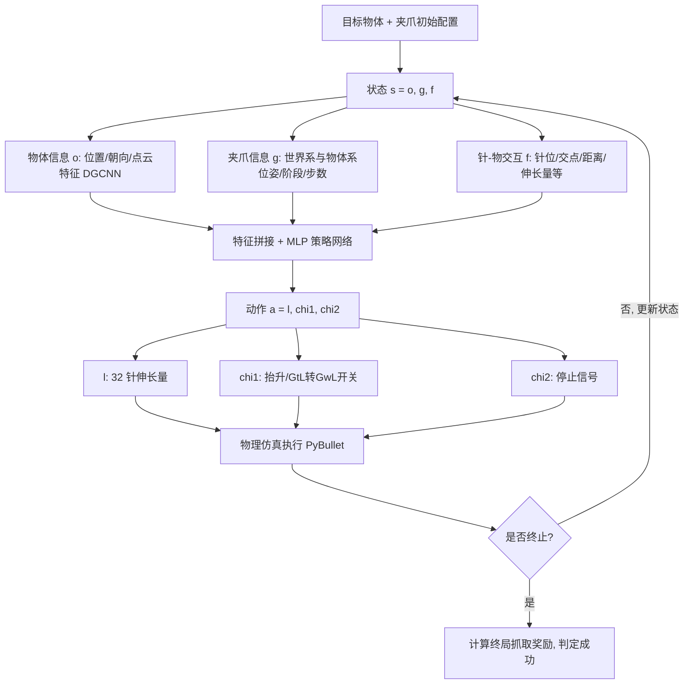

## 一句话总结

本文从"按压画板"玩具获得灵感，设计了一种每根手指嵌入可独立伸缩针阵列的平行夹爪（pin-pression gripper），并用强化学习训练出一套能同时完成形状自适应抓取与在手重定向的动态抓取策略，使夹爪对任意几何、任意姿态的未见物体都能高成功率、高效率地抓取。

## 研究背景

机器人抓取研究长期存在两条相对割裂的主线：一是为既有夹爪学习抓取技能，二是针对特定物体优化夹爪指形。传统平行夹爪指形固定，难以泛化到未见的新物体；数据驱动的定制指形方法（如 Fit2form）虽能为特定物体类别生成手指形状，却无法适应抓取过程中物体姿态的变化，更难迁移到从未见过的形状。软体夹爪虽有柔顺性，但对材料（弹性膜、颗粒填充等）要求苛刻。

本文主张把"夹爪设计"和"抓取技能学习"两件事联合起来做。核心观察来自按压画板玩具：一个由大量可独立伸缩针组成的 2D 阵列，当物体压上去时会自然形成与物体形状贴合的印痕，天生具备几何感知与形状自适应能力。作者把这一机制搬到平行夹爪的手指上，让针能主动伸缩（而非早期 OmniGripper 那样被动包裹、需要 254 根针的密集驱动），从而以更少的执行器（每指 4×4 阵列）获得形状自适应与在手操作能力，特别适合处理平板、梯形、锥形等对传统夹爪困难的物体。

## 方法

### 整体流程

夹爪采用固定的自顶向下抓取范式：从上方接近物体，通过在线调整针的伸缩形成对物体的闭合，抬起过程中在需要时进行在手重定向以提升稳定性。抓取被建模为马尔可夫决策过程 $$(\mathcal{S}, \mathcal{A}, \mathcal{P}, \mathcal{R})$$，用 Soft Actor-Critic（SAC）离策略算法学习策略网络。

### 夹爪设计

每根手指由 4×4 的圆柱针组成，针高 6cm，针尖为半径 0.7cm 的球体，每根针最大行程 5.5cm，所有针达到最大前伸时夹爪完全闭合。每个抓取位姿由 (6+32) 自由度描述：前 6 自由度是夹爪整体的刚性变换，其余 32 自由度是两指全部针的伸长量。作者主要聚焦固定的自顶向下抓取。

### 状态表示

状态 $$s = [o, g, f]$$ 融合三类多模态信息：

- 物体信息 $$o = [o_p, o_r, o_f]$$：位置、四元数朝向、用 DGCNN 提取的 512 维点云特征，合计 519 维。
- 夹爪信息 $$g = [g_p, g_p^o, g_r, g_r^o, g_{stage}, g_{step}]$$：世界系与物体系下的位姿、3 维 one-hot 阶段指示（地面调整/空中调整/调整完成）、$$C$$ 维 one-hot 步数指示（实验取 $$C=11$$），合计 $$(14+3+C)$$ 维。
- 针-物交互信息 $$f$$：对每根针记录世界系针位 $$f_p$$、物体系针位 $$f_p^o$$、针尖水平延伸到物体表面的交点 $$f_i$$ 及其物体系表示 $$f_i^o$$、针尖到表面距离 $$f_d$$、伸长量 $$f_e$$、所属手指指示 $$f_b\in\{-1,1\}$$、针索引 one-hot $$f_c$$，总长 1504 维。作者特意用这种可快速计算的交互表征替代计算开销大的 IBS（交互等分面）。

### 动作表示

动作 $$a = [l, \chi_1, \chi_2]$$：$$l$$ 是限制在 $$[0.0\text{cm}, 5.5\text{cm}]$$ 的 32 维针伸长量；$$\chi_1$$ 是二值开关，表示是否抬升以及从 GtL 转向 GwL（$$\chi_1=0$$ 为前者，$$\chi_1=1$$ 为后者）；$$\chi_2$$ 是停止信号。动作共 34 维。

其中两种抓取模式是关键：Grasp-then-Lift（GtL，先抓后抬）是静态策略，形成力闭合后再抬升；Grasp-while-Lift（GwL，边抓边抬）在整个抓取抬升过程中动态调整针，效率更高，还可能在部分抬起时借助物体底部信息找到更好的闭合，但更难学习。

### 奖励设计

抓取奖励为终局奖励：

$$r_{grasp} = \omega_1 G + \omega_2 Q_1 + r_{time}$$

其中 $$G\in\{-1,1\}$$ 表示是否成功，$$Q_1$$ 是 Liu et al. 提出的广义抓取稳定性度量，$$\omega_1=2000$$、$$\omega_2=1000$$；时间项 $$r_{time}=\omega_3 T_{grasp}+\omega_4 T_{lift}$$，$$\omega_3=-250$$、$$\omega_4=-50$$。效率奖励为中间奖励：

$$r_{effici} = \omega_5 r_{len} + \omega_6 r_{step}$$

$$\omega_5=-1$$、$$\omega_6=-10$$，用来抑制冗余的针移动与步数。Critic 网络分别用向量 $$(Q_g, Q_e)$$ 近似抓取奖励与效率奖励的累积回报，比输出单一标量更利于训练。

### 课程学习

为让策略同时掌握 GtL 与 GwL，作者用带聚合回放缓冲区的两阶段课程学习。第一阶段只允许地面调整、学习 GtL 策略，并把所有经验存入自探索回放缓冲区（最大 $$m=50000$$）。第二阶段继续学习同时接纳 GtL 与 GwL 的混合策略，并额外注入一个由"仅空中调整"预训练策略采集的 GwL 经验缓冲区（最大 $$n=5000$$，训练中固定不更新）。两个缓冲区按容量比例采样，从而在成功率与执行代价之间取得平衡。

## 实验结果

仿真环境基于 PyBullet，物体统一质量 50 克、横向摩擦系数 0.2、滚动摩擦系数 0.001、抓取力 0.5N，抬升到 30cm 判定是否掉落。数据集从 3DNet、BigBIRD、ShapeNet、YCB、GD、KIT、Thingi10K 等收集，共 543 个物体（446 训练 / 97 测试），并额外在 5000 多个未见物体上测试，还贡献了针对被动抓取困难的 108 个物体（Chal-H 平板类、Chal-T 斜面/四面体类）。

消融实验（表 1）显示完整方法在测试集成功率 82.47%、$$Q_1$$ 0.3456、运行时间 6.54s（GwL 占 64.95%、GtL 占 35.05%）。仅用 GtL（$$\chi_1=0$$）成功率最高 84.53% 但耗时最长 7.65s；仅用 GwL（$$\chi_1=1$$）耗时最短 6.00s 但成功率最低 61.86%。完整方法在效率与效果间取得良好平衡。去掉成功信号 $$G$$ 成功率骤降至 58.76%，去掉课程学习（w/o CL）降至 70.10%，去掉点云改用 RGB-D 图像为 73.19%，均验证各组件的必要性。

与替代夹爪的对比（表 2，全部为未见形状）：

| 方法 | ShapeNet | Thingi10K | ABC | YCB | BigBIRD | KIT |
|------|----------|-----------|-----|-----|---------|-----|
| WSG50 | 43.28% | 41.34% | 40.28% | 58.22% | 47.20% | 41.09% |
| Fit2form | 78.82% | 76.96% | 68.12% | 78.21% | 84.00% | 80.62% |
| Random | 22.37% | 28.86% | 23.34% | 35.44% | 31.20% | 24.03% |
| Passive | 60.36% | 67.51% | 56.94% | 60.76% | 68.80% | 55.81% |
| Ours | 81.54% | 80.42% | 76.91% | 81.01% | 88.00% | 87.60% |

本文方法在全部六个数据集上一致领先。在挑战集上（表 3），本文主动抓取在平板类 Chal-H 达 72.00%、斜面/四面体类 Chal-T 达 63.79%，而被动抓取分别只有 36.00% 与 44.82%，WSG50 仅 26.00% 与 22.42%。有趣的是平板物体更多用 GtL（72.00%）以精确定位接触点，斜面/四面体物体更多用 GwL（75.87%）借在手旋转改变相对姿态。

其他分析：针密度实验（表 4）显示 3×3 成功率仅 50.51%、4×4 达 82.47%、5×5 达 88.66%，作者认为 4×4 在执行器数量与性能间最平衡。Sim-to-Sim 迁移到 Isaac Gym（表 5）成功率 73.19%，优于 WSG50（47.42%）与 Fit2form（70.10%），且计算耗时（0.79s）远低于 Fit2form（477.56s）。物体旋转鲁棒性测试中本文方法在 ±10° 到 ±50° 各档几乎始终最优。Sim-to-Real 采用教师-学生两阶段训练：教师用仿真全状态经 RL 训练，学生经 DAgger 用虚拟 RGB-D 与针读数模仿教师，最终用真实相机 RGB-D 与电动执行器针读数驱动，在配 4×4 针阵列与手内 RGB-D 相机的实体夹爪上成功抓起五种物体。

## 亮点与局限

亮点：

- 把"夹爪硬件设计"与"抓取技能学习"联合考虑，从玩具获得的针阵列机制以仅 4×4 每指的少量执行器实现主动形状自适应与在手重定向，兼顾灵活性与鲁棒性。
- GtL/GwL 混合动作设计加上两阶段课程学习，让单一策略能自动在"先抓后抬"和"边抓边抬"间权衡，对平板、斜面、四面体等困难形状显著优于被动抓取。
- 精心设计的针-物交互状态表征既信息充分又计算高效（替代昂贵的 IBS），并完成了 sim-to-sim 与 sim-to-real 的双重验证。

局限：

- 针的调整需要较大行程，导致可抓取物体的尺度受限。
- 对极端细长物体（如筷子）因调整空间受限而难以处理；某些曲面物体会因针沿 x 轴产生的作用力被推出夹爪。
- 抓取是同时兼顾成功、稳定、效率的多目标优化，由于优先保成功与稳定，效率奖励权重较低，仍存在一些冗余动作，执行效率有待进一步提升。

## 延伸思考

这篇工作最有意思的地方在于"用可控的针阵列把连续曲面离散成一组可编程支撑点"，本质上是把软体夹爪的形状顺应性用刚体运动重新实现，从而摆脱对特殊材料的依赖，又比被动针阵列多了主动控制维度。它与图形学联系在于几何感知的状态表征（点云特征 + 针-物交互）和动作规划，其实是一个几何驱动的接触优化问题。

几个值得进一步探索的方向：针尖形状目前是圆柱+球，导致细长和曲面物体失败，若引入可变形针尖或非均匀针分布或许能缓解；GwL 模式借"部分抬起后重新观察物体底部"来改善闭合，这种"边操作边感知"的闭环思路可以推广到更一般的在手操作任务；此外把针读数与视觉融合的教师-学生迁移范式，对其他高自由度自适应末端执行器的 sim-to-real 也有借鉴意义。执行效率与多目标权衡的自动调参，是把它推向工业实用的关键瓶颈。
