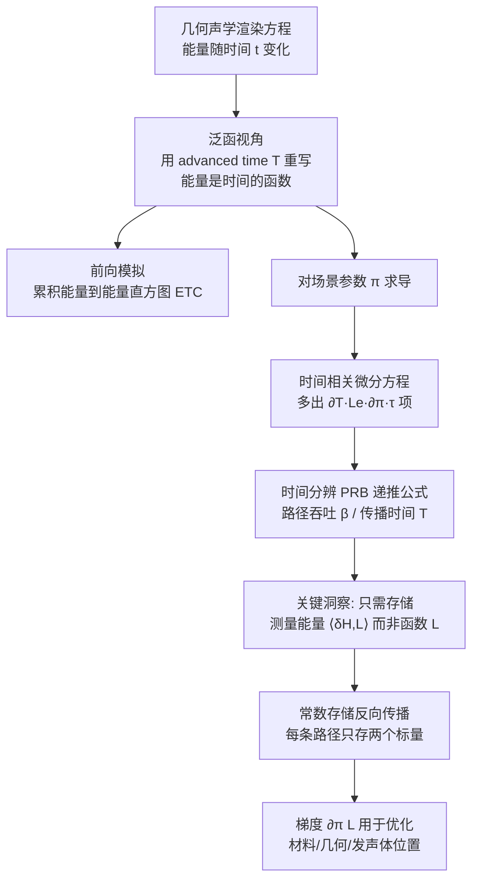

## 一句话总结

利用光传输与几何声学的对偶性，把可微物理渲染扩展到时间域，提出时间分辨版本的 Path Replay Backpropagation（PRB），实现了首个完全可微的声学路径追踪器：能对材料、发声体、麦克风、场景几何等任意参数求出能量时间曲线（ETC）的导数，且在任意反射次数下都保持常数内存和线性时间开销。

## 研究背景

可微渲染已成为计算机图形学和视觉中求解逆问题的关键工具，其中路径追踪配合反向模式自动微分是主流范式。声学与光学都属于波动现象，且几何声学（Geometrical Acoustics, GA）与光传输具有深刻的对偶关系：相机传感器对应麦克风，光源对应扬声器，图像对应能量频谱图。基于这种对偶，声学模拟长期借用图形学技术来提升效率。

但把可微渲染直接搬到声学有一个本质困难——时间。光传输通常假设瞬时传播，渲染函数在角度域求解而不解析时间；声学则相反，接收器常可视作无空间分辨率的全向麦克风，但必须解析时间域，因为声音的传播速度不可忽略，能量到达时刻是声学度量（混响时间、清晰度）的核心。

已有的可微声学工作各有局限：j-Wave 做的是波动方程的可微模拟；可微图像源模型（ISM）虽能对包括几何在内的场景参数优化，但只适用于鞋盒形房间。可微瞬态渲染（transient rendering）虽考虑了非瞬时传播，但要么建立在三次反弹假设上、过于受限，要么依赖 CPU 上的前向模式微分，只适合少量参数的简单应用。核心痛点在于：朴素的基于自动微分磁带（tape-based AD）的反向传播在路径追踪这种庞大复杂的计算图上会迅速被内存拖垮。本文的贡献正交于已有工作——不聚焦于路径空间中的不连续处理，而是攻克时间分辨物理可微渲染的高效反向模式微分。

## 方法

### 整体思路

论文的推导分为四步：先建立"泛函视角"把声能表示为随时间变化的函数；再把可微渲染框架搬到声学；然后对时间相关的传输方程求导，得到可通过"重放路径"计算的额外时间项；最后解决朴素实现中存储随时间分辨率线性增长的问题，实现与时间分辨率无关的常数存储。

### 声学渲染方程与泛函视角

几何声学的渲染方程与光传输渲染方程形式几乎相同，只是能量随时间 $t$ 变化：

$$L_o(x, \omega, t) = L_e(x, \omega, t) + \int_{S^2} f(x, \omega, \omega_i) L_i(x, \omega_i, t)\, d\omega_i^{\perp}$$

入射与出射能量之间存在传播延迟（retarded time）。若声速为 $c$，一段路径的本地延迟为：

$$\tau = \frac{\lVert x'(x, \omega) - x \rVert}{c}$$

即某时刻 $t$ 到达的能量，是延迟时间之前发射出的：$t_r = t - \tau$。

关键的技巧是把方程改写成"advanced time" $T$ 的形式，把行进时间的影响推迟到发射项的求值上：

$$L_i(x, \omega, T, t) = L_o(x', -\omega, T + \tau, t)$$

这样 $t$ 就能全局地标识唯一的时间点，而收集到的发射能量不过是发射曲线 $L_e$ 被延迟了 $T$。由于时间函数构成向量空间，加法、数乘都有定义，于是可以像处理标量能量一样处理时间相关的蒙特卡洛积分——这正是泛函视角的优雅之处。麦克风测量方程给出的能量直方图 $H(t)$ 就是这些时间函数的积分。

### 时间分辨的 Path Replay Backpropagation

传统 PRB 的核心是：把总入射辐射度用路径吞吐量 $\beta_k = \beta_{k-1} f_k$ 递推计算，从而以常数内存（与路径深度无关）完成前向和反向。本文把它扩展到时间域。对 advanced time 形式的传输方程求导，用多元链式法则得到：

$$\partial_\pi L_o(T) = \partial_\pi L_e(T) + \int_{S^2} f\, \partial_\pi L_o(T+\tau) + \partial_\pi f\, L_o(T+\tau) + f\, \partial_T L_o(T+\tau)\, \partial_\pi \tau \, d\omega_i^{\perp}$$

前两项对应光传输的标准可微渲染，**第三项是声学独有的**：它描述当参数 $\pi$ 改变了当前路径段长度、从而改变传播时间时，后续采集能量随之发生的变化。关键观察是 $\partial_T L_o$ 的行为与普通能量 $L_o$ 完全一致（因为 $f$ 和 $\tau$ 都不依赖 $T$），所以可以在同一个前向过程里用蒙特卡洛同时估计 $L_o$ 和 $\partial_T L_o$。

由此得到"逐反弹"的递推公式。总能量为：

$$L_N = L_{e1}(\tau_1) + f_1 L_{e2}(\tau_1+\tau_2) + f_1 f_2 L_{e3}(\tau_1+\tau_2+\tau_3) + \cdots$$

导数的递推为：

$$\partial_\pi L_k = \partial_\pi L_{k-1} + \beta_{k-1}\left[\partial_\pi L_{ek}(T_k) + \partial_\pi f_k (L_N - L_k)/\beta_k\right] + \beta_{k-1}\partial_\pi \tau_k \left[(\partial_T L_N - \partial_T L_{k-1})/\beta_{k-1}\right]$$

其中 $L_N$ 和 $\partial_T L_N$ 在前向 primal 过程中预计算，剩余入射能量用单变量重放路径即可恢复。

### 与时间分辨率无关的常数存储

朴素实现的致命问题：因为要恢复入射能量 $L_o(T+\tau)$ 和微分延迟能量 $\partial_T L_o(T+\tau)$，每个蒙特卡洛样本都要为 $L$ 和 $\partial_T L$ 各存一个数组，大小随时间分辨率增长。数百万样本乘以数千时间桶，内存直接爆炸。

**核心洞察**：计算梯度时不需要存储函数 $L$ 本身，只需存储它的测量值 $\langle \delta H, L\rangle$（即与伴随直方图 $\delta H$ 的时间积分）。作者证明测量能量 $\langle \delta H, L_o\rangle$ 可以用与能量完全相同的方式通过重放路径恢复：

$$\langle \delta H, L_o(T)\rangle = \langle \delta H, L_e(T)\rangle + \int_{S^2} f \langle \delta H, L_o(T+\tau)\rangle\, d\omega_i^{\perp}$$

原来传输的是函数，现在传输的是标量。于是每条路径只需存储两个标量：测量能量和测量微分延迟能量。这利用了辐射反向传播（Radiative Backpropagation）的结构——先做前向 primal，再做一个"梯度 primal"过程（用伴随能量 $\delta H$ 累积测量能量），最后做伴随过程重放路径。这样存储复杂度就与时间分辨率彻底解耦，且没有近似。

### 连续发声曲线（高斯发射）

声学脉冲响应通常假设发射是 Dirac delta，但这会导致微分延迟能量 $\partial_T L_e$ 几乎处处为零，无法追踪几何移动引起的能量变化。作者改用**高斯发射曲线**：

$$L_e(x, \omega, T, t) = \exp\left(\frac{(t-T)^2}{\sigma^2}\right)$$

这既是可微的必要条件（高斯的导数处处连续），也符合物理现实（声音发射总有非零时长）。高斯还有实用优势：虽然理论上全局支撑，但超过阈值（如四倍标准差）后贡献可忽略，使所有时间积分实际上局部化。实践中用极窄的高斯（标准差 0.25 个时间桶），因此结果仍可解释为 ETC。

### 实现

方法建立在可微光传输系统 Mitsuba 3 之上，大多数组件（形状、发声体）可直接复用。作者实现了自定义传感器（可全向或有向的 Microphone）、自定义 film（Tape），以及三个核心积分器：
- **AcousticPRB**：时间分辨的 PRB，高效且时间敏感的梯度估计，采用 Worchel 和 Finnendahl 的三点式参数化。当场景参数改变物体可见性时会产生有偏梯度。
- **AcousticAD**：常规自动微分，用于验证 AcousticPRB 的正确性。
- **AcousticADReparam**：额外引入 warped area sampling 正确处理几何不连续处的导数，是唯一能处理不连续的积分器。

## 实验结果

### 前向模拟验证

在 25 m × 12 m × 7 m 的鞋盒房间中与成熟声学软件 RAVEN 对比。吸收系数 $\alpha$ 在 0.1 到 0.9、散射系数 $s$ 在 0 到 1 之间变化。结果显示：混响时间差异低于 8%（平均 2%），清晰度指数 $C_{80}$ 差异低于 1.5 dB（平均 0.34 dB）。当在 RAVEN 中关闭图像源模型（使两者依赖相同物理模型）后，平均差异进一步显著下降到 $T_{60}$: 0.33%、$C_{80}$: 0.06 dB。这些偏差都在恰可觉察差异（JND）范围内。

### 梯度验证

- **时间导数传播**：三反射面场景中，参数移动靠近麦克风的反射器，AcousticPRB 计算的梯度与有限差分完全一致，证明时间导数能正确跨多次反弹传播。
- **梯度光滑性**：声学梯度天然光滑，因为每条射线贡献都是加权平移的高斯，其导数也是加权平移的高斯导数之和。方差实验（样本数从 10,000 到 49,000,000）显示前向模拟变化很小，梯度虽方向正确但方差较大，且后期时间桶方差更大（因晚期能量弥散在众多桶中，每桶样本少）。
- **PRB 对比 AD**：在 32 个波长的复杂客厅场景中，AcousticPRB 与 AcousticAD 的梯度一致（仅有 IEEE-754 浮点数值差异）。

### 时间与内存效率

在走廊场景（需至少三次反弹连接发声体与传感器）中，对不同路径深度测量渲染加反向微分的时间和内存（5 次执行取中位数）：

| 路径深度 | AcousticPRB 初次 | PRB 中位 | PRB 内存 | AcousticAD 初次 | AD 中位 | AD 内存 |
|---|---|---|---|---|---|---|
| 4 | 1.207s | 0.213s | 6.75 MiB | 22.8s | 0.730s | 13.5 MiB |
| 8 | 1.343s | 0.343s | 6.75 MiB | 85.7s | 1.873s | 27 MiB |
| 16 | 1.645s | 0.616s | 6.75 MiB | 444s | 7.111s | 54 MiB |
| 32 | 2.219s | 1.246s | 6.75 MiB | 3407s | 17.178s | 108 MiB |
| 64 | 3.681s | 2.699s | 6.75 MiB | DNF | DNF | DNF |

PRB 内存恒为 6.75 MiB（常数），AD 内存随深度线性增长；深度 64 时 AD 因内存被操作系统终止（DNF）。初次运行差异尤为悬殊（AD 的 JIT 编译器需组装超大内核）。在多参数效率实验中（鞋盒房间加 $n/6$ 个盒子，每盒 6 个 BSDF 参数），PRB 对 1800 个参数只需约 3.68s，对数百参数达到亚秒级——而先前工作即使对单个参数也需数十秒到数分钟。

### 应用

- **材料参数优化**：鞋盒房间六个表面（墙、地、天花板）的吸收系数拟合，几何固定无不连续，AcousticPRB 可靠收敛。梯度能区分不同时刻到达的贡献——直达声（第一个峰）不依赖材料参数故无梯度贡献。
- **大量吸收系数优化**：15×15 板块场景，每块 37 个吸收谱值共 8325 个参数，发声体与传感器无直线视线，成功重建出 SIGGRAPH logo 形状的目标能量频谱图。
- **房间尺寸优化**：单一缩放因子调整鞋盒房间尺寸以达到目标混响时间 $T_{60}$，可靠收敛。
- **发声体位置估计**：发声体藏在墙后无直线视线，仅用一条目标 ETC，AcousticPRB（有偏）和 AcousticADReparam 都能恢复目标位置，且优化过程惊人地相似。
- **天花板反射器角度优化**：取自 BRAS Benchmark 的音乐厅场景，同时优化舞台上方一个和观众上方三个反射器的角度。目标函数为 $\mathcal{L}(E) = \text{std}(E_{\text{early}}) - \text{mean}(E_{\text{early}})$。优化把早期声能重定向到观众后排，整体清晰度从 3.7 dB 提升到 4.3 dB，早期能量标准差基本保持（0.94 → 0.96 dB），个别高排座位清晰度提升达 2.9 dB（远超约 1 dB 的 JND）。

## 亮点与局限

亮点：
- 首个完全可微的声学路径追踪器，把可微渲染的完整工具箱引入声学逆问题，作者认为其对声学界的意义可媲美可微渲染对图形学界的意义。
- 时间分辨 PRB 实现常数内存、线性时间，且相比光传输版本仅有极小开销；解决了可微瞬态渲染中此前悬而未决的高效反向微分难题。
- "只存测量值不存函数"的洞察精巧地把存储复杂度与时间分辨率解耦，无近似。
- 高斯发射曲线既是数学上可微的关键，又有物理依据。

局限：
- **有偏梯度**：当场景参数影响可见性时，AcousticPRB 产生有偏梯度；目前没有任何实现能同时处理不连续又基于 PRB，两者结合是明确的改进方向。
- **反射模型简单**：几何声学中很少见到超越理想漫反射和理想镜面反射的模型，作者认为 Phong 类的漫反射-镜面过渡模型不仅有助于梯度下降，也更真实。
- **忽略波动效应**：基于路径追踪，忽略衍射、干涉等所有波动现象，相比光传输这是更严重的物理简化。
- 未支持有向的声源/接收器方向特性（如扬声器膜片的指向性），留作未来工作。

## 延伸思考

这项工作最有启发性的地方在于它对"对偶性"的彻底利用：作者没有从零构建声学可微框架，而是识别出声学与光学在数学结构上的深层同构，把 Mitsuba 3 的大部分组件直接复用，仅补上"时间"这一维度。这提示我们，跨领域的技术迁移往往不在于工具本身，而在于找到正确的抽象层——这里的泛函视角（把能量看作时间函数、构成向量空间）就是让光传输算法"自然而然"套用到声学的桥梁。

论文明确指出与差可微瞬态渲染的联系：本文基于经典渲染方程的球面积分，而实现用的是表面积分，其导数与路径空间形式的内部导数密切相关。把本文的时间分辨洞察与路径空间形式及其近期进展结合，可能既改善声学中的不连续处理，又反哺出更高效的可微瞬态渲染——这是一条双向受益的研究路径。对于声学设计实践而言，能对材料、几何、反射器角度等做梯度优化，意味着音乐厅、报告厅的声学设计有望从"手工试错加遗传算法"转向基于梯度的自动优化，这在计算效率上是数量级的跃升。
