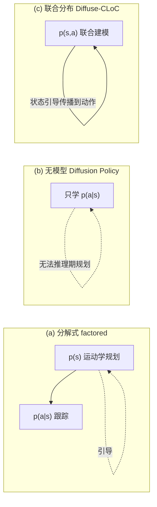
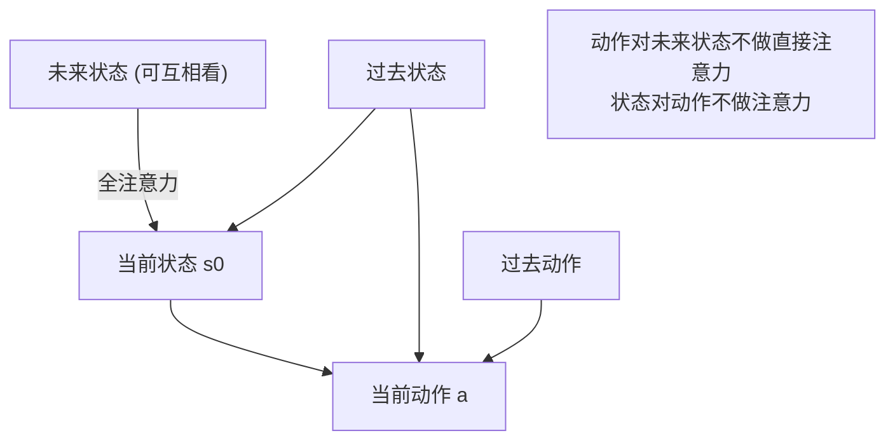

## 一句话总结

Diffuse-CLoC 用**单个扩散模型联合建模状态与动作**（co-diffusion），让物理仿真角色在推理阶段仅靠经典的引导技术（classifier guidance、inpainting）就能零样本完成一系列没见过的长时程任务，无需重新训练，也无需额外的高层规划器。

## 研究背景

物理角色动画长期追求既符合动力学、又能响应用户控制的运动合成。围绕扩散模型，已有两条主流路线，但各有硬伤：

- **运动学扩散 + 跟踪控制器（分解式）**：先用扩散模型在状态空间 $p(s)$ 生成运动学轨迹，再用一个通用跟踪策略 $p(a|s)$ 去追踪。优点是状态空间里目标好定义，可以直接套用 classifier guidance、inpainting 做各种下游任务；缺点是生成的运动学轨迹常含漂浮、脚滑、穿模等瑕疵，跟踪器对分布外输入很敏感，哪怕轻微的引导都会让跟踪崩掉。
- **动作扩散策略（无模型式）**：直接学 $p(a|s)$ 预测动作，物理可行性天然有保证；但因为只出动作、不预测未来状态，推理阶段的条件化（引导）无从下手——任务目标定义在状态空间，而输出是动作轨迹，两者不可比，所以换个新任务就得重训。

作者把三种扩散范式画在一张图里对照：

核心洞见：**只要用一个扩散模型联合建模状态和动作的分布 $p(s,a)$，动作生成就能以预测出来的状态为条件被引导**。这样一来，运动学生成里那套成熟的状态空间引导技术，可以直接用来"操纵"物理可行的动作生成，从而把规划能力内置进策略本身。

## 方法

### 基础：状态-动作联合扩散

模型基于 DDPM。在每个时刻 $t$，预测一条包含未来 $H$ 步状态-动作对的轨迹：

$$\boldsymbol{\tau}_t = [\boldsymbol{a}_t, \boldsymbol{s}_{t+1}, \boldsymbol{a}_{t+1}, \dots, \boldsymbol{s}_{t+H}, \boldsymbol{a}_{t+H}]$$

同时以长度为 $N$ 的历史观测 $\boldsymbol{O}_t = [\boldsymbol{s}_{t-N}, \boldsymbol{a}_{t-N}, \dots, \boldsymbol{s}_t]$ 作为条件。训练一个去噪网络 $\hat{\boldsymbol{\tau}}_t = x_{0,\theta}(\boldsymbol{\tau}_t^{\boldsymbol{k}}, \boldsymbol{O}_t, \boldsymbol{k})$ 直接预测干净轨迹，用 MSE 自监督：

$$\mathcal{L} = \mathrm{MSE}\big(x_{0,\theta}(\boldsymbol{\tau}_t^{\boldsymbol{k}}, \boldsymbol{O}_t, \boldsymbol{k}),\, \boldsymbol{\tau}_t\big)$$

关键设计之一：**状态与动作各自拥有独立的、逐时间步的噪声等级** $\boldsymbol{k} = (\boldsymbol{k_s}, \boldsymbol{k_a})$。这为后面的 rolling 推理和 inpainting 提供了灵活性。

采样遵循随机 Langevin 动力学迭代去噪：

$$\boldsymbol{\tau}_t^{\boldsymbol{k}-1} = \alpha_{\boldsymbol{k}}\big(\boldsymbol{\tau}_t^{\boldsymbol{k}} - \gamma_{\boldsymbol{k}}\,\epsilon_\theta(\boldsymbol{\tau}_t^{\boldsymbol{k}}, \boldsymbol{O}_t, \boldsymbol{k}) + \mathcal{N}(0, \sigma_{\boldsymbol{k}}^2 \boldsymbol{I})\big)$$

### 引导机制

模型无条件训练，推理时靠贝叶斯规则做条件生成。给定代价函数 $G_{c\boldsymbol{\tau}}(\boldsymbol{\tau})$，令最优轨迹的条件概率 $p(\boldsymbol{\tau}^* | \boldsymbol{\tau}) \propto \exp(-G_{c\boldsymbol{\tau}}(\boldsymbol{\tau}))$，则后验梯度天然指向代价下降方向：

$$\nabla_{\boldsymbol{\tau}} \log p(\boldsymbol{\tau}^* \vert  \boldsymbol{\tau}) = -\nabla_{\boldsymbol{\tau}} G_{c\boldsymbol{\tau}}(\boldsymbol{\tau})$$

只要代价函数梯度可算，就能引导。因为状态和动作被联合建模，在**状态空间**定义的直观代价（比如离障碍物的距离）会通过网络内部结构反向影响到**动作**生成——这正是打通两条路线的关键。

### 架构与注意力

采用 decoder-only 的 GPT 式 Transformer。与 Diffuser 把状态-动作打包成单 token 不同，Diffuse-CLoC 把**状态和动作作为独立的 token**输入（状态用两层 MLP 编码，动作用线性层，各自拼上噪声等级的正弦嵌入 + 可学习位置编码）。

注意力掩码是精心设计的核心：

- **动作用因果注意力**：只看过去的状态和动作（锚定轨迹、过滤未来预测的瑕疵）。未来状态的信息通过传播到当前状态 $s_0$ 来间接影响动作。
- **状态用全注意力**：可以看未来状态，让未来信息反向传播到当前状态。
- **屏蔽状态对动作的注意力**：简化学习，且不损失运动学预测质量。

其它设计：
- **更短的动作时程**：状态可预测约 1 秒（长时程规划需要），但长时程动作方差大，所以动作时程限制在最多 16 步，损失里对更远的未来动作做 mask。
- **Emphasis Projection**：用投影矩阵 $\boldsymbol{P} = \boldsymbol{AB}$（$\boldsymbol{A}_{ij}\sim\mathcal{N}(0,1)$，$\boldsymbol{B}$ 对角阵对全局状态设 $c>1$）强调全局状态；并通过拼接投影后与原始状态 $\boldsymbol{P}=[\boldsymbol{AB}\,\boldsymbol{I}]$ 保留对局部状态的敏感度。

### Rolling 推理

推理时用后退时域控制（receding horizon），每步都重规划、只执行当前动作。但频繁重规划会让轨迹在不同模式间震荡。作者引入 **FIFO 缓冲的 rolling 方案**：按轨迹步距当前时刻的远近分配噪声等级——越近的越清晰、越远的越接近纯噪声。每步推入一对纯噪声、弹出最早的干净对去驱动仿真器。

这样既复用上一步的去噪结果做 warmup（保证一致性、减少去噪步数、提速），又因为在较高噪声等级下 rolling（$\boldsymbol{k}\to 0$ 时引导信号会消失）而保留了较强的引导能力。实现上状态在噪声等级 14 处 rolling、动作在 4 处 rolling。

## 应用（同一个预训练模型，零样本）

- **静态避障 + 导航**：障碍代价 $G_{\boldsymbol{\tau}}^{\text{obs}}(\boldsymbol{\tau}) = \sum_j \sum_{t'=t}^{t+H} \exp(-c\cdot \mathrm{SDF}_j(\boldsymbol{s}_{t'}))$，可与航点代价 $G_{\boldsymbol{\tau}}^{\text{wp}}(\boldsymbol{\tau}) = \sum \|P_{\text{root}}(\boldsymbol{s}_{t'}) - g\|^2$ 组合；对可交互物体（如跳上台阶）把物体外部 SDF 截零，只惩罚穿透。
- **动态避障**：把障碍代价扩展成角色之间按时序互相避让 $G_{\boldsymbol{\tau},i}^{\text{sa}}(\boldsymbol{\tau}) = \sum_{j\ne i}\sum_{t'=t}^{t+H}\exp(-c\cdot\|P_{\text{root}}(\boldsymbol{s}_{t'}^i)-P_{\text{root}}(\boldsymbol{s}_{t'}^j)\|^2)$，多个角色可在柱林里互相穿行。
- **任务空间控制**：对任意未来关键帧的指定关节施加 $G_{\boldsymbol{\tau}}^{\text{ts}}(\boldsymbol{\tau}) = \sum_{t'\in T}\|P_x(\boldsymbol{s}_{t'}) - g_{t'}\|^2$，实现根轨迹跟随、末端到达（reaching）、手柄实时操控（设定根速度/朝向/高度为任务空间）。
- **运动补间（in-betweening）**：用 inpainting，把关键帧状态直接设为零噪声 $\boldsymbol{s}_t = \hat{\boldsymbol{s}}_t,\ \boldsymbol{k_{s_t}}=0,\ \forall t\in T$，天然区分干净帧与噪声帧，无需像以往方法额外加 mask 标签。

## 实验结果

数据：AMASS 子集 54 条运动（走、跑、爬、跳），用 PHC+ 跟踪采集状态-动作对，每条约 40 次 rollout（约 3.5 小时），并注入动作噪声采集纠正动作。状态 165 维（SMPL 骨架 23 个球关节，含全局/局部），动作 69 维（关节 PD 控制器目标位置）。模型：6 层 Transformer decoder、8 头、512 维嵌入，约 19.95M 参数，推理约需 1GB 显存；20 步去噪，A100 单卡训 1000 epoch（约 24 小时）。

**与运动学+跟踪基线（Kin+PHC，即 Guided-MDM 式规划器 + PHC+ 跟踪）对比**，Diffuse-CLoC 在四个任务上全面领先：

| 方法 | 重规划间隔 | Walk+Perturb %Fall↓ | FID↓ | Forest %Success↑ | Time↓ | Jump %Success↑ | In-Between %Fall↓ | MJPE↓ | MRPE↓ |
|---|---|---|---|---|---|---|---|---|---|
| Kin+PHC | 1 | 30 | 0.185 | 69 | 39.72 | 0 | 66 | 0.2 | 0.985 |
| Kin+PHC | 4 | 26 | 0.162 | 38 | 40.31 | 1 | 38 | 0.148 | 0.544 |
| Kin+PHC | 8 | 28 | 0.088 | 83 | 22.57 | 21 | 55 | 0.158 | 0.53 |
| Kin+PHC | 16 | 30 | 0.073 | 68 | 16.87 | 22 | 55 | 0.140 | 0.388 |
| Kin+PHC | 32 | 44 | 0.038 | 22 | 22.28 | 15 | 60 | 0.191 | 0.939 |
| **Diffuse-CLoC** | 1 | **16** | 0.074 | **96** | **13.23** | **71** | **31** | **0.116** | **0.322** |

要点：Kin+PHC 存在"运动质量 vs 任务成功率"的权衡——慢重规划让 FID 变好（32 步时 0.038）但无法应对突变，摔倒率反而升到 44%；在 Jump 任务上避障引导会把轨迹推出跟踪器能力范围，最高仅 22% 成功。Diffuse-CLoC 在保持低 FID（0.074）的同时把摔倒率降到 16%，Jump 成功率达 71%，补间任务的关节/根误差都最低。

**时程消融**：状态时程是关键。16 步（约 0.5s）视野太短，角色在柱林里打转或卡住；扩到 32 步（约 1s）森林成功率飙到 96%、跳跃 71%；再扩到 64 步（约 2s）反而变差，因为长时程预测方差大、策略会过早锁定次优轨迹。动作时程方面，1 步预测会抖，过长又方差大，**32 状态 + 16 动作**是最佳组合。

**注意力消融**：全注意力（动作直接看未来状态）成功率下降，因为未来状态含瑕疵且在 rolling 下更嘈杂；Diffuser 的局部感受野无法把未来信息传回当前动作，任务表现很差（Jump 直接 0%）。Diffuse-CLoC 的因果动作注意力最稳——分析显示 $s_0$ 更强地关注过去状态而非未来预测，优先依赖可靠信息。

**Rolling 消融**：状态 rolling 在 Jump 里很重要（关掉会破坏动量、跳不高），森林任务里则存在一致性 vs 适应新障碍的权衡；动作 rolling 对性能影响很小，却能带来约 25% 的扩散提速。

## 亮点与局限

亮点：
- 用"联合建模 $p(s,a)$"这一个洞见，优雅地统一了运动学扩散的可操纵性与动作扩散的物理可行性，把成熟的状态空间引导技术迁移到动作生成。
- 单个预训练模型零样本覆盖避障、动态避让、跳跃/下蹲、任务空间控制、运动补间等多种长时程任务，无需高层规划器、无需微调。
- 定制的因果/全注意力掩码 + rolling 推理，兼顾了长时程规划、动作鲁棒性与推理速度（TensorRT 在 RTX 4060 上可交互执行）。

局限：
- 引导强度需要人工调参：跳跃、爬行等任务里过强引导会产生不自然运动或质量下降，需要额外加大障碍清除的引导权重。
- 受数据覆盖限制：训练集里有跳跃却没有过头够物的动作，导致要求过头 reaching 时会"原地跳"等错误行为。
- 运动质量仍有瑕疵（如脚部抖动），很可能源于数据增广时注入的力矩噪声——但去掉噪声又会因误差累积导致扩散失败。

## 延伸思考

- 论文提出可探索用"未来回报"替代即时奖励，或引入信赖域约束来更好地控制引导强度，这与离线 RL / 规划领域的思路相衔接，值得关注 co-diffusion 与价值函数引导的结合。
- "状态噪声低、动作噪声高时用状态确定性来稳住长时程动作"这一观察，本质上是把规划的确定性从状态通道"借"给动作通道，对通用具身控制（机器人 locomotion/manipulation）可能同样适用。
- 方法强依赖一个能采集高质量状态-动作对的跟踪控制器（PHC+）来造数据，数据覆盖直接决定了零样本任务的边界；如何降低对预训练跟踪器和数据多样性的依赖，是把这套框架推向更开放场景的关键。
