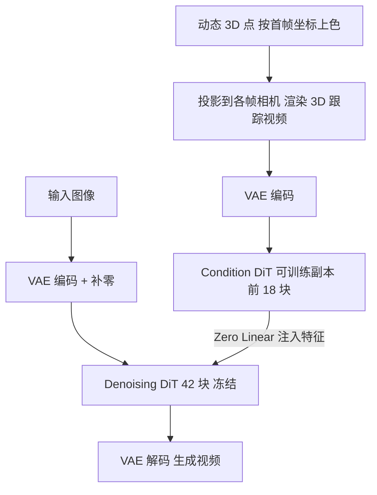

## 一句话总结

本文提出 Diffusion as Shader（DaS），把"3D 跟踪视频"作为统一的 3D 控制信号注入图像到视频扩散模型，使一个模型就能完成网格动画转视频、相机控制、运动迁移与物体操控等多种视频生成控制任务。

## 研究背景

- 领域现状：随着 Sora、CogVideoX、Kling、Hunyuan 等扩散模型的发展，从文本或图像生成高质量、时序一致的视频已经成为现实，成为广告、影视、机器人、游戏等行业的潜在工具。
- 核心痛点：如何对生成过程做到多样且精确的控制仍是难题。现有可控视频生成方法大多只针对单一控制类型（如相机运动、身份保持），依赖专门架构，缺乏对新控制需求的适应性；而且它们普遍只做高层调整，难以实现"精确抬起虚拟人左手"这类细粒度修改。
- 本文 idea：作者认为视频本质是动态 3D 内容的 2D 渲染，因此多样精确的控制根本上需要 3D 控制信号。传统 CG 制作流程正是通过操控网格、粒子等底层 3D 表示来精细控制视频；受此启发，DaS 用 3D 跟踪视频作为条件，让扩散模型像"着色器（shader）"一样在动态 3D 点上计算外观，从而在统一架构下支持多种控制任务。相比只提供结构线索的深度图，3D 跟踪视频还能跨帧关联同一批 3D 点，显著提升时序一致性。

## 方法

### 整体框架

DaS 是一个图像到视频（I2V）扩散模型，同时以输入图像和 3D 跟踪视频作为条件。3D 跟踪视频由一组随时间运动的 3D 点渲染而成：点的颜色由其在首帧相机坐标系中的坐标决定（坐标归一化到 $$[0,1]^3$$ 后转成 RGB，其中 z 坐标取倒数），颜色在不同帧保持不变，再把这些点投影到每帧相机上渲染得到该帧。由于同一 3D 点在整段视频中保持相同颜色，这些"颜色锚点"为生成提供了跨帧一致性。针对不同控制任务，只需用不同方式构造这段 3D 跟踪视频即可。

### 关键设计

基座模型。DaS 基于 CogVideoX 的 I2V 版本微调，这是一个在潜空间上运行的 Transformer 视频扩散模型（DiT）。输入图像 $$I\in\mathbb{R}^{H\times W\times 3}$$ 先补零成与目标视频同尺寸的条件视频，经 VAE 编码得到 $$\frac{T}{4}\times\frac{H}{8}\times\frac{W}{8}\times 16$$ 的潜向量，与同尺寸噪声拼接后由 DiT 迭代去噪，再经 VAE 解码得到 $$T$$ 帧视频 $$V\in\mathbb{R}^{T\times H\times W\times 3}$$。

3D 跟踪控制注入。借鉴 ControlNet 的思路：用预训练 VAE 编码器把 3D 跟踪视频编码为潜向量，再复制去噪 DiT 的前 18 个块（去噪 DiT 共 42 块）作为可训练的"Condition DiT"来处理它。Condition DiT 每个块的输出特征经零初始化线性层后加到去噪 DiT 对应特征图上。训练时只微调 Condition DiT，冻结原始去噪 DiT，因此数据高效。

面向任务的 3D 跟踪视频构造。同一套模型通过不同方式生成跟踪视频来适配四类任务：其一，物体操控——用 Depth Pro 或 MoGE 估计深度、用 SAM 分割出目标，再直接操控该物体点云构造跟踪视频；其二，网格动画转视频——从 CG 软件的简单动画网格出发，先用 depth-to-image FLUX 生成一张精美首帧，再由网格生成跟踪视频引导 DaS 补全丰富外观；其三，相机控制——估计首帧深度并转为带色 3D 点，把点投影到指定相机轨迹上得到跟踪视频；其四，运动迁移——估计源视频首帧深度、用 FLUX 按文本重绘首帧外观，再用 SpatialTracker 从源视频生成 3D 跟踪视频，结合重绘首帧生成新视频。

训练细节。训练集混合真实视频（MiraData）与用 Mixamo 网格和动作序列渲染的合成视频，统一中心裁剪并缩放到 $$720\times 480$$、49 帧。合成视频有真值网格与相机位姿，直接用稠密真值 3D 点构造跟踪视频；真实视频用 SpatialTracker 检测并跟踪 4900 个均匀分布的 3D 点。用 AdamW、学习率 $$1\times 10^{-4}$$，梯度累积到有效批量 64，训练 2000 步，在 8 张 H800 上耗时约 3 天，全程使用不到 1 万条视频。

## 实验结果

在相机控制任务上，作者以 MotionCtrl 与 CameraCtrl 为基线，在 RealEstate10K 的 100 条随机轨迹（小幅运动）以及左右上下与螺旋等大幅固定运动上评测，用估计相机位姿与真值位姿之间的旋转误差 RotErr、平移误差 TransErr（单位为度）衡量精度：

| 方法 | 小幅 TransErr ↓ | 小幅 RotErr ↓ | 大幅 TransErr ↓ | 大幅 RotErr ↓ |
|------|-----------------|---------------|-----------------|---------------|
| MotionCtrl | 44.23 | 8.92 | 67.05 | 39.86 |
| CameraCtrl | 42.31 | 7.82 | 66.76 | 29.70 |
| Ours | 27.85 | 5.97 | 37.17 | 10.40 |

DaS 在小幅与大幅运动下的平移与旋转误差全面优于两个基线，尤其在大幅运动时优势明显。作者归因于 3D 跟踪视频带来的完整 3D 感知，使生成过程能进行准确的空间推断，而基线只用隐式的相机或射线嵌入。

运动迁移任务上，与 TokenFlow 和 CCEdit 相比，DaS 在文本对齐（Text-Ali 32.6）与时序一致性（Tem-Con 0.971）两项 CLIP 指标上均领先。分析实验（在 DAVIS 与 MiraData 验证集上以 PSNR、SSIM、LPIPS、FVD 评测）进一步表明：用 3D 跟踪视频作条件比用深度图作条件在所有指标上更好（如 4900 点时 FVD 551.3、PSNR 19.27，而纯深度图 FVD 645.1、PSNR 18.08）；跟踪点数从 900 增到 8100，2500/4900/8100 视觉质量接近，考虑到 SpatialTracker 跟踪过多点较慢，默认取 4900 点。网格动画转视频与物体操控任务主要给出定性结果，显示其在 3D 结构、纹理细节与多视一致性上优于 CHAMP 等方法。

## 亮点与局限

亮点：提出用 3D 跟踪视频作为统一 3D 控制信号，一套架构覆盖网格转视频、相机控制、运动迁移、物体操控等多种任务，摆脱了"一任务一专用架构"的局限；"扩散即着色器"的视角把视频生成类比为在动态 3D 点上计算外观，直觉清晰；跨帧一致的颜色锚点显著增强时序一致性，即使某区域短暂消失再出现也能保持外观一致；训练高效，冻结基座只训 ControlNet 副本，用不到 1 万条视频、8 卡 3 天即可获得强控制能力。

局限：控制质量高度依赖 3D 跟踪视频的正确性。若输入图像与跟踪视频结构不兼容，模型会生成不合理的场景切换；对没有 3D 跟踪点覆盖的区域，跟踪视频无法约束，可能产生失控的、不自然的内容。当前还依赖已有动画网格或已有视频来获得高质量跟踪视频。

## 延伸思考

DaS 的核心洞见是把"跨帧关联"显式地编码进控制信号：深度图只描述单帧结构、不约束运动，而按首帧坐标上色的 3D 跟踪视频让同一 3D 点在时间上保持同色，相当于给扩散模型提供了稠密的时空对应关系，这解释了它在时序一致性与相机控制精度上的优势。

把多种看似不同的控制任务统一到"如何构造 3D 跟踪视频"这一问题上，是很有价值的抽象——控制的多样性被转移到前端的 3D 点生成与操控，而生成骨干保持不变，这为后续扩展新控制类型留出了空间。

作者也指出了自然的下一步：既然瓶颈在于获取高质量跟踪视频目前要靠现成网格或源视频，那么训练一个专门的扩散模型来直接生成 3D 跟踪视频，就有望闭环，让整套框架摆脱对外部 3D 资产的依赖，向真正端到端的可控生成迈进。
