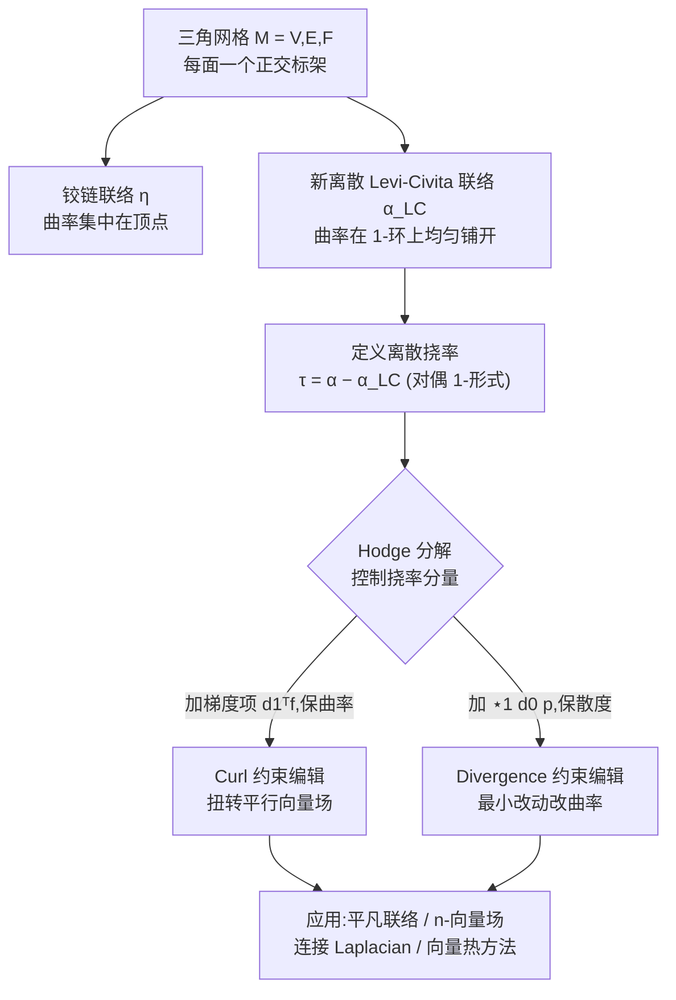

## 一句话总结

本文首次为三角网格上的离散度量联络补上了"挠率(torsion)"这一缺失量：先构造一个曲率均匀分布、误差更低的新离散 Levi-Civita 联络作为参考，再把任意联络相对该参考的偏差(对偶 1-形式)定义为离散挠率，从而让曲率与挠率可以像连续情形那样被独立、线性地控制与编辑。

## 研究背景

在几何处理中，离散联络已经是向量场/条纹图案设计、二维草图矢量化、可制造性设计等任务的基础工具。在光滑理论里，曲面上的联络由 Cartan 活动标架法刻画，包含两个量：标量的**曲率**与向量值的**挠率**。

然而现有工作几乎只关注曲率，完全忽略了挠率。这一点相当反常，因为挠率正是 Riemann 几何基本定理的核心组成——正是"零挠率 + 度量兼容"这两个条件保证了由度量诱导的 Levi-Civita 联络存在且唯一。

给定标架 $E(x)$ 下,任意联络可写成 $\nabla = d + \omega$。对曲面上的度量联络，连接 1-形式 $\omega$ 反对称,可用标量 1-形式 $\alpha$ 表示为 $\omega = J\alpha$（$J$ 为 90° 旋转矩阵）。曲率与挠率分别为:

$$\Omega^{\nabla} = d\omega + \omega\wedge\omega = J\,d\alpha, \qquad \Theta^{\nabla} = d\theta + \omega\wedge\theta$$

关键的连续观察是：从 Levi-Civita 联络出发，令 $\tilde\nabla = \nabla^{LC} + J\alpha$，则挠率恰好等于其相对 Levi-Civita 联络的偏差：

$$\Theta^{\tilde\nabla} = -\alpha^{\sharp}\,dA$$

且曲率与挠率的变化互相关联——曲率变化是挠率变化的旋度(curl)。这正是本文离散化的出发点。

以往离散做法(Crane 等 2010)用"铰链联络(hinge connection)"$\eta$ 作为参考，把网格当作曲率集中在顶点的多面体曲面，其曲率就是通常的角亏(angle defect)。但它没有给出任何离散挠率的定义；而 Braune 等 2024 虽能经由 $\Theta = d\theta + \omega\wedge\theta$ 定义挠率,却高度非线性,难以求解指定挠率或无挠联络。

## 方法

整体流程是：构造低挠率参考联络 → 定义挠率为偏差 → 通过 Hodge 分解分别控制曲率与挠率。

### 关键设计一：新的离散 Levi-Civita 联络

铰链联络把网格视为曲率集中在奇异顶点的锥面近似,与它所逼近的光滑曲面几何差异较大。本文改为把网格看作**局部常曲率**的光滑曲面近似——即把每个顶点的总曲率 $K_i$（角亏 $2\pi - \Phi_i$）在其 1-环上**均匀铺开**，而非集中。最终给出相对铰链映射的闭式偏移:

$$\alpha^{LC}_{ij} = \eta_{ij} + \frac{1}{\lozenge_{ij}}\left[K_i A_{*ij}\left(\frac{A_{*ij}}{A_i} - \frac{\varphi_{*ij}}{\Phi_i}\right) - K_j A_{*ji}\left(\frac{A_{*ji}}{A_j} - \frac{\varphi_{*ji}}{\Phi_j}\right)\right]$$

其中 $A_{*ij}$ 是对偶边 $*ij$ 与顶点 $i$ 构成三角形的面积，$\varphi_{*ij}$ 是其在 $i$ 处的角，$\lozenge_{ij}=A_{*ij}+A_{*ji}$ 为边菱形面积，$A_i$ 是对偶格面积，$\Phi_i$ 是顶点角和。直觉是：铰链映射按归一化尖角 $\varphi_{*ij}/\Phi_i$ 分配曲率，而本文按邻接面积 $A_{*ij}/A_i$ 分配——类似顶点法向量用面积权重还是角度权重做平均的区别。当局部为等边三角形时两者比值均为 $1/6$，公式退化回铰链映射。

### 关键设计二：把挠率定义为偏差

有了离散 Levi-Civita 形式 $\omega^{LC}=J\alpha^{LC}$，一个联络 $\omega = J\alpha$ 的**离散挠率**就定义为对偶 1-形式:

$$\tau := \alpha - \alpha^{LC}$$

这与连续定义完全平行。虽然在连续世界里向量值 2-形式、向量场、1-形式三者同构,这种选择差别不大,但在离散设定下它带来了可计算、鲁棒的编辑框架:可以通过对 $\tau$ 做 Hodge 分解,分别操控其旋度、散度与调和分量。

### 关键设计三：约束式挠率编辑

- **Curl 约束(保曲率)**：由于挠率变化的旋度对应曲率变化，只要给 $\alpha$ 加上调和对偶 1-形式或对偶梯度场 $d_1^T f$（$f$ 为定义在面上的对偶 0-形式），就能在保持所有可收缩对偶环路上全纯率(即曲率)不变的前提下改变挠率。高亏格曲面上,每个同调生成元又提供额外的编辑自由度。
- **Divergence 约束(保散度)**：加上 $\star_1 d_0 p$（$p$ 为顶点标量势），由于它是 $p$ 旋转 90° 的梯度,无散度,不影响挠率的梯度分量——这是改变曲率所需的最小扰动。

### 与平凡联络的联系

Crane 等 2010 的平凡联络(指定奇异点及指标、其余处零全纯率)取 $L^2$ 最小范数解,本文指出这等价于最小化到**铰链映射**的距离,而本文框架下更自然的是最小化到新 Levi-Civita 联络的距离。更重要的是获得了新的几何解释:带指定奇异点的平凡联络空间,恰好是挠率 1-形式具有**固定旋度**的那些联络;在此空间内加上标量势梯度即可探索不同挠率,而不再局限于"挠率最小"。

## 实验结果

**收敛到光滑 Levi-Civita 联络（图 5）**：在 500 个随机二次曲面 $z=\lambda_1 x^2 + \lambda_2 y^2$（$\lambda_1,\lambda_2$ 于 $[-2.5, 2.5]$ 均匀采样）上测试。铰链映射与新离散 Levi-Civita 联络都以**线性速率**收敛,但新联络在**每一个**样例上误差都更低——在该实验中约低 **30%**。误差通过在每个顶点 1-环内拟合线性 1-形式、再与二阶精度的光滑参考解求 $L^2$ 距离得到。

**平凡联络收敛（图 6）**：在球面上推导了最小挠率平凡联络的解析式,测量远离奇异点的球面小块上的 $L^\infty$ 误差。从新离散 Levi-Civita 联络与从铰链映射出发都呈线性收敛;由势函数给出的指定挠率几乎被离散化完美捕获,故两种平凡联络误差近乎一致。

**应用效果**：
- **向量场/n-向量场设计（图 3）**：共享同一曲率约束下,给挠率加梯度分量 $d_1^T f$ 会在平行向量场中引入扭转,$f$ 幅值越大处扭转越强;$n=4$ 时可得交叉场(cross field)。
- **连接 Laplacian（图 4）**：用离散 Levi-Civita 联络构造的连接 Laplacian 得到 3D 空间中流线尽可能笔直的最优场;换成带非零挠率的联络则在流线中引入扭转。
- **向量热方法（图 1）**：修改 Sharp 等 2019 的连接 Laplacian 为带指定挠率的联络,计算对数映射(全局极坐标参数化)时,能在径向线中引入明显扭转。

**对偶网格选择（4.4 节）**：外心对偶能简化诸多表达式（半菱形面积相等,对偶边张角可用对角写出),但即便在高质量网格上也可能出现翻转的对偶边、导致大数值误差。实践中**重心对偶**对三角形质量的敏感度显著更低,且不增加实现复杂度、不损失良态网格上的精度。

## 亮点与局限

**亮点**：
- 补上了离散几何处理长期缺失的一块——挠率,与曲率并列,让联络的两个 Cartan 特征量都能被离散、独立地控制。
- 挠率定义"偏差即挠率"简洁且与连续理论精确平行,且是**线性**的,避免了此前非线性构造难以求解的问题。
- 新离散 Levi-Civita 联络有闭式表达,几乎不增加复杂度却带来约 30% 的一致精度提升。
- 借助 Hodge 分解可分别保曲率改挠率、或保散度改曲率,直接嵌入向量场设计、连接 Laplacian、向量热方法等既有管线。

**局限**：
- 新联络 $\alpha^{LC}$ 的曲率一般并不精确等于角亏 $K_i$,而是 $K_i$ 加上邻域顶点角亏的修正项,在尖锐顶点或网格退化处可能显著偏离,其与其他高斯曲率估计的关系尚未厘清。
- 外心对偶在低质量网格上鲁棒性差,需退而使用重心对偶或混合方案。
- 理论仅针对曲面(二维),自然扩展到三维/高维困难：曲面上挠率可由向量场编码,但高维挠率张量按 Cartan 分解含一个"无几何解释"的第三分量,难以作为离散理论基础。

## 延伸思考

- **度量的视角转换**：最小挠率平凡联络可看作把全部曲率集中到奇异点的锥度量的 Levi-Civita 联络。这提示可以"调整度量以消除联络奇异性",在极端奇异情形下可能得到更良态的问题;文中的局部测地极坐标映射只需曲率信息即可适配不同度量。
- **曲率估计的再认识**：$\alpha^{LC}$ 的曲率是一种带邻域平滑的高斯曲率估计,是否与其他经典估计等价、在不同对偶下的平滑效应如何,值得进一步研究。
- **三维挠率与物理应用**：R³ 中场的扭转是数学与物理的基本问题,牵涉体网格化、流体模拟(涡丝)等图形学方向。若能突破 Cartan 分解第三分量缺乏几何意义的障碍,发展三维离散挠率理论,可能成为研究与优化此类场的关键工具。
