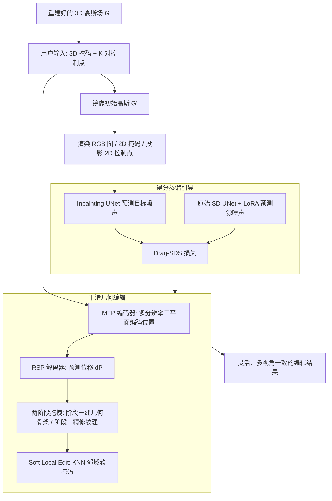

## 一句话总结

DYG 把二维拖拽式图像编辑范式扩展到三维，用户只需给定 3D 掩码与若干对控制点（handle 点与 target 点），即可通过隐式三平面表示搭建几何骨架、并借助 Drag-SDS 损失把二维拖拽扩散模型的先验蒸馏到 3D 高斯场，实现灵活、精确且多视角一致的几何编辑。

## 研究背景

3D 场景的表达与操控在 VR/AR 等领域越来越重要。3D Gaussian Splatting（3DGS）以稀疏、可解释的高斯基元替代稠密神经网络，具备实时渲染与快速更新的优势，成为 3D 编辑的理想载体。

现有基于 3DGS 的编辑方法大多借助预训练的二维文本引导潜在扩散模型（LDM）来指导优化，但存在两个核心缺陷：

- 只擅长纹理或风格修改，难以完成几何变化（例如让角色转头、并腿）。
- 语言难以精确描述编辑的空间范围与程度，缺乏对编辑结果空间位置的准确控制。

二维拖拽式编辑（如 DragGAN 及其后续工作）用成对控制点提供了精确、直观的操控能力。但若直接把二维拖拽生成模型套到 3DGS 优化上，会遇到新难题：目标区域往往高斯分布稀疏，模型倾向于对齐附近高斯的纹理而非真正生成期望的几何结构，严重影响精度与真实感。简单的刚性变换（把 handle 点附近的高斯拷贝到目标区）又会限制编辑多样性、并在目标区留下明显伪影。

## 方法

### 整体框架

DYG 接收重建好的 3D 高斯场，为每个高斯额外附加一个掩码属性 $$m$$，用户输入 3D 掩码与 $$K$$ 对控制点 $$Q=\{(q_i^o, q_i^t)\}_{i=1}^{K}$$，目标是把 handle 点 $$q_i^o$$ 周围的编辑区域拖拽到 target 点 $$q_i^t$$。系统保留一份镜像的初始高斯 $$G'$$ 用于渲染二维引导信号（RGB 图、二维掩码、投影后的二维控制点），作为二维拖拽 LDM 的条件。

整体分两大模块：平滑几何编辑（Smooth Geometric Editing）负责搭建并细化几何骨架；得分蒸馏引导（Score Distillation Guidance）负责用 Drag-SDS 把二维先验注入优化。

### 关键设计

多分辨率三平面位置编码器（MTP Encoder）：利用三平面表示的紧凑与连续特性，解决高斯基元空间分布不均、目标区稀疏的问题；其思路是把原区域高斯"搬运"到目标区，而非删除原区、在目标区新生成。把 3D 空间分解为三个正交、可学习的多分辨率特征平面 $$H_{xy}, H_{xz}, H_{yz}$$，对每个高斯位置 $$p=(x,y,z)$$ 归一化后投影到各平面并作双线性插值：

$$f_c^s = \psi_s(H_c, \pi_c(x,y,z))$$

再对多尺度、多平面特征做 Hadamard 积拼接并经轻量 MLP 融合：

$$f = \Theta\,\mathrm{concat}_s\left(\prod_{c\in C} f_c^s\right)$$

区域特定位置解码器（RSP Decoder）：把高斯划分为掩码内子集 $$G_m$$ 与掩码外子集 $$G_{um}$$，用两个 MLP（$$N_1$$、$$N_2$$）解码位移。掩码内直接由 $$N_1$$ 预测；掩码外用停梯度算子 sg 保留主位移并用 $$N_2$$ 校正非预期移动：

$$\Delta p = N_1(f)\ \text{对于}\ g_i\in G_m;\quad \Delta p = \mathrm{sg}(N_1(f)) + N_2(\mathrm{sg}(f))\ \text{对于}\ g_i\in G_{um}$$

并配区域正则损失约束掩码外高斯尽量不动：

$$L_{RR} = \sum_{g_i\in G_{um}} \Delta p_i$$

两阶段拖拽：第一阶段只优化 MTP 编码器与 RSP 解码器、冻结全部 3DGS 参数并关闭稠密化/剪枝，专注搭建几何骨架；第二阶段重新激活稠密化/剪枝，主要优化颜色、不透明度、旋转、尺度等纹理属性，新增高斯均归入 $$G_m$$ 继续优化。

软局部编辑（Soft Local Edit, SLE）：严格冻结掩码外参数会导致编辑区与周围出现裂缝、脱节。SLE 为每个 $$G_m$$ 内高斯找 K 近邻，取其中属于 $$G_{um}$$ 的高斯组成 $$G_{knn}$$，以较低学习率优化，实现平滑过渡。

Drag-SDS 损失：在 SDS 基础上把预测噪声扩展为复合项：

$$\hat{\epsilon} = \epsilon_{tgt} - \epsilon_{src} + \epsilon$$

其中目标噪声 $$\epsilon_{tgt}$$ 由 Lightning-Drag 的 Stable Diffusion Inpainting U-Net 预测（输入噪声潜变量、二值掩码与被掩码初始图潜变量，并注入 2D 控制点的点嵌入与外观嵌入）。由于 inpainting 主干偏重掩码内、难以刻画当前整体分布，源噪声 $$\epsilon_{src}$$ 改用带 LoRA 的原始 SD U-Net 预测，其可学习嵌入初始化为零，LoRA 用简单扩散损失训练：

$$L_{lora} = \mathbb{E}_{t,c,\epsilon}\left[\lVert \epsilon_\phi(x_t,t,\hat{y}_\varnothing) - \epsilon \rVert_2^2\right]$$

图像空间得分蒸馏损失：

$$L_{img} = \mathbb{E}_{t,c,\epsilon}\left[w(t)\frac{\sqrt{\bar{\alpha}_t}}{\sqrt{1-\bar{\alpha}_t}}\lVert x - \hat{x} \rVert_2^2\right]$$

最终 Drag-SDS 由潜空间、图像空间与 LoRA 三项加权组成：

$$L_{Drag\text{-}SDS} = \lambda_{lat}L_{lat} + \lambda_{img}L_{img} + \lambda_{lora}L_{lora}$$

## 实验结果

实现层面，基于原版 3DGS 重建场景，在 A100-40G 上完成一次拖拽约需 10 分钟，而 GS-Editor 需要 20 分钟以上。评测选取 Mip-NeRF360 与 Instruct-NeRF2NeRF 两个数据集的六个代表性场景，执行超过 20 类编辑任务，涵盖人脸、室内物体与复杂室外场景。

由于此前无 3DGS 真实场景拖拽编辑的直接可比方法，作者与文本驱动编辑（GS-Editor、GS-Ctrl）、锚点拖拽（SC-GS）以及自建的 2D-Lifting（先二维拖拽再三维重建）基线对比。

用户研究收集 75 名用户、共 1500 票，在编辑效果与场景质量两项上分别有 86.1% 与 62% 的用户偏好 DYG 的结果。此外用 GPT-4o 打分（0~5），评估场景质量 SQ、编辑效果 EE、初始特征保留 RIF，并按 $$0.3\times SQ + 0.4\times EE + 0.3\times RIF$$ 计算综合分 GPTO；又用 LAION 美学预测器给出 0~10 的美学分 AES。

主实验结果如下（灰体为初始场景指标）：

| 方法 | SQ↑ | EE↑ | RIF↑ | GPTO↑ | AES↑ |
| --- | --- | --- | --- | --- | --- |
| Init（初始场景） | 5 | — | 5 | — | 5.53 |
| SC-GS | 2.69 | 2.318 | 2.28 | 2.4182 | 4.14 |
| GS-Editor | 4.418 | 2.354 | 4.624 | 3.6542 | 5.28 |
| GS-Ctrl | 4.162 | 2.16 | 4.392 | 3.4302 | 5.38 |
| 2D-Lifting | 3.116 | 3.234 | 3.212 | 3.192 | 4.85 |
| Ours（DYG） | 4.434 | 4.42 | 4.626 | 4.486 | 5.36 |

DYG 在 SQ、EE、RIF、GPTO 四项上全面领先。GS-Editor 因几何变化极小而 RIF 高、但 EE 低；GS-Ctrl 常在几何编辑上失败、EE 低且倾向过饱和（其 AES 偏高但并未完成预期编辑）；2D-Lifting 虽能完成几何编辑但多视角不一致导致模糊、SQ 偏低。DYG 的 AES 仅比初始场景下降 0.17。

消融方面：逐步添加 Drag-SDS、MTP、两阶段训练、RSP、SLE 各模块，验证只用 Drag-SDS 会以纹理拟合代替位移、留下伪影；加入 MTP 缓解伪影但精细拖拽仍不足；两阶段训练建好骨架但会误改背景；RSP/局部编辑会在掩码边界出现裂缝；最终 SLE 带来最和谐、一致的高质量结果。得分蒸馏损失消融显示原始 SDS 会使目标区模糊、Drag-SDS 配 inpainting UNet 会因过度关注掩码内而出现色彩分层，改用原始 SD UNet 后能兼顾全局信息、消除分层。

## 亮点与局限

亮点：

- 首个面向真实场景的 3DGS 拖拽式编辑方法，用 3D 掩码 + 成对控制点实现对编辑范围与程度的精确、直观控制，覆盖形变、平移变换、结构变形三类几何编辑。
- 用隐式三平面（MTP）+ 区域解码（RSP）巧妙解决目标区高斯稀疏问题，思路是"搬运"而非"删旧建新"；两阶段训练与 Soft Local Edit 兼顾几何骨架与局部和谐。
- Drag-SDS 用双 UNet（inpainting 预测目标、SD+LoRA 预测源）改进 SDS，缓解过饱和、过平滑与色彩分层，保证多视角一致。
- 支持多轮拖拽，并能推广到 Director3D 等生成式 3D 场景。

局限：

- 3D 编辑能力受制于底层 2D 拖拽生成模型的性能，2D 生成模型的进步才能进一步推动本方法。
- 交互速度尚未达到近实时；作者将其列为未来改进方向，并展望扩展到 4D 动态场景编辑。

## 延伸思考

DYG 的核心贡献在于把"稀疏离散的 3DGS"与"连续的隐式三平面"缝合起来，用连续表示来托底稀疏区域的几何生成，这一"显式 + 隐式互补"的思路对其它 3DGS 编辑或重建任务同样有借鉴价值。Drag-SDS 用两套不同 UNet 分别估计目标分布与当前分布，实际上是对 SDS 类方法中"源项估计不准导致过饱和"这一通病的针对性修补，值得在其它蒸馏式生成/编辑任务里复用。局限也指明了这类方法的天花板：三维编辑质量强绑定二维生成先验，未来若把更强的多视角一致扩散模型或视频扩散模型作为引导，或直接在三维/四维空间做拖拽引导，有望摆脱对单帧二维模型的依赖并迈向近实时与动态编辑。
