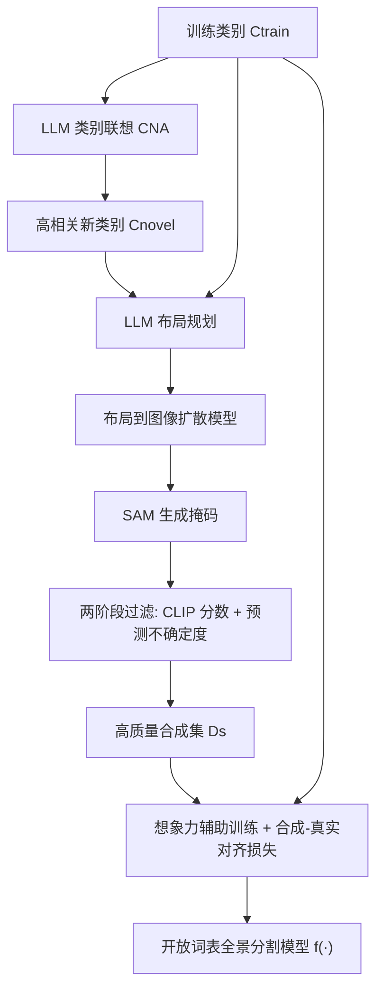

## 一句话总结

DreamMask 从"数据"而非"模型结构"的角度出发，用大语言模型联想新类别、用布局到图像的扩散模型合成带标注的训练样本，再配合一个合成-真实对齐损失，把现有开放词表全景分割模型在新类别上的表现显著拉高，且即插即用、不增加推理开销。

## 研究背景

- 领域现状：开放词表全景分割（Open-vocabulary Panoptic Segmentation, OPS）借助 CLIP 这类视觉-语言大模型，让模型在推理时可以用任意文本作为类别定义。主流做法是把 CLIP 与全监督分割模型结合，并通过区域级或掩码级的图文对齐做微调。
- 核心痛点：作者发现这些号称"泛化强"的方法，性能提升几乎都集中在与训练集重叠的类别上，对真正的新类别只有微弱进步。以最先进的 FC-CLIP 为例，在 COCO 上训练、ADE20K 上测试时，对新类别的准确率明显偏低——而识别新物体才是开放词表研究的真正目的。
- 本文 idea：既然扩大训练词表是提升泛化最直接的方式，而真实分割数据的采集与标注成本极高，那就用合成数据来补。但以往合成数据方法都局限于闭词表设定（类别、图像、标注都已知），如何为开放词表模型合成"类别名、图像、标注都未知"的新类别样本，是一个尚未解决的问题。DreamMask 正是系统性地回答"怎么在开放词表设定下造数据、又怎么用真实+合成数据训模型"这两个问题。

## 方法

### 整体框架

DreamMask 分两大步：新样本合成（Novel Sample Synthesis, NSS）与想象力辅助训练（Imagination Aided Training, IAT）。NSS 先用大语言模型为每个训练类别联想出高相关的新类别，再让大语言模型规划布局、用布局到图像扩散模型合成图像，并借助 SAM 结合布局框生成像素级标注，最后用两阶段过滤留下高质量样本；IAT 则把合成样本并入训练集，并用一个合成-真实对齐损失，通过在线更新的类别原型缩小真实与合成物体的表征差距。

### 关键设计

1. 类别名联想（Category Name Association, CNA）。把训练类别名喂给大语言模型，让它联想出一批语义相关的新类别名，然后剔除非名词、以及与训练集重复或语义过近的项。为了对冲大语言模型输出不稳定，同一提示跑五次、取重复出现的类名作为可靠结果。一个关键洞见是：扩展到与训练类别高相关的新类别，效果远好于随机挑选的新类别——因为随机类别与初始训练集存在过大的域差，反而会拖累性能。

2. 上下文感知的样本合成（Context-aware Sample Synthesis, CSS）。从新类别与训练类别的并集中随机采样类名，让大语言模型先做粗粒度布局规划，再经文本到布局的诱导转成细粒度布局（含边界框），交给布局到图像扩散模型（LayoutGPT）合成忠于场景描述的图像。由于每个边界框内保证只有单一类别的物体，把图像与布局框一起送进 SAM 就能直接拿到每个物体的像素级标注——相比"抠图-粘贴"这类上下文无关方式，合成出的场景更真实自然。

3. 两阶段过滤。生成质量参差不齐，作者从"生成质量"和"标注质量"两个维度筛样本。先用 CLIP 分数过滤：把每个框裁出的物体与其类名分别送进 CLIP 图文编码器算相似度，取图内均值作为该图 CLIP 分数，只保留高于全集平均值的样本，剔除有明显伪影的图像。再用标注不确定度过滤：对每个物体计算像素级预测的平均不确定度，并采用类别敏感的方式（避免直接全局过滤导致类别分布严重失衡），每类保留预测不确定度最低的 top-n 个物体。单个物体的平均不确定度定义为 $$S_i = \sum_{hw} \big[\mathbb{1}(M^i_{hw}=j)\times(1-P^i_{hw})\big] \big/ \sum_{hw}\mathbb{1}(M^i_{hw}=j)$$ ，其中 $$P^i$$ 为像素级预测。

4. 合成-真实对齐损失（Synthetic-Real Alignment）。直接混用真实与合成样本训练，模型会偏向合成域、在真实图像上泛化变差。为此为每个训练类别维护一个在线更新的特征记忆库 $$M^p_r$$（最近使用的特征入队、最久的出队），把该类真实物体原型与同类合成物体特征 $$F^p_s$$ 做余弦对齐：$$L_{sra}=1-\dfrac{F^p_s\cdot M^p_r}{\lVert F^p_s\rVert_2\cdot\lVert M^p_r\rVert_2}$$ 。总损失为 $$L=L_{seg}+\lambda L_{sra}$$ ，其中 $$L_{seg}$$ 是被增强方法原有的分割损失，DreamMask 只额外引入 $$L_{sra}$$ ，因此可作为即插即用模块接到 FC-CLIP、MAFT+、ODISE 等现有方法上。

## 实验结果

主实验为开放词表语义分割的 mIoU 对比：模型在 COCO Panoptic 上训练，在 ADE20K 与 Pascal Context 的多套设定上测试。DreamMask 作为插件接到三种基线上，均带来一致提升，其中 FC-CLIP+DreamMask 在 A-150 上相对 FC-CLIP 提升 3.3%，MAFT++DreamMask 在 A-150 上刷新到 38.2%。

| 方法（训练集 COCO Panoptic） | A-847↑ | PC-459↑ | A-150↑ | PC-59↑ |
|------|--------|--------|--------|--------|
| ODISE | 11.1 | 14.5 | 29.9 | 57.3 |
| ODISE+DreamMask | 12.7 | 16.0 | 31.4 | 58.1 |
| FC-CLIP（基线） | 14.8 | 18.2 | 34.1 | 58.4 |
| FC-CLIP+DreamMask | 16.8 | 20.5 | 37.4 | 59.2 |
| MAFT+ | 15.1 | 21.6 | 36.1 | 59.4 |
| MAFT++DreamMask | 16.8 | 22.8 | 38.2 | 60.6 |

其余实验以文字补充：在只统计"与训练类别无相近语义的新类别"时提升更为突出，FC-CLIP 在 A-150 新类别上的 mIoU 从 8.5 提到 21.8、A-847 从 2.5 提到 6.8；全景分割指标（PQ/AP/mIoU）上 FC-CLIP+DreamMask 在 ADE20K 相对基线提升 1.3/1.9/3.3，而在闭词表 COCO 上保持与基线相当，说明对齐策略没有损伤原有能力。消融方面，NSS 与 IAT 逐一叠加均有增益（34.1→35.7→37.4，A-150 mIoU）；与上下文无关的抠图粘贴、MosaicFusion 相比，上下文感知合成大幅领先；随机新类别反而低于基线，验证了 CNA 的必要性；用等量网络爬取数据训练几乎只与基线持平，凸显合成数据的高保真优势。超参上 $$\lambda=0.8$$ 、每类样本数 $$n_s=500\text{k}$$ 时达到性能与效率的平衡。

## 亮点与局限

- 亮点：
  - 指出并用实验坐实了"开放词表方法的提升主要来自重叠类别、对新类别几乎无效"这一被忽视的问题，切入点扎实。
  - 提出完整的开放词表合成数据流水线（LLM 联想类名 → LLM 规划布局 → 布局到图像扩散生成 → SAM 生成标注 → 两阶段过滤），解决了"类名/图像/标注都未知"的难题。
  - 即插即用、不增加推理开销，能接到多种现有方法上稳定涨点；并给出"合成数据优于等量网络爬取数据"的有价值结论。
- 局限：
  - 效果受限于布局到图像扩散模型的能力，面对复杂场景描述时合成质量有时不稳，作者也承认这是主要瓶颈，留待引入上下文学习式布局规划与物体交互扩散来改进。
  - 在 Pascal（PAS-21/PAS-20）等类别已全部包含于训练集的数据集上，DreamMask 的提升较小，其价值主要体现在存在大量新类别的场景。
  - 流水线依赖 GPT-3.5、LayoutGPT、SAM、CLIP 等多个现成大模型，且需要合成约 50 万级样本，数据构建的算力成本不低。

## 延伸思考

- 这条"用生成模型给判别模型造训练数据"的思路与 FreeMask、MosaicFusion 一脉相承，但首次把它推到开放词表设定，并抓住了"新类别与训练类别的相关性"这一影响域差的关键变量；这提示在其他开放词表任务（检测、指代分割、3D 场景理解）中，同样值得先用 LLM 做"相关类别联想"再合成。
- 合成-真实对齐用的是简单的类别原型余弦对齐，未来或可换成更强的分布对齐或对比学习目标；记忆库长度、原型更新策略对稳定性的影响也值得深挖。
- 布局质量是当前上限，若把 LayoutGPT 换成更强的、支持物体交互与遮挡关系的布局-生成一体化模型，或引入可控性更好的扩散模型，理论上还能进一步压缩合成域差、提升复杂场景的样本可用率。
