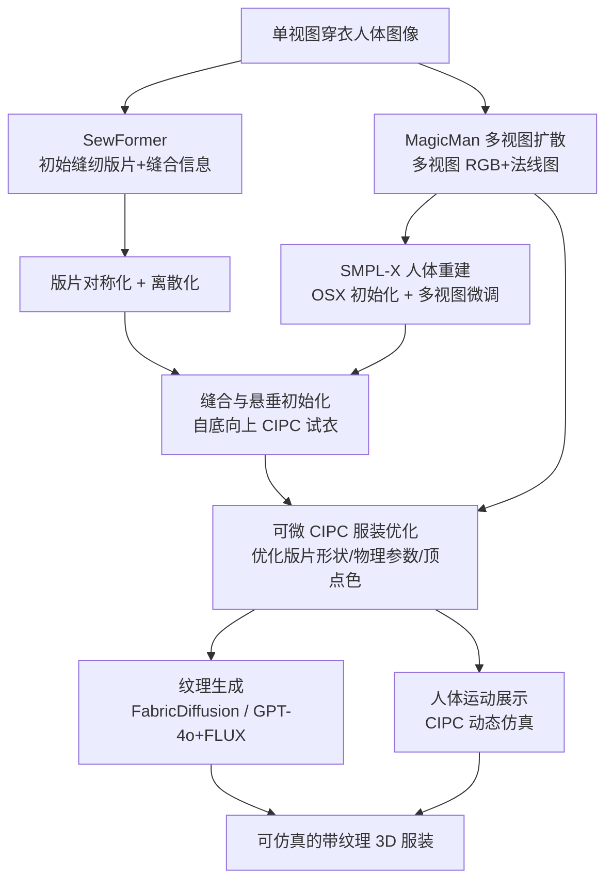

## 一句话总结

从一张野外单视图照片出发，Dress-1-to-3 把"图像到缝纫版片生成"的前馈模型、"多视图扩散"的 2D 先验和"可微 CIPC 布料仿真"结合起来，重建出可分离、可直接仿真的带缝纫版片的 3D 服装与人体。

## 研究背景

创建"穿衣数字人"资产在 VR、影视、时尚设计、游戏中都很关键，但传统流程涉及概念设计、选材、建模、姿态生成、试衣、动画等大量繁琐步骤。近年图像到 3D 的大模型（尤其是多视图扩散模型）进展显著，微调到人体数据集后能从野外图像重建 avatar，但产出的模型往往是"融为一体"的一整块网格，无法用于服装动画、交互等下游任务。

另一条路线是把"缝纫版片"（sewing pattern，服装工业里的基础表示）作为中间重建目标。它天然对接物理仿真和服装编辑，但这些前馈方法受制于高质量 3D 数据稀缺，重建结果被训练分布束缚，难以对齐输入图像、难以覆盖真实世界的多样服装。

本文提出的核心问题是：能否既保留缝纫版片"可仿真"的优势，又借助多视图扩散模型的强先验，仅从一张野外图像重建服装？作者的答案是用一个可微布料仿真器把这两条路线桥接起来——用 2D 生成的多视图 RGB 与法线图作为监督，反向优化 3D 缝纫版片，从而重建出分布外（out-of-distribution）的服装形状。

主要贡献有三点：一是提出从单图到"贴合于姿态化人体"服装的完整重建流水线，人体姿态与服装都与输入对齐；二是推导了一个与本构模型无关、统一的可微 IPC 框架，用于共维（codimensional）服装优化；三是大量实验验证了框架在多类服装（含训练集之外类别）上的有效性与通用性。

## 方法

### 整体流水线

### 可微 CIPC 仿真：统一的伴随框架

前向仿真采用共维增量势接触（Codimensional IPC, CIPC），通过基于距离的对数障碍能量和连续碰撞检测（CCD）保证无穿透。每个时间步通过优化式时间积分求解：

$$\boldsymbol{x}^{n+1} = \arg\min_{\boldsymbol{x}} E(\boldsymbol{x}) = \frac{1}{2}\|\boldsymbol{x}-\tilde{\boldsymbol{x}}\|_{\boldsymbol{M}}^2 + \Psi(\boldsymbol{x};\boldsymbol{X}) + B(\boldsymbol{x})$$

其中 $\tilde{\boldsymbol{x}}=\boldsymbol{x}^n+\boldsymbol{v}^n h+\boldsymbol{g}h^2$ 是后向欧拉预测位置，$\Psi$ 是拉伸与弯曲弹性能，$B$ 是 IPC 的对数障碍能。

本文的关键创新在于可微化：以往工作（Huang et al. 2024）的伴随法推导与具体本构模型强绑定，扩展到布料需要繁琐的解析导数。作者提出用"自动微分 + 伴随法"结合的统一框架。系统满足一阶最优性条件：

$$\boldsymbol{G}(\boldsymbol{x}^*;\boldsymbol{x}^n,\boldsymbol{v}^n,\boldsymbol{\varsigma}^n) = \nabla E(\boldsymbol{x}^*;\boldsymbol{x}^n,\boldsymbol{v}^n,\boldsymbol{\varsigma}^n) = 0$$

其中 $\boldsymbol{\varsigma}^n$ 涵盖形状参数、质量矩阵、弹性模量等所有连续参数。对该隐式方程两边求全微分并结合链式法则，最终得到反传梯度：

$$\left(\frac{dL}{d\boldsymbol{v}^n}, \frac{dL}{d\boldsymbol{\varsigma}^n}\right) = -A\left(\frac{\partial \boldsymbol{G}}{\partial \boldsymbol{v}^n}, \frac{\partial \boldsymbol{G}}{\partial \boldsymbol{\varsigma}^n}\right)$$

其中 $A=\left[\frac{dL}{d\boldsymbol{x}^{n+1}}+\frac{1}{h}\frac{dL}{d\boldsymbol{v}^{n+1}}\right]\left(\frac{\partial \boldsymbol{G}}{\partial \boldsymbol{x}^*}\right)^{-1}$，其系数矩阵正是系统能量的 Hessian。这样只需把 $\boldsymbol{G}$ 当作可自动微分的层，无需手工推导 $\frac{\partial \boldsymbol{G}}{\partial \boldsymbol{v}^n}$ 和 $\frac{\partial \boldsymbol{G}}{\partial \boldsymbol{\varsigma}^n}$。实现上用 NVIDIA Warp 的自动微分能力，包装进自定义 autograd.Function。

### 预优化步骤

- 版片生成：用 SewFormer 从单图生成初始缝纫版片（表示为 2D 平面上的二次贝塞尔曲线集合）与缝合信息。
- 版片对称化：SewFormer 输出常带对称性，作者通过求解一个二次优化问题保持自对称/互对称，该系统是固定系数正定线性系统，保证可微。
- 版片离散化：用弧长参数化做边界均匀采样，配对边共享采样点数以施加顶点到顶点的缝合约束；内部用 Delaunay 三角化，并借助调和坐标（harmonic coordinates）把内部点表示为边界点的线性组合，使贝塞尔曲线参数到网格顶点的采样可微。
- 多视图生成：用 MagicMan 生成轨道相机视角下的多视图 RGB 与法线图，作为后续重建的"伪真值"。
- 人体重建：以 SMPL-X 为参数化模型，先用 OSX 做初始姿态/形状估计，再用 DWPose 关键点做粗阶段（优化全局缩放与旋转），细阶段加入 RGB 损失和掩码损失微调；排除被遮挡区域的损失以适配宽松服装。
- 服装初始化：采用自底向上策略把各连通部件依次缝合、悬垂到 T-pose 人体上，再从 T-pose 插值到重建姿态，人体作为运动边界条件；通过收缩腰部三角形的静止形状产生足够摩擦防止下装滑落。

### 服装优化

在优化阶段，迭代微调贝塞尔曲线的顶点集 $P$、控制点集 $K$，以及全局拉伸刚度 $\kappa_s$、弯曲刚度 $\kappa_b$ 和顶点色 $C_G$，使静态悬垂的服装在所有视角下匹配生成的多视图图像。每次迭代用 CIPC 仿真一步（1 秒）直接逼近静态平衡；由于静态平衡不依赖初始状态，把初始状态更新为上一步的仿真结果：

$$\boldsymbol{x}_0^n = \mathrm{Sim}(\boldsymbol{x}_0^{n-1}; \boldsymbol{\varsigma}(\kappa_s,\kappa_b,P,K))$$

损失包含两大类。渲染损失：以服装彩色掩码损失 $L_{\text{Mask}}$ 为主导（用 SegFormer 分割上装/下装/连衣裙），辅以 RGB 损失 $L_{\text{RGB}}$ 和法线损失 $L_{\text{Normal}}$ 稳定训练（因掩码损失在服装内部梯度为零）。

几何正则项：由于同一 3D 网格有无穷多种展平方式，版片优化本身病态，需大量正则：
- 面积比损失 $L_{\text{AR}}$：保持各版片相对连通部件的面积比。
- 边界角/小角正则 $L_{\text{BC}}, L_{\text{SAC}}, L_{\text{DC}}$：惩罚偏离直角的边界角、过小的版片角，对齐曲线端切向与离散边方向，利于可制造性。
- 舒适度损失 $L_{\text{Comfort}}$：用 ARAP 拉伸能评估贴合松紧，防止过紧。
- 拉普拉斯损失 $L_{\text{Lap}}$：平滑网格噪声与不规则褶皱。
- 缝线损失 $L_{\text{SL}}, L_{\text{SC}}$：约束配对缝合边等长、保持初始曲率，防止缝线附近异常褶皱。

此外还有翻转防护（迭代后对负三角形面积做最小二乘惩罚）和自动重网格化（网格质量下降时通过"回拉到初始版片—重新试衣—松弛"避免穿透）。

### 后优化步骤

- 纹理生成：两种策略。对可平铺纹理，用 FabricDiffusion 从前视图裁剪的均匀色块生成无畸变可平铺纹理图；对一般纹理，用 GPT-4o 提取材质关键词（如"denim, dark blue, smooth fabric"）再喂给 FLUX 生成。
- 运动展示：用 CIPC 做动态仿真；针对 IPC 要求无穿透初始配置的问题，用 XPBD 解注入变形处理（IDP）修复人体自穿透。

## 实验结果

几何重建定量对比在 CloSe 和 4D-Dress 两个数据集上进行，指标为 Chamfer Distance（CD，越低越好）和 IoU（越高越好）。主表结果如下：

| 方法 | CloSe CD↓ | CloSe IoU↑ | 4D-Dress CD↓ | 4D-Dress IoU↑ |
|---|---|---|---|---|
| BCNet | 2.277 | 0.781 | 4.704 | 0.575 |
| ClothWild | 2.166 | 0.664 | 3.125 | 0.664 |
| GarmentRecovery | 2.058 | 0.831 | 2.983 | 0.776 |
| SewFormer | 2.233 | 0.748 | 2.926 | 0.720 |
| Dress-1-to-3（本文） | **1.623** | **0.862** | **2.441** | **0.808** |

本文方法在两个数据集的两项指标上均取得最佳。定性上，BCNet 和 ClothWild 网格过于平滑缺乏褶皱，GarmentRecovery 细节改善但常出现互穿透，SewFormer 能出可仿真版片但忽略物理参数导致仿真结果偏离真值。

缝纫版片评估对比 Neural Tailor（输入点云）和 SewFormer（输入单图）。Neural Tailor 在偏离 T-pose 时预测不佳且会产生多余版片；SewFormer 版片规整对称但常与图像不符（如短裤图预测成长裤版片）。本文的优化式方法无需额外训练数据，通过可微仿真精修初始估计，结果显著更准。

带纹理重建与仿真在 4D-Dress、CloSe、DeepFashion2 及 FLUX 文本生成图像上广泛测试，展示了对多样质量与姿态的鲁棒性，重建服装能无缝接入物理仿真做动态展示。

消融实验验证了各组件的作用：去掉对称化会产生明显不对称输出；缺 $L_{\text{Lap}}$ 保留噪声、缺 $L_{\text{BC}}$ 产生尖锐难制造的角、缺 $L_{\text{Comfort}}$ 版片偏小偏紧、缺 $L_{\text{AR}}$ 版片比例失调、缺缝线损失产生不均缝线与过度弯曲。此外顶点色因网格分辨率有限而偏平滑且有色彩渗透，故需额外纹理模块。

训练时间：预优化约 10 分钟，服装优化在单张 RTX 3090（24GB）上约 2 小时内完成。

## 亮点与局限

亮点：
- 把"生成先验（多视图扩散）+ 可仿真表示（缝纫版片）+ 可微物理（CIPC）"三者优雅桥接，产出真正可分离、可仿真的服装资产，而非融为一体的网格。
- 提出与本构模型无关的统一可微 IPC 框架（AutoDiff + 伴随法），大幅降低把可微仿真扩展到布料的推导成本。
- 优化式路线无需额外训练数据，能重建训练分布外的服装形状，并自动发现物理参数。
- 全流程覆盖到纹理生成与动态展示，工程完整度高。

局限（作者坦诚列出）：
- 生成能力受初始缝纫版片估计限制，无法预测初始估计中不存在的新连通部件；SewFormer 只能预测单层版片，多层服装会被融合。
- 部分优化版片不完全符合传统服装设计规范，因监督仅来自渲染真值。
- 服装表面偏平滑，缝线/拉普拉斯正则和 MagicMan 多视图法线不一致都会抑制自然褶皱与高频细节。
- 输入图像与生成纹理间存在差距（纹理用现成工具，非主要贡献）。
- 仅用于重力与人体支撑下的静态贴合；对流动快照或抓握等非静态状态只能用邻近静态构型近似，未必反映真实几何。

## 延伸思考

这篇工作最有价值的思路是"用生成模型的先验去监督可微物理优化"，把不可靠但覆盖广的 2D 生成结果，通过物理仿真的约束"精修"为物理合理的 3D 资产。这种"生成给方向、物理给约束"的范式，可迁移到更多需要物理合理性的重建任务。

几个可延伸方向：一是替换更强的版片预测器（支持多层、多连通部件），本文框架本身即可处理更复杂服装；二是把静态优化扩展到动态场景，例如从单目视频重建、或抓握等交互驱动的形变——作者已具备可微动态仿真层，只是当前只用于静态贴合；三是高频几何与 PBR 纹理的联合生成，是当前明显短板；四是引入服装设计规范的正则项，让优化出的版片更贴近可量产的工业标准。此外，作者也提到数据集存在体型偏差的伦理问题，值得后续在公平性上关注。
