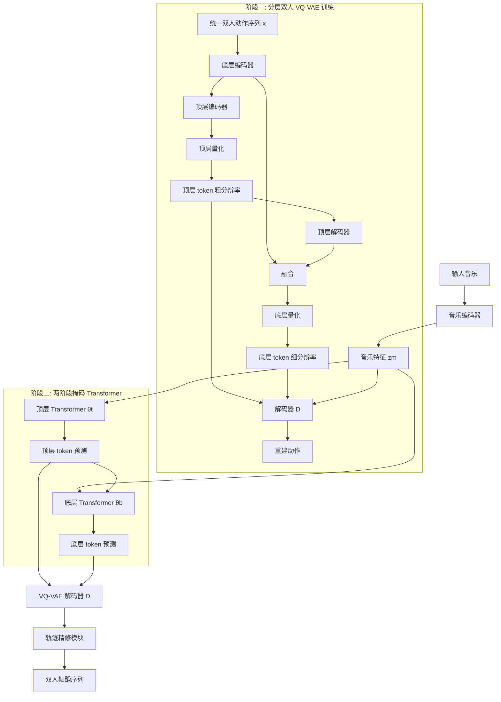

## 一句话总结

DuetGen 提出首个从音乐直接生成双人互动舞蹈的框架，通过分层 VQ-VAE 把两位舞者的动作统一编码为粗细两级离散 token，再用两阶段掩码 Transformer 由音乐逐级生成这些 token，从而实现同步、协调且贴合音乐节拍的双人舞。

## 研究背景

双人舞（duet dance）是人类文化中高度互动、极具观赏性的舞蹈形式，包含旋转、托举、扶持等紧密身体接触。相比单人舞只需关注一个身体的时序与空间一致性，双人舞生成面临独特难题：两位舞者既要彼此同步（保持节奏、速度与相对站位），又要建模复杂的领舞—跟舞（lead-follow）动态与近距离交互，同时整体还要与音乐对齐。

已有工作大多停留在单人舞生成或群舞生成，后者虽处理多人同步却忽视了紧密交互。Duolando 首次涉足双人场景，但它只能生成"跟舞者"对给定"领舞者"的被动反应，无法同时生成双方动作。DuetGen 旨在填补这一空白，直接从音乐同时生成两位舞者协调的、带紧密交互的舞蹈动作。

## 方法

### 整体框架

方法分为两个阶段。第一阶段用分层双人动作 VQ-VAE 把统一的双人动作序列压缩为两级离散 token：粗时序分辨率的顶层 token 表达全局语义（如行走、转身等整体动作），细时序分辨率的底层 token 补充精细细节（如具体编舞的关节articulation）。第二阶段用两个掩码 Transformer 从音乐生成这些 token：第一个由音乐生成顶层语义 token，第二个在音乐与顶层 token 条件下生成底层细节 token。推理时从全掩码序列出发迭代填充，最后经 VQ-VAE 解码并由轨迹精修模块修正根轨迹。

### 关键设计

统一双人动作表示。两位舞者记为 A 与 B（可互换），整段双人舞表示为 $$x_{1:N}\in\mathbb{R}^{N\times D}$$，把 A、B 的动作拼在同一特征里而非分别用单人表示建模。采用 SMPL 骨架、$$J=22$$ 个关节。每帧特征包含 A 的根平移增量（相对自身上一帧）、B 的根平移（相对 A 当前帧）、二者的根全局朝向（6D）、根不变的局部关节位置、6D 局部关节旋转、局部关节速度以及二值足地接触指示，合计维度 $$D=536$$。作者刻意将 A 的全局位置用速度表示、将 B 的全局位置相对 A 表示——这种"关系式全局定位"让 B 的位置由伙伴信息推知，使网络更易预测，实验证明它对 VQ 学习与最终生成都至关重要。

分层动作量化。编码器由底层编码器 $$E_B$$ 与顶层编码器 $$E_T$$ 串联，分别以 $$\eta_{bot}$$、$$\eta_{top}$$（$$\eta_{top}>\eta_{bot}>1$$）在时间维下采样。顶层潜码经码本 $$C_{top}$$ 量化得 $$z_{top}$$；再上采样与 $$E_B$$ 输出融合后经底层码本 $$C_{bot}$$ 量化得 $$z_{bot}$$。有意思的是，解码器 D 额外以音乐特征 $$z_m$$ 为条件能加快收敛并提升重建质量。这与 MoMask 的残差量化（RVQ）不同：RVQ 各层都在全时序尺度、且 token 表示无明确语义的量化残差，而本文的粗到细策略天然把高层语义与低层细节分离到不同时序分辨率。

同步专用训练损失。除动作重建损失 $$L_r$$ 与速度损失 $$L_v$$、承接 T2M-GPT 的 EMA 与码本重置、以及承诺损失 $$L_{com}$$ 外，作者用前向运动学 $$fk(\cdot)$$ 得到全局关节位置，施加全局关节位置损失 $$L_{fk}$$ 与双人相对关节距离损失 $$L_{rel}$$。$$L_{rel}$$ 中对端执行器（end-effector）赋更高权重、并用指数衰减的距离感知权重 $$e^{-d(p_{Aj},p_{Bk})}$$ 强调彼此更靠近、更相关的关节，从而更好地建模交互。总损失为各项加权和 $$L_{vq}=\lambda_r L_r+\lambda_v L_v+\lambda_{com}L_{com}+\lambda_{fk}L_{fk}+\lambda_{rel}L_{rel}$$。

两阶段掩码建模。参照 MaskGIT，用余弦函数调度掩码比例 $$\gamma(\tau)=\cos\left(\frac{\pi\tau}{2}\right)$$，$$\tau\sim U(0,1)$$；并借鉴 BERT 的重掩码策略。顶层 Transformer $$\theta_t$$ 由音乐预测被掩码的顶层 token，优化掩码位置的负对数似然；底层 Transformer $$\theta_b$$ 在音乐与完整顶层 token 条件下预测底层 token。两者都用无分类器引导（CFG），训练时 10% 概率去掉音乐条件。推理时从全掩码序列出发，$$\theta_t$$ 迭代 $$L_{top}$$ 次生成顶层 token，$$\theta_b$$ 再迭代 $$L_{bot}$$ 次生成底层 token，每轮把置信度最低的 token 重新掩码。

轨迹精修模块。生成动作会因根运动不准而出现滑步。由于全局根运动通常可由局部身体运动推断，作者用 1D 卷积回归器以根朝向与局部动作特征为输入，预测根轨迹速度，用重建损失训练后替换生成动作的原始根轨迹。

## 实验结果

实验在 DD100 数据集（10 种舞种、约 1.9 小时双人舞、SMPLX 表示）上进行，经滑窗增广与 A/B 互换后得到 4556 个训练样本与 1144 个测试样本，帧率 30 FPS。基线包括 Duolando、GCD、InterGen、MoFusion，均在 DD100 上重训。

VQ 重建评测使用 MPJPE、MPJVE 与相对距离误差 RDE（数字越低越好）：

| 方法 | MPJPE-A（mm） | MPJPE-B（mm） | MPJVE-A（mm） | MPJVE-B（mm） | RDE（mm） |
| --- | --- | --- | --- | --- | --- |
| A1: 去关系式定位 | 59.35 | 60.69 | 14.33 | 15.84 | 7.23 |
| A2: 去分层 tokenization | 58.35 | 65.09 | 15.38 | 17.54 | 7.12 |
| A3: 去统一表示 | 58.99 | 59.33 | 13.23 | 13.34 | 6.33 |
| A6: 去音乐特征 zm | 39.60 | 43.71 | 12.82 | 14.68 | 1.32 |
| A7: 残差 VQ（4 层） | 49.77 | 57.62 | 12.51 | 14.49 | 4.54 |
| A8: 三级层次 | 36.25 | 36.44 | 10.81 | 12.05 | 0.19 |
| 分层双人 VQ-VAE（本文） | 36.32 | 36.26 | 10.86 | 11.84 | 0.17 |

本文仅用两层量化即取得高保真重建，RDE 从 vanilla 的 7.12 降到 0.17 mm，关系式全局定位与统一表示把个体每关节误差降低超过 30%；引入音乐条件进一步提升重建；加到三级（A8）仅有边际收益甚至部分指标略退。

双人舞生成评测（FID、PFID 越低越好；Div、CF 越接近 GT 越好；PFC 越低越好；BAS 越高越好）：

| 方法 | FID ↓ | Div → | PFID ↓ | PFC ↓ | CF% → | BAS ↑ |
| --- | --- | --- | --- | --- | --- | --- |
| GT | − | 15.67 | − | 0.36 | 82.6 | 0.213 |
| Duolando | 12.21 | 14.72 | 13.18 | 16.22 | 74.7 | 0.202 |
| GCD | 9.71 | 15.03 | 12.03 | 8.11 | 78.1 | 0.203 |
| InterGen | 13.77 | 15.01 | 14.11 | 12.4 | 60.1 | 0.172 |
| MoFusion | 21.2 | 15.60 | 23.09 | 7.5 | 21.1 | 0.202 |
| A1: 去关系式定位 | 5.03 | 14.34 | 14.97 | 4.83 | 79.5 | 0.203 |
| A2: 去分层 tokenization | 4.77 | 14.45 | 15.44 | 5.88 | 80.2 | 0.197 |
| A3: 去统一表示 | 5.65 | 14.02 | 18.99 | 5.66 | 75.66 | 0.204 |
| A4: 去轨迹精修 | 2.62 | 14.11 | 2.81 | 5.31 | 78.2 | 0.211 |
| A5: 438-D 音乐编码 | 2.45 | 14.99 | 2.87 | 3.45 | 72.1 | 0.193 |
| A8: 三级层次 | 1.55 | 15.62 | 2.95 | 5.45 | 70.1 | 0.210 |
| DuetGen（本文） | 1.31 | 15.71 | 2.54 | 1.47 | 83.2 | 0.215 |

DuetGen 在个体 FID（1.31，GCD 为 9.71）、配对 PFID（2.54，GCD 为 8.11）、音乐对齐 BAS（0.215）以及接触频率（83.2%，接近 GT 的 82.6%）上均领先，多样性 Div 也最接近 GT。消融证实分层建模（对比 A2）与同步专用表示（对比 A1、A3）缺一不可，去掉任一项会显著恶化 FID 与 PFID。

用户研究邀请 30 名不同年龄、性别与舞蹈经验的参与者，对同一音乐下随机顺序的多方法动画在动作质量、音乐—动作对齐、伙伴协调三方面按 5 分李克特量表打分。DuetGen 在三项上均排名最高，得分均在 4 分以上（至少比其他方法高 22%），InterGen 因动作不自然三项均低于 2 分。

## 亮点与局限

亮点：这是首个由音乐同时生成双方双人舞的框架；统一双人表示配合关系式全局定位显著降低交互建模难度；粗到细的分层 tokenization 天然分离语义与细节，比全尺度残差量化更高效；同步专用损失（距离感知加权的相对关节距离）直接优化交互保真度；两阶段掩码 Transformer 支持迭代式并行生成。

局限：不显式建模身体形状变化，依赖数据集提供的真值体型；因 DD100 手指动作噪声大而未建模精细手指交互；验证仅限 DD100 约 1.9 小时数据（目前唯一多舞种双人数据集）。作者建议未来结合动捕数据与在线舞蹈视频来缓解数据稀缺。

## 延伸思考

DuetGen 把"统一表示 + 分层离散化 + 掩码生成"这条在单人动作与文本驱动双人动作中被验证的范式，成功迁移到音乐驱动的紧密交互场景，核心洞见在于用相对坐标把伙伴关系编码进表示本身，而非事后靠损失约束。这提示：在多智能体协调生成里，"以谁为参照系"的表示选择可能比堆叠网络容量更关键。另一个值得关注的方向是数据瓶颈——方法上限被 1.9 小时的单一数据集牢牢限制，如何从更易获取的野外舞蹈视频中蒸馏出可用的双人交互先验，可能是这条技术路线走向实用的决定性一步。掩码建模天然的可编辑性（局部重掩码、条件填充）也为交互式编舞、片段替换等应用留下了想象空间。
