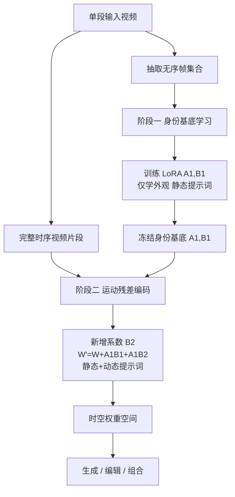

## 一句话总结

本文提出 Set-and-Sequence 框架，用两阶段 LoRA 训练从单段视频中学习「动态概念」（同时包含外观与运动的实体），在没有显式时空分离结构的 Diffusion Transformer 上构建出一个时空权重空间，从而实现对动态概念的高保真生成、编辑与组合。

## 研究背景

文本到图像模型的个性化（personalization）已经相当成熟：模型可以从用户提供的少量样本中学到特定概念，再进行定制、编辑并组合到新的场景中。但把这种能力扩展到文本到视频模型上却面临独特挑战。

与静态概念不同，视频概念本质上是「动态」的——一个实体不仅由外观定义，还由它独特的运动模式定义，例如海浪的流体运动、篝火的闪烁跳动。这类动态概念很难用文本准确描述，因此更适合把它们嵌入视频模型的输出域，用 token 表示，以支持广泛的编辑与组合任务。

作者指出的关键难点在于底层架构。当前最先进的视频生成基于 Diffusion Transformer（DiT），它同时处理空间与时间 token 的联合建模（joint spatio-temporal modeling），相比 UNet 式的分离建模能避免刚性伪影、获得更高质量。但 DiT 缺乏分离空间与时间特征的内在归纳偏置，这使得在其权重空间中嵌入动态概念变得困难。而如果直接在单段视频上微调 LoRA，往往无法同时抓住外观与运动，得到的表示不可复用，也无法泛化到新语境或支持有意义的组合。

## 方法

### 整体框架

Set-and-Sequence 的核心思路是：把动态概念分解为「外观」与「运动」两部分，并将其嵌入一个统一的时空权重空间。它通过两阶段学习实现——先用无序帧集合（Set）学习与时间无关的身份基底，再冻结身份基底、在完整视频序列（Sequence）上学习运动残差。

### 关键设计

预备知识：框架基于用流匹配损失（flow matching loss）训练的视频扩散模型，目标是对齐预测速度场与真实数据流：

$$L_{flow} = \mathbb{E}_{x,t}\left[\left\| v_\theta(x_t,t) - \frac{\partial x_t}{\partial t}\right\|_2^2\right]$$

LoRA 通过低秩更新微调预训练权重：

$$W' = W + \Delta W,\quad \Delta W = AB$$

其中 $$A \in \mathbb{R}^{m\times r}$$，$$B \in \mathbb{R}^{r\times n}$$，秩 $$r \ll \min(m,n)$$。LoRA 的参数高效与可调性，使它成为解耦身份与运动的理想工具。

阶段一：身份基底学习（Identity Basis）。从输入视频抽取一组无序帧当作图像来训练 LoRA，得到与时间无关的身份表示，只捕捉外观、不受运动干扰。权重修改为：

$$W' = W + A_1 B_1$$

训练使用静态文本 token $$T_{static}$$ 描述外观（例如 "a [v] person"，其中 [v] token 用零初始化，实际中还会加入背景、表情等细节）。优化目标为身份专用的流匹配损失，得到一个稳健的低维身份基底。

阶段二：运动残差编码（Motion Residual）。在冻结的身份基底之上，新增一个低秩矩阵 $$B_2$$，把运动编码成叠加在身份之上的残差形变：

$$W' = W + A_1 B_1 + A_1 B_2$$

其中 $$A_1, B_1$$ 保持固定以保留身份，$$B_2$$ 编码运动特定形变。文本条件使用静态与动态 token 的并集：

$$T_{motion} := T_{static} \cup T_{dynamic}$$

$$T_{dynamic}$$ 描述运动属性（例如 "... in [u] motion"，还会补充粗粒度动作与相机运动描述）。只优化 $$B_2$$，使运动成为对身份的补充形变。

正则化：这是框架能稳健训练、避免过拟合的关键，共四种策略。其一，先验保持（prior preservation），用外观+运动两段式提示词采样基座模型生成的视频进行重建约束。其二，高秩 LoRA 的高 dropout 正则——单视频训练下低秩会欠拟合、高秩会过拟合，作者采用高秩 LoRA 并只对 $$B$$ 矩阵施加选择性 dropout（$$B' = B \odot M$$，dropout 概率 $$p$$ 例如 0.8），在保持 $$A$$ 稳定的同时引入稀疏性、缓解过拟合并促进动态概念组合。其三与其四，上下文感知正则：文本 token 掩码（随机遮盖输入文本 token，迫使模型从上下文推断，提升对不完整提示的适应力）与自条件（self-conditioning，把中间输出重新作为输入迭代精修，提升时序一致性）。

架构与训练细节：底层是在视频自编码器潜空间中运行的视频扩散模型，自编码器沿用 MAGVITv2 架构，时空压缩比为 8×16×16、瓶颈维度 32 通道。扩散主干为 11.5B 参数的 DiT，含 32 个 DiT Block、隐藏维度 4096，配合 1×2×2 patch 化后有效压缩比达 8×32×32，可用 9216 个 token 表示 121 帧 1024×576 视频并进行完整 3D 自注意力。对单段视频，最终方法阶段一训练 600 步、阶段二训练 900 步；复杂运动（如舞蹈）阶段二需扩展到 2k~2.5k 步。

## 实验结果

评测在人类中心视频数据集上进行（含 5 个不同身份的舞蹈、行走动作，以及两身份互动场景），聚焦局部与全局编辑任务。指标包括：CLIP-Text 相似度（C-T，语义对齐）、ArcFace 身份相似度（ID，身份保持）、逐帧均方误差（MSE，重建保真）、时序连贯性（TC）。

基线消融（编辑任务，任务为「换衣服+换背景」和「拿玻璃杯」）：

| 方法 | MSE ↓ | ID ↑ | C-T ↑ | TC ↑ |
|------|-------|------|-------|------|
| LoRA-1（低秩） | 0.0432 | 0.622 | 0.226 | 0.9974 |
| LoRA-8（高秩） | 0.0223 | 0.703 | 0.224 | 0.9969 |
| + Two-Stage | 0.0461 | 0.629 | 0.250 | 0.9971 |
| + Reg（完整方法） | 0.0221 | 0.680 | 0.239 | 0.9972 |

低秩 LoRA 因欠拟合导致身份保持明显下降，高秩 LoRA 过拟合、对新提示适应性差；两阶段方法用相同秩分别训练身份基底与运动残差，配合 dropout 正则达成重建与可编辑性的平衡。

与最新方法对比（编辑任务）：

| 方法 | MSE ↓ | ID ↑ | C-T ↑ | TC ↑ |
|------|-------|------|-------|------|
| Tex-Inv | 0.0714 | 0.145 | 0.201 | 0.9927 |
| DB-LoRA | 0.0223 | 0.703 | 0.224 | 0.9969 |
| NewMove | 0.2223 | 0.270 | 0.204 | 0.9914 |
| DreamVideo | 0.2021 | 0.118 | 0.218 | 0.9657 |
| DreamMix | 0.0429 | 0.579 | 0.226 | 0.9965 |
| Ours | 0.0221 | 0.680 | 0.239 | 0.9972 |

本方法在保持较低 MSE 与较高 ID 的同时取得更高的 C-T，整体重建-可编辑性权衡优于对手。

用户研究（10 名参与者，成对比较，指标为身份保持 IP、运动保持 MP、提示遵循 AP、整体偏好 OP，数值为偏好百分比）：

| 对比 | IP | MP | AP | OP |
|------|-----|-----|-----|-----|
| Ours vs DreamMix | 87% | 88% | 98% | 100% |
| Ours vs LoRA-1 | 99% | 95% | 94% | 100% |
| Ours vs LoRA-8（DB-LoRA） | 78% | 75% | 98% | 98% |
| Ours vs Two-Stage | 86% | 97% | 76% | 90% |

用户研究中本方法在各维度均一致优于对手。定性上，框架支持局部编辑（换衣、加物体）与全局编辑（背景、光照），可改表情、年龄、相机角度，还能做风格化（如 Pixar 风格，通过重新加权身份基底实现）。在组合方面，用统一身份基底联合训练多个概念、再联合学习各自的运动残差，可把海浪与篝火等不同动态实体融合进同一场景；针对语义相似概念（如多个人）出现的身份泄漏问题，采用「拼接视频」（stitched videos）作额外正则来缓解。

## 亮点与局限

亮点：首次在联合时空建模的 DiT 上系统性地把动态概念嵌入权重空间；Set（无序帧学外观）与 Sequence（时序学运动）的两阶段分解巧妙绕开了 DiT 缺乏时空分离归纳偏置的难题；运动以残差形式叠加在冻结身份基底之上，使外观与运动可独立编辑；在编辑、风格化、多概念组合上都展现出前所未有的保真度与可控性。

局限：作者明确指出训练涉及 LoRA 优化与额外正则，计算开销较大，理想的未来方向是基于编码器（encoder-based）的前馈方案；此外方法对高频或极复杂运动（如剧烈、无规律的动作）仍可能吃力，时序一致性有待进一步提升。

## 延伸思考

Set-and-Sequence 揭示了一个有价值的范式：当模型架构本身不提供某种解耦的归纳偏置时，可以通过「训练数据的组织方式 + 分阶段冻结」在权重空间中人为构造出所需的结构。用无序帧集合剥离时间信息、再用完整序列注入运动残差，本质上是在数据层面完成了空间/时间的解耦，这一思路或可迁移到其他缺乏显式分解结构的生成任务。

另一个方向是效率。当前每个概念需要单独优化 LoRA，与图像域个性化正在走向的前馈编码器路线相比仍显笨重。若能训练一个通用编码器直接预测身份基底与运动残差系数，动态概念个性化就有望从「逐样本微调」走向「即时生成」，这也是作者点出的下一步。此外，如何更优雅地处理多个语义相似动态概念之间的身份泄漏，而不依赖拼接视频这类工程化技巧，也是值得深入的问题。
