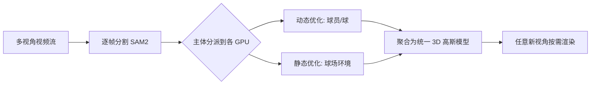

## 一句话总结

本文提出 LiveSplats，一个面向体育赛事的端到端流式框架：以多路多视角视频为输入，借助分布式并行处理和以人体骨架为先验的粗到细优化，用 3D Gaussian Splatting 逐帧重建动态三维场景，让观众能以交互帧率从任意新视角自由观看比赛。

## 研究背景

- 领域现状：现有体育赛事的远程观看仍以 2D 转播为主，最多允许在若干固定机位间切换（如早期的 EyeVision、Intel TrueView）；辐射场技术（Neural Radiance Fields 及 3D Gaussian Splatting）已能重建高保真三维场景并合成新视角，也出现了一批面向动态场景的流式重建方法（如 3DGStream、HiCoM、StreamRF、Dynamic-3DGS）。
- 核心痛点：一是速度——传统重建要慢到无法支撑实时直播；二是质量随时间退化——依赖刚性或无先验的增量式重建会累积误差、在剧烈运动中丢失细节；三是缺乏带真值标注、可复现评测的多视角体育数据集。
- 本文 idea：把"人为中心"这一场景特性用足。将整帧场景拆成"逐人物"与"环境"两类子任务分发到不同 GPU 并行处理；人物用易获取的骨架姿态作强几何先验做粗到细重建，环境假设几何静止、只优化视角相关外观，从而大幅压缩每帧计算并支持随算力线性扩展。

## 方法

整体框架：在时刻 $$t$$，系统把最近 $$N$$ 个未处理帧分派到 $$N$$ 个节点（借鉴两级 MapReduce 思路）；每帧先用现成分割模型（SAM2）生成各主体的多视角掩码，再把每个主体（球员、球、球场）分配给一块专用 GPU。每个节点按"动态优化"或"静态优化"逻辑重建该主体在 $$t$$ 时刻的 3D 高斯，最后把各节点结果聚合成统一模型，按需为客户端渲染任意视角。关键在于：帧 $$t$$ 的重建与其它帧完全独立，因而可跨帧多路并行，每帧时间约为 $$T_r/N$$，随节点数近似线性下降，直到匹配输入采样率（如每帧 33 ms）时达到实时。

关键设计：

1. 骨架驱动的高斯（动态主体的先验）。先用多视角 T-pose 图像训练一份 vanilla 3DGS，再拟合 SMPL 模型得到网格、骨架与线性混合蒙皮（LBS）权重；每个高斯绑定到最近网格顶点并继承其蒙皮权重。给定 T-pose 骨架 $$S_0$$ 和帧 $$t$$ 的姿态骨架 $$S_t$$，用蒙皮权重把高斯的位置与四元数从 T-pose 变换到当前姿态，其中位置变换写作 $$x_{i,t} = \sum_{j} w_{i,j}[q_{j,t} q^{*}_{j,0}(x_{i,0}-x_{j,0}) q_{j,0} q^{*}_{j,t} + x_{j,t}]$$ 。这套绑定是无学习的（有意保持简单、鲁棒），骨架姿态由 OpenPose 多视角 2D 关键点三角化得到。

2. 骨架优化（对抗噪声先验）。三角化骨架常因遮挡和分辨率受限而带噪，导致高斯错位。作者提出骨架优化：把所有高斯绑定到骨架，仅更新关节旋转（冻结不透明度、尺度、球谐 SH），通过光栅化渲染并对多视角真值图最小化 2D 光度损失来逐步校正 3D 骨架；为提速与稳健，优化的是世界坐标系下的全局关节旋转而非相对父关节的局部旋转，以简化计算图。

3. 外观精修（脱离骨架的自由优化）。骨架优化收敛后把高斯与骨架解耦，用光度损失自由优化其参数，以补充局部结构细节、适应光照变化。为防止高斯因掩码不完美而"漂移"到背景，对真值和光栅器都施加随机背景，惩罚移出人体范围的高斯。

4. 环境的静态优化与渲染提速。假设环境几何静止、只有视角相关外观（全局光照、阴影、反射）变化：先对空场训练 3DGS 三万次迭代冻结几何，后续每帧只优化 SH（静态背景约 200 次、动态前景约 500 次迭代）。由于几何冻结，深度排序结果可缓存复用（预计算），进而实现纯 CUDA graph 的执行流（记录为有向无环图重放，去掉 CPU 同步开销）。再引入负载均衡：把每个光栅 tile 的高斯按序切成若干子块，各子块由独立线程块处理以榨干 GPU 占用；因只优化 SH，透射率可在首帧预计算，子块间无需同步即可做 alpha 混合，像素颜色写作 $$I(p) = \sum_{j} T^{i}_{j}(p) \sum_{g_k \in B^{i}_{j}} \prod_{m<k}(1-\alpha_m(p)) \alpha_k(p) C_k(p)$$ 。

## 实验结果

作者构建了合成数据集 BASKET-Multiview（Unreal Engine 5 生成，89 机位，含分割掩码/深度/法线/动画等多模态真值），并在其 Core 场景与真实数据集 CMU-Panoptic 上与在线训练的代表方法对比。评测指标含 PSNR、SSIM、LPIPS、掩码 PSNR（M-PSNR）、视频指标 VMAF，以及每帧训练秒数 SPF 和"单位时间质量"效率指标 VE（$$\text{VMAF}/\text{SPF}$$）、PE（$$\text{PSNR}/\text{SPF}$$）。下表为主实验（方法 × 指标，取均值）：

| 数据集 | 方法 | VMAF↑ | PSNR↑ | M-PSNR↑ | LPIPS↓ | SPF↓ | VE↑ |
|--------|------|-------|-------|---------|--------|------|-----|
| BASKET-Multiview | StreamRF | 36.30 | 26.82 | 13.45 | 0.198 | 48.6 | 0.75 |
| BASKET-Multiview | 3DGStream | 51.43 | 28.36 | 20.79 | 0.174 | 12.6 | 4.10 |
| BASKET-Multiview | D-3DGS | 65.41 | 28.75 | 23.20 | 0.149 | 74.3 | 0.88 |
| BASKET-Multiview | HiCoM | 54.69 | 28.08 | 19.03 | 0.157 | 6.1 | 8.89 |
| BASKET-Multiview | LiveSplats | 67.30 | 29.75 | 25.24 | 0.119 | 5.2 | 13.02 |
| CMU-Panoptic | StreamRF | 34.49 | 23.46 | 18.20 | 0.404 | 9.0 | 3.83 |
| CMU-Panoptic | 3DGStream | 46.00 | 25.68 | 21.37 | 0.338 | 5.0 | 9.20 |
| CMU-Panoptic | D-3DGS | 50.66 | 26.41 | 24.60 | 0.286 | 88.3 | 0.57 |
| CMU-Panoptic | HiCoM | 38.37 | 25.35 | 21.85 | 0.301 | 4.0 | 9.60 |
| CMU-Panoptic | LiveSplats | 57.33 | 26.53 | 26.55 | 0.274 | 4.7 | 12.20 |

LiveSplats 在两个数据集上都取得最佳的质量（VMAF、LPIPS、M-PSNR）并保持很低的每帧时间，效率指标 VE/PE 大幅领先；尤其在 CMU-Panoptic 这种掩码不完美、先验带噪的真实数据上仍稳居第一，体现出对噪声先验的鲁棒性。补充实验显示：不同机位距离下（近/中/远视角），中距视角优势最明显、远距下虽仍领先但骨架检测在极远处变得不可靠；在突发光照变化场景中 LiveSplats 的质量优势进一步拉大；静态场景优化实验表明其 ms/iter 和 SPF 明显低于基线且质量相当。

## 亮点与局限

- 亮点：
  - 把"人为中心 + 环境静止"这一领域假设转化为可并行、可线性扩展的系统设计，每帧时间约 $$T_r/N$$，为实时直播提供了工程可行路径。
  - 骨架优化让方法对 OpenPose/SMPL 等现成先验的噪声鲁棒，且是无学习的、简单可靠。
  - 静态环境侧的一系列工程优化（SH-only、深度排序预计算、CUDA graph、子块负载均衡）实打实地降低了每帧开销。
  - 贡献了带多模态真值、89 机位的合成体育数据集 BASKET-Multiview，填补了该方向的评测空白。
- 局限：
  - 运动类型有限，主要覆盖结构化体育与室内休闲场景，未验证摔跤、拳击等强身体接触的复杂交互。
  - 强依赖人体特有先验与骨架约束，尚未推广到一般物体骨架。
  - 假设环境几何静止，难以处理显著的环境动态变化。
  - 主评测建立在合成数据上，真实世界的复杂性覆盖不足，泛化性仍需更多真实数据验证。标题中的"实时"更接近"若算力足够可达交互帧率"的系统潜力，而非单机既成事实。

## 延伸思考

- 该框架把"逐主体重建"与"环境重建"解耦并分发的思路，与体育转播已有的多机位基础设施天然契合，落地时的瓶颈可能不在算法而在多路视频的传输、分割与姿态估计流水线（这些被有意排除在关键路径计时之外）。
- "无学习骨架绑定 + 骨架优化"路线牺牲了一部分可学习绑定方法的视觉平滑度，换来速度与鲁棒；若把可学习绑定做成轻量、可在线的形式，或能在不牺牲实时性的前提下进一步提质。
- 把高斯绑定从人体骨架推广到通用物体骨架/关节结构，是把该系统从"人为中心赛事"扩展到更一般动态场景的关键一步，也是与其它可驱动高斯 avatar 工作对接的方向。
