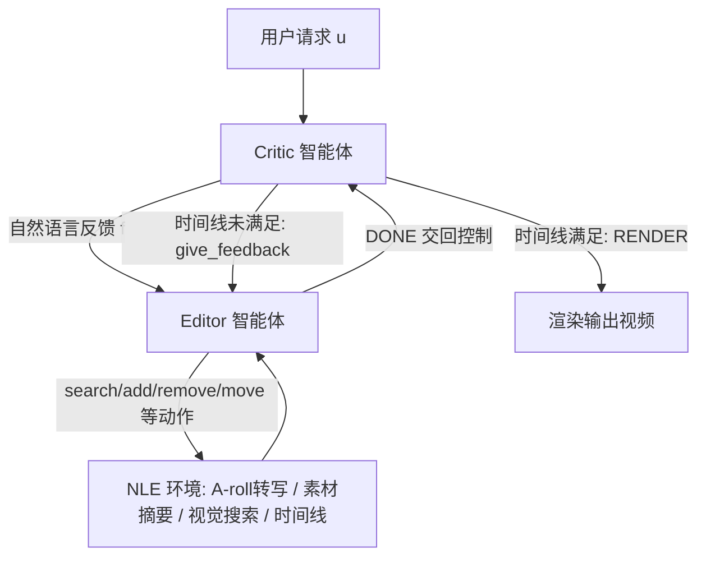

## 一句话总结

把视频非线性编辑（NLE）形式化为一个序列决策过程，用两个基于 LLM 的智能体——负责操作时间线的 Editor 与负责给出自然语言反馈的 Critic——相互协作、迭代打磨，从而在给定一段旁白 A-roll、一批海量原始素材和一句高层指令的情况下，自动剪出满足时长与内容要求的 B-roll 时间线。

## 研究背景

Premiere Pro、DaVinci Resolve 这类专业 NLE 软件功能强大但门槛高，普通创作者往往需要专门训练才能上手。理想的工作流是：用户只用一句朴素的英文指令（例如"做一段 30 秒、节奏舒缓的空镜"），系统就能自动理解、拆解、并调用编辑工具在素材库上执行。

以往的自动化视频编辑工作大多只解决其中一环：要么聚焦检索（把旁白转写对齐到候选片段），要么做交互式用户界面，真正的"剪辑"动作仍留给用户完成。本文要自动化的是编辑这一核心任务本身，并且面向真实世界的高拍摄比场景——纪录片、真人秀常常拍摄了成品百倍以上的素材（论文数据集里 1458 分钟素材要剪成 21.5 分钟成片）。

这带来三重挑战：一要理解素材库的内容、风格与剪辑手法（节奏、运镜、转场、剪法）；二要具备专业级的 NLE 工具操作能力；三要理解带有领域术语的自然语言指令。作者观察到单智能体方案难以同时跟踪多个跨步骤约束，容易产出不完整或受限的结果，因此转向专业化分工的多智能体迭代方案。

## 方法

整体框架把任务定义为：在一个 NLE 环境 $$\Omega(\mathcal{A}, \mathcal{V}, \tau)$$ 内，给定 A-roll、视频集合 $$\mathcal{V}$$ 和自然语言用户请求，让 Editor 与 Critic 两个智能体轮流行动、基于彼此反馈不断精修时间线 $$\tau$$，直到 Critic 认为满足请求并触发渲染。

关键设计一：NLE 环境与观测。素材库中每个视频先用 TW-FINCH 聚类切成子片段（短于 1 秒的丢弃），每段带有起止时间、内容描述（Llava-NeXt 生成字幕）、镜别（用 MovieShots 上训练的 MobileNet V3 分类，含特写到远景五类）与运镜类型（LSTM + SSD 特征分类）。整库再由 Llama3.1-70B-Instruct 概括成一段摘要。智能体不会一次看到全部素材，而是通过一个每次最多返回五条结果的搜索引擎探索素材，贴近人类使用搜索面板的方式。环境对外暴露四元观测 $$o = (o_{\mathcal{A}}, o_{\mathcal{V}}, o_{search}, \tau)$$，分别是 A-roll 转写、素材库摘要、搜索结果与当前时间线。

关键设计二：Editor 与 Critic 的分工。Editor 以 $$a^{\mathcal{E}}_i \sim \mathcal{E}(o_i, h^{\mathcal{E}}_{i-1}, f_j)$$ 逐步生成函数调用，可用工具包括 search_collection（返回与查询 CLIP 相似度最高的五个片段，是唯一直接接触像素的工具）、add_to_timeline、remove_from_timeline、switch_clip_positions、move_clip 以及 DONE（把控制权交回 Critic）。Critic 以 $$a^{\mathcal{C}}_j \sim \mathcal{C}(o^{\tau}_j, h^{\mathcal{C}}_j, u)$$ 只观察时间线与用户请求，输出两类动作之一：give_feedback（给 Editor 自然语言修改建议，开启新一轮）或 RENDER（认定成片可渲染）。两个智能体都用 Llama3.1-8B-Instruct 作骨干，并采用结构化生成以避免非法函数调用。

关键设计三：多智能体通信的上下文学习（ICL）。作者发现 Editor 常读不懂 Critic 反馈、Critic 又常给出无法执行的幻觉建议（如"换个角度重新拍一段"）。为此提出测试时自监督探索，自动生成合成示范作为 in-context 例子，全程不微调参数。分两阶段：第一阶段用 Editor Explorer / Labeler / Scorer / Self-Reflecting Editor 四个辅助智能体，探索出动作序列、反推出对应反馈、打分（1 到 5），得分 3 及以下丢弃、4 分交自反思智能体精修、仅 5 分留用，直到攒够五条 Editor 示范；第二阶段用 Critic Explorer / Labeler / Scorer 三个辅助智能体，从随机时间线出发跑完整交互、反推可能的用户请求并打分，同样只保留 5 分的五条 Critic 示范。

关键设计四：自动 NLE 评判器。因为剪辑没有唯一正解、人工评测昂贵，作者用 GPT-4o 作为 VLM 评判器 $$\mathcal{J}(\tau_1, \tau_2)$$：给它每个子片段中点的关键帧网格加时长，让它在两条时间线间做偏好选择，并据此定义 PreferenceRate。用户研究显示，评判器与人类多数票的一致率为 80.6%，接近人类之间的 78.7%，PABAK 为 0.61（人类间为 0.57），说明该自动评判可与人类评测相当可靠。

## 实验结果

数据集取自 EditStock 的五部纪录片（"The Scramble King""The Rock Climber""The Ovens of Cappoquin""Shores of this Bay""Built by Life"），人工为每段 B-roll 标注了描述风格与内容的高层指令。评价指标包括失败率、时间覆盖率（$$TC(d,\hat{d}) = \min(d,\hat{d})/\max(d,\hat{d})$$）、平均重复片段数，以及人类偏好率与自动偏好率。

| 方法 | 失败率 ↓ | 覆盖率 ↑ | 重复数 ↓ | 人类偏好 | 自动偏好 |
|---|---|---|---|---|---|
| T2V（基线） | 0.0% | 92.6% | 2.696 | 13.1% | 22.2% |
| VisProg（基线） | 34.8% | 44.8% | 0.783 | 16.1% | 18.5% |
| BAGEL（基线） | 14.3% | 73.5% | 0.214 | 18.2% | 11.5% |
| Editor Only（消融） | 23.8% | 68.5% | 0.217 | 14.3% | 22.2% |
| Editor Critic（消融） | 19.5% | 82.7% | 0.257 | 35.1% | 29.4% |
| EditDuet（本文） | 8.2% | 89.8% | 0.174 | N/A | N/A |

注：人类偏好与自动偏好列为各方法相对 EditDuet 的偏好占比，故本文自身为 N/A。EditDuet 在 LLM 类方法中失败率最低（8.2%），覆盖率接近理想（89.8%），重复片段最少（0.174）。T2V 覆盖率高但严重重复导致偏好率低；VisProg 因无法迭代精修而失败率高、覆盖率差；BAGEL 虽有探索阶段，但更关注如何用工具而非产出高质量剪辑，偏好率不高。消融显示多智能体协作与自监督探索缺一不可：去掉探索后失败率从 8.2% 升到 19.5%。

## 亮点与局限

亮点在于首次把视频 NLE 的核心剪辑动作本身自动化，并用 Editor-Critic 的专业化分工加迭代反馈来处理跨步骤的多约束；提出的自监督探索能自动生成高质量多智能体通信示范，免微调即可显著降低幻觉类失败；同时给出一个与人类偏好高度相关的 VLM 自动评判器，为难以标注真值的剪辑任务提供了可扩展的评价信号。

局限在于当前编辑环境的动作空间较窄，只支持搜索与增删移子片段，尚不支持转场、像素级编辑、音频编辑等真实剪辑中的关键操作；受限于开源 VLM 上下文长度，Critic 只能看时间线结构而非完整视频；最主要的残留失败仍是函数幻觉与不受支持的反馈。

## 延伸思考

这项工作把可控性放在了智能体的编排与反馈层面：底层用的是并不算大的 8B 开源模型，靠 Critic 的专业化反馈与 Editor 的逐步自纠来逼近专业剪辑质量，而非依赖单个超大模型一次成型。其中"探索—打分—自反思—只留满分示范"的合成数据管线，本质上是在没有真值的创作任务里自造监督信号，思路可迁移到更多开放式生成编排问题。顺着作者指出的方向，随着 VLM 上下文变长、能一次吞下大量视频，把 Critic 升级为真正的视觉评判者、扩展动作空间到转场与音频，甚至用这套自动评判器作为奖励做强化学习，都是让自动剪辑更接近人类水准的自然路径；而其上限仍取决于评判指标能否捕捉更细粒度的时序与叙事质量。
