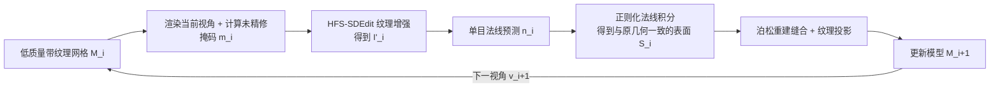

## 一句话总结

本文提出 Elevate3D，一个以"逐视角、纹理与几何交替精修"的框架，把容易获取的低质量 3D 模型提升为纹理精细、几何准确且二者对齐的高质量 3D 模型，其核心是解决 SDEdit 保真–质量矛盾的 HFS-SDEdit 纹理增强方法。

## 研究背景

- 领域现状：高质量 3D 资产在图形学与 3D 视觉中需求巨大，但采集成本高、数量稀缺；虽然已有大规模开源 3D 数据集，但其中高质量模型很少。把丰富的低质量模型精修成高质量模型（作者称之为 3D model refinement）是弥合供需缺口的自然思路。
- 核心痛点：
  - 传统方法（网格细分、去噪）只用简单几何先验平滑表面，做不出高质量细节，也不管纹理。
  - 近期基于生成先验的方法多为逐视角独立增强，导致跨视角不一致、纹理发糊；多视角扩散模型虽更一致，但受显存限制分辨率低。
  - 基于 SDEdit 的方法存在保真–质量矛盾：加噪多则质量高但偏离输入，加噪少则保真但增强有限。
  - 仅依赖图像先验会让几何欠约束，即便某些视角看着好，底层几何仍可能很差；把几何与纹理拆成两个独立优化阶段又常导致二者错位。
- 本文 idea：以逐视角迭代的方式交替精修纹理和几何——每个视角先增强纹理，再用增强后的纹理去驱动几何精修，从而保证纹理与几何天然对齐，并能同时用上大规模图像先验和单目几何预测先验。

## 方法

整体框架：给定一个低质量带纹理网格，Elevate3D 沿预定义相机路径 $$V=\{v_0,\dots,v_k\}$$ 逐视角迭代。第 $$i$$ 步在视角 $$v_i$$ 下，先对当前部分精修模型 $$M_i$$ 中"尚未精修且可见"的区域做纹理增强，再从增强后的纹理中提取几何线索精修网格，最后把精修纹理投影到更新后的网格上，得到进入下一视角的 $$M_{i+1}$$。这样既复用了强图像/几何先验带来高质量，又通过"沿用已精修区域"保证跨视角一致。

关键设计：

1. **HFS-SDEdit：用高频注入破解保真–质量矛盾。** 常规 SDEdit 通过给参考图加噪、再去噪来贴近高质量分布，但加噪多会破坏结构（低保真），加噪少又残留低质量域信息（弱增强）。作者的洞察是：图像的"域信息"主要藏在潜变量的低频分量里，高频分量只描述小尺度结构。因此 HFS-SDEdit 从大噪声起步（充分去除低质量域信息，让扩散模型自由生成高质量低频），但在早期若干去噪步里，把去噪结果 $$\hat z_t$$ 的高频分量替换为参考图 $$\tilde z_t$$ 的高频分量：$$z'_t=(\delta-G_\sigma)*\tilde z_t + G_\sigma*\hat z_t$$，其中 $$G_\sigma$$ 为高斯核、$$\delta$$ 为狄拉克函数。高频注入既约束了细节，又引导模型合成与之匹配的低频，兼顾高质量与高保真；替换持续到时间步 $$t_{stop}$$ 便停止，以免把低质量的退化细节也复制过来。

2. **逐视角纹理精修与掩码融合。** 在视角 $$v_i$$ 渲染得到图像 $$I_i$$ 后，通过比较当前视角法线与此前视角观察方向的余弦相似度（阈值 $$\tau=0.5$$，约 $$60^\circ$$）构造二值掩码 $$m_i$$，标出"尚未精修"的像素。在扩散采样每一步用下采样掩码 $$\tilde m$$ 做融合 $$\hat z_t=\tilde m\odot z'_t+(1-\tilde m)\odot\tilde z_t$$，只精修未精修区域、保留已精修区域，保证跨视角一致。

3. **借精修纹理做几何精修。** 用单目法线预测模型从精修图 $$I'_i$$ 推断法线图 $$n_i$$。由于 $$n_i$$ 只依赖图像、不受已有几何约束，直接积分得到的表面会明显偏离原网格。作者提出正则化法线积分：在正交相机下最小化能量 $$E(z)$$，第一项约束表面切向量与预测法线正交（贴合预测法线），第二项用正则参数 $$\lambda$$ 约束估计深度 $$z(u,v)$$ 靠近从 $$M_i$$ 光栅化的深度 $$d(u,v)$$，从而在忠于精修纹理的同时不脱离原始几何。

4. **缝合与纹理投影。** 精修得到的局部几何 $$S_i$$ 通过泊松表面重建与网格未变动部分缝合成 $$\tilde M_i$$；正则化积分以粗网格深度为引导，使更新少有几何伪影。随后用免 UV 的投影映射把 $$I'_i$$ 贴到 $$\tilde M_i$$，交给下一视角迭代。

实现上纹理增强用开源大模型 FLUX（rectified flow-matching），总去噪步 $$T=30$$，初始加噪步 $$t_s=29$$、频率交换阈值 $$t_{stop}=18$$、高斯滤波 $$\sigma=4$$、深度正则 $$\lambda=0.008$$，相机调度采用类似 Text2Tex 的自动选视角策略（优先覆盖最大未精修区域）。

## 实验结果

在 GSO 真实扫描数据集上构建 59 个物体的测试集，通过把面数降到 20% 并对纹理施加 $$\sigma=8$$ 的高斯低通滤波来制造低质量输入，然后与 DreamGaussian（仅精修纹理）、DiSR-NeRF、MagicBoost（后两者纹理几何都精修）比较。用无参考图像质量指标评估精修后模型的渲染图，Elevate3D 在全部指标上领先，耗时也优于多数竞品：

| 方法 | MUSIQ↑ | LIQE↑ | TOPIQ↑ | Q-Align↑ | 耗时↓ |
|------|--------|-------|--------|----------|-------|
| DreamGaussian（仅纹理） | 61.667 | 2.1185 | 0.4690 | 2.7416 | 1 min |
| DiSR-NeRF | 48.940 | 1.2869 | 0.3879 | 2.6794 | 6 hrs |
| MagicBoost | 51.646 | 2.1085 | 0.3915 | 2.4992 | 20 min |
| Elevate3D（本文） | 66.527 | 2.7744 | 0.5295 | 3.2151 | 25 min |

在 2D 图像精修（LSDIR 验证集，8 倍下采样再上采样制造低质量）上，HFS-SDEdit 与不同强度的 SDEdit、NC-SDEdit 对比：在无参考质量指标（MUSIQ 39.519、Q-Align 3.337、LIQE 2.105、TOPIQ 0.283）上全面最佳，LPIPS（0.598）也最优，说明兼顾感知相似度；因为是生成式精修，PSNR/SSIM 不如低强度 SDEdit，这是生成式方法追求"合理精修而非逐像素保真"的常见现象。频率交换实验进一步验证：替换低频会把生成路径拉向低质量域、难出高频细节；只换高频则不论参考图质量都能生成丰富纹理——证实域信息位于低频而非高频。消融显示，缺几何精修则几何仍粗糙、缺纹理精修则几何几乎无改善，二者兼备才得到互相一致的高质量结果；正则化法线积分对避免几何畸变也不可或缺。此外把 Elevate3D 接在 TRELLIS 等图/文生 3D 方法之后，可进一步提升其对训练域外输入的生成质量。

## 亮点与局限

- 亮点：
  - HFS-SDEdit 从"域信息藏在低频"这一洞察出发，用高频注入巧妙化解 SDEdit 的保真–质量矛盾，且训练无关、可直接嵌入现有扩散管线。
  - 逐视角"纹理→几何"交替精修，使几何由精修纹理驱动，从根本上保证纹理–几何对齐，并靠沿用已精修区域获得跨视角一致性。
  - 同时用上大规模图像先验与单目法线先验，几何精修不再欠约束；正则化法线积分让新几何忠于纹理又不脱离原网格。
  - 适用面广：既能修真实扫描的退化模型，也能作为后处理提升 SoTA 生成模型的输出。
- 局限：
  - 原型实现未优化，单个模型约 25 分钟，慢于仅修纹理的 DreamGaussian（相比之下与 MagicBoost 相当、远快于 DiSR-NeRF）。
  - 作为生成式精修，逐像素保真指标（PSNR/SSIM）并非最优。
  - 依赖单目法线预测器与泊松重建等外部组件的质量；深度不连续处需过滤不可靠深度值（会留下接缝，靠后处理弥补）。
  - 若干关键超参（$$\sigma$$、$$t_{stop}$$ 等）靠定性挑选，泛化性有待更系统的验证。

## 延伸思考

- HFS-SDEdit 的"频段分解 + 选择性注入"思路并不局限于 3D 精修，理论上可迁移到图像/视频超分、编辑等需要平衡保真与生成质量的任务；与 NC-SDEdit（保低频）恰好互补，值得思考不同任务下该保留/替换哪一频段。
- 逐视角交替精修本质上是"用 2D 强先验驱动 3D 更新"的范式，和 Text2Tex、TEXTure 等纹理生成方法一脉相承；把几何也纳入这一循环是它相对纹理化方法的关键推进。
- 值得追问：能否把逐视角的串行流程并行化或蒸馏以缩短耗时；正则化法线积分与近期可微渲染、SDF 表面重建的结合是否能进一步减少接缝与拓扑约束问题；以及在更极端退化（严重缺面、拓扑破损）下方法的鲁棒边界在哪里。
