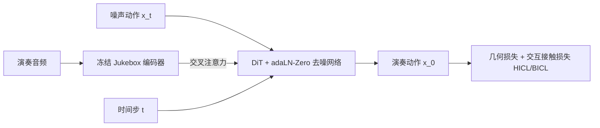

## 一句话总结

ELGAR 是一个基于扩散模型的框架，只用音频作为输入就能生成大提琴演奏的全身精细动作，包含左手按弦与右手运弓这类演奏者与乐器之间的复杂交互。

## 研究背景

- 领域现状：跨模态动作生成（文本/语音/音乐驱动）近年借助扩散模型进展很快，也出现了针对人-物、人-人交互的动作合成工作；但乐器演奏动作生成大多只建模躯干或手部的局部动作。
- 核心痛点：已有乐器演奏动作生成分两条路线——监督学习只关注身体动作、忽略与乐器的细腻交互；强化学习虽能满足物理约束，却依赖符号化输入（乐谱/MIDI）和物理仿真环境，且只能生成局部（手部）动作。真正端到端、从原始音频驱动的全身演奏动作生成尚属空白。此外，弦乐这类连续（非离散）音高乐器要求手、弓、弦之间高度协调，评价指标也不能只用通用动作质量指标。
- 本文 idea：以大提琴为代表，提出首个"音频到全身演奏动作"的扩散框架。用音频而非符号谱作输入，因为音频表达力更丰富、获取更容易；并引入针对手与弓的交互接触损失，把发声物理与领域知识注入生成过程，同时设计弦乐专用评价指标。

## 方法

整体框架：给定演奏音频，先用冻结的 Jukebox 音频编码器提取特征，再用带 adaLN-Zero 的 DiT（扩散 Transformer）去噪模块，通过交叉注意力把音频特征注入去噪过程，从纯噪声 $$x_t$$ 逐步还原出演奏动作 $$x_0$$。训练时额外施加几何损失与交互接触损失来保证动作的物理合理性与交互真实性。

关键设计：

1. **数据规范化与运动表示（SPD-GEN）**：原始动捕数据集 SPD 里演奏者身高、性别以及大提琴形状/摆位各不相同，直接用会导致解空间过大。作者把所有片段归一化成"同一人用同一把琴演奏"：对大提琴用 Kabsch 算法求最优旋转对齐到共享琴身，并复原了拱形琴桥（相比 SPD 里的平桥更贴近真实大提琴，避免拉中间两根弦时误触相邻弦的穿模）；对人体用基于 VPoser 的两阶段逆运动学拟合到 SMPL-X 平均体型，优先保证手腕拟合精度。最终得到约 7000 秒动作数据，用 6D 旋转表示，动作向量 $$x=\{r,\hat{v}\}\in\mathbb{R}^{309}$$，其中身体 21 关节、每只手 15 关节共 $$306=(21+15+15)\cdot 6$$ 维旋转，加上弓方向单位向量 $$\hat{v}\in\mathbb{R}^3$$。弓的起点（弓根/frog）锚定在左手中指、无名指与拇指之间，配合固定弓长即可推出弓尖位置。

2. **音频条件与扩散主干**：扩散前向过程按马尔可夫链逐步加噪，$$q(x_t\vert x_0)=\sqrt{\bar{\alpha}_t}\,x_0+\epsilon\sqrt{1-\bar{\alpha}_t}$$。条件注入上作者比较了 Classifier Guidance 与 Classifier-Free Guidance，认为音频不像空间约束那样有显式结构、难以训练分类器，最终选用 CFG：训练时以 10% 概率丢弃条件 $$c=\varnothing$$ 同时训练无条件模型，采样时按权重 $$w$$ 做条件与无条件输出的线性组合。去噪网络直接预测干净动作，用简单 MSE 损失 $$L_{simple}=\mathbb{E}[\lVert f_\theta(x_t,t,c)-x_0\rVert]$$。主干采用 DiT 的 adaLN-Zero 块，相比 EDGE 用的 FiLM/adaLN 块，它在残差连接前回归逐维缩放参数，条件建模更强。

3. **交互接触损失 ICL（核心贡献）**：这是让动作"真的在演奏"而非悬空比划的关键，分两部分。手部接触损失 HICL：左手按弦决定音高，规定按音指要贴住弦（空弦除外）、其余手指保持自然手型但不误触按弦点；据音频提取出理论接触位置，约束按音指到接触点的距离 $$L_{hand}=\mathbb{1}_{note}\lVert\hat{d}_{cp}\odot I_{f_0}\rVert_2^2+\mathbb{1}_{others}\lVert(\hat{d}_{cp}-d_{cp})\odot I_{f_0}\rVert_2^2$$，其中指示函数 $$I(\cdot)$$ 在检测到基频 $$f_0$$ 时才激活损失。弓部接触损失 BICL：弓虽不像手那样有显式位置，但"激活弦"可作为强约束，要求弓接触到发声弦并让弓两端与弦保持合理距离关系 $$L_{bow}=\lVert\hat{d}_{ls,lb}\odot I_{f_0}\rVert_2^2+\lVert(\hat{d}_{p,ls}-d_{p,ls})\odot I_{f_0}\rVert_2^2$$。

4. **几何损失与长序列采样**：另加位置损失、脚部接触损失、旋转速度损失和位置速度损失做物理正则，其中位置速度损失 $$L_{posvel}=\frac{1}{N-1}\sum_{i=1}^{N-1}\lVert\Delta FK(x_0)_i-\Delta FK(\hat{x}_0)_i\rVert_2^2$$ 用前向运动学后的逐帧位置差保证时序连贯。训练时切成 5 秒片段（不足的用末帧填充），生成长序列时借用动作补间的免训练可编辑性做长采样，并让相邻片段重叠 4 秒后线性加权融合以增强一致性。

## 实验结果

模型用 8 个 DiT 块、约 55M 参数、隐层维度 512，在单张 NVIDIA H800 上训练 90000 步；扩散 1000 步、DDIM 50 步采样、余弦加噪调度。作者认为 FID 不适合本任务（引入音频约束会天然拉开与数据集分布的差异，且 SPD-GEN 规模偏小、测试集难以代表训练分布），转而设计弦乐专用指标：手指-接触距离（FCD）、弓-弦距离（BSD）、运弓 F1 分数（BF1，容差 3 帧约 0.1 秒），以及运弓余弦相似度（BCS，衡量弓相对弦的相对位置随时间的相似度）。

主实验是围绕 HICL/BICL 的消融，验证两个交互接触损失的必要性：

| 损失配置 | FCD↓（mm） | BSD↓（mm） | BF1↑ | BCS↑ |
|------|--------|--------|--------|--------|
| 不加 ICL | 18.64 | 25.20 | 0.4332 | 0.6965 |
| 仅加 HICL | 14.56 | 23.98 | 0.4082 | 0.6646 |
| 同时加 HICL 与 BICL | 15.60 | **5.40** | **0.4721** | **0.7515** |

可以看到：HICL 主要改善与左手按弦相关的手指-接触距离（FCD 从 18.64 降到 14.56）；在此基础上加入 BICL 后，弓-弦距离骤降到 5.40 mm、运弓 F1 与余弦相似度也升到最高，说明两个损失分别管住了手与弓的交互，二者协同才能同时保证左手按弦与右手运弓都贴合实际演奏。定性对比中，加入 ICL 前弓和左手相对琴弦有明显不真实的位置偏差，加入后交互明显更准确合理。

## 亮点与局限

- 亮点：
  - 首个仅凭音频驱动、端到端生成乐器演奏"全身"精细动作的方案，同时刻画手部细节与手-弓-弦交互，填补了 audio-to-perform 的空白。
  - HICL/BICL 把发声物理与演奏领域知识转化为可微的接触约束，显著提升交互真实性，思路对其他精细人-物交互任务有借鉴意义。
  - 针对弦乐设计了 FCD/BSD/运弓 F1 等专用指标，弥补了通用动作指标（如 FID）在此类任务上的不足，并贡献了可作为基准的 SPD-GEN 数据集。
- 局限：
  - 长序列上下文感知有限，持续乐段中偶有不自然的换弓；即便有 BICL 约束，弓仍会偶尔脱离琴弦。
  - 把手指-弦压力简化为"按/不按"二值状态，更细的力度建模需要力传感器等额外模态；且假设大提琴静止，忽略了真实演奏中乐器的自然晃动。
  - SPD-GEN 规模仍偏小，尤其缺乏同一乐曲的多样演奏风格，限制了风格化表达；生成动作重定向到虚拟角色时，现有交互重定向方法难以保留这种精细交互。

## 延伸思考

- 论文把"用旋转还是用关节位置作动作表示"留成了开放问题：旋转便于动画集成，但直接预测关节位置对接触约束更直接，二者的更好结合值得探索——这对所有接触密集型交互生成都有共性价值。
- 交互接触损失的范式（从信号中提取理论接触点 + 指示函数门控 + 距离约束）不局限于大提琴，可迁移到吉他、二胡等连续音高弦乐，甚至更广的手-物精细操作。
- 作者点出的重定向难题很实际：这类富交互动作给动作重定向研究提出了新的、有挑战性的场景，若能在重定向后保住手与乐器的接触细节，将大幅降低动画制作成本。
