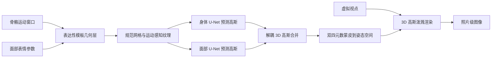

## 一句话总结

EVA 从多视角视频中重建出针对特定演员的全身可驱动数字人：用一层"可变形的表达性模板几何"作为几何代理，再叠一层"身体与面部解耦的 3D 高斯外观"，实现对身体、手部、面部的独立控制，并在实时帧率下渲染出高保真图像。

## 研究背景

- 领域现状：结合神经渲染与运动捕捉的照片级数字人建模已取得长足进展，出现了大量基于模板 + NeRF 或 3D 高斯的可驱动人体方法（如 DDC、ASH），也有把高斯挂到 SMPL-X 这类表达性参数模型上的工作（如 ExAvatar、DEGAS）。
- 核心痛点：现有方法要么只提供身体级别的控制、无法精确捕捉身体动态，要么面部表情与身体运动的表示是纠缠在一起的，导致无法对面部、手部、身体做完整、忠实且独立的控制。挂在 SMPL-X 上的方法又难以刻画宽松衣物的动态。此外，依赖面部图像编码器（DEGAS）驱动表情，灵活性受限。
- 本文 idea：把数字人拆成两层——一层"表达性可变形模板几何"作为更强的几何代理（既有衣物形变动态、又有面部表情控制），另一层"解耦的 3D 高斯外观"用两个独立模块分别建模身体与面部外观，从而把身体运动相关和表情相关的外观效应分离开，支持独立驱动，并保持实时渲染。

## 方法

整体框架：给定一个虚拟视点、一段骨骼运动窗口和对应的面部表情参数窗口，EVA 先由"表达性模板几何层"$$\Phi_{mesh}$$ 生成一具可被姿态与表情共同驱动的全身网格，再由"解耦 3D 高斯外观层"$$\Phi_{app}$$ 在模板的 UV 纹理空间中分别为身体和面部预测高斯参数，最后经双四元数蒙皮从规范空间变形到姿态空间并做高斯泼溅，得到照片级图像。训练依赖演员在受控影棚中的稠密多视角视频（约 100 台全身相机 + 约 20 台面部特写相机）。

关键设计：

1. 表达性可变形模板（几何层）。以扫描得到的绑定蒙皮模板网格为基础，采用 DDC 的基于图神经网络的形变模型来捕捉与运动相关的非刚性形变（如衣物褶皱），并保留手部关节控制。这一层解决了参数化模型难以刻画宽松衣物动态的问题。模板通过输入一段骨骼姿态的时间窗口，隐式地编码了速度、加速度等运动动态。

2. 个性化头部化身。基于 FLAME 头部模型并额外引入逐顶点位移 $$D$$（补足头发等 FLAME 形状参数覆盖不到的细节），用一套由粗到细的梯度下降拟合到全身扫描的头部区域，分三步：先做全局平移与旋转的粗对齐，再用"冻结并精修"策略配合掩码 Chamfer 损失拟合形状参数，最后拟合逐顶点位移。关键是头部直接从全身采集中学习、不需要专门的面部装置和单独的头部采集，采集时间约减半。

3. 运动优化与表情跟踪。作者发现无标记动捕常有头部姿态不准、整体身体姿态不精确的问题，会拖累后续表情跟踪和外观训练。于是选取面部清晰可见的相机视角，用 Mediapipe 与 FAN 预测二维面部关键点，通过最小化双向 Chamfer 损失、二维关键点损失和时序平滑的全变差损失来精修骨骼姿态，随后再从多视角图像中单独恢复面部表情参数（下颌、表情、眼睑），其中用 Mediapipe 关键点专门跟踪眼睑以捕捉眨眼。

4. 解耦的可动画高斯外观。把外观建模成 UV 纹理空间中的 3D 高斯，遵循 ASH 把学习过程当成图像到图像的翻译任务。核心是用两套独立的 U-Net 分别为身体和面部预测几何参数（位置偏移、尺度、旋转、不透明度）和外观参数（球谐系数）。身体高斯由归一化的身体运动驱动，面部高斯由表情参数驱动，并额外引入头部全局旋转平移窗口和一个全局位置隐变量来补偿影棚内的光照变化。这种显式解耦避免了网络学到"面部表情与身体运动"的错误相关，实现二者互不干扰的独立控制。训练上采用预热阶段学习伪真值高斯、按姿态多样性采样帧、图像裁剪块训练、随机背景色，并加入 IDMRF 损失和位置正则以提升渲染质量。

## 实验结果

数据集为受控多相机影棚采集：100 台全身相机 + 20 台面部特写相机，4K、25 fps，含约 27,000 训练帧与 8,000 测试帧，覆盖宽松/紧身衣物与丰富面部表情。评测指标为在 2K 分辨率、四个未见视角上计算的 PSNR、LPIPS、SSIM。对比对象是同样只靠运动参数驱动的两个实时人体渲染方法 DDC 与 ASH（并发工作 DEGAS 无公开代码，且需推理时输入面部图像，无法公平比较）。

主实验（四个演员上的平均，LPIPS 与 SSIM 数值按原文标度，SSIM 为百分制写法）：

| 方法 | 新姿态/表情 LPIPS ↓ | 新姿态/表情 PSNR ↑ | 新姿态/表情 SSIM ↑ | 新视角 LPIPS ↓ | 新视角 PSNR ↑ | 新视角 SSIM ↑ |
|------|------|------|------|------|------|------|
| ASH | 22.15 | 45.78 | 98.75 | 19.30 | 46.31 | 99.09 |
| DDC | 20.70 | 45.36 | 98.62 | 18.14 | 46.87 | 99.05 |
| EVA | 15.55 | 46.00 | 98.79 | 12.55 | 46.39 | 99.22 |

EVA 在两种设定下的绝大多数指标上都优于 ASH 和 DDC，尤其在感知指标 LPIPS 上优势明显；唯一例外是新视角下 DDC 的 PSNR 略高（作者归因于 DDC 在全部帧而非采样帧上训练）。定性上，ASH 只能从身体姿态推断表情、常给出错误面孔，DDC 因缺少高斯、依赖动态纹理而结果偏模糊，二者都因未显式建模表情而产生模糊与伪影。

消融实验（三个演员）验证了各设计的作用：去掉 IDMRF 损失后感知质量明显下降；去掉 DDC 形变则无法重建宽松衣物；去掉解耦或额外引入身体特征驱动头部，都会让网络学到表情与身体运动的错误相关而变差；去掉表情输入则无法准确重建面部外观。完整 EVA 在所有消融变体中表现最好。

运行时方面，外观层约 35 fps、几何层约 41 fps，配合两块 A40 GPU 可以在一帧延迟下实时渲染 2K 图像。

## 亮点与局限

- 亮点：
  - 把"可变形模板几何"与"身体/面部解耦的高斯外观"两层组合，同时拿到宽松衣物动态与独立可控的面部表情，补齐了此前方法二选一的短板。
  - 面部直接由表情参数驱动（而非依赖面部图像编码器），支持音频等多模态驱动信号，灵活性更好。
  - 头部直接从全身采集中学习、无需专用面部装置和单独采集，采集时间约减半，工程上更实用；且能实时渲染。
  - 显式解耦身体与头部的高斯预测，避免网络学到错误相关，能"只改表情不动身体"或反之。

- 局限：
  - 基于网格的表示无法处理拓扑变化，宽松服装的建模仍有边界；作者建议未来探索可学习的服装层等分层表示。
  - 身体高斯数量固定，限制了多尺度渲染，可考虑分层高斯模型。
  - 头部与身体用各自独立的高斯纹理，颈部边界可能出现轻微视觉不一致。
  - 独立预测导致无法建模跨区域的光照/阴影（如手在脸上的投影）；光照以隐变量表示，受训练影棚光照约束。
  - 方法是针对特定演员训练的，且依赖上百台相机的稠密影棚采集，泛化到任意新人物和轻量采集尚需进一步工作。

## 延伸思考

EVA 的核心思路是"用更强的几何代理 + 显式解耦的外观"来换取可控性，这与近期把 3D 高斯泼溅挂在参数化人体模型上的路线形成对比：它更看重衣物动态与面部表情的分别保真，代价是重度的多视角采集和特定演员训练。值得追问的点包括：解耦思路能否扩展到更多语义部件（如各件服装、鞋、配饰）以支持编辑；隐变量光照能否替换成基于物理的渲染以支持重光照，从而摆脱对采集影棚光照的依赖；以及在相机数量大幅减少或转向单目输入时，模板跟踪与表情恢复的鲁棒性会如何退化。对于关注遥现、虚拟制作与 XR 社交的研究者，EVA 提供了一个把"表情级表达性"纳入全身实时化身的可参考框架。
