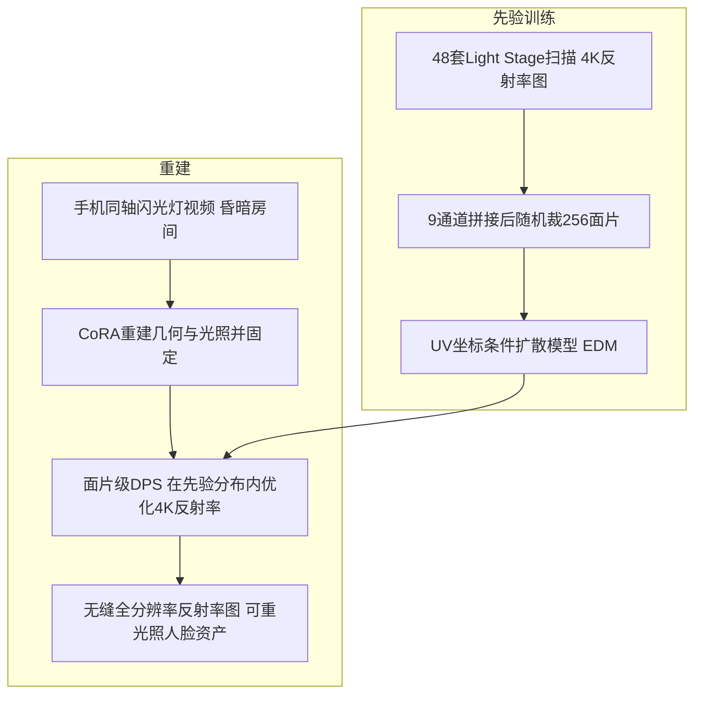

## 一句话总结

用一部手机在昏暗房间里拍一段"手机与闪光灯同轴（co-located）"的视频，借助在 Light Stage 高质量扫描数据上训练的"面片级反射率扩散先验"，把低成本采集重建出的人脸反射率贴图约束到影棚级数据分布中，从而在家就能拿到接近影棚质量的可重光照人脸资产。

## 研究背景

- 领域现状：人脸外观捕捉要从图像里估计漫反射反照率（diffuse albedo）、高光反照率（specular albedo）和法线等反射率信息。影棚方案用高清相机加偏振片做漫反射与高光分离，能做到量产级质量但成本高、只服务少数专业用户；近年出现的手机采集方案（如 CoRA）易用，但质量明显落后于影棚。
- 核心痛点：手机方案质量差有两个原因，一是手机相机成像质量远不如单反，二是没有偏振片来显式分离漫反射与高光，两者纠缠导致估计退化。已有工作要么加偏振片（牺牲易用性），要么用 PCA 之类表达能力有限的先验（无法重建痣等个体化细节）。
- 本文 idea：沿用 CoRA 的手机同轴闪光灯采集设置保持易用，转而用"数据驱动的高质量反射率先验"来增强漫反射与高光分离。具体做法是在 Light Stage 扫描数据上训练一个扩散模型，重建时把反射率贴图约束在这个先验建模的分布内。为解决 Light Stage 数据"超高分辨率但样本极少"的矛盾，先验在面片级（patch-level）训练，再配一套面片级后验采样技术拼出无缝的全分辨率贴图。

## 方法

### 整体框架

方法分两大阶段。第一阶段训练一个面片级反射率扩散先验：把 48 套 Light Stage 扫描的漫反射反照率、高光反照率、法线以及 UV 坐标图沿通道拼成 9 通道图，随机裁出大量 256×256 的面片来训练扩散模型，并用 UV 坐标图作为条件补回被裁掉的全局位置信息。第二阶段做先验引导的重建：先用 CoRA 重建几何与光照并固定，再用扩散后验采样（DPS）在先验分布内优化 4K 反射率贴图，使其渲染结果匹配拍摄图像；为绕开显存限制，提出面片级 DPS 把全图拆成重叠面片协同采样。

### 关键设计

1. 面片级先验加 UV 坐标条件。Light Stage 数据是 4K×4K 超高分辨率但只有几百套，直接训生成模型样本太少。作者改为从全图随机裁 256×256 面片来训练，把有效训练样本扩到上万个，同时把分辨率降下来便于训练。裁面片会丢失"这块贴图在脸上哪个位置"的全局信息，于是把 UV 坐标面片经位置编码后拼接进 UNet 去噪器作为条件。消融显示：不加 UV 条件时细节变差；而 UV 坐标图本身空间频率很低，直接拼接（w/o pos. enc.）效果差，必须经位置编码让条件更有区分度。采用 EDM 架构从头训练，去噪器输出 7 通道（漫反射 3、高光 1、法线 3）。

2. 用 DPS 做先验引导的反射率估计。几何与光照沿用 CoRA：光照拆成手机闪光灯点光源加二阶球谐环境光，几何用 ICT 拓扑三角网格（因为先验建在 ICT 的 UV 空间）。固定几何和光照后，用可微光栅化渲染器和 Disney BRDF 把反射率图渲成图像，目标是让扩散模型生成的反射率图 $$x_0$$ 最小化多视角光度损失 $$L_{pho}(x)=\sum_{i=1}^{V}\lVert R(x,i)-I_i\rVert_2^2$$ 。采样时在标准反向去噪一步后，再沿 $$-\zeta_t\cdot\nabla_{x_t}L_{pho}(\hat{x}_t)$$ 方向移动，把生成样本推向能解释拍摄图像的方向。粗糙度因缺乏先验而固定不优化。

3. 面片级 DPS 加 Tiled Diffusion 拼无缝全图。理论上 UNet 能吃任意分辨率，但直接在 4K 上跑 DPS 显存扛不住（80G A800 也只能到 1536×1536）。若简单地拆成不重叠面片各自采样，相邻面片会收敛到不同局部极小值而出现明显接缝（因为低成本设置下反射率求解是病态的）。方案是把全图拆成"重叠"面片：先切成 $$p\times p$$ 的不重叠面片，再沿边界外扩 $$p_{pad}$$ 像素得到重叠面片（实际面片尺寸 $$p^{+}=p+2\cdot p_{pad}$$ ）。每一步先对各重叠面片独立做 DPS，再借鉴 Tiled Diffusion 用掩码加权平均把重叠区融合回全图，交替进行即得无缝结果。实现上还有一个效率技巧：渲染只需知道像素到 UV 的对应，因此把 UV 坐标图先光栅化到屏幕（几何固定只需一次），再对每个面片在线求平移缩放的闭式解，避免把面片补零到全分辨率再渲染的浪费。

## 实验结果

数据用 iPhone X 在夜间拉窗帘的卧室拍摄，先验用 48 套 3D Scanstore 扫描训练（8 卡 48G L20 训 24 小时），重建在单张 24G RTX 4090 上跑（几何光照约 60 分钟，反射率估计约 8 小时）。主实验是与同类采集设置的最强方法 CoRA 在 8 位被试留出视角上的人脸重建对比，指标只在面部皮肤区域计算：

| 被试 | CoRA PSNR↑ | CoRA SSIM↑ | CoRA LPIPS↓ | 本文 PSNR↑ | 本文 SSIM↑ | 本文 LPIPS↓ |
|------|-----------|-----------|-------------|-----------|-----------|-------------|
| Caucasian M | 32.52 | 0.9763 | 0.0552 | 33.28 | 0.9696 | 0.0589 |
| Caucasian F | 31.47 | 0.9468 | 0.0683 | 32.09 | 0.9380 | 0.0659 |
| Asian M1 | 31.79 | 0.9541 | 0.0843 | 33.42 | 0.9439 | 0.0775 |
| Asian M4 | 36.65 | 0.9817 | 0.0464 | 36.88 | 0.9763 | 0.0423 |
| African M | 34.28 | 0.9434 | 0.0786 | 32.81 | 0.9315 | 0.0762 |
| 平均 | 33.22 | 0.9595 | 0.0653 | 33.59 | 0.9517 | 0.0631 |

值得注意：本文在更受约束的空间里估计反射率，重建的新视角 PSNR/LPIPS 与 CoRA 相当甚至略优，SSIM 略低，但重建出的反射率贴图（尤其高光反照率、法线）细节明显更丰富、重光照更真实——量化指标只能反映"能否解释输入图像"，反射率质量的优势更多体现在定性对比。此外与影棚 Light Stage 方案（Ghosh 等的 SoulShell 实现）相比仅有轻微质量差距，却大幅降低成本；与更易用的 HiFi3DFace、MoSAR 相比能保留痣等个体化细节，且只用 48 套扫描（MoSAR 用 800+ 套）。

消融（4 位被试均值）表明：去掉 UV 条件、去掉位置编码、去掉重叠拼接都会让指标下降或产生接缝；引导步长 $$\zeta'_t$$ 越大越贴合输入图像但质量下降，取 1 折中；固定实际面片尺寸 576 时，较大的 $$p$$ 配较小的 $$p_{pad}$$ 更快，但 $$p_{pad}$$ 太小会因重叠区不足而质量变差，最终选 $$p=448$$ 、 $$p_{pad}=64$$ 平衡速度与质量。

## 亮点与局限

- 亮点：
  - 首个用扩散模型在面片级联合建模高质量漫反射反照率、高光反照率、法线，并以 UV 坐标图为条件的反射率先验，用极少的扫描数据（48 套）训出强表达力先验。
  - 提出面片级 DPS，把 DPS 与 Tiled Diffusion 结合，在显存受限下从面片级先验采样出无缝 4K 全分辨率反射率图，是一套针对性很强的工程与算法设计。
  - 保持"一部手机、昏暗房间"的极简采集，把低成本方案的质量拉近到影棚水平，且能重建痣、甚至挤眼表情等训练集里没有的个体化特征（得益于多视角逆渲染降低了对先验的依赖，加上扩散模型能生成超出训练集的内容）。

- 局限：
  - 反射率估计约 8 小时，DPS 步数多加高分辨率导致耗时长。
  - 受数据驱动先验制约，训练集里没有的内容（如 3D Scanstore 男性都剃了胡须）重建质量差；换 DreamFace 数据训练能改善胡须但整体质量下降。
  - 粗糙度图因缺先验而固定不优化；采用局部着色模型，忽略全局光照与次表面散射；单手机多视角在不同时刻拍摄，被试轻微移动会带来错位（成年人尽量保持不动时较鲁棒）；法线会为补偿相机标定与几何误差而弯曲。

## 延伸思考

- 这篇是"用生成式先验做逆问题"路线在人脸反射率上的落地，思路上承 DPS 与 DPI（后者用扩散先验建模光照歧义，本文转而提升反射率质量），可以和把扩散先验用于少样本视图合成、内在分解的工作对照看：区别在于本文直接在数据样本上学先验以降低数据需求，而非为每种测量对训练条件模型。
- 面片级先验加 Tiled Diffusion 的无缝拼接范式，本质是"低分辨率生成模型 + 重叠融合"扩展到高分辨率逆问题，思路可迁移到其他 UV 空间的高分辨率贴图重建（如身体、物体 SVBRDF）。
- 作者指出的几个方向都很实在：用更快的后验采样（如 Rout 等）配粗到细策略压缩耗时、联合优化相机与几何以改善法线、用支持全局光照与次表面散射的可微渲染器、以及构建更多样（含胡须、含粗糙度图）的 Light Stage 数据集。代码将开源于 DoRA 仓库，值得关注其复现性与在更广人群上的泛化。
