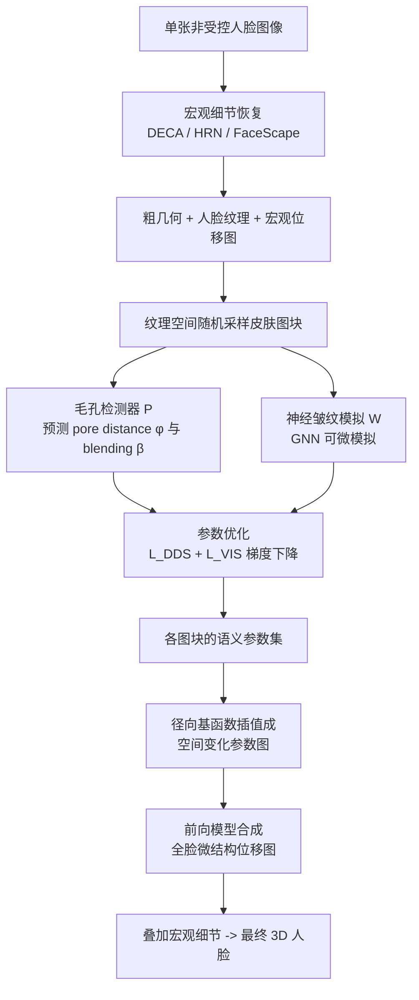

## 一句话总结

本文提出 FLEX 框架，从单张自然拍摄（非受控）的人脸图像中合成微观级别的皱纹与毛孔细节：核心是用图神经网络把皱纹-毛孔的图结构建模为可微的参数化微结构模型，再配合一个只关注方向特征的目标函数，从模糊的皮肤图块中优化出清晰的微结构位移图，平均约 2 秒完成，并能无缝叠加到 DECA、HRN、FaceScape 等宏观人脸重建方法上。

## 研究背景

- 领域现状：为游戏、虚拟现实、数字人创建富有细节的 3D 人脸是重要需求。现有方法在宏观（macro，整体脸型）乃至中观（meso，明显褶皱）尺度上从单图重建已相当成熟，但难以延伸到微观（micro）尺度的皱纹和毛孔，而这些细节恰恰是人脸真实感的关键。
- 核心痛点：从自然条件下拍摄的单张图像恢复微结构尤其困难。一方面皱纹与毛孔在微观层面复杂交织；另一方面输入图像往往模糊，皮肤上的微结构只呈现出朦胧的轮廓，导致"清晰的模拟结果"与"模糊的输入"之间难以直接对齐。
- 已有方案的局限：高保真几何采集方法（主动或被动光照）能重建带微结构的人脸，但依赖昂贵且专门的采集设备。Weiss 等人提出了参数化的面部微结构模型，能从清晰的近距离局部人脸图恢复微结构，但其模拟过程不可微，采用粒子群优化（PSO）求参数，单块皮肤耗时超过 140 秒；其后续工作用 StyleGAN 生成微皱纹图块，但属数据驱动，高度依赖训练数据与分辨率。
- 本文 idea：作者观察到皱纹与毛孔的连接遵循一种特殊模式，可以用图（graph）表示，从而提供强先验。关键在于构造一个"语义参数可控、且可微"的参数化微结构模型——把皱纹间的复杂相互作用交给图卷积来模拟，使得微结构参数能通过梯度下降优化，无需依赖不可微的概率迭代。

## 方法

### 整体框架

FLEX（Fine-Level facial detail EXtraction）把微结构恢复视作一个优化问题：对目标微结构 $$W'$$，通过最小化 $$\arg\min_{x}\ \mathcal{L}(W(x), W')$$ 求解语义参数 $$x=(\phi,\beta,\theta,\mu,\delta,\sigma,\tau,\rho)$$，其中 $$\phi,\beta$$ 是毛孔参数，其余为皱纹参数，$$W$$ 是可微参数化微结构模型，$$\mathcal{L}$$ 是目标函数。

整个流程分三步：先用现成方法恢复宏观细节，再对采样得到的皮肤图块逐块优化参数，最后把所有图块参数插值成全脸的微结构位移图。

### 关键设计

一、宏观细节恢复（可替换模块）。用任意现成方法（FaceScape、DECA、HRN 等）把输入人脸展开到纹理空间，恢复粗糙 3D 模型、人脸纹理和宏观位移图。这一步让 FLEX 具有通用兼容性。

二、毛孔检测器 P。毛孔参数相对好预测，直接由一个检测网络从皮肤图块 $$I'$$ 得到：$$(\phi,\beta)=\mathcal{P}(\mathcal{Y}(I'),\mathcal{H}(I'),\mathcal{T}(I'))$$，其中 $$\mathcal{Y}$$ 是灰度图、$$\mathcal{H}$$ 是高通滤波图、$$\mathcal{T}$$ 是二值化图。

三、神经皱纹模拟（Neural Wrinkle Simulation，方法核心）。沿用 Weiss 的图假设：毛孔是节点、皱纹是边。由预测的毛孔间距 $$\phi$$ 生成基础图 $$G_\phi$$（每个节点连接最近的六个邻居），再构造其对偶图 $$G_\phi^{w}$$（把皱纹作为节点，共享同一毛孔的两条皱纹相连），交给 GNN 做多次图卷积来模拟皱纹间相互影响。迭代更新规则为：

$$E_{w}^{(t)} = E_{w}^{(t-1)} + \mathcal{G}(E'_g + E'_i + E'_d + E'_s;\ G_\phi^{w})$$

$$E'_k = \Theta_k(E_k \cdot E_{w}^{(t)}),\quad k\in\{g,i,d,s\}$$

其中 $$\mathcal{G}$$ 是基于皱纹图的 GAT 图注意力卷积，四个隐向量（全局、交互、距离、强度隐向量）由语义参数以及皱纹方向 $$w_\theta$$、皱纹长度 $$w_l$$ 预编码得到。经 $$T$$ 次迭代（实践取 $$T=7$$）后，用一个 4 层 MLP 解码器 $$\Phi_w$$ 得到皱纹深度 $$D_w=\Phi_w(E_{w}^{(T)})$$，毛孔深度 $$D_p$$ 按邻接皱纹深度推出，最终位移图经可微渲染 $$I_x=\mathcal{F}(D_w, D_p;\ G_\phi)$$ 得到。这样就在皱纹参数与皱纹深度之间建立了可微的直接关系。

四、方向分布相似度（Direction Distribution Similarity, DDS）。模糊输入缺失细节，直接做像素级匹配容易陷入局部极小。作者观察到微皱纹的方向特征是影响皮肤外观的最重要因素，于是用一组 Gabor 滤波器度量图块在各方向上的强度：$$p(I;\theta)=\mathrm{Var}(f(\theta)\otimes I)$$，其中 $$f(\theta)$$ 是朝向 $$\theta$$ 的 Gabor 滤波器。归一化后 $$\int_{0}^{\pi} p(I;\theta)\,d\theta = 1$$ 得到方向分布 $$D_\theta(I)$$，再用 Jensen-Shannon 散度衡量模拟图块与真实皮肤图块的方向分布相似度：$$\mathcal{L}_{DDS}(I,I')\triangleq \mathcal{J}(D_\theta(I)\ \|\ D_\theta(I'))$$。

五、总目标函数。结合方向分布相似度与视觉相似度：$$\mathcal{L}(W(x),W')\triangleq \lambda_d\,\mathcal{L}_{DDS}(W(x),I') + \lambda_v\,\mathcal{L}_{VIS}(W(x),I')$$，其中 $$\mathcal{L}_{VIS}$$ 采用基于 VGG 特征均值与方差的风格损失，实现中取 $$\lambda_d=10$$、$$\lambda_v=0.001$$，优化 75 次迭代。

六、微结构合成。优化后得到纹理空间上离散的参数点，用径向基函数插值成空间变化的参数图，再用简化版 Weiss 前向模型合成全脸位移图。

实现上，毛孔检测网络在 5 万张合成皮肤图块（$$256^2$$）上训练、神经皱纹模拟网络在 5 万张微皱纹位移图（$$256^2$$、含 20 种图结构）上训练，训练损失均含 MSE 与 LPIPS，用 Adam、学习率 $$1e{-}4$$，在单张 RTX 3090 上分别训练约 5 小时和 18 小时。

## 实验结果

数据来自 Pexels 与 Zhu 等人开源库中微结构可见的人脸图。除 FLEX 外，还对比了两种基线：Uniform（毛孔间距用本方法预测、皱纹参数固定）与 Noise（von der Pahlen 等人常用于实时人脸的噪声模型）。

合成皮肤图块数据集上的定量评估（从验证集随机取 1000 块，LPIPS 衡量微结构外观相似度、MSE 衡量参数相似度）：

| 指标 | Uniform | Noise | DDS Only | VIS Only | Ours |
| --- | --- | --- | --- | --- | --- |
| LPIPS ↓ | 0.3984 | 0.6864 | 0.3073 | 0.4282 | 0.3019 |
| MSE ↓ | - | - | 0.0919 | 0.2603 | 0.0933 |

本方法在外观相似度（LPIPS）上最优，参数相似度（MSE）上排第二，仅略逊于 DDS Only。

用户研究（42 名参与者，每人至少评 22 组人脸图块，做 A/B 真实感二选一），并用 PageRank 进一步分析，结果如下（单元格数字表示左侧方法战胜上方方法的次数）：

| Winner \\ Loser | FLEX | Uniform | Noise | Total ↑ | PageRank ↓ |
| --- | --- | --- | --- | --- | --- |
| FLEX | 0 | 216 | 246 | 462 | 0.2304 |
| Uniform | 162 | 0 | 162 | 324 | 0.2472 |
| Noise | 90 | 48 | 0 | 138 | 0.5224 |

FLEX 获得最高胜场与最优 PageRank，其次是 Uniform。

性能方面：单块皮肤图块的参数恢复平均 2.35 秒完成，而 Weiss 等人的优化方法超过 140 秒，得益于可微微结构模拟，效率提升约 60 倍。

消融实验表明 DDS 与 VIS 缺一不可：只用 DDS 会导致皱纹深度强度不稳定，只用 VIS 会丢失方向特征、外观出问题，两者结合才能既保持方向一致又复现相似的微皱纹外观。定性上，FLEX 与 FaceScape、DECA、HRN 集成后均能提升细节真实感，并与 Alexander 等人的真实皮肤纹理对比验证了合成微结构的空间变化外观质量。

## 亮点与局限

亮点：
- 把不可微的概率迭代式微结构模拟替换为基于 GNN（GAT 图卷积）的可微模拟，首次让微结构语义参数可用梯度下降优化，相比前作提速约 60 倍（单块从 140 余秒降到约 2 秒）。
- 提出方向分布相似度（DDS），用 Gabor 滤波+Jensen-Shannon 散度专注方向特征，巧妙解决了"模糊输入 vs 清晰模拟"的对齐难题，避免陷入局部极小。
- 框架与宏观重建方法解耦，可即插即用地叠加在 DECA、HRN、FaceScape 之上增强真实感。

局限：
- 假设微结构仅由凹陷特征（微皱纹、毛孔）构成，无法表达鼻尖等区域由皮脂丝或脂肪堆积形成的凸起结构。
- 参数优化基于输入图像中可见的皮肤纹理，而感知到的微结构本身受光照与视角影响，无法保证跨不同光照场景的微结构一致性。
- 作者在伦理部分明确指出，高保真微结构合成若与宏观人脸合成技术结合，理论上存在被用于伪造的风险。

## 延伸思考

- 方法把"参数化图模型 + 图神经网络"结合的思路很有借鉴意义：当一个物理/经验模拟过程本身具有明确图结构但不可微时，用 GNN 学习其相互作用可作为一条通用的"可微化"路径，从而把生成问题转化为可优化的逆问题。这一范式或可迁移到织物、木纹、皮革等同样具有局部重复微结构的材质合成上（本文通讯作者团队长期从事织物与微观外观建模，思路一脉相承）。
- DDS 用方向分布而非逐像素匹配来对齐模糊与清晰图像，本质是"抓统计特征而非精确对应"，对所有"输入退化、目标清晰"的逆向优化任务（去模糊引导、低质量照片重建）都有启发。
- 现有局限指向两个自然的后续方向：一是引入凸起结构与更完整的微结构模型；二是把动态表情纳入考量，让微皱纹随面部拉伸/收缩动态变化，作者也将其列为未来工作。
