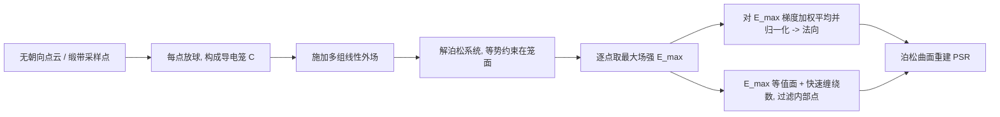

## 一句话总结

本文提出 FaCE，把无朝向点云（以及 VR 缎带草图采样点）当成一个屏蔽内部电场的法拉第笼，在多组外加线性电场下解泊松方程、取"最大场强"函数，再用其梯度估计每个点的法向，从而天然获得与缠绕数负梯度一致的朝向，显著改善相交结构与稀疏缎带草图的表面重建。

## 研究背景

- 领域现状：从无朝向点云重建曲面是经典问题。泊松曲面重建（PSR）及其屏蔽版把法向视作指示函数的梯度，是事实上的主力工具，但都需要先有一致朝向的法向。近年点云定向从"局部邻域拟合切平面 + 全局传播"转向全局计算，出现了 iPSR（反复迭代 PSR 与法向重估）、GCNO（在 Voronoi 极点上优化广义缠绕数）、BIM、WNNC（把法向对齐到缠绕数场梯度）等一批方法。
- 核心痛点：这些方法几乎都隐含"曲面互不相交且封闭"的假设，即缠绕数在全域只取 0 或 1。一旦输入含有相交部件（如玩具的腿穿进身体）、扫描配准误差造成的"重影"双层面、或 CAD 建模残留的内部结构，它们就会在相交处把法向翻向内侧，导致 PSR 出现凹陷（concavity）、麻点（pitting）与孔洞。VR 缎带草图更是典型：缎带本身就是相互穿插的开放条带，还常有笔画间的空隙。
- 本文 idea：借用法拉第笼的屏蔽直觉——导体笼会重新分布电荷，使笼内部几乎感受不到外场。把输入点建成导电笼，施加一系列外加线性电场，笼"内部"因被屏蔽而场强极小、"外部"场强大；对场强取方向上的最大值得到一个刻画"内部性"的标量函数，其梯度自然指向外侧，即所求法向。这种做法不依赖封闭/不相交假设，对内部结构与相交部件更鲁棒。

## 方法

整体框架：先在每个输入点上放一个球，这些球共同构成导电笼 $$C$$ ；在包围域 $$\Omega$$ 的外边界 $$\partial\Omega$$ 上依次施加若干线性外场，每个场景解一个带等势约束的泊松（调和）问题得到电位 $$u$$ ；对所有场景的场强 $$\|\nabla u\|$$ 逐点取最大得到 $$E_{max}$$ ；再对 $$\nabla E_{max}$$ 做加权平均、归一化，得到每个点的法向；最后用（屏蔽）泊松曲面重建出面，并可选地依据 $$E_{max}$$ 过滤内部点。

关键设计：

- 法拉第笼的泊松模型：理想法拉第笼在静电情形可建模为求一个调和电位 $$\Delta u = 0$$ ，并在导体笼面上满足等势约束。作者把它写成带线性约束的二次变分问题：最小化 $$\int_\Omega \|\nabla u\|^2$$ ，约束为笼面 $$u\vert _{\partial C}=u_C$$ （ $$u_C$$ 是未知的笼面统一电位）与外边界 $$u\vert _{\partial\Omega}=g$$ 。其中 $$g(\vec{x})=\vec{v}^T\vec{x}+b$$ 表示由方向 $$\vec{v}$$ 决定的线性外场（无屏蔽时全域场恒为 $$\vec{v}$$ ）。这也可类比为小挠度下弹性薄片在等势/狄利克雷约束下的平衡高度场。

- 离散化与快速求解：笼由输入点上的球近似，球半径取到最近邻距离的 45%，既随局部密度自适应又避免相交、增强屏蔽。域 $$\Omega\setminus C$$ 用 Triangle（二维）/ TetGen（三维）生成约束 Delaunay 网格，球用二十面体近似。用余切拉普拉斯 $$L$$ 表达狄利克雷能量，并把已知的外边界条件并入目标、把笼面电位聚成单一标量变量，从而把带约束的二次优化化简为一个无约束二次型，最终变成稀疏正定线性系统，用 CHOLMOD 的稀疏 Cholesky 分解一次分解、对多组外场反复回代求解，效率很高。

- 最大场强 $$E_{max}$$ 与法向：设第 $$i$$ 个线性外场（单位方向 $$\vec{v}_i$$ ）解出电位 $$u_i$$ ，若用户还指定了点电荷则汇成一个场景 $$u_{pts}$$ ，则 $$E_{max}(x)=\max\{\max_{i}\|\nabla u_i(x)\|,\ \|\nabla u_{pts}(x)\|\}$$ 。离散上先把逐单元梯度按面积/体积加权平均到顶点、取模、再对场景取最大，得到分片线性的 $$E_{max}$$ 。得益于屏蔽的全局性，即使只用线性外场，场强也能探入凹处与把手。法向则取 $$\nabla E_{max}$$ 在每个输入点周围笼顶点上的加权平均并归一化。作者用极少的方向即可：三维只从半个二十面体采样 6 个单位向量就够（继续加方向收益递减）。

- 缠绕数一致性：一个关键的经验观察是，FaCE 在相交部件上稳健地给出一致朝外的法向，其法向近似对齐真值缠绕数 $$w$$ 的负梯度 $$-\nabla w$$ ——被多层部件包围的区域屏蔽更强，梯度自然指向外。因为它不假设 $$w\in\{0,1\}$$ ，所以在两域相交区 $$A\cap B$$ 不会像其他方法那样把法向翻向内侧、挖出侵入式凹陷。

- 内部点过滤与雕刻工具：对含内部结构的输入，用 marching tetrahedra 抽取 $$E_{max}$$ 的 $$\alpha$$ 等值面，再用快速缠绕数以 0.9 阈值判定内外来剔除内部点（稠密输入取 $$\alpha=0.01$$ ，稀疏输入取 $$\alpha=0.05$$ ）。此外提供两种交互雕刻：加点电荷产生"减法"效果、锐化局部凹陷；加额外笼点产生"加法"效果、修补缎带间的空隙。

## 实验结果

评测覆盖四类输入：合成扫描得到的错配点云（14 例）、缎带草图（12 例及其稀疏化版本）、含内部结构的 CAD 三角汤（ModelNet 20 个 + Thingi10k 5 个）、以及从封闭流形均匀采样的"干净"输入（Xu 等 2023 的 18 例）。法向指标看对齐率（与真值点积为正的比例）、平均角误差、角误差标准差；重建指标看 Chamfer 与对称 Hausdorff 距离。对比方法包括 iPSR、GCNO、BIM、WNNC，以及缎带表面化的 SurfaceBrush。

下表为主实验之一：稀疏化缎带草图上的法向估计质量（方法 × 指标，越好的方向已标注；GCNO 有两例未收敛，按其余模型统计）。

| 方法 | 平均对齐率↑ | 平均角误差↓ | 角误差标准差↓ |
| --- | --- | --- | --- |
| 本文 FaCE | 98.47% | 15.35° | 18.42° |
| iPSR（2022） | 95.84% | 17.75° | 25.90° |
| BIM（2024） | 95.93% | 17.70° | 25.01° |
| WNNC（2024） | 94.01% | 21.96° | 31.94° |
| GCNO（2023） | 89.45% | 32.53° | 29.29° |

FaCE 在三项法向指标上全面领先。表面重建方面：在稀疏缎带上，FaCE 在 12 个模型里取得最低 Chamfer/Hausdorff 的次数最多（各 8 次、7 次），且远优于 SurfaceBrush（其平均 Hausdorff 约 0.032，而 FaCE 屏蔽 PSR 约 0.0055）。在错配扫描上，FaCE 取得最低 Hausdorff 的模型数最多（8 个），能过滤"重影"内部点、避免薄结构处的麻点与孔洞。在 CAD 三角汤上，FaCE 的屏蔽 PSR 平均 Chamfer 与 Hausdorff 均为各方法最优（约 0.000192 与 0.0085），有效消除内部空洞与表面波纹。在干净输入上各方法都很强（平均对齐率均超 99%），FaCE 的运行时间普遍优于 GCNO、BIM，也快于在噪声输入上收敛缓慢的 iPSR。计时分析显示其主要耗时在网格化与离散算子构建，而非线性求解。

## 亮点与局限

亮点：

- 把"法拉第笼屏蔽"这一物理直觉转成一个简单泊松系统，纯几何、无需训练数据，就得到对内部结构与相交部件鲁棒的法向定向。
- 揭示并利用了法向与缠绕数负梯度的一致性，从原理上解释了为何它在相交处不挖凹陷，这是相较 iPSR/GCNO/BIM/WNNC 的核心差异。
- 只需极少外场方向（三维 6 个）即可，稀疏正定系统一次分解多次回代，工程上高效；并附带点电荷/加笼点两种直观的交互雕刻能力。
- 面向 VR 缎带草图：能吃更稀疏的笔画输入、输出封闭水密网格，减轻艺术家绘制负担，优于专门的 SurfaceBrush。

局限：

- 对含封闭内腔的域（二维圆环、三维球壳）有根本困难：仅用线性场时会把内腔当作另一个域而翻转真值法向，需靠用户在腔内放点电荷修正。
- 开放/近乎平坦的薄结构重建仍受限，很大程度是 PSR 对无体积薄层的固有短板，与法向质量无关；采样过稀时薄丝状特征也会断裂或出现团块状伪影。
- 稀疏缎带（删去部分笔画）会残留轻微凹陷。
- 当前实现未优化，瓶颈在网格化（用 TetGen 求稳）；可换更新的四面体网格库或引入多重网格求解器以逼近实时雕刻。

## 延伸思考

- 方法把"内部性"压成单一标量 $$E_{max}$$ ，但每个点在所有外场场景下的场强分布其实含有更丰富的信息，作者也明确鼓励挖掘这一分布——例如用整条场强曲线而非其最大值来刻画结构层次、区分多层重影，可能进一步提升相交/嵌套场景的鲁棒性。
- 与缠绕数方法的关系值得深究：FaCE 相当于用一个物理场"软性地"逼近 $$-\nabla w$$ ，而 GCNO/WNNC 直接优化缠绕数。把两条路线结合（用 FaCE 的场提供良好初值或正则，再交给缠绕数优化收尾）也许能兼得鲁棒性与精度。
- 瓶颈在网格化而非求解，说明若改用无网格/多重网格（如 PSR 自身的多重网格框架）或 GPU 求解，法拉第笼雕刻有望做到交互甚至实时，这对 VR 缎带创作这类需要即时反馈的场景意义很大。
- 该框架本质是"用外场探测隐式几何"，与用行走球（Walk On Spheres）等蒙特卡洛方式解同类泊松/调和问题的思路相邻，是否能借助随机游走式求解摆脱网格依赖、并把点电荷雕刻做成局部增量更新，是一个自然的交叉方向。
