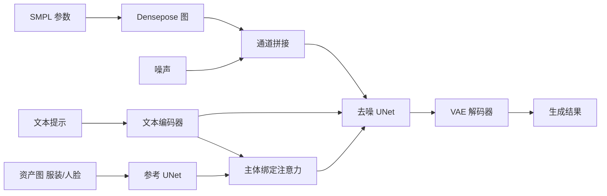

## 一句话总结

FashionComposer 把文本、参数化人体、服装图与人脸图统一当作"资产"，通过一个参考 UNet 加"主体绑定注意力"，在一次前向中合成可控、多服装、身份一致的时尚人像。

## 研究背景

在电商场景里，商家有大量在架服装图，需要模特展示上身效果。已有的虚拟试穿方法存在明显局限：通常只能试穿单件服装，无法一次穿整套；生成图的姿态往往被参考人像固定，body shape 和姿势缺乏多样性。多主体定制方法（如 Textual Inversion、DreamBooth、Cones、Emu2、Collage Diffusion、FastComposer）要么需要昂贵的逐样本微调，要么难以保持每个物体的精细保真度。

作者提出 FashionComposer，核心是"组合性"（compositionality），体现在两方面：一是多模态输入（文本描述、控制体型与姿态的参数化人体、服装图与可选人脸图）；二是多个视觉资产的组合，允许用户把想要的服装部件和人脸拖入一个"资产库"来定制生成。它在一个统一框架里同时支持可控模特图生成、虚拟试穿、多服装试穿、身份一致的人像相册等多种任务。

## 方法

### 整体框架

框架以 Stable Diffusion v1.5 为骨干，包含 VAE、去噪 UNet 和文本编码器。从 SMPL 投影得到的 densepose 图先与噪声在通道维拼接，输入去噪 UNet 执行去噪。参考 UNet 与去噪 UNet 结构相同，区别是把自注意力模块替换为主体绑定注意力，用于从"资产图"中提取外观特征并注入去噪过程。文本经 CLIP 文本编码器编码后，通过 cross-attention 注入两个 UNet。对不同任务，只需切换输入组合：常规试穿时把 4 通道的 cloth-agnostic 人像 latent 与 1 通道二值 mask 一并与噪声拼接（UNet 输入通道相应改为 9），替代 densepose 图。

### 关键设计

- **多模态数据构造**：原始数据集每张目标图只配单件在架服装图。作者用 Mask2Former 做人体解析，把没有对应在架图的服装 mask 出来作为组合部件，再把在架服装、抠出的服装与人脸随机无重叠地贴在白底上构成"资产组合"；用 Qwen-VL-Chat 为目标图生成描述，用 Qwen-14B-Chat 把描述里的短语按部件归类。最终得到 165k 样本的联合多模态数据集。

- **参考 UNet 做外观保真**：参考 UNet 与去噪 UNet 同构并以 SD v1.5 初始化，从其自注意力模块取出 key/value 令牌 $$k_{ref}, v_{ref} \in \mathbb{R}^{(h \times w) \times d}$$，与去噪 UNet 对应块的 key/value 拼接，去噪 UNet 的自注意力替换为 $$\text{softmax}(\frac{q_{den} \cdot [k_{den}, k_{ref}]^T}{\sqrt{d}}) \cdot [v_{den}, v_{ref}]$$。与原始做法不同，作者保留 cross-attention 的文本输入，使模型在保细节的同时仍能对齐文本。

- **主体绑定注意力（Subject-binding Attention）**：解决单个参考 UNet 无法区分多个参考图的问题。把所有参考元素（任意位置、大小、数量）放进一张资产图，用一个参考 UNet 提取特征；对每个资产部件，通过下采样定位其在特征图中对应的 key/value 令牌，再把该资产对应短语的文本嵌入经每个 UNet 块独有的 MLP 后与令牌相加：$$k'_j = \text{MLP}_l(P_i) + k_j$$，从而按语义把各资产特征映射到正确像素，支持任意数量与类型的参考图。

- **身份一致的相册生成**：提出 correspondence-aware attention（借助 SMPL 的 UV 坐标，仅当 $$(u,v)$$ 相同时才用第 1 张图的 key/value 替换第 2 到 N 张图对应令牌，保证服装保真）与 latent code alignment（先用 cross-frame attention 生成高一致性相册并保留最终去噪 latent，再用 densepose 提取人脸 mask，把人脸区域 latent 缝合进 correspondence-aware attention 的结果中），无需额外微调即可兼顾一致性与保真度。

## 实验结果

在多物体参考生成任务上与主流方法比较（前三行为单次前向多参考定制，后两行为基于预生成底图的两阶段 inpainting 流程）：

| Method | CLIP-I↑ | DINO↑ | CLIP-T↑ |
| --- | --- | --- | --- |
| Ours | 77.60 | 40.11 | 27.71 |
| Emu2 | 69.70 | 35.96 | 20.54 |
| Collage Diffusion | 67.80 | 34.16 | 22.14 |
| AnyDoor+ControlNet | 72.40 | 37.94 | 27.00 |
| Paint-by-example+ControlNet | 64.50 | 34.60 | 23.77 |

FashionComposer 在图像相似度与文本对齐两方面均优于所有对比方法。在 VITON-HD 标准试穿任务上，除 LPIPS 外全指标领先（SSIM 0.8771、paired FID 5.842、KID 0.906；unpaired FID 9.205、KID 1.3606）；warping-based 方法（GP-VTON、DCI-VTON）在 SSIM/LPIPS 有优势但在 KID/FID 上更弱，说明其偏重结构与感知相似而缺乏真实细节。消融显示参考 UNet 相比 DINOv2 嵌入与 ControlNet 保真度最佳，主体绑定注意力（Bind(1,2,3)）在 DINO 与用户研究的 Fidelity 上最优。

## 亮点与局限

亮点：把文本、参数化人体、服装、人脸统一为"资产"，用单个参考 UNet 加主体绑定注意力实现一次前向的多资产组合，避免为每个参考单独配 UNet 的计算开销；一个框架覆盖可控模特图、单/多件试穿、身份一致相册等多种应用；correspondence-aware attention 与 latent code alignment 无需微调即可生成高保真且一致的相册。

局限：骨干为较早的 SD v1.5，分辨率训练在 512×384，可能限制细节与画质上限；资产需摆放在无重叠的白底组合图上，对复杂遮挡或大量资产的实际交互成本原文未充分讨论；效果依赖 SMPL 与人体解析等一系列现成模型的准确性。

## 延伸思考

把异构条件统一抽象为"资产"并用注意力做语义绑定，是一种可扩展到更多可控生成场景（如场景合成、多物体编辑）的通用范式。若将骨干替换为更强的扩散或 DiT 架构，并把资产库交互做得更自动化（自动布局、自动去重叠），有望进一步提升保真度与易用性。correspondence-aware attention 借助 UV 对应做跨图令牌共享的思路，也可迁移到视频人物一致性与多视角生成等问题。
