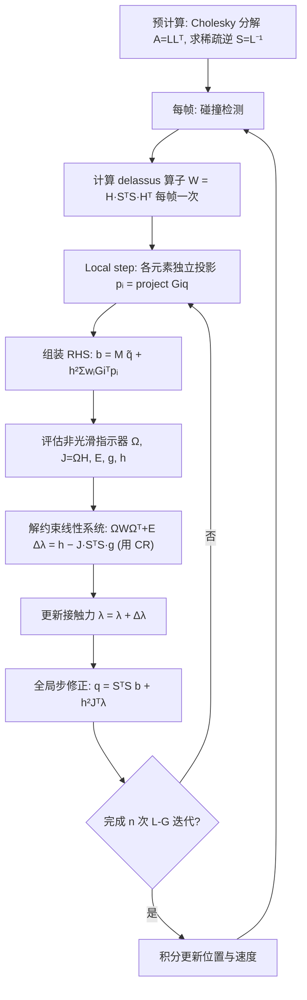

## 一句话总结

本文提出一个 GPU 友好的实时隐式弹性体仿真框架：一方面用"稀疏逆"技巧把 local-global 全局步从难以并行的三角求解改写成两次稀疏矩阵乘法，在保持完整解快速收敛的同时释放大规模并行；另一方面把非光滑 Newton 法（互补条件）无缝嵌入 local-global 迭代，并用"分离非光滑指示器"策略把 Schur 补的计算从"每次迭代一次"降到"每帧一次"，从而在实时约束下同时做到高精度超弹性形变与鲁棒的摩擦接触。

## 研究背景

- 领域现状：可变形体实时仿真里有两条主流路线。PBD/XPBD/VBD 等 PBD-like 方法简单鲁棒高效，但以 Gauss-Seidel 方式传播、收敛慢，且 PBD 不源于连续介质力学，精度受限。Projective Dynamics（PD）等 PD-like 的 local-global 方法把局部约束投影和全局耦合分开，靠一个可预分解的常量系统快速传播局部结果，收敛远快于 PBD-like。
- 核心痛点一（并行）：local-global 的全局步依赖预分解后的稀疏三角求解（STS），其前代/回代存在强数据依赖，很难在 GPU 上高效并行。已有的"不完整解"（如单次 Jacobi 迭代 + Chebyshev 加速）虽易并行，却牺牲了传播效率，收敛显著变慢，尤其在高刚度系统里几乎无法收敛。
- 核心痛点二（接触与摩擦）：把超弹性、非穿透接触、摩擦三者放进实时仿真，是一个又非线性又非光滑的难题。罚方法（含 IPC 的对数障碍）高效但难以严格非穿透与精确摩擦；Lagrange 乘子法鲁棒精确，但松弛类求解（如 PGS）难并行、收敛差。非光滑 Newton 法（把 Signorini-Coulomb 条件写成 NCP 函数做根查找）收敛快、精度高、与线性求解器解耦，但它天然与 impulse-based 积分绑定，不易融入 position-based 的 local-global 框架。
- 本文 idea：让 local-global 迭代被非线性互补条件约束，用稀疏逆解决全局步并行，用分离非光滑指示器解决接触求解的性能瓶颈，核心只依赖标准稀疏矩阵运算。

## 方法

整体框架分两大块。第一块是"稀疏逆 local-global"：注意到系统矩阵 $$A$$ 在整个仿真中保持不变，对其 Cholesky 因子 $$L$$ 求逆得到 $$S=L^{-1}$$，并用消元树的祖先结构保证 $$S$$ 高度稀疏，于是 $$A^{-1}=S^{T}S$$，全局步 $$q^{k+1}=S^{T}S b^{k}$$ 变成两次可高度并行的稀疏矩阵向量乘（SpMV）。第二块是把非光滑 Newton 法嵌入 local-global：在每次 local-global 迭代里评估冲量以还原内力，据此把接触力的 Lagrange 乘子约束加到全局步上，用 NCP 函数（Fischer-Burmeister）把 Signorini-Coulomb 条件转成根查找，做 Schur 补得到关于接触力增量的鞍点方程，再用 Conjugate Residual 求解。

关键设计：

1. **稀疏逆全局步（Sparse Inverse）**：直接存稠密的 $$A^{-1}$$ 内存爆炸（1 万顶点就要 3GB 以上），但 $$L^{-1}$$ 在做了嵌套剖分（nested dissection）降填充排序后非常稀疏。据 Theorem 1，$$L^{-1}$$ 的非零结构只由消元树中各节点及其祖先决定。于是显式计算并稀疏存储 $$S=L^{-1}$$，全局步变为
$$q^{k+1}=S^{T}S\,b^{k}$$
既保留完整解的快速收敛（少量迭代即可高精度），又只用 SpMV 这种易在 GPU 上并行的操作（cuSPARSE），是 fast 与 accurate 兼得的关键。代价是额外存储 $$S$$，但实验证明内存开销可控（多数 2 万顶点物体的 $$S$$ 低于 1GB）。

2. **受约束的全局步（Constrained Global Step）**：local-global 是 position-based，不显式算内力，难以直接接 Lagrange 乘子。作者在全局步内用冲量关系还原当前迭代的内力
$$f_{int}(q^{k+1})=h\Big(\sum_i w_i G_i^{T}p_i^{k}-\sum_i w_i G_i^{T}G_i q^{k+1}\Big)$$
从而把接触力项 $$h^2 H^{T}\lambda$$ 合法地加入全局步，等价地把 position-based 与 impulse-based 两种积分统一起来。

3. **非光滑 Newton 集成**：把互补条件 $$0\le a\perp b\ge0$$ 改写成 NCP 函数 $$\phi(a,b)=0$$（可选 minimum-map 或 Fischer-Burmeister）。对 NCP 做一阶 Taylor 展开、组装后经 Schur 补得到只关于接触力增量的鞍点方程
$$\big(JA^{-1}J^{T}+E\big)\Delta\lambda=\tfrac{1}{h^2}\big(JA^{-1}g-h\big)$$
该系统与线性求解器解耦，可选 Krylov 方法（本文用 Conjugate Residual）兼顾收敛与并行。

4. **分离非光滑指示器（Splitting Out Non-smooth Indicators）**：这是接触求解提速的核心。观察到非光滑 Jacobian 可统一写成 $$J=\Omega H$$，其中对角矩阵 $$\Omega$$ 里的指示器 $$\omega$$ 主导动态行为，而 $$H$$ 只依赖碰撞检测和约束线性化、在一个时间步内保持不变。于是 Schur 补
$$JA^{-1}J^{T}=\Omega H A^{-1}H^{T}\Omega^{T}=\Omega W\Omega^{T},\quad W=HS^{T}SH^{T}$$
其中 delassus 算子 $$W$$ 每个时间步只需算一次（用 SpGEMM），把原来 $$m$$ 次迭代各算一次 Schur 补，降为"每帧一次 Schur 补 + 每次迭代两次对角阵乘"。相比 Macklin 等人用对角近似弱化约束耦合，本文是精确解且仍高效。

5. **互补预条件（Complementarity Preconditioner）**：预条件 $$r$$ 不改变解但强烈影响收敛。已有做法用质量逆 $$HM^{-1}H^{T}$$ 且存在循环依赖问题；在高刚度材料里，主导系统对角的是刚度而非质量，质量逆预条件会误把摩擦判入黏滞区、逼使速度归零造成错误的"粘住"。本文改用 delassus 算子对角元：单侧约束 $$r_j=h^2 W_{jj}$$，摩擦约束 $$r_j=h W_{jj}$$，既用 $$A^{-1}$$ 正确纳入刚度，又因 $$W$$ 每帧一算避免循环依赖。

## 实验结果

硬件：Intel i9-13900KF + NVIDIA RTX 4090 (24GB)。除非特别说明，每帧 5 次 local-global 迭代、含接触时 10 次 Conjugate Residual 迭代，时间步 $$h=0.01s$$。

- 内存（稀疏逆的可行性）：对 20k 顶点（60k DoFs）物体，存 $$S$$ 通常低于 1GB（仅体积 bar 例外）；对照稠密 $$A^{-1}$$ 动辄上万 MB。四方形布料（40k 三角形）稠密逆约 14010MB，而无弯曲/等距弯曲/Laplace-Beltrami 弯曲的 $$S$$ 分别只需约 280、523、749MB。拓扑连接越复杂、填充越多，$$S$$ 越大。

- 收敛与性能（Twisting Bar）：完整解在前几次迭代即快速降误差，低刚度和高刚度都成立；不完整解（单次 Jacobi）传播慢，高刚度尤甚——当 Young 模量 $$E\ge10^{7}$$ 时即使迭代 1000 次也达不到 $$10^{-3}$$ 精度。在实时约束（30/60 FPS）内，本文对高、低刚度均能达到误差 $$<10^{-3}$$，而不完整解低刚度只能到 0.1、高刚度更差。

- 摩擦精度（Stick-Sliding，斜面 10°）：解析黏滑临界 $$\mu^{*}=\tan(10\pi/180)=0.17632698$$。本文的系统逆预条件在 0.001 精度上捕捉黏滑不连续；而质量逆预条件只能达到 0.1 精度。该测试用 10 次 L-G 迭代、24 次 CR 迭代。

- 大形变接触对比 IPC（Squeezing Ball，Neo-Hookean）：软球被滚筒强压穿过缝隙并恢复形状；7k 顶点下本文约 46.15ms/帧，而 IPC 同顶点数约 60s/帧。

- Table 3 部分代表性数据（Frame max* 为最大接触对时每帧总耗时，混合 CPU-GPU）：
  - Twisting Bar（ARAP）：5.3k 顶点 6.23ms；11.3k 顶点 13.55ms；20.8k 顶点 28.55ms。
  - Squeezing Ball（Neo-Hookean）：7.1k 顶点 46.15ms（最大接触 3.18k）；14.7k 顶点 102.01ms（4.62k）。
  - Pulling Wooper（$$E=10^{7}$$）：5.3k 顶点 19.95ms；11.8k 顶点 46.20ms。
  - Gingerbread Man（$$E=10^{6}$$）：11.1k 顶点 34.75ms；19.5k 顶点 59.76ms。
  - Grabbing Raptor（Neo-Hookean）：10.3k 顶点 21.49ms；20.4k 顶点 38.62ms。
  - Sharp Corner（富接触）：10.2k 顶点时最大接触 8.62k，Schur 补单次 200.08ms、约束求解 9.13ms，总帧 277.36ms——这是唯一明显跌出实时的场景。
  - 封面 Crossing Gingerbread Man：单物体 58.5k DoFs，最大 800 接触约束时 11.95ms/迭代、每帧 5 次 L-G 迭代。

- 超弹性通用性（Cloth Extension）：同一方布分别用 Neo-Hookean、co-rotational、ARAP，体积保持能力不同——线性 co-rotational 体积损失大，ARAP 因缺体积保持项只做正交形变，Neo-Hookean 表现最好。

## 亮点与局限

亮点：
- "稀疏逆"是把完整解的快速收敛与 GPU 并行性兼得的巧思，用 $$A^{-1}=S^{T}S$$ 把三角求解换成 SpMV，绕开了 STS 的数据依赖瓶颈。
- "分离非光滑指示器"把 Schur 补从每迭代一次降为每帧一次（$$W$$ 复用），是接触求解能进入实时的关键，且相比对角近似保持了约束间的精确耦合。
- 基于 delassus 算子对角元的互补预条件，在高刚度材料下把摩擦黏滑精度从 0.1 提升到 0.001，同时消除了原预条件的循环依赖。
- 框架统一（弹性动力学 + 双边/非穿透/摩擦约束统一进同一系统）、模块化、核心仅靠标准稀疏矩阵运算，易维护易集成；相比 IPC 有约三个数量级的速度优势。

局限：
- 接触响应是基于穿透的，Signorini-Coulomb 条件因数值原因通常不被精确满足，无法像 IPC 那样保证无穿透。
- 强依赖 $$S$$ 的预计算，难以处理切割、撕裂等拓扑改变事件。
- 超富接触（如 Sharp Corner 的 8.62k 约束）下 Schur 补与大规模线性求解仍拖累实时性。
- 当前局部步在 CPU 上并行、其余在 GPU，是混合实现；全 GPU 化仍是未来工作。自碰撞在原理上支持但实验中未开启。

## 延伸思考

- 稀疏逆的思想本质是"用一次性预计算换取运行时的并行友好性"，其适用边界正是系统矩阵不变这一前提。这提示：任何依赖预分解常量系统的 local-global 变体（LBFGS-PD、WRAPD、Mixed-FEM）都可直接受益于该加速，值得系统性地做一次并行化移植。
- 拓扑改变的瓶颈可能借助增量式 Cholesky 更新（progressively updated Cholesky）来缓解——若能高效增量维护 $$S$$，切割/撕裂类交互就有望纳入这套实时框架。
- 富接触场景的性能墙提示接触空间降维（如按区域聚合接触约束）是下一步关键；这与"局部步全 GPU 化"结合，或能把 Sharp Corner 这类场景也拉回实时。
- 把"position-based local-global"和"impulse-based 非光滑 Newton"统一起来的推导，为图形学里罚方法与 Lagrange 乘子法两条接触路线的融合提供了一个干净的接口，具备迁移到机器人闭环控制、可微仿真等下游场景的潜力。
