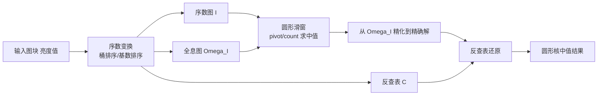

## 一句话总结

本文提出了一种高效的中值（及任意百分位）滤波算法，首次同时支持任意位深、任意核尺寸和任意凸核形状（尤其是圆形核），在保持乃至超越方形核最优实现性能的同时，消除了方形核带来的交叉网纹伪影。

## 研究背景

- 领域现状：中值滤波是经典图像处理的基石，能在几乎不模糊边缘的前提下平滑图像、去除噪声与离群点，并对 gamma 调整等单调变换保持不变。围绕它已发展出排序网络、滑动窗口直方图、积分查询、各向同性近似等多类加速方法。
- 核心痛点：几乎所有高效算法在实践中都被限制在方形核上，而方形核会产生明显的交叉网纹（cross-hatching）伪影，损害画质。已有算法还各自受限于图像位深、核尺寸或核形状；支持高阶多边形／圆形核的方法则要付出随边数线性增长的性能与内存代价，近似各向同性方法又难以扩展到 HDR 等高位深场景。
- 本文 idea：把作者早年 [Weiss 2006] 的一维"复合直方图"技术推广到二维，构造一个不可变的"全息图"（omnigram）数据结构，使任意形状图像区域的直方图元素都能在常数时间内取得，再把 Huang 的滑窗中值法改造成圆形核、向量化并行版本，从而以最优性能得到各向同性的高质量结果。

## 方法

整体框架：先对每个小图块做"序数变换"（ordinal transform），把亮度值替换为其在图块内的排序名次，得到一张取值唯一的序数图 $$I$$；同时构造把序数映射回亮度的反查表与记录每个序数值二维坐标的全息图 $$\Omega_I$$。之后对序数图套用改造过的 Huang 圆形滑窗法：不再维护和更新显式直方图，而是从不可变的 $$\Omega_I$$ 中按需查询直方图元素，并且一次性并行地纵向滑动多个相邻窗口，使每个瓶颈步骤都可向量化、可并行。最后用反查表把序数结果还原为亮度输出。

关键设计：

1. **序数变换与取值唯一性**：把重复的亮度值映射为连续的序数名次，使序数图每个值都唯一。由此任意子区域的直方图每个元素只会是 0 或 1，可用单比特表示；而且中值这类排序操作对该变换保持不变，处理完在序数域再还原即可。

2. **全息图（omnigram）**：这是本文相对于早年复合直方图的核心推广。复合直方图只对每个序数值编码其列号（或哨兵值），只能服务单条输出扫描线且需随窗口滑动而更新；全息图则同时编码行与列，即每个序数值在整幅图中的完整二维位置。代价是结构大小翻倍，但换来两个关键优势：一是结构不可变，构造后永不修改，任意区域都能复用；二是任意形状（不止矩形）子区域的直方图元素都能常数时间取得。对于以 $$P$$ 为圆心、半径 $$r$$ 的圆形区域，直方图元素即 $$H_{C(P,r)}[v]=1$$ 当且仅当 $$\lVert \Omega_I[v]-P \rVert \le r$$。

3. **量化 pivot 与向量化滑窗**：滑窗时借鉴 Huang 的 pivot/count 思想，但观察到 pivot 不必恰好等于中值，只要是已知精确 count 的邻近值即可。作者把 pivot 取为最接近中值的 64 的倍数，既便于向量对齐地扫描全息图，又能用更少比特存储。纵向同时滑动多个相邻窗口时，进出的前导／尾随像素在内存中形成连续分组，从而可用 SIMD 处理；否则单个非矩形窗口滑动时这些像素在内存中是散落的，无法向量化。精化阶段把全息图按 64 元素为一段规约成 64 位掩码，用 popcount 得到"粗"直方图元素快速定位，再在段内扫描出精确解。

4. **分块与 CPU／GPU 实现**：图像被切成不超过 256×256 的小图块，使全息图每元素可用 16 比特（x、y 各 8 比特）编码；当输入图块不超过 128×128 时，pivot 与序数图还可进一步压到 8 比特。CPU 上对 8/16 位整型用单遍桶排序、对浮点用改造的基数排序构造序数映射，采用自顶向下逐扫描线求解并把末行解"前推"给下一图块以复用。GPU（CUDA）上用高度优化的分段基数排序并行处理全部图块，输入图块取成去掉无用角像素的圆角矩形，并采用"由中心向外"的求解策略：先解稀疏的 32/64 个种子像素，再左右补全稀疏行，最后上下扫掠补全整块，让数百个线程共享同一份不可变的序数图与全息图以获得最优内存局部性。

## 实验结果

作者在 3700 万像素灰度图上测试，CPU 为 64 核 AMD 5995WX、GPU 为 NVIDIA RTX 4060，并在同一硬件上跑了 Moroto 的 2D 小波矩阵（2DWM）、Adams 的可分离排序网络以及 Perreault 的常数时间中值滤波（CTMF）的公开基准代码。性能上，本文方法在半径约 8～12 之间开始超过最快的方形核 SOTA 实现，对八边形／十二边形等各向同性 SOTA 方法在所有半径上都大幅领先、常达一个数量级以上；8 位图像上 CPU 略快于 CTMF 方形核实现，GPU 上在半径 84 以内优于 2DWM 方形核实现。

在画质上最能量化说明问题的是旋转不变性实验：把 16 位输入分别正负旋转 22.5°（双三次重采样），用等面积的方形与圆形中值核滤波后再旋转回来，比较两次结果的一致程度。圆形核的结果在旋转下的匹配精度约为方形核的 35 倍。

| 方法 | 旋转后结果标准差（灰阶）↓ | 相对一致性 |
|------|------|------|
| 圆形核（本文） | 0.06 | 约 35 倍更精确 |
| 方形核（标准） | 2.12 | 基准 |

此外，作者还实现了 arm64 版本以覆盖更多桌面与移动设备，并在 RTX 5080 等更高端显卡上验证了性能随核心数近乎线性扩展（细节见补充材料）。方法也天然支持任意百分位滤波，可让请求的百分位在图像上连续变化。

## 亮点与局限

- 亮点：
  - 首次在单一算法中同时突破位深、核尺寸、核形状三重限制，支持任意凸核（含圆形），彻底消除方形核的交叉网纹伪影。
  - 不可变全息图让任意形状区域的直方图查询变为常数时间，且结构无需随窗口更新，非常契合 GPU 的大规模并发与紧张的快速内存。
  - 在中大核尺寸上达到甚至超越最优方形核实现的性能，画质却显著更高；对各向同性 SOTA 方法常有一个数量级以上的加速。

- 局限：
  - 运行时是数据相关的，理论上存在"对抗性"输入（如带粗灰边的高频黑白棋盘图块）导致变慢，尽管在真实图像上未观察到。
  - 核虽各向同性但权重均匀，尚不支持高斯等空间加权或边缘平滑衰减的"抗锯齿"核。
  - 当滤波半径接近图块尺寸时，重叠图块间的序数变换存在冗余（同一像素可能被排序多次），仍有优化空间。

## 延伸思考

方法的高效很大程度依赖中值输出的"相干性"——相邻像素的结果通常相近；作者也指出对这种相干性做系统的统计分析，有助于确定最优参数并识别可能的对抗性输入，这是一个值得深入的方向。全息图作为"通用直方图"的思路不止服务中值：由于它能常数时间回答任意区域、任意值的直方图查询，天然适合一次序数变换后摊薄成本地同时输出多个百分位（如 25/50/75 分位做方差估计）或多个核尺寸，这与 2DWM 的"仅运行时"效率理念相呼应。把它推广到任意凸核形状、乃至空间加权核，可能催生一类更通用的秩序滤波原语，值得与排序网络在小核上的高效实现结合探索。
