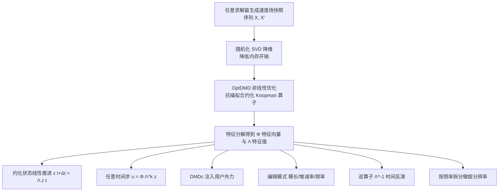

## 一句话总结

本文首次将动力学模态分解（Dynamic Mode Decomposition, DMD）引入图形学流体仿真，通过对"把状态从当前时刻推进到下一时刻的线性算子"（即 Koopman 算子）而非状态本身做降维，得到一个既有空间降阶模型压缩能力、又有谱方法物理直觉的时间感知子空间，从而以极少的基函数实现快速、省内存、可交互编辑的流体重建与控制。

## 研究背景

- 领域现状：全分辨率流体仿真能产生高细节流动，但计算昂贵，只能用于离线影视特效，难以支撑交互式与虚拟现实应用。降阶模型（Reduced-Order Model, ROM）通过降维加速仿真，把高维流体状态投影到低维子空间中求解偏微分方程。
- 核心痛点：传统子空间方法有三大难题。其一，子空间仿真容易耗散湍流中人们最想要的高频细节；其二，需要构造一个能泛化到多种场景配置的静态子空间；其三，即便用了线性子空间，无粘 Euler 方程的对流项相对流体状态仍是非线性的，仍需回到全空间计算。此外，PCA 等数据驱动方法得到的空间基缺乏物理直觉，难以挑出单个基去操控流动，因而长期只能用于回放。
- 本文 idea：不再固守"静态子空间"思路，改用 DMD——它线性近似描述流动时间演化的 Koopman 算子，并直接对该算子降维。这样得到的子空间天然带有时间动力学信息：每个特征向量-特征值对对应一个独立的波模式，特征向量编码空间形态、特征值编码时间演化。由此既能在任意时刻直接求值而无需逐步时间积分或离散对流，又能像谱方法那样分模式可控地编辑流动的"观感"。

## 方法

### 整体框架

方法围绕一个线性算子展开：给定一段流体速度场快照序列，先用（随机化）SVD 做降维，再拟合出在低维空间中把状态从 $$t$$ 推进到 $$t+\Delta t$$ 的约化 Koopman 算子；该算子的特征分解直接暴露出可编辑的时空模式，进而支撑重建、任意时间步跳转、外力注入、时间反演与超分辨率等应用。

### 关键设计

- Koopman 算子与 DMD 的定位：考虑自治系统 $$\frac{d\boldsymbol{u}}{dt}=\boldsymbol{f}(\boldsymbol{u})$$，存在一个线性算子 $$\boldsymbol{K}$$ 使得 $$\boldsymbol{g}_{k+1}=\boldsymbol{K}\boldsymbol{g}_k$$。这个受限 Koopman 算子在网格自由度上维数极高且几乎稠密，不可直接使用。DMD 通过在两段时移快照 $$\boldsymbol{X}$$ 与 $$\boldsymbol{X}'$$ 上求解 $$\arg\min_{\boldsymbol{K}}\lVert \boldsymbol{X}'-\boldsymbol{K}\boldsymbol{X}\rVert_F$$，并借助截断 SVD 得到低秩近似。与 PCA 只看快照协方差、对数据顺序不敏感不同，DMD 拟合的是"把前一状态推进到下一状态"的算子，因而对数据的时间顺序敏感，能捕捉系统动力学而非仅解流形的几何。

- 约化到对角谱形式：对约化 Koopman 算子做特征分解 $$\tilde{\boldsymbol{K}}=\boldsymbol{\Phi}\boldsymbol{\Lambda}\boldsymbol{\Phi}^{*}$$，把全空间速度场投影到基 $$\boldsymbol{\Phi}$$ 张成的低维空间后，状态推进简化为对角矩阵作用 $$\boldsymbol{z}(t+\Delta t)=\boldsymbol{\Lambda}\boldsymbol{z}(t)$$，再乘回基即可返回全空间 $$\boldsymbol{u}(t+\Delta t)=\boldsymbol{\Phi}\boldsymbol{\Lambda}\boldsymbol{z}(t)$$。复杂度由全空间的 $$O(N^2n^2)$$ 降到投影后的 $$O(Nnr)$$。由于 $$\boldsymbol{\Lambda}$$ 是对角特征值矩阵，每个观测量恰好是以特征值虚部所给频率旋转的空间模式，这为按模式编辑提供了基础。

- 抗噪拟合 OptDMD：流体本身混沌、离散化在 Nyquist 极限附近产生噪声，加之图形学常用大时间步与提前终止迭代，训练数据噪声很大。标准 DMD 只拟合相邻两帧、时间视野短、对噪声敏感。本文改用 OptDMD，将约化算子训练转化为指数数据拟合问题 $$\arg\min_{\boldsymbol{\alpha},\boldsymbol{B}}\lVert \bar{\boldsymbol{V}}\boldsymbol{\Sigma}-\boldsymbol{\Phi}(\boldsymbol{\alpha})\boldsymbol{B}\rVert_F$$，用变量投影法同时考虑所有快照、在更长时间视野上抑制随机噪声。

- 内存优化随机化 SVD：DMD 训练中的 SVD 需存储 $$Nn\times Nn$$ 矩阵，3D 场景下内存吃紧。本文用随机化 SVD 构造投影矩阵 $$\boldsymbol{Q}$$ 使 $$\boldsymbol{X}\approx\boldsymbol{Q}\boldsymbol{Q}^{T}\boldsymbol{X}$$，再在更小的 $$\boldsymbol{B}=\boldsymbol{Q}^{T}\boldsymbol{X}$$ 上做传统 SVD，得到 $$\boldsymbol{X}\approx\boldsymbol{Q}\boldsymbol{U}\boldsymbol{\Sigma}\boldsymbol{V}^{T}$$，从而在消费级硬件上处理 3D 大自由度数据。

- 任意时间步跳转：因算子线性且在约化空间中对角，可预先计算其幂，一次矩阵乘法即可把 $$t$$ 时刻状态映射到 $$t+k\Delta t$$：$$\boldsymbol{u}(t+k\Delta t)=\boldsymbol{\Phi}\boldsymbol{\Lambda}^{k}\boldsymbol{z}(t)$$。由于算子把速度场映射到速度场，非线性对流被直接编码进算子中，对流"免费"完成。

- 边界条件与无散约束：若约束可写成 $$\boldsymbol{C}\boldsymbol{X}=0$$，则可证明 $$\boldsymbol{C}\boldsymbol{\Phi}=0$$，即任何由约化表示重建出的速度场都自动满足初始数据所满足的线性约束（含无散条件），只要对应特征值非零。

- 注入外力 DMDc：原始 OptDMD 只能重建、无法响应用户新外力。本文首次把 DMD with Control（DMDc）与 OptDMD 结合，将用户可修改的外力项投影进约化空间：$$\boldsymbol{z}(t+\Delta t)=\boldsymbol{\Lambda}\boldsymbol{z}(t)+\boldsymbol{\Phi}^{+}\sum_i \boldsymbol{B}_i\boldsymbol{q}_i(t)\Delta t+\boldsymbol{\Phi}^{+}\sum_j \boldsymbol{f}_j(t)\Delta t$$，从而支持实时交互式的力编辑。

## 实验结果

实验在配备 2.10GHz 32 核 Intel CPU、120GB 内存的 Linux 工作站上完成，方法完全用 Python 实现，DMD 部分基于高度优化、省内存的 PyDMD，交互示例用 Taichi、数值验证用 NumPy。

- 2D 羽流重建：与先前 PCA 类方法对比，本文方法仅用 9 个基函数就能重建羽流顶部轮廓，而对比方法只能捕捉基本上升运动、缺乏涡结构；用 28 个基已接近真值，用 61 个基几乎完美重建，而对比方法需要 130 个基才能达到类似细节水平。

- 运行时开销（2D 羽流，256 × 512 网格）：

| 阶段 | 方法 | 时间 | 相对全空间加速 |
|---|---|---|---|
| 全空间求解 | Fullspace | 754 ms | 基准 |
| 子空间求解 | PCA 类[2013] | 16.15 ms（含外力）/ 0.95 ms（无外力） | 47× / 794× |
| 子空间求解 | 本文 | 8.9 μs | 84,719× |
| 预计算 | PCA 类[2013] | 114 s | — |
| 预计算 | 本文 | 79 s | — |

- 涡量约束下的泛化：训练时涡量约束取 1.5，在未见过的 1.51、1.6、2.5 上测试相对误差。本文用 50 个基即可达到对比方法 150 个基的相当或更低误差。

- 3D 羽流基准（128 × 128 × 256，MacCormack 求解器）：在独立羽流、羽流绕球、羽流绕兔子三个逐渐复杂的场景中，小基（$$r=9$$）即可重建整体流动；增大到 $$r=28$$、$$r=61$$ 时湍涡与边界附近细节明显改善，展示了对复杂边界条件的鲁棒性。

- 3D 对撞涡环（150 个基）：面对速度场突变（两点涡正面对撞）的高难度场景，方法能重建碰撞前后由两点涡到发散速度场、再到周边大量涡结构涌现的完整过渡。

- 求解器无关性：方法只建模约化空间中相邻状态的转移，不绑定具体离散格式，成功应用于 MacCormack、MacCormack + Reflection 以及并不直接求解 Navier-Stokes 的 Lattice Boltzmann 方法，是"无方程"的数据驱动方法，甚至可接受手工修改或真实测量的数据。

## 亮点与局限

- 亮点：
  - 首次把 DMD/Koopman 理论系统性引入图形学流体仿真，指出 DMD 天然位于空间降阶（如 PCA）与时间降阶（谱方法）之间，兼得两者优势。
  - 算子在约化空间中对角化，单次矩阵乘法即可推进到任意时刻，运行时相对全空间加速可达数万倍，且以极少基函数保留高频细节。
  - 线性性解锁一系列面向艺术家的应用：按模式的模长、增减率、频率直接编辑时间动力学（无需了解求解器细节）；用逆算子 $$\boldsymbol{\Lambda}^{-1}$$ 做时间反演、回滚到负帧；用训练好的算子对低分辨率序列做超分辨率补充高频细节，其升采样本质是两次矩阵乘法的线性组合。

- 局限：
  - 降维依赖 SVD，大维度（如 3D）数据内存需求约为 $$O(n^2)$$，即便用随机化 SVD 缓解，更大规模仿真训练仍昂贵。
  - 降阶模型以泛化换性能，表示能力有限：远离观测数据的速度场可能无法被约化空间与算子表示，交互到远离数据的状态时行为可能异常，空间泛化仍需改进。

## 延伸思考

- 作者指出 DMD 与一阶向量自回归 VAR(1) 共享同一代数骨架——都在估计把状态从 $$t$$ 推进到 $$t+1$$ 的线性映射，区别在于 DMD 用截断 SVD 替换完整状态转移矩阵，这为借鉴时间序列文献中的成熟工具留出空间。
- 一个直接的扩展方向是把密度场并入流体状态、对增广系统构造 Koopman 算子，从而像查询速度场那样在任意时刻直接查询密度场，省去当前"先算速度再对流密度"的经典数值积分步骤。
- 由于 DMD 算子的线性性，多个预训练算子的线性组合仍是合法算子，可像集成学习那样按用户输入自适应混合，获得更丰富的运动模式；进一步还可对算子做可微的逆向设计，或用神经网络扩充其非线性控制空间。
