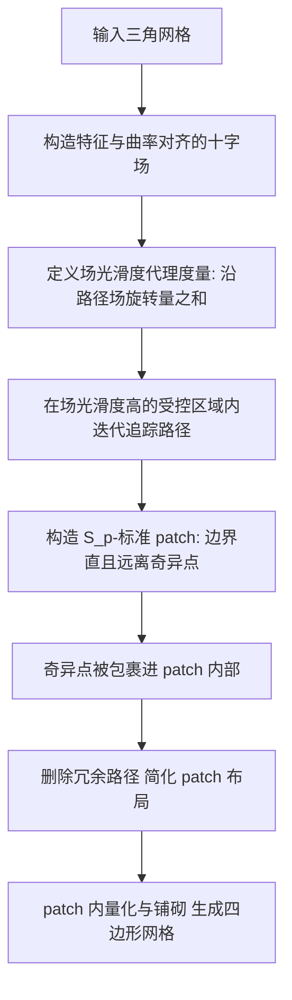

# Field Smoothness-Controlled Partition for Quadrangulation

> 说明：本篇全文 PDF（约 261M）托管在作者主页但当前无法下载，正文依据作者项目页（摘要、动机、方法段落）与公开信息整理，实验部分仅给出项目页描述的定性结论，不含具体数值表格。

## 一句话总结

针对基于场（cross field）的可靠特征对齐四边形网格化，提出一种以"场光滑度"为控制目标的曲面分块方法：让分块边界尽量走在远离奇异点、场光滑度高的区域，从而把奇异点包进 patch 内部、得到更直的 patch 边界，显著提升下游四边形网格质量。

## 研究背景

把三角网格转成高质量四边形网格（quadrangulation），是几何处理中的经典难题。主流的基于场的流水线大致分三步：先在曲面上构造一个特征与曲率对齐的十字场（cross field），再据此把曲面分块（partition）成若干四边形拓扑的 patch，最后在每个 patch 内做量化（quantization）与铺砌（tessellation）生成规则四边形。其中"分块"是承上启下的关键：给定十字场后，如何找到一个能提升最终网格质量的分块，长期缺乏可靠而系统的判据。

难点在于场的奇异点（singularities）。传统的流线/分隔线（separatrix）分块方法会让分隔线从奇异点出发，路径往往绕着奇异点旋转、不够笔直，进而在这些区域产生扭曲的四边形，甚至出现小碎块与极限环，抵消四边形布局本应带来的好处。已有工作多用"禁止路径穿过奇异点 n-环邻域"之类的几何硬约束来回避，但这类约束既生硬又难以刻画"什么样的边界才算好"。

作者延续 [Campen et al. 2012] 的观察：如果先把曲面分成边界笔直、且远离场奇异点的 patch，四边形化流水线更容易产出高质量网格。于是本文把问题重新表述为：给定十字场，如何找到能改善"分块与量化衔接"的分块？其核心洞见是——远离奇异点、场足够光滑的流线，才是更合适的 patch 边界。

## 方法

方法不采用"禁止穿越邻域"这类几何硬约束，而是引入代理度量（proxy metrics）：沿着场追踪路径时，用路径上的场光滑度来衡量这条路径好不好。直觉是——若一条路径始终走在场光滑度很高的区域，它就会自然变直、远离奇异点，成为理想的 patch 边界。场光滑度可用"沿路径的场旋转量之和"来评估：旋转量越小，路径越平直、越光滑。

在非协调多边形 patch 布局（non-conforming polygonal patch layout）框架之上，作者提出 $S_p$-标准 patch（$S_p$-standard patch）的概念，用来刻画适合铺砌的理想 patch，并在曲面上迭代地构造这类 patch。整体算法先在"场光滑度受控"的区域内迭代追踪路径以形成 patch，再删除冗余路径来简化 patch 布局。

### 关键设计一：以"场光滑度"作为边界优劣的代理度量

核心是把"好边界"从几何硬约束转成可量化的软目标。对一条待追踪的路径，其质量由路径上的场光滑度衡量，可评估为沿路径各处场旋转量之和。旋转量小意味着路径贴合场方向、不绕着奇异点打转，因此更直、更稳。这样一来，"让边界远离奇异点"不再靠禁行区，而是自然涌现为"在高光滑度区域内追踪"的结果。

### 关键设计二：$S_p$-标准 patch 与奇异点内嵌

作者定义 $S_p$-标准 patch 来刻画理想的可铺砌单元，并给出用 $S_p$ 描述 patch 类型的方式（例如最简单的一类记作 $S_p = (\infty, 0, 0, 0, 0)$，其分隔线来自不规则顶点，特征线单独处理）。与传统让分隔线从奇异点起笔不同，本方法允许把奇异点包裹在 patch 内部，从而让 patch 之间的边界保持笔直、削弱奇异点对边界的扭曲影响。

### 关键设计三：迭代构造 + 冗余路径简化的实用算法

算法分两阶段：先在场光滑度受控的区域内迭代追踪路径、逐步拼出 $S_p$-标准 patch；再对生成的 patch 布局做简化，删除冗余路径，得到更简洁的分块。这样既结合了"边界对齐场与特征线"等常用度量，又用光滑度控制机制约束边界走向，形成一个实用的分块算法。

## 实验结果

作者在一个大规模测试数据集上，用本文分块生成四边形网格来验证方法的有效性与实用性。据项目页与摘要的定性结论：与当前最先进方法相比，本文方法在保持相近可靠性（reliability）的同时，显著提升了四边形网格质量，从而验证了"远离奇异点的光滑流线更适合作为 patch 边界"这一核心洞见。首图展示了在高亏格、多样几何、复杂特征等场景下生成的高质量四边形网格（特征线以红色高亮）。

（注：受限于全文 PDF 不可获取，本节未能给出主表的具体指标数值；如需精确对比数据，建议查阅 ACM 原文。）

## 亮点与局限

亮点：

- 用"场光滑度"这一可量化的代理度量替代"禁行奇异点邻域"的几何硬约束，让"好边界"从软目标中自然涌现，思路更统一、更贴合场结构。
- 提出把奇异点内嵌进 patch 的策略，换来更直的 patch 边界，直击传统流线分块在奇异点附近产生扭曲四边形的痛点。
- 在大规模数据集上验证，能处理高亏格、复杂特征等困难模型，且在提升质量的同时维持了与 SOTA 相近的可靠性。
- 公开了代码与数据，实用性与可复现性较好。

局限：

- 方法建立在"已有一个特征与曲率对齐的十字场"之上，最终质量仍受输入场质量影响。
- 代理度量与 $S_p$-标准 patch 的构造涉及迭代追踪与简化流程，其参数与终止条件的敏感性、以及在极端奇异分布下的表现，需结合原文细节评估。
- 受限于当前无法获取全文，方法在效率、内存与失败案例上的定量边界这里无法进一步核实。

## 延伸思考

这项工作最值得玩味之处，在于把"分块"问题从"避开奇异点"重新框定为"追逐场光滑度"。奇异点本身并非要被排斥，而是可以被包裹、被安置在 patch 内部，只要边界走在光滑的地方就好——这种视角的转换往往比新增约束更能带来质变。它与流线/分隔线简化一脉相承，却提供了一个更连续、更可优化的判据，天然适合与量化阶段联合调优。可以进一步追问的是：场光滑度度量能否反过来指导十字场本身的构造，让"造场—分块—量化"三步端到端协同？以及这套"用光滑度控制边界"的思想，是否能迁移到六面体网格、各向异性重网格化等更一般的场驱动离散化任务中。
