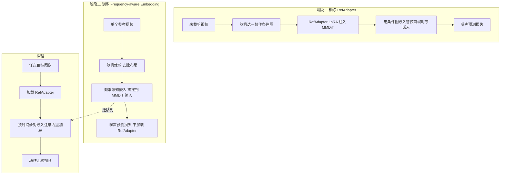

## 一句话总结

本文提出 FlexiAct，一个图像到视频（Image-to-Video, I2V）动作迁移框架，能把参考视频中的动作迁移到任意目标图像上，即使二者在布局、视角、骨架结构上存在差异，也能同时保证动作准确与外观一致。

## 研究背景

动作迁移（action transfer）在影视、游戏、动画中应用广泛，但传统流程成本高昂：专业动捕系统动辄数万美元且需要熟练技师，制作一段 30 秒、每秒 12 帧的动画可能需要六位专业动画师约 20 个工作日。这些高门槛把大量潜在创作者挡在门外。

为降低成本，视频生成领域的动作控制大体分为两类，但都有明显局限：

- 预定义信号方法（如 AnimateAnyone、StableAnimator）依赖姿态图、深度图等信号，要求目标图像与参考视频在形状、骨架、视角等空间结构上严格对齐，现实中往往不可行；对非人类主体也难以获取姿态信息。
- 全局运动方法（如 Motion Director、Motion Inversion）通常生成固定布局的运动，无法把运动迁移到差异较大的不同主体上；部分方法用身份特定的 LoRA 做动画，但在外观一致性与灵活性上表现欠佳。

本文正面解决"异构场景"下的动作迁移问题：给定一段参考视频和任意目标图像，在不要求布局、形状、视角对齐的前提下，把动作迁移过去，同时保留动作动态与外观细节。这需要同时攻克三点：精确的动作控制、空间结构自适应、以及一致性保持。

## 方法

### 整体框架

FlexiAct 基于 CogVideoX-I2V（一个基于 MMDiT 的潜空间视频扩散模型）构建，包含两个新组件，分两阶段独立训练：

- RefAdapter：一个轻量的图像条件适配器，负责空间结构自适应与外观一致性保持。
- FAE（Frequency-aware Action Extraction，频率感知动作提取）：在去噪过程中直接提取动作，通过在不同时间步动态调整注意力权重来实现。

两者分开训练，以确保动作提取不干扰 RefAdapter 的一致性保持能力。基座模型的编码方式为：3D VAE 把视频编码为潜变量 $$L_{video} \in \mathbb{R}^{\frac{T}{4} \times \frac{H}{8} \times \frac{W}{8} \times C}$$，把条件图像编码为 $$L_{image} \in \mathbb{R}^{1 \times \frac{H}{8} \times \frac{W}{8} \times C}$$ 并沿时间维零填充对齐，再与噪声沿通道维拼接后去噪。

### 关键设计 1：RefAdapter

直接用 I2V 做空间结构自适应有两大障碍：动作提取会损害 I2V 的一致性保持能力；且 I2V 是强约束的图像条件框架，训练时用首帧作条件图，若初始空间结构与参考视频不同则难以平滑迁移动作。

RefAdapter 的做法是在条件图与初始空间结构之间人为制造"落差"：

- 训练时从未裁剪视频里随机采样一帧作为条件图，而非固定用首帧，最大化空间结构差异。
- 用 $$L_{image}$$ 替换 $$L_{video}$$ 时间维上的第一个嵌入，让模型把首个嵌入当作"引导参考"而非"视频起点"约束，从而不再强制生成视频的初始状态匹配条件图。

RefAdapter 仅微调少量 LoRA，引入 66M 参数（占 CogVideoX-I2V 总参数的 5%），避免了 ReferenceNet、ControlNet 那种大规模参数复制。它在 42,000 段视频上做一次性 40,000 步训练即可通用。

### 关键设计 2：Frequency-aware Action Extraction

作者最初尝试像 textual inversion 那样直接训练运动嵌入拟合动作，但效果不佳。深入分析嵌入与视频 token 在不同去噪时间步的注意力图后，他们发现一个关键规律：嵌入在去噪早期（大时间步）主要关注低频动作信息（运动区域），随后逐渐转向高频外观细节。

- 大时间步（如 step=800）：关注运动信息（低频），高注意力集中在主体的运动部位。
- 中间时间步（如 step=500）：转向主体的细粒度细节。
- 后期时间步（如 step=200）：注意力分散到全图，关注背景等全局细节。

基于此，FAE 在推理时于大时间步提升视频 token 对频率感知嵌入的注意力权重、其余时间步保持原值，从而增强对参考动作的感知与复现。重加权策略为：

$$W_{bias} = \begin{cases} \alpha, & t_l \le t \le T \\ \frac{\alpha}{2}\left(\cos\left(\frac{\pi}{t_h - t_l}(x - t_l)\right) + 1\right), & t_h \le t < t_l \\ 0, & 0 \le t < t_h \end{cases}$$

其中 $$\alpha$$ 控制偏置强度，$$t_l$$、$$t_h$$ 分别为低频、高频时间步，中间用过渡函数平滑变化。最终注意力权重为 $$W_{attn} = W_{ori} + W_{bias}$$，作用于所有 DiT 层。实践中取 $$\alpha = 1$$、$$t_h = 700$$、$$t_l = 800$$。消融显示：没有过渡函数时，在 $$t = 700$$ 直接改偏置会让模型学到参考视频的外观（如衣着），在 $$t = 800$$ 改偏置又会导致动作不准，因此 700 到 800 之间的过渡是平衡外观与动作的关键。频率感知嵌入对每段参考视频只需 1,500 到 3,000 步训练。

## 实验结果

评测数据集含 250 组视频-图像对、25 个不同动作类别，每个动作迁移到 10 张不同目标图像，覆盖真人、动物、动画与游戏角色。基线为在 CogVideoX-I2V 上重实现的 MotionDirector（记作 MD-I2V），以及去掉 RefAdapter 与 FAE、仅用标准可学习动作嵌入的 BaseModel。指标包括文本相似度、运动保真度（Motion Fidelity，基于跟踪轨迹）、时序一致性、外观一致性（生成视频首帧与其余帧的平均 CLIP 相似度），以及 5 名评分者的人工评测（相对 BaseModel 的偏好率）。

| 方法 | 文本相似度↑ | 运动保真度↑ | 时序一致性↑ | 外观一致性↑ | 人工-运动 (vs Base) | 人工-外观 (vs Base) |
| --- | --- | --- | --- | --- | --- | --- |
| MD-I2V | 0.2446 | 0.3496 | 0.9276 | 0.8963 | 47.2 v.s. 52.8 | 53.1 v.s. 46.9 |
| Base Model | 0.2541 | 0.3562 | 0.9283 | 0.8951 | - | - |
| w/o FAE | 0.2675 | 0.3614 | 0.9255 | 0.9134 | 59.7 v.s. 40.3 | 76.4 v.s. 23.6 |
| w/o RefAdapter | 0.2640 | 0.3856 | 0.9217 | 0.9021 | 68.6 v.s. 31.4 | 52.2 v.s. 47.8 |
| Ours | 0.2732 | 0.4103 | 0.9342 | 0.9162 | 79.5 v.s. 20.5 | 78.3 v.s. 21.7 |

完整方法在所有自动指标上均居首，运动保真度（0.4103）与外观一致性（0.9162）显著领先；人工评测中运动一致性、外观一致性相对 BaseModel 的偏好率分别达 79.5% 与 78.3%。消融显示：去掉 FAE 明显拉低运动保真度，印证其对动作提取的作用；去掉 RefAdapter 则同时损害外观一致性与运动保真度，说明它对跨主体空间结构自适应不可或缺。作者也指出本方法的运动保真度绝对值低于全局运动任务，因为异构场景受布局不一致影响，与相同布局的全局迁移不可直接比较。

## 亮点与局限

亮点：

- 首个能把参考动作迁移到任意主体、且允许布局/骨架/视角差异的灵活框架，同时保证动作与外观一致，甚至支持跨域（人到动物）迁移。
- RefAdapter 以仅 5% 的可训练参数实现了 ReferenceNet 级别的细粒度外观控制，并缓解了 I2V 模型对首帧的强约束。
- FAE 揭示了去噪过程"早期关注低频运动、后期关注高频外观"的规律，据此在去噪过程中直接提取动作，无需额外的时空分离架构。
- 用带过渡函数的注意力重加权巧妙平衡动作准确性与外观保持，超参数简单（$$\alpha=1$$、$$t_h=700$$、$$t_l=800$$）。

局限：

- 与多数运动定制方法一样，需对每段参考视频单独优化（1,500 到 3,000 步），无法即时迁移。
- 面向异构场景的前馈式（feed-forward）动作迁移方法仍是明确的未来方向。

## 延伸思考

- "去噪时间步与频率成分的对应关系"是本文最有价值的观察，把它作为可控信号来调制注意力，提示扩散模型的时间步本身携带丰富的语义/频率结构，值得在编辑、风格化等其他可控生成任务中挖掘。
- RefAdapter 用"随机选帧作条件"来解耦条件图与生成起点，本质是弱化 I2V 的首帧约束，这种"故意制造训练落差以换取推理灵活性"的思路具有一般性。
- 动作提取与外观保持分两阶段独立训练，避免相互干扰，是一种务实的解耦工程范式；但也意味着两者无法端到端联合优化，未来若能统一或许能进一步提升上限。
- 逐视频优化是当前实用性的主要瓶颈，结合大规模动作先验训练前馈网络，有望把 FlexiAct 从"每段视频微调"推向"即时迁移"。
