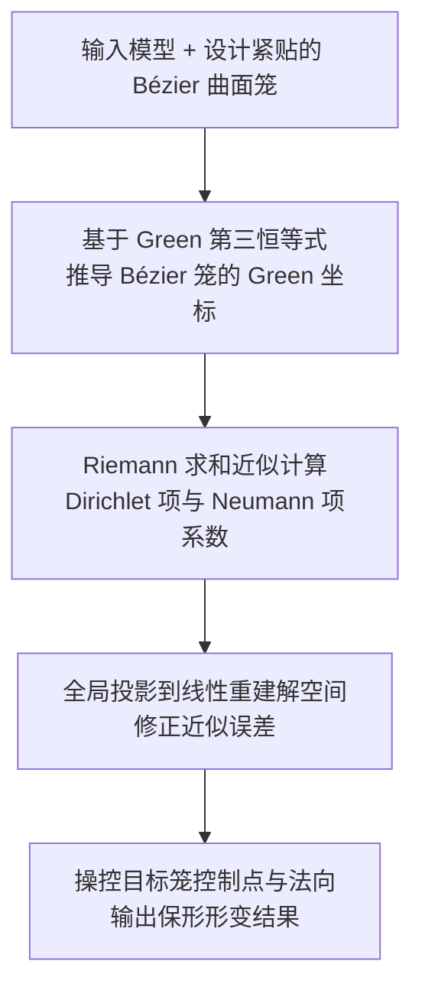

## 一句话总结

将笼型形变（cage-based deformation）的笼子从传统三角形/四边形升级为 Bézier 曲面片，并首次在这种高阶曲面笼上推导出带法向控制的 Green 坐标，从而用很少的控制点实现紧贴模型的笼子与高曲率、保形的空间形变。

## 研究背景

空间形变是几何处理中的基础问题，笼型形变是其中最常用的一类方法：用户在模型外围指定一个"笼子"（cage）作为区域边界，通过操控笼子的顶点使笼内嵌入的模型随之变形。核心是为笼内任意点 $$\eta$$ 构造一组关于笼顶点的坐标，满足单位分解与线性重建 $$\eta=\sum_{i=1}^{N}\phi_i(\eta)\mathbf{v}_i$$。

已有坐标体系各有局限。均值坐标、调和坐标、泊松坐标等广义重心坐标不强调共形性质，形变时容易出现剪切失真。Lipman 等人提出的 Green 坐标同时考虑笼顶点 $$\mathbf{v}_i$$ 与笼法向 $$\mathbf{n}_j$$，形式为 $$\eta=\sum_{i=1}^{N}\phi_i(\eta)\mathbf{v}_i+\sum_{j=1}^{M}\psi_j(\eta)\mathbf{n}_j$$，能在三维中实现拟共形映射，具有保形效果。

除了坐标本身，笼子的几何结构同样关键。早期工作把笼子表示为三角网格，形状控制能力有限。后续将其扩展到三-四边形混合笼：四边形当四个顶点不共面时可表示非平面区域，但它形成的是直纹面，等参曲线都是直线，难以刻画弯曲和高曲率形变。有工作把笼子扩展为多项式曲线并实现曲边形变，但仅限二维。三维中虽有 S-patch 与 $$C^0$$ GC patch 等高阶结构可构造重心坐标，却因缺少笼法向而难以建立具备保形能力的 Green 坐标。这篇工作正是要填补这一空白：在三维曲边高阶笼上建立带法向控制的坐标。

## 方法

### 整体框架

方法围绕"用 Bézier 曲面片当笼子 + 在其上推导 Green 坐标"展开，可拆为三步：

### 高阶笼的表示

方法同时支持张量积 Bézier 曲面片与 Bézier 三角片（主文聚焦前者，三角片在附录给出）。一张 degree-$$(m,n)$$ 的张量积 Bézier 片由 $$(m+1)\times(n+1)$$ 个控制点 $$\mathbf{b}_{ij}$$ 决定，参数方程为 $$\mathbf{b}(u,v)=\sum_{i=0}^{m}\sum_{j=0}^{n}\lambda_{ij}(u,v)\mathbf{b}_{ij}$$，其中 $$\lambda_{ij}(u,v)=B_i^m(u)B_j^n(v)$$ 是两个 Bernstein 基函数之积。相比三角网格只能做一阶逼近，Bézier 片的高阶结构让笼子能更紧、更精确地贴合模型，也让曲边形变更灵活。

### 关键设计一：基于 Green 第三恒等式推导坐标

令 $$f(\eta)=\eta$$（谐函数），用 Green 第三恒等式把 $$\eta$$ 写成边界积分，拆为 Dirichlet 项与 Neumann 项。对单张 Bézier 片 $$Q$$，把参数方程代入后，形变位置可整理为对控制网的位置与法向的线性组合：

$$\tilde{\eta}=\sum_{Q}\sum_{i=0}^{m}\sum_{j=0}^{n}\left(\phi_Q^{ij}(\eta)\,\tilde{\mathbf{b}}_{ij}^{Q}+\psi_Q^{ij}(\eta)\,\tilde{\mathbf{N}}_{ij}^{Q}\right)$$

其中 Dirichlet 项系数 $$\phi_Q^{ij}(\eta)=\iint_{u,v=0}^{1}\dfrac{\lambda_{ij}(u,v)\,(\mathbf{b}_Q(u,v)-\eta)\cdot\mathbf{N}_Q(u,v)}{4\pi\|\mathbf{b}_Q(u,v)-\eta\|^3}\,\mathrm{d}u\,\mathrm{d}v$$，Neumann 项系数 $$\psi_Q^{ij}(\eta)=\iint_{u,v=0}^{1}\dfrac{\lambda_{ij}(u,v)}{4\pi\|\mathbf{b}_Q(u,v)-\eta\|}\,\mathrm{d}u\,\mathrm{d}v$$。

难点在于 Neumann 项需要笼法向，而高阶片的未归一化法向 $$(\mathbf{b}_u\times\mathbf{b}_v)(u,v)$$ 难以直接用控制网法向表达。作者借鉴 PN 三角形等做法，先为每个控制点算出顶点法向（角点法向用相邻控制点的叉积，内部点取一环邻域叉积的平均），再用 Bernstein 基插值近似整片法向 $$\mathbf{N}(u,v)=\sum_{i=0}^{m}\sum_{j=0}^{n}\lambda_{ij}(u,v)\mathbf{N}_{ij}$$。该法向对控制点法向 $$\mathbf{N}_{ij}$$ 是线性的，从而能把 Neumann 项建立在控制网法向之上。

### 关键设计二：Riemann 求和近似

由于三维情形下 $$\phi$$、$$\psi$$ 的被积函数分母是二元多项式的 $$3/2$$ 次与 $$1/2$$ 次幂，没有已知闭式解。作者把参数域 $$[0,1]\times[0,1]$$ 剖分成小三角元并用 Riemann 求和近似：先把 $$\eta$$ 投影到片上求最近点参数（点反演问题，用梯度下降优化点到面距离），再用越靠近 $$\eta$$ 越密的 UV 剖分模式。Dirichlet 项用带符号立体角 $$\omega_t(\eta)$$ 近似，Neumann 项利用基本解在平面三角形上的闭式积分。

### 关键设计三：全局投影保证线性重建

由于 Riemann 求和与法向插值都是近似，线性重建性质不会精确成立。已有的逐四边形投影需要预先把曲面剖分成分片线性三角形，作者认为并非最优。这里改为全局投影：把线性重建与单位分解约束写成线性系统 $$A\Phi=q$$，其中 $$A\in\mathbb{R}^{4\times 2K(m+1)(n+1)}$$，$$q=(\eta,1)^\top$$。将近似坐标 $$\bar{\Phi}$$ 投影到该解空间，等价于求最小范数修正，闭式解为

$$\Phi=\bar{\Phi}+A^\top(AA^\top)^{-1}(q-A\bar{\Phi})$$

由于 $$A$$ 恒为行满秩（附录给出证明），$$AA^\top$$ 只是 $$4\times 4$$ 矩阵求逆，计算很高效。当源笼与目标笼相同时，加了全局投影后输出模型能与输入完全吻合，实现精确线性重建。

## 实验结果

由于此前没有公开的 Bézier 笼模型，作者从已有四边形笼出发，把每个四边形升级为 degree-$$(3,3)$$ Bézier 片（在 $$\mathbf{q}(i/3,j/3)$$ 处加控制点），再借助 Blender 与 Python 脚本设计紧贴模型的笼子。实现基于 C++ 与 Eigen，实验在 10 核 2.40 GHz Intel CPU、16GB 内存的笔记本上进行。

对比对象包括三角笼 Green 坐标（GC）、四边形笼均值坐标（QMVC）、四边形笼 Green 坐标（QGC）。为公平比较，QMVC 与 QGC 把每张 Bézier 片细分成 9 个四边形，GC 把每片细分成 18 个三角形。定性结果显示：QMVC/QGC/GC 在弯曲和高曲率形变下会产生分段（segmented）的折面结构，而本方法凭借高阶结构得到光滑的曲边边界；QMVC 虽更贴合笼形但会引入剪切、显得不自然，Green 坐标则保形更好。与 $$C^0$$ GC patch 相比，本方法因引入法向信息而具有更强的保形性。

运行时间对比（单位：秒，$$V$$ 为网格顶点数，$$B$$ 为 Bézier 片数）：

| 模型 / 方法 | $$V$$ | $$B$$ | GC-18 | QMVC-9 | QGC-9 | Ours |
| --- | --- | --- | --- | --- | --- | --- |
| Cactus | 98820 | 34 | 5.00 | 102.89 | 124.62 | 26.45 |
| Bench | 65430 | 22 | 2.16 | 42.30 | 51.42 | 11.59 |
| Bar | 229378 | 6 | 2.12 | 41.57 | 49.99 | 8.51 |
| FireHydrant | 39028 | 46 | 2.67 | 54.79 | 67.04 | 14.48 |
| WireSphere | 48964 | 6 | 0.45 | 8.78 | 10.66 | 2.48 |

本方法比同样需要域剖分的 QMVC-9、QGC-9 快数倍；GC-18 因有闭式解最快，但会在高曲率处产生分段折面。坐标只需预计算一次，之后同一模型的新形变无需重算。

## 亮点与局限

亮点：

- 首次在三维曲边高阶笼（Bézier 曲面片/三角片）上构造带法向控制的 Green 坐标，用极少控制点即可实现紧贴笼子与高曲率保形形变。
- 提出全局投影方法，用一个 $$4\times 4$$ 矩阵求逆即可把近似坐标精确投影到满足线性重建与单位分解的解空间，比逐四边形投影更简洁。
- 利用张量积与 Coons 操作可交换的性质，只需边界 Bézier 曲线即可自动生成内部控制点，笼子设计并不比 $$C^0$$ GC patch 更繁琐。

局限：

- 坐标没有闭式解，Riemann 求和带来一定计算耗时。
- 虽然 Green 坐标能保形，但无法保证形变后的模型始终留在笼子内部。

## 延伸思考

这项工作把"高阶笼 + 法向控制坐标"这条路线在三维打通，一个自然的后续方向正是作者点出的：为三维高阶笼寻找 Green 坐标的闭式解，从而摆脱 Riemann 求和的耗时与近似误差。此外，法向近似采用的是控制网插值而非真实的 $$\mathbf{b}_u\times\mathbf{b}_v$$（附录中的叉积精确法会把 Neumann 项数从 16 增到 120、耗时翻倍却结果相近），说明 Neumann 项对最终形变的影响并不敏感，这提示在追求精度与效率折中时法向项还有简化空间。紧贴曲面笼、保形、控制点稀疏这几个特性，也让该方法在角色绑定、可编辑几何与需要精细曲面控制的建模流程中具有实用价值。
