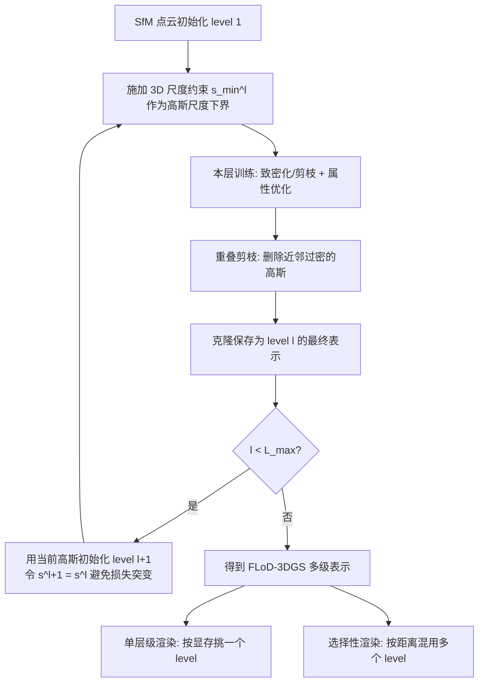

## 一句话总结

FLoD 给 3D 高斯泼溅（3DGS）引入了真正意义上的可变细节层级（LoD）：通过对每一层施加不同的 3D 尺度下界约束并采用逐层训练，构建出多个能各自独立重建整个场景的层级，让用户按显存从 24GB 服务器到 2GB 笔记本自由挑选渲染质量与内存开销的折中。

## 研究背景

3DGS 凭借高质量重建与快速渲染成为新视角合成的热门方案，但它依赖海量高斯基元，对显存要求很高。围绕它的后续工作分成了两个互不兼容的阵营：一类（AbsGS、FreGS、Mip-Splatting）继续提升画质，需要同等甚至更多的高斯，只能跑在高端设备上；另一类（LightGaussian、CompactGS）通过剪枝压缩降低内存，却以牺牲画质为代价。结果是现有方法都被绑定在单一硬件档位，缺乏跨设备自适应的灵活性。

图形学里的经典 LoD 概念本应解决这个问题：低层级用更少几何/纹理细节降低开销，高层级提升细节。已有把 LoD 与 3DGS 结合的工作（Octree-GS、Hierarchical-3DGS、CityGaussian）确实构建了多层级表示，但它们的目标是"在高端 GPU 上做一致且高质量的渲染"，而非"适配不同显存"。这些方法要么把各层级聚合起来渲染（单独用低层级会导致结构崩坏、出现细长高斯伪影），要么根本没有"用某个特定层级渲染"的概念。因此，中低端设备无法从中获得可用的低内存渲染选项。

FLoD 的出发点就是补上这块空白：让每个层级都能独立完整地重建整个场景，从而第一个真正遵循 LoD 核心原则、为广泛 GPU 档位提供可调渲染选项。

## 方法

FLoD 把场景重建为一个 $L_{max}$ 层的多级高斯表示，低层级用少而大的高斯捕捉粗结构，高层级用多而小的高斯刻画细节。核心由三部分组成：层级专属的 3D 尺度约束、逐层训练、重叠剪枝。

关键设计：

**1. 3D 尺度约束（3D scale constraint）。** 对每个层级 $l$ 设定一个尺度下界 $s^{(l)}_{min}$，逐层递减：

$$s^{(l)}_{min} = \begin{cases} \lambda \times \rho^{1-l} & 1 \le l < L_{max} \\ 0 & l = L_{max} \end{cases}$$

其中 $\lambda$ 是初始尺度约束，$\rho$ 是每升一级缩小的比例因子；最高层约束设为 0，允许无约束地重建最精细的细节。高斯的实际尺度定义为：

$$s^{(l)} = e^{s_{opt}} + s^{(l)}_{min}$$

由于 $e^{s_{opt}} > 0$，保证 $s^{(l)} \ge s^{(l)}_{min}$。注意只设下界不设上界，让简单形状可以用少量大高斯表达，避免高层级用大量小高斯造成冗余。论文取 $\lambda = 0.2$、$\rho = 4$。

**2. 逐层训练（level-by-level training）。** 采用由粗到细的策略：level 1 从 SfM 点初始化，训练完成后克隆保存为该层最终结果，再用它初始化下一层。为避免初始化时损失突变，令下一层的可学习尺度参数满足

$$s_{opt} = \log\left(s^{(l)} - s^{(l+1)}_{min}\right)$$

使得 $s^{(l+1)} = s^{(l)}$。各层的迭代数递增（level 1~5 分别为 1w/1.5w/2w/2.5w/3w），低层级因收敛快而迭代更少。这保证跨层级的 3D 结构一致性。

**3. 重叠剪枝（overlap pruning）。** 删除三近邻平均距离低于阈值 $d^{(l)}_{OP}$ 的高斯（$d^{(l)}_{OP}$ 设为该层 $s^{(l)}_{min}$ 的一半），抑制大高斯在远处重叠造成的伪影，同时降低内存占用。最高层不施加。

**渲染方法。** 训练好的多级表示支持两类渲染：
- 单层级渲染：从 $\{G^{(l)}\}$ 中任选一层，因每层都能完整重建场景，可像游戏画质档位一样按显存匹配。
- 选择性渲染（selective rendering）：按高斯到相机的距离，把不同层级的高斯混合使用——近处用高层级、远处用低层级。判据是投影距离

$$d^{(l)}_{proj} = \frac{s^{(l)}_{min}}{\gamma} \times f$$

即层级尺度约束 $s^{(l)}_{min}$ 在像平面上投影恰好等于屏幕尺寸阈值 $\gamma$ 时对应的距离（$f$ 为焦距）。由于 $s^{(l)}_{min}$ 固定，$d^{(l)}_{proj}$ 也固定，只需计算每个高斯到相机的距离即可完成分层，计算比逐层做 2D 投影比较更高效。选择性渲染又分预先确定（predetermined，相机轨迹集中时固定一套 $G_{sel}$）与逐视角（per-view，大场景长轨迹时随相机移动动态重采样）两种。

**骨干兼容性。** 方法足够简单，可迁移到其他 3DGS 变体。作者把它接到基于锚点神经高斯的 Scaffold-GS 上，得到 FLoD-Scaffold。

## 实验结果

实验在 15 个真实场景上进行：Tanks&Temples（2 个）、Mip-NeRF360（7 个）、DL3DV-10K（6 个，含大量远景元素）。主要在单张 NVIDIA RTX A5000 24GB 上训练，$L_{max}=5$。对比对象包括 3DGS、Scaffold-GS、Mip-Splatting、Octree-GS、Hierarchical-3DGS。

**最高层级质量对比（各数据集取最佳渲染设置）。** FLoD-3DGS 在常用基准上具竞争力，在含大量远景的 DL3DV-10K 上全面领先：

| 方法 | Mip-NeRF360 PSNR/SSIM/LPIPS | DL3DV-10K PSNR/SSIM/LPIPS | Tanks&Temples PSNR/SSIM/LPIPS |
|---|---|---|---|
| 3DGS | 27.36 / 0.812 / 0.217 | 28.00 / 0.908 / 0.142 | 23.58 / 0.848 / 0.177 |
| Mip-Splatting | 27.59 / 0.831 / 0.181 | 28.64 / 0.917 / 0.125 | 23.62 / 0.855 / 0.157 |
| Octree-3DGS | 27.29 / 0.815 / 0.214 | 29.14 / 0.915 / 0.128 | 24.19 / 0.865 / 0.154 |
| Hierarchical-3DGS | 27.10 / 0.797 / 0.219 | 30.45 / 0.922 / 0.115 | 24.03 / 0.861 / 0.152 |
| FLoD-3DGS | 27.75 / 0.815 / 0.224 | 31.99 / 0.937 / 0.107 | 24.41 / 0.850 / 0.186 |

**质量-开销折中（Mip-NeRF360，单层/选择性渲染）。** 减少高斯数量可显著提升 FPS 并降低内存：

| 渲染设置 | PSNR | SSIM | LPIPS | FPS | 高斯数 |
|---|---|---|---|---|---|
| 仅 level 5 | 27.75 | 0.815 | 0.224 | 103 | 2189K |
| level {5,4,3} | 27.33 | 0.801 | 0.245 | 124 | 1210K |
| 仅 level 4 | 26.67 | 0.764 | 0.292 | 150 | 1049K |
| level {4,3,2} | 26.48 | 0.759 | 0.298 | 160 | 856K |
| 仅 level 3 | 24.11 | 0.634 | 0.440 | 202 | 443K |
| level {3,2,1} | 24.07 | 0.632 | 0.442 | 208 | 414K |

**与 Hierarchical-3DGS 的选择性渲染对比。** FLoD 选用 level {5,4,3} 时内存约降到一半，PSNR 下降不到 1；选 level {3,2,1} 时内存降到约 30%，PSNR 约降 3.6。而 Hierarchical-3DGS 即使 $\tau=120$ 仍占用约 79% 内存、PSNR 骤降超过 5。同 PSNR 下 FLoD 始终更省内存、更高 FPS。

**低端设备验证（2GB VRAM MX250 笔记本）。** 仅 level 5 时 MX250 会 OOM（A5000 上 PSNR 26.9、内存 2.06GB、113 FPS）；改用 level 4 或选择性 level {5,4,3} 可在内存约降 40% 的前提下维持相近画质，MX250 上避免 OOM 并接近实时（如 level 3 在 MX250 上 13.2 FPS）。

**层级表示对比 Octree-3DGS（DL3DV-10K）。** 低层级下 Octree-3DGS 结构破碎、细长高斯伪影明显，FLoD 各层级 SSIM 更高且用更少高斯——level 1/2/3 仅用最高层的 0.7%/2%/22% 高斯。

**骨干兼容（FLoD-Scaffold，Table 3）。** level 1~5 在三数据集上均提供质量-内存的平滑档位；最高层级质量优于 Scaffold-GS、与 Octree-Scaffold 相当。例如 Mip-NeRF360 上 FLoD-Scaffold level 5 达 PSNR 27.4/1.0GB，而 Scaffold-GS 为 27.4/1.3GB。

**城市大场景（Small City）。** 长轨迹下 per-view 选择性渲染比 predetermined PSNR 高 0.8。对比 Hierarchical-3DGS（$\tau=30$）：FLoD per-view 达 PSNR 25.49、221 FPS、1.03GB，而 Hierarchical-3DGS 仅 24.69、55 FPS、5.36GB。

**消融。** 去掉 3D 尺度约束后，level 2 的细节量就已接近最高层，各层级失去区分度，且高斯数多出约 98.6%；去掉逐层训练会使中间层结构不准并传递到高层，各层 PSNR/SSIM/LPIPS 全面下降；去掉重叠剪枝会破坏远景结构，且低层级高斯数大增（level 1/2/3 分别多 90%/34%/10%）。

## 亮点与局限

亮点：
- 第一个真正贯彻 LoD 原则的 3DGS 方案——每层都能独立完整重建场景，因此可以只用低层级在 2GB 笔记本上渲染，而不是必须聚合所有层级。
- 设计极简（一个尺度下界约束 + 逐层训练），几乎无痛地迁移到 Scaffold-GS 等变体。
- 意外收获：移除 vanilla 3DGS 的"大高斯剪枝"并引入尺度约束，反而修正了远景（天空、建筑）被误用近处小高斯渲染的畸变，使 FLoD 在远景丰富的 DL3DV-10K 上大幅领先。
- 选择性渲染在质量-内存-速度三者的折中曲线上全面优于 Hierarchical-3DGS。

局限：
- 长相机轨迹场景必须用 per-view 选择性渲染才能维持一致质量，而这要求把 $[L_{start}, L_{end}]$ 范围内全部高斯常驻 GPU，内存开销高于只用最高层 $L_{end}$ 的单层渲染。作者建议未来研究 CPU-GPU 之间高斯的按需搬运策略来缓解。

## 延伸思考

FLoD 的核心洞见是"约束驱动的层级分化"：不是事后压缩或聚合，而是在训练时用一个逐层收紧的尺度下界，强迫每个层级学出对应粒度的完整场景。这与传统网格 LoD 的离散层级思路一脉相承，但落在连续可微的高斯表示上，且保留了"任意单层可独立渲染"这一实用属性。

尺度下界同时带来了几何正则化的副作用——先用大高斯锁定粗结构、再逐步细化，天然缓解了 3DGS 在远景处的错误摆放。这提示尺度约束本身可能是提升 3DGS 几何准确性的通用手段，而不仅是为了 LoD。

局限里 per-view 渲染的显存问题，本质是"层级切换的粒度"与"内存驻留"之间的矛盾；若结合流式加载或与 Hierarchical-3DGS 的层次结构互补，或许能在超大城市场景下兼顾一致性与内存。此外 $L_{max}$、$\lambda$、$\rho$ 目前靠经验设定，如何按场景自适应地决定层数与尺度谱，是值得延伸的方向。
