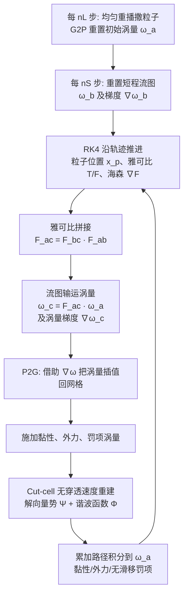

## 一句话总结

本文提出涡量粒子流图（Vortex Particle Flow Map, VPFM）方法：把涡量作为最适合在长程粒子流图上输运的物理量，用移动的涡量粒子承载涡量、涡量梯度以及流图的雅可比与海森矩阵，再在背景网格上重建速度，从而把传统 Vortex-In-Cell 方法"复活"为一个流图长度比现有最优方法长 3–12 倍、涡结构保持能力显著增强的仿真框架。

## 研究背景

- 领域现状：涡量方法把不可压 Navier-Stokes 方程改写为涡量形式 $$\frac{D\boldsymbol{\omega}}{Dt}=(\boldsymbol{\omega}\cdot\nabla)\boldsymbol{u}+\nu\Delta\boldsymbol{\omega}$$，天然凸显涡结构、保持环量，长期是湍流与复杂涡旋仿真的核心工具。其中 Vortex-In-Cell（VIC）是把 PIC/FLIP 从速度推广到涡量的混合方法，用粒子输运涡量、用网格做微分与泊松求解。近年来长程流图与规范变量（脉冲 / covector）结合的做法（如 NFM、PFM、EVM、Covector Fluids）在图形学中取得了低耗散的领先效果。
- 核心痛点：一方面，图形学社区几乎没有像拥抱 PIC/FLIP 那样采用 VIC，原因很直接——传统 VIC 在涡量保持上并没有明显优势，既不如纯拉格朗日涡方法细节丰富，也难以超过纯粒子涡方法。另一方面，现有流图方法都无法实现"稳健且长程"的流图：欧拉流图带来插值误差与畸变；选用速度 $$\boldsymbol{u}$$ 或脉冲 $$\boldsymbol{m}$$ 作为耦合变量会引入更强的奇异性而失稳；此前的粒子流图方法（如 PFM）又直接忽略或用邻域插值近似流图海森项，处理不当。
- 本文 idea：作者观察到涡量作为"线元 / 2-form"可以被长程流图几何式地输运，而粒子轨迹天然是一条完美的双向流图。既然涡量比脉冲更不易奇异、更适合长流图，就把"涡量粒子"升级为"涡量粒子流图"——不仅演化涡量，还演化涡量梯度、流图雅可比与海森，用它们精确重建当前涡量，从而绕开 VIC 的耗散瓶颈。

## 方法

VPFM 是一个混合欧拉-拉格朗日框架：物理量（涡量、涡量梯度、流图雅可比与海森）随涡量粒子演化，速度则在背景笛卡尔网格上重建。系统由三大部件组成：涡量粒子流图框架、精确海森演化格式、以及针对涡量方法的固体边界处理。

关键设计：

1. 涡量在流图上的输运。涡量随前向雅可比几何式地拉伸输运：
$$\boldsymbol{\omega}(\boldsymbol{x},t)=\mathbf{F}_t(\boldsymbol{x})\,\boldsymbol{\omega}(\boldsymbol{\psi}(\boldsymbol{x}),0)$$
在离散实现中，粒子从初始时刻 $$a$$ 演化到当前 $$c$$，用拼接后的雅可比得到当前涡量 $$\boldsymbol{\omega}^p_c=\mathbf{F}^p_{[a,c]}\boldsymbol{\omega}^p_a$$。涡量梯度则同时用到前向、后向雅可比与海森：
$$\nabla\boldsymbol{\omega}^p_c=\mathbf{F}^p_{[b,c]}\nabla\boldsymbol{\omega}^p_b\mathbf{T}^p_{[b,c]}+\nabla\mathbf{F}^p_{[b,c]}\boldsymbol{\omega}^p_b$$

2. 精确的海森演化。不同于 PFM 忽略海森、或用临时采样点插值海森，本文直接在粒子上沿轨迹演化流图海森，其物质导数满足：
$$\left[\frac{D(\nabla\mathbf{F})}{Dt}\right]_{ijl}=-(\nabla\mathbf{F})_{ijk}(\nabla\boldsymbol{u})_{kl}+(\nabla\boldsymbol{u})_{ik}(\nabla\mathbf{F})_{kjl}+(\nabla\nabla\boldsymbol{u})_{ilk}\mathbf{F}_{kj}$$
这个"完美海森"避免了在无结构、随机分布粒子上做有限差分带来的不稳定与不对称，在长流图（$$n_L=40$$）下给出更光滑的涡管与涡环。

3. 自适应流图长度。高阶量（如 $$\nabla\boldsymbol{\omega}$$）因额外求导会放大误差，需要更短的流图；而涡量本身用更长的流图能更好地抑制耗散。因此系统维护两段雅可比：完整轨迹 $$\gamma^p_{a\to c}$$（长度 $$n_L$$）用于涡量，短段 $$\gamma^p_{b\to c}$$（长度 $$n_S$$）用于涡量梯度，二者通过雅可比拼接 $$\mathbf{F}^p_{[a,c]}=\mathbf{F}^p_{[b,c]}\mathbf{F}^p_{[a,b]}$$ 相连。

4. 无穿透边界：SPSD Cut-Cell。速度按 Helmholtz 分解为无旋谐波分量与螺线管涡量分量 $$\boldsymbol{u}=-\nabla\Phi+\nabla\times\boldsymbol{\Psi}$$。先解三个泊松方程求向量势 $$\Delta\boldsymbol{\Psi}_d=-\boldsymbol{\omega}_d$$ 得到 $$\boldsymbol{u}_\omega=\nabla\times\boldsymbol{\Psi}$$，再用有限体积 cut-cell 方式解拉普拉斯方程 $$\Delta\Phi=0$$ 强加曲面上的无穿透条件。该系统是稀疏、对称、半正定（SPSD）的，可用 AMGPCG 求解——这是涡量方法中首个用于网格速度重建的 SPSD cut-cell 格式，避免了体素化带来的阶梯状伪影。

5. 无滑移边界：简化 Brinkmann 罚项。传统 Brinkmann 罚项需对整个固体域惩罚、且要多次泊松求解才能同时逼近无穿透与无滑移。本文只在贴近固体边界约半个网格的切向速度上施加罚项，把罚项速度经旋度转成罚项涡量 $$\boldsymbol{\omega}_{pen}=\lambda(\nabla\times\boldsymbol{u}_{pen})$$，再当作外力沿轨迹以路径积分方式回注到初始粒子涡量上。由于无穿透条件已单独求解，整个流程每步只需一次速度重建（SVR），罚项系数 $$\lambda$$ 还可当作调节涡量脱落强度的可调参数。

6. 黏性与外力。基于基本涡量公式，黏性与外力都写成沿轨迹的路径积分乘以前向雅可比，例如黏性项 $$\boldsymbol{\Gamma}_{\nu,t}=\mathbf{F}_t\int_0^t\mathbf{T}_\tau\,\nu\Delta\boldsymbol{\omega}\,d\tau$$，在网格上算好后插值到粒子、乘后向雅可比并累加进初始涡量。

## 实验结果

作者在 Taichi + CUDA/C++ 上实现，测试机为 Intel i9-14900KF、64GB 内存、NVIDIA RTX 4090（24GB）。核心结论是流图长度比现有最优方法长 3–12 倍，3D 中涡结构保持时间最长可达 30 倍。

- 相同挑战性长流图下的稳定性（2D leapfrog $$n_L=240$$、3D leapfrog $$n_L=100$$，而以往流图方法上限约 20）：2D 中本方法可无限稳定运行，而 NFM、PFM、EVM 分别在 0.7s、1.3s、3.5s 爆掉；3D 爆炸时间上，NFM 为 1.4，PFM 为 1.5，EVM 为 8.8，本方法去掉海森为 21.6，完整版为 42.2，即分别约为 NFM、PFM、EVM 的 30.1×、28.1×、4.8×，且海森项几乎让稳定时间翻倍。

- 各方法用各自最优流图长度对比：本方法在 2D leapfrog 用到 $$n_L=240$$（是 PFM 的 12 倍），3D leapfrog 用 60，trefoil knot 用 40；而 NFM/PFM/EVM 的最优值分别只在 10–30 区间。2D leapfrog 中两对涡维持分离的时间：本方法 613s，PFM 573s，NFM 346s，EVM 213.1s，CF-vortex 157s，CO-FLIP 71.3s，APIC-vortex 10.2s，BFECC 9.9s，VIC 与 IPIC 各 9s。用 CO-FLIP 的初始速度场时，本方法可保持涡结构超过 600s（CO-FLIP 原文报告 500s）。

- 3D 长流图综合分析（Table 5）：能保持稳定的最长流图长度 $$n_L$$，本方法为 65（去掉海森为 60），EVM 为 40，PFM 为 30，NFM 为 20；3D leapfrog 完成的"跳跃"次数，本方法达 7 次，其余方法最多 5 次。海森项在 $$n_L=65$$ 时把原本会爆炸的模拟稳定住，并在 $$20\le n_L\le 60$$ 区间提升最终能量。

- Casimir 不变量：本方法几乎完美保持涡量二阶矩（熵），四阶矩仅轻微下降，优于多个基线。

- 边界与黏性验证：cut-cell 让涡环绕球、绕柱的流动更圆滑，消除体素化的阶梯脱落；简化 Brinkmann 无滑移在 $$Re=1000$$ 薄板与 $$Re=9500$$ 圆盘上与迭代/多分辨率 Brinkmann VIC 结果高度一致；2D 顶盖驱动方腔在 $$Re=100$$ 至 $$10000$$ 下与 Ghia 等人的经典数据在中点涡量、中心线速度极值上高度吻合（例如 $$Re=10000$$ 时中点涡量本方法 47.943 对参考 46.827）。

- 精度：2D Taylor-Green 涡实验中经验收敛阶约为 2.5 阶（不同时刻在 32–128 分辨率区间可达三阶）。

- 性能：3D leapfrog（短域）每步约 0.43s（含海森）/0.40s（不含），GPU 显存 13.34GB/9.95GB；瓶颈是 P2G（约占总时间 50%，主要因原子操作）。尽管本方法要解三个泊松方程（PFM 只解一个），凭借高效 CUDA 泊松求解器仍比 PFM 更快，代价是更高的显存占用。移动固体场景（游泳的蛇颈龙、旋转螺旋桨）可用 $$n_L=30$$，而以往方法上限仅 8（NFM/EVM）或 12（PFM）。

## 亮点与局限

亮点：
- 提出"涡量是最适合长程流图的规范变量"这一核心洞见，并给出理论依据：脉冲重建速度 $$\boldsymbol{u}=\boldsymbol{m}-\nabla(\Delta^{-1}(\nabla\cdot\boldsymbol{m}))$$ 比涡量重建 $$\boldsymbol{u}=-\nabla\times\Delta^{-1}\boldsymbol{\omega}$$ 多一次求导，因而更奇异、更不适合长流图。
- 首次在粒子流图上精确演化海森项，替代此前的忽略或插值近似，显著提升长流图稳定性与光滑度，且该海森格式还能反哺 PFM（让 PFM 多保持一次 leapfrog 跳跃）。
- 首个用于涡量方法网格速度重建的 SPSD cut-cell 系统，兼容 MGPCG 类快速求解器，处理曲面边界不产生阶梯伪影。
- 简化 Brinkmann 罚项把无滑移逼近做到每步单次速度重建，成本低、易实现。
- 把长期处于图形学边缘的 VIC 方法重新做成了 state-of-the-art。

局限：
- 不支持双向固-流耦合，也不能处理自由表面。
- 无滑移条件仍是近似而非精确强加。
- 非单连通域上谐波分量的真实动力学未纳入求解。
- 黏性用显式格式，黏性较大时可能失稳；P2G 的原子操作是当前性能瓶颈；3D 中流图长度 $$n_L$$ 一般不宜超过 60。

## 延伸思考

- "选对规范变量比堆求解器更关键"是这条流图路线的共同主题：从速度到脉冲再到涡量，本质是在寻找一个在长程输运下奇异性最小、量级最稳定的载体。VPFM 把这条思路推到涡量，未来能否找到更"温和"的变量或混合表示仍是开放问题。
- 精确海森演化的思想具有普适性——只要用粒子承载流图，高阶量的"直接演化"往往优于"事后插值"，这对可微仿真、伴随求解等需要高阶导数的场景可能有价值。
- 局限中"两相耦合、自由表面、精确谐波动力学"恰是流图涡量方法走向实际生产（如带气泡、带自由液面的特效）的关键缺口，也是这个框架最自然的后续扩展方向。
- P2G 原子操作瓶颈提示，结合 GPU-MPM 类的并行转移技术，方法还有明显的加速空间。
