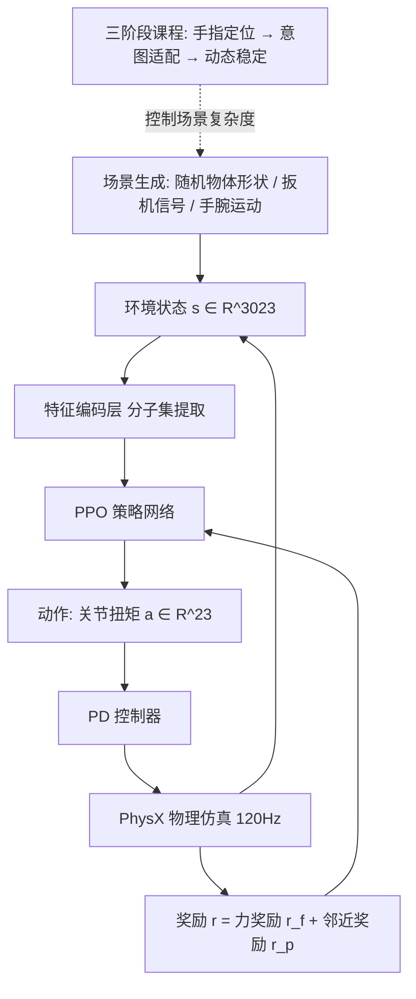

## 一句话总结

本文提出 ForceGrip，一个无需动捕参考数据、通过三阶段课程学习训练的深度强化学习智能体，能把 VR 手柄扳机输入忠实翻译成可连续调节的抓握力，从而在虚拟现实里合成既视觉自然又物理可信的手部操作动作。

## 研究背景

- 领域现状：沉浸式手部交互是 VR 体验的核心。手柄接口因易用、响应快而普及，但大多数方案只关注视觉上合理的手部动作，用简单的二值扳机信号驱动，忽略了抓握力的精细控制。
- 核心痛点：现实中人会根据物体重量、易碎程度、摩擦持续微调握力，让物体在不同力度下滑落或稳固。但传统数据集与动捕技术几乎不包含接触力、手指扭矩这类物理属性，导致现有方法只会施加"千篇一律的紧握"，无法反映用户意图的力度。基于穿透模型的手部追踪需要逐指标定、可用性差；附着式方法用固定动画闭合手指、缺乏物理真实感；VR-HandNet 虽然从动捕数据推断关节扭矩，但数据里缺物理属性，无法精确控制握力。
- 本文 idea：抛开动捕参考，直接用程序化随机生成的训练场景（随机物体形状、扳机输入流、手腕运动）逼迫智能体面对广谱物理交互；再用由易到难的三阶段课程学习稳定训练，并引入邻近奖励引导自然的指尖接触。

## 方法

### 整体框架

ForceGrip 在 Unity + NVIDIA PhysX 中运行，物理仿真以 120 Hz 更新，学习智能体以 30 Hz 决策。每个时间步智能体输出手指关节的扭矩，由比例-微分（PD）控制器转成手部姿态并驱动物体交互。训练用 PPO 强化学习、576 个并行智能体，并采用早停：物体离手腕超过 10 cm 就终止该回合，避免在不可恢复状态上浪费计算。训练时手腕沿预设路径运动，实际使用时则跟随 VR 手柄。

### 关键设计一：状态、动作与奖励

智能体接收环境状态 $$s \in \mathbb{R}^{3023}$$，输出动作 $$a \in \mathbb{R}^{23}$$。状态含三部分：手部信息 $$H = \{p, q, v, w, \alpha\}$$（关节位置、DoF 角度、线速度、DoF 速度与加速度）；物体信息 $$O = \{o_g, v_{gvs}, v_{lvs}, c, n\}$$，其中包含手腕坐标下的重力向量、挂在手腕上的全局体素传感器 $$v_{gvs} \in \mathbb{R}^{450}$$（2 cm 网格）、挂在每个碰撞体上的局部体素传感器 $$v_{lvs} \in \mathbb{R}^{2160}$$（0.5 cm 网格）、关节到物体表面的最近点向量 $$c$$ 与对应法向 $$n$$——这种双分辨率感知在细节与泛化之间取得平衡，避免对特定形状过拟合；任务信息 $$T = \{f, u, p\}$$ 含各碰撞体当前受力、过去 6 帧（0.2 s）的扳机信号历史、上一步动作。

奖励由两项组成。力奖励衡量实际合力与目标力的差距：

$$r_f = \exp[-1.0(\|(\sum_k \|f_k^t\|) - f_t^{target}\|^2)]$$

目标力由用户输入决定 $$f_t^{target} = f_{max} \cdot \bar{u}_t$$，其中最大握力 $$f_{max} = 10\ \text{kgf}$$，$$\bar{u}_t$$ 是最近六帧的平均扳机信号（该上限可按设备需求调整）。为避免只用任务奖励导致僵硬不自然的手势，再加邻近奖励引导初始接触：

$$r_p = \sum_j w_j \exp[-0.07\|c_j^t\|^2]$$

五个指尖及其相邻关节权重更高（0.0625），其余为 0.03125，从而鼓励"指尖优先"的自然接触。最终奖励 $$r = r_f + r_p$$。值得注意的是，作者的目标不是保证任何物体都能被举起，而是仅反映用户意图的力度——力不够物体就该滑落，用户只控制力度大小，不控制抓/放，滑落是设计使然。

### 关键设计二：无参考的训练场景生成

为摆脱数据集覆盖有限的问题，作者程序化生成 3 秒（90 帧）的训练场景，含三类随机因子：物体随机化（沿三轴以 0.5 到 1.5 缩放并随机摆放，前 0.5 秒物体设为运动学状态先稳定姿态）；扳机变化（正弦函数叠加高斯噪声，变频率、幅度、偏移，防止对单一控制模式过拟合）；手腕运动（移除地板后引入随机的手腕加速度，最高 $$2\ m/s^2$$、角加速度最高 $$360°/s^2$$，模拟真实的动态条件）。用轻质物体（0.01 kg）来削弱质量影响，防止智能体为怕掉物而一味用力。

### 关键设计三：三阶段课程学习

随机高复杂度场景直接训练很难收敛，于是把训练拆成由易到难的三阶段，每阶段建立在前一阶段技能之上：

1. **手指定位（Finger Positioning）**：只开物体随机化，关闭扳机变化与手腕运动，手腕固定、扳机取常值，让智能体先掌握碰撞处理与初始握持等基础行为。训练 1200 epoch。
2. **意图适配（Intention Adaptation）**：加入扳机变化，要求智能体实时解读波动信号并施加成比例的力。训练 400 epoch。
3. **动态稳定（Dynamic Stabilization）**：再加入手腕运动，带来突变的朝向与加速度，策略必须在重力与惯性剧烈变化时保持接触力不脱手。训练至奖励收敛（经验上约 800 epoch）。

## 实验结果

作者从 100,000 个回合采集数据，用三项指标评估课程设计与消融：回合成功率 ESR、平均邻近奖励 PR、平均力奖励 FR。对比六种课程（C1 基线 P1→P2→P3；C2 交换因子；C3 合并 P2、P3；C4 合并 P1、P2；C5 为 C2 合并 P1、P2；C6 无课程 P1+P2+P3）以及两项消融（PR× 去掉邻近奖励、EL× 去掉特征编码层）。

| 配置 | ESR (%) ↑ | PR ↑ | FR ↑ |
| --- | --- | --- | --- |
| C1（本文课程）| 81.30 | 0.635 | 0.607 |
| C2（交换因子）| 73.96 | 0.601 | 0.594 |
| C3（合并 P2+P3）| 74.33 | 0.595 | 0.601 |
| C4（合并 P1+P2）| 75.33 | 0.589 | 0.123 |
| C5（C2 合并 P1+P2）| 77.06 | 0.605 | 0.120 |
| C6（无课程）| 79.38 | 0.607 | 0.126 |
| PR×（去邻近奖励）| 43.26 | 0.014 | 0.133 |
| EL×（去编码层）| 83.44 | 0.657 | 0.460 |

不以 P1 开头的课程（C4、C5、C6）全程奖励明显偏低，且 FR 显著下降，说明过早引入高级随机化（手腕运动或动态扳机）会让力控制学不好——先学稳定手指接触很关键。去掉邻近奖励（PR×）性能大幅崩塌，尤其 ESR 与 PR。去掉编码层（EL×）虽在 ESR 与 PR 上更高，但 FR 明显走低：缺少特征提取后网络难以吸收像 $$u \in \mathbb{R}^6$$ 这类关键低维输入，导致智能体倾向于过度用力而非精细调节握力。本文课程 C1 在保真与力控制之间取得最佳综合平衡。

用户研究招募 20 名被试，与两个 SOTA 手柄接口方法对比：Attachment（AT）与 VR-HandNet（VH）。E1 拾放任务用真实感问卷 RQ 评视觉真实感，ForceGrip 显著优于 VH 与 AT。E2 捏罐任务用力真实感问卷 FRQ 评物理体验（AT 不支持物理交互被排除），ForceGrip 在所有指标上显著优于 VH。关键地，作者绘制扳机输入与实测握力的相关：ForceGrip 呈清晰线性相关（$$r = 0.884$$，贴合参考线 $$y = 10x$$），而 VH 几乎无相关（$$r = 0.073$$），无论扳机大小都产生过大握力——印证 VH 缺乏可靠的力度缩放机制。前后测的模拟器眩晕问卷无显著变化，说明晕动影响很小。

## 亮点与局限

亮点：

- 无参考训练：完全不依赖动捕数据，用程序化随机场景就合成出视觉与物理都可信的手部操作，绕开了数据集覆盖受限的老问题。
- 用户可控握力：把用户的握力意图忠实翻译为真实手部动作，扳机与握力线性相关（$$r = 0.884$$），显著提升交互精度与沉浸感。
- 有效的课程学习：三阶段"手指定位→意图适配→动态稳定"渐进增加复杂度，实验证明先学稳定接触再引入动态因子对收敛与力控制至关重要。
- 邻近奖励与双分辨率体素感知等设计经消融验证，对自然手势与精细力控有实质贡献。

局限：

- 控制信号是 [0, 1] 的一维量，虽兼容性好，但难以支持手内操作或工具专用调节（如剪刀、筷子），需要更丰富的输入结构。
- 碰撞与摩擦建模仍有提升空间，SDK 提供的胶囊碰撞体指尖过圆导致偶发物体滑落；软体仿真可能带来更稳定、更逼真的接触动力学。
- 缺乏触觉反馈让精细力控更难，被试反映单食指扳机控制力度略显不自然，这更多是消费级 VR 硬件的限制。

## 延伸思考

ForceGrip 最有启发的点是"用奖励定义意图，而非用参考动作定义结果"：它不追求把每个物体都举起来，而是让力度忠实映射用户输入，滑落被当成合理的物理后果。这种把"用户意图"直接编码进奖励、放弃模仿参考的思路，很适合迁移到其他缺乏高质量物理动捕的交互任务。课程学习的消融也再次印证了"因子解耦、由易到难"在高维随机环境里的价值——同时抛出所有随机因子（C6）几乎学不好力控制。

未来若把一维扳机扩展为多维输入（配合力反馈手套或自适应扳机），并引入软体接触建模，ForceGrip 这套无参考课程学习框架有望支撑更复杂的手内操作与工具使用，让 VR 里的"手感"更接近现实。
