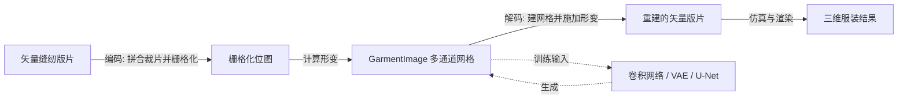

## 一句话总结

GarmentImage 把服装缝纫版片的几何、拓扑与身体上的摆放位置统一编码成多通道规则网格（栅格数据），从而让简单的卷积网络就能获得连续的隐空间，并对训练时未见过的服装拓扑具备更强的泛化能力。

## 研究背景

缝纫版片（sewing pattern）是服装设计的底层语言，它由一组二维裁片（panel）组成，并附带裁片边界之间的缝合关系（stitching）以及每片在人体上的摆放信息。当前主流的数字化表示是"矢量表示"：把每个裁片描述为一串直线和曲线，再记录裁片之间的缝合与摆放。这套表示是为计算机辅助设计（CAD）而生的，并没有考虑机器学习的需求，因而在学习式方法里暴露出两个核心问题：

- 隐空间不连续：两个整体二维形状相近、但拓扑不同的版片，往往裁片数量和裁片拓扑都不一样。矢量表示编码出的隐空间在不同拓扑之间会出现明显跳变，插值时容易生成非法版片。
- 对未见拓扑泛化差：视觉上相近的输入（图像或三维披挂结果）可能对应差异极大的矢量版片，这抬高了模型的 Lipschitz 上界，削弱泛化能力。此外，处理不同服装类型意味着裁片数量可变，模型必须把输入隐式映射到预定义裁片池里的一个离散子集，这种离散选择在遇到未见拓扑时尤其困难。

作者由此提出用栅格数据来统一表达版片，把"拓扑变化"从离散的裁片选择转化为网格结构内部的连续变化。

## 方法

### 整体框架

GarmentImage 是连接"矢量版片"与"机器学习模型"的中间数据结构。给定矢量版片，编码过程把它转成 GarmentImage 供网络输入；模型生成 GarmentImage 后，解码过程再确定性地重建回矢量版片，接入仿真等既有流程。

### 关键设计

表示由四个核心概念构成，落在前后两层网格上：

- 层（Layer）：用前层和后层两张二维网格分别嵌入人体正面和背面的裁片，两张网格像三明治一样夹住 T-pose 人体；相邻网格单元对应人体表面上相邻的区域。跨越正反面的裁片会被切分为前后两部分并沿边界缝合。
- 内外标志（Inside/Outside Flag）：每个单元用一个标志表示该处是否被版片覆盖。
- 边类型（Edge Type）：每个单元有四条边，每条边记录边界与缝合信息，共四种类型——NON-BOUNDARY（不在边界或缝线上）、NON-STITCH（在边界但不缝合，可用于带孔裁片）、FRONT-TO-BACK（与对侧层同位置边缝合）、SIDE-BY-SIDE（与同层相邻单元的边缝合）。摆放位置则由裁片对应单元在网格上的坐标隐式表达。
- 形变矩阵（Deformation Matrix）：单元本身是正方形，而它对应的裁片局部区域是任意四边形，形变矩阵 $$F \in \mathbb{R}^{2\times4}$$ 用四个列向量（各为一条边的形变向量 $$f \in \mathbb{R}^{2\times1}$$，定义为边终点减起点 $$\bar{v}_j - \bar{v}_i$$）描述从正方形到四边形的映射。

编码过程：先按摆放信息把裁片分成前/后裁片（跨越正反面者切分）；对齐待缝合的接缝边后，把裁片顶点坐标离散到网格中，单元中心落在某裁片内即标为 inside。因为事先对齐了接缝，离散化能保证缝合裁片在网格上相邻、裁片间无缝隙或重叠，并且能处理不同长度接缝之间的缝合（例如腰头）。随后自动判定边类型，并为每个单元求解形变矩阵。形变通过一个带线性约束的最小二乘问题得到：

$$\arg\min_{\bar{v}} \left\{ \sum_{(i,j)\in E} \left\| (\bar{v}_j - \bar{v}_i) - (v_j - v_i) \right\|^2 \right\} \quad \text{s.t.} \quad C\bar{v} = c$$

其中 $$v_i$$ 与 $$\bar{v}_i$$ 分别是形变前后第 $$i$$ 个顶点位置，约束矩阵 $$C$$ 强制边界顶点落到裁片边界曲线的目标位置 $$c$$，用拉格朗日乘子法求解。

解码过程（确定性、全自动，分三步）：

- 单元聚类得到裁片：把标记为 inside 且被边界边（NON-STITCH、FRONT-TO-BACK、SIDE-BY-SIDE）包围的单元分组，每组对应一个裁片。
- 裁片形状恢复：从单元组构造四边形网格并求解另一个最小二乘问题，让恢复出的边尽量匹配嵌入的形变向量，同时保持网格在栅格上的位置：

$$\arg\min_{\hat{v}} \left\{ \sum_{(i,j)\in E} \left( (\hat{v}_j - \hat{v}_i) - f_{ij} \right)^2 + \sum_{v_i \in V} (\hat{v}_i - v_i)^2 \right\}$$

- 缝合与摆放恢复：把网格边类型迁移到对应的裁片曲线边上，得到缝合关系；单元在网格中的位置给出裁片在人体上的摆放，从而可重建三维服装网格用于仿真，或生成可裁剪缝制的二维版片。

实验统一采用 $$16 \times 16$$ 网格、每单元 34 通道（shape 为 (34, 16, 16)）：前后层各 17 通道，其中 1 通道为内外标志、8 通道以两个长度为 4 的 one-hot 向量编码底边与左边的边类型、8 通道表示形变矩阵。

## 实验结果

作者在三个下游任务上验证 GarmentImage 的优势，数据集通过对已有缝纫版片数据集随机化参数采样、再自动编码而来。

- VAE 隐空间探索：用 GarmentImage 训练 CNN-based VAE（32 维隐空间），与基于矢量表示、用 Transformer-based VAE（借鉴 Sewformer 与 Motionformer）作对比。在不同拓扑之间做隐空间插值时，GarmentImage VAE 呈现连续过渡与裁片的无缝合并（如把裙片连续分裂为两片裤腿），而矢量 VAE 出现离散跳变、常生成非法版片。外推实验中，把"从连体衣到上装+裤"的隐向量差施加到裙装上，GarmentImage VAE 能正确把裙装分裂为上装与裙片，甚至能生成训练未见的版片（如上装+裙、两片裙装），矢量 VAE 则失败。

- 文本驱动版片编辑：在上述 VAE 隐空间上做基于优化的编辑。用 Stable Diffusion 作文生图器，额外训练一个图像解码器把隐码映射为 $$64 \times 64$$ 的仿真服装图（正面、棕色渲染），再用 SDS 损失优化隐码以贴合文本提示。结果显示初始版片能随提示调整几何乃至拓扑，例如在提示"pants"下把一片式裙装变成上装+裤，同时保留原上身廓形。

- 图像到版片预测：用简单的三段式 U-Net 依次预测内外标志、边类型、形变矩阵（内外标志与形变用 L2 损失，边类型用交叉熵），与 Sewformer、NeuralTailor 对比。设置两种泛化测试：D1 面向"全新拓扑"（训练 dress/jumpsuit/top+pants，测试 top+skirt），D2 面向"未见裁片组合"（训练里各裁片都出现过，但 top+sleeves+pants 的组合未出现）。GarmentImage 能正确预测分离的裙片和新的裁片组合，而 Sewformer 常退化为训练中已有版片、漏掉袖片或生成非法版片。

在 D2 上以裁片对齐质心后计算预测与真值的 IoU（NeuralTailor 的点云编码器替换为预训练 ResNet-50 以接受图像输入）：

| 方法 | 已见组合 (Seen) | 未见组合 (Unseen) |
| --- | --- | --- |
| NeuralTailor | 0.8390 | 0.3131 |
| Sewformer | 0.9311 | 0.4260 |
| Ours | 0.9304 | 0.8127 |

在已见组合上本方法比 NeuralTailor 高 9.1%、与 Sewformer 相当；在未见组合上则大幅领先两个基线（0.8127 对 0.4260 / 0.3131）。

## 亮点与局限

亮点：

- 用统一的栅格结构同时编码几何、拓扑与摆放，使拓扑变化变为网格内部的连续变化，隐空间更平滑。
- 表示天然是二维数值矩阵，可直接复用成熟的栅格图像生成建模技术，仅用简单 CNN/U-Net 就能取得优于 Transformer 式基线的泛化表现。
- 预测时整体生成 GarmentImage 再确定性解码出裁片，绕开了矢量方法中"从预定义裁片池离散选择"的难题；能自然表示带孔裁片、省道（dart）、腰头等特征。

局限：

- 重建版片边界可能不够光滑，需提高网格分辨率并加后处理平滑。
- 表示非唯一：同一版片可被编码成疏密不同的网格，需要一致的转换策略以免影响训练。
- 自动编码目前只适配较简单服装（如裙装、连体衣），在 NeuralTailor 数据集裙装上成功率为 89.88%，失败样本用简单规则过滤剔除；复杂服装可能需人工标注。
- 网络也可能输出非法 GarmentImage（多因边类型预测错误），作者对两类可自动检测的错误做规则修正，更复杂的不一致仍需人工介入。
- 当前实验用正面视角的仿真渲染图，尚未接入真实图像；表示也需扩展更多服装特征（如领、袖口、口袋可作新层，而 tuck 需要新的 TUCK 边类型）。

## 延伸思考

GarmentImage 的核心思路是把"离散、可变数量、拓扑各异"的结构对象改写成"固定尺寸、规则排布"的栅格张量，从而把结构预测转化为图像式的稠密预测——这与 Geometry Images、Polycube/Polysquare 把三维曲面或二维形状映射到网格空间的做法一脉相承。它的价值不仅在服装领域：任何存在"拓扑离散跳变导致隐空间不连续"的结构生成任务（如版式布局、图结构、装配件），都可能借助这种"栅格化中间表示 + 确定性解码"的范式来换取更连续的隐空间与更好的泛化。值得追问的是分辨率与表示唯一性之间的权衡：更高分辨率能改善边界光滑度，但会放大非唯一性和无效预测的空间，如何在编码策略或损失中显式约束合法性，可能是把该表示推向复杂真实服装的关键。
