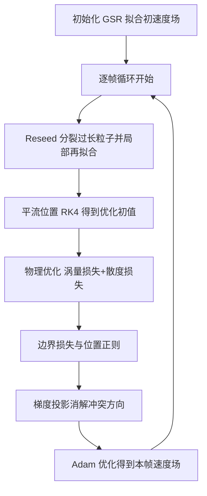

## 一句话总结

本文提出高斯空间表示（Gaussian Spatial Representation, GSR）——用一组带权高斯函数的加权和来连续、可微地表示流体速度场，配合一套面向流体动力学定制的一阶物理优化框架，在完全无网格、无粒子离散的前提下求解不可压 Navier-Stokes 方程，从而以极低内存获得高保真的涡结构保持与自适应空间精度。

## 研究背景

- 领域现状：传统流体求解器依赖网格（欧拉）或粒子（拉格朗日）离散，或二者的混合方案，这些直接的空间离散便于高效求解时间演化，长期是流体仿真的主流。
- 核心痛点：欧拉方法因缺乏连续性易产生数值黏性；SPH 等拉格朗日方法精度有限、难以捕捉细结构；混合方法在两种离散之间传递数据时又引入数值误差。这些问题虽可用海量内存缓解，却会陷入维度灾难。近期兴起的隐式神经表示（INR）虽然连续、自适应，但计算代价大、收敛慢，且难以强加硬物理约束，缺乏统一高效的 PDE 求解策略。
- 本文 idea：受 3D Gaussian Splatting 在多视图重建中强表达力的启发，作者把连续流速场建模为多个高斯函数的加权和。该表示天然连续可微，能直接解析地推导空间微分量，进而通过为流体量身定制的一阶优化求解时间相关 PDE。相比 INR，GSR 在鲁棒性、精度、通用性与时间演化的计算效率上更优。

## 方法

### 整体框架

求解器主干是"初始化 → 逐帧物理优化"的循环。仿真开始时，先把 GSR 拟合到给定初速度场；此后每个时间步依次执行：重置（reseed，对过度拉长的高斯粒子做分裂与局部再拟合）→ 平流位置（把高斯粒子视作拉格朗日粒子，用 RK4 沿速度场移动作为优化初值）→ 物理优化（用涡量、散度、边界等物理损失把 GSR 训练到下一帧的速度场）。整个过程无需网格或压强/泊松求解，也无需逐场景调参。

### 关键设计一：高斯空间表示与直接可微

每个 $$d$$ 维（$$d\in\{2,3\}$$）高斯函数写作 $$G_i(\boldsymbol{x})=\exp\left(-\tfrac{1}{2}(\boldsymbol{x}-\boldsymbol{\mu}_i)^\top\boldsymbol{\Sigma}_i^{-1}(\boldsymbol{x}-\boldsymbol{\mu}_i)\right)$$，其逆协方差可分解为 $$\boldsymbol{\Sigma}_i^{-1}=\boldsymbol{R}_i\boldsymbol{S}_i^{-1}\boldsymbol{S}_i^{-1}\boldsymbol{R}_i^\top$$（旋转在 2D 用角度、3D 用四元数表示）。速度场即所有高斯的加权和 $$\tilde{\boldsymbol{v}}(\boldsymbol{x})=\sum_{i=1}^{N}\boldsymbol{v}_i G_i(\boldsymbol{x})$$。与依赖自动微分的 INR 不同，GSR 的梯度可从定义直接解析得到 $$\nabla\tilde{\boldsymbol{v}}(\boldsymbol{x})=-\sum_{i\in\mathcal{N}(\boldsymbol{x})}G_i(\boldsymbol{x})\boldsymbol{v}_i(\boldsymbol{x}-\boldsymbol{\mu}_i)^\top\boldsymbol{\Sigma}_i^{-1}$$，散度与旋度也可自然导出，且计算复杂度与评估场值本身相同，为强加物理约束带来显著的效率优势。

### 关键设计二：局部截断与哈希加速

原始 GSR 单点求值需 $$O(N)$$ 次运算，随查询规模增大不可承受。作者利用高斯随距离快速衰减的特性引入截断高斯 $$\hat{G}_i(\boldsymbol{x})$$：当 $$G_i(\boldsymbol{x})\ge c$$ 时取 $$G_i(\boldsymbol{x})-c$$（减去阈值 $$c$$ 以避免核函数不连续），否则取 0。再用哈希表按空间局部性存储粒子，实现只检索邻近粒子，把单次查询复杂度降到 $$O(1)$$。

### 关键设计三：物理引导的一阶优化与损失设计

时间积分被表述为优化问题。初始化阶段用值损失 $$\mathcal{L}_{\text{val}}$$、梯度损失 $$\mathcal{L}_{\text{grad}}$$ 以及各向异性正则 $$\mathcal{L}_{\text{aniso}}$$、体积正则 $$\mathcal{L}_{\text{vol}}$$ 拟合初场。逐帧演化阶段的核心是涡量损失 $$\mathcal{L}_{\text{vor}}$$（把当前旋度逼近由上一帧输运来的涡量场；2D 中涡量沿速度平流，3D 中按 $$\tfrac{D\boldsymbol{\omega}}{Dt}=\nabla\boldsymbol{u}\cdot\boldsymbol{\omega}$$ 用双向流图输运）与散度损失 $$\mathcal{L}_{\text{div}}$$（软性强加无散度约束），再加上两类边界损失、位置惩罚 $$\mathcal{L}_{\text{pos}}$$ 及各向异性/体积正则的加权组合，最后用 Adam 优化。该方案绕开了压强场与泊松方程求解，也免除了 INR 优化中的三阶导数计算，带来约六倍性能提升。

### 关键设计四：梯度投影消解损失冲突

涡量损失与散度损失的梯度方向可能相互矛盾（点积为负），沿其一下降会抬高另一个。借鉴多任务学习中的梯度手术策略，当检测到冲突时，把两者的梯度分别投影到对方的正交方向：$$\boldsymbol{g}_{\text{vor}}=\nabla_\Theta\mathcal{L}_{\text{vor}}-(\nabla_\Theta\mathcal{L}_{\text{vor}}\cdot\boldsymbol{t}_2)\boldsymbol{t}_2$$ 与 $$\boldsymbol{g}_{\text{div}}=\nabla_\Theta\mathcal{L}_{\text{div}}-(\nabla_\Theta\mathcal{L}_{\text{div}}\cdot\boldsymbol{t}_1)\boldsymbol{t}_1$$，使沿一方向前进不影响另一损失，从而加大有效步长、减少涡量场的涟漪伪影。

### 关键设计五：边界采样与重置分裂

边界处理只需在域边界上采样点，通过无滑移（$$\boldsymbol{u}=\boldsymbol{u}_b$$）与自由滑移（$$\boldsymbol{u}\cdot\boldsymbol{n}=f$$）两类边界损失施加约束，无需显式切割单元即可处理复杂几何。重置阶段则在每步开始时对最大尺度不小于最小尺度约 $$r_{\text{aniso}}$$ 倍的过长粒子做分裂：新粒子位置从原高斯分布采样、最大尺度减半，随后仅对新粒子及其邻居做局部再拟合，以在湍流拉伸下维持表达力。

## 实验结果

主实验用 Taylor-Green 涡这一具有解析解的算例做定量对比：不可压无黏流的速度场应保持恒定，作者以模拟速度场与解析解在 $$60\times60$$ 网格上的均方误差（MSE）衡量各方法的数值误差。下表为不同帧的 MSE（数字忠于原文）：

| 帧 | Eulerian | INSR | NMC | Ours |
| --- | --- | --- | --- | --- |
| 0 | $$2.432\times10^{-4}$$ | $$8.998\times10^{-7}$$ | $$1.829\times10^{-4}$$ | $$9.957\times10^{-8}$$ |
| 50 | $$9.757\times10^{-3}$$ | $$1.715\times10^{-5}$$ | $$6.492\times10^{-4}$$ | $$2.510\times10^{-7}$$ |
| 100 | $$2.019\times10^{-2}$$ | $$1.992\times10^{-5}$$ | $$1.725\times10^{-3}$$ | $$2.181\times10^{-7}$$ |

可见本方法误差比 INR 类方法低数个量级，而半隐式欧拉方法误差最高。性能与内存方面（RTX 4090，运行时间单位秒、内存单位 KB）：Taylor-Green 上本方法运行时间 38 秒、576 粒子、仅 17.9 KB，优于 INSR（403 秒、32.1 KB）与 NMC（39 秒、103.8 KB）；Taylor 涡上本方法 63 秒对 INSR 378 秒，约六倍加速；Karman 涡街上本方法 214 秒、内存 598.6 KB；三个 3D 算例（Leapfrog 3D、Ring collide、Smoking bunny）均为 64000 粒子、3252.2 KB、约 200–228 秒。定性上，本方法在 Taylor 涡中比 512×512 欧拉网格、128×128+65536 粒子的 FLIP 及 SPH 更好地保持薄涡结构且内存更省（少于 5600 粒子）；在 Karman 涡街中稳定生成涡脱落，而 NMC 在域边界出现数值不稳定；在涡对穿双球障碍算例中正确建模了谐波分量，成功穿越缝隙，优于保守谐波分量的涡粒子法。消融实验表明：粒子分裂对保持 Taylor 涡的薄丝结构必不可少；梯度投影消除了涡量场涟漪伪影；平流初值把投影平均迭代数从 4661.3 降到 3902.5 并改善流速一致性。

## 亮点与局限

亮点：

- 把 3D Gaussian Splatting 的强表达力迁移到流体求解，首次系统性地用带权高斯和作为连续、可微、内存高效的速度场表示，并证明其空间导数可解析直算、与场值评估同复杂度。
- 一阶物理优化框架无需求解压强/泊松、无需三阶导数，相比 INR 类方法约六倍加速，且全程 2D/3D 各用一套参数、无需逐场景调参。
- 梯度投影、平流初值、粒子分裂重置等设计共同带来长时稳定性、优异的涡量保持与自适应空间精度，并能隐式处理谐波分量与复杂边界几何。

局限：

- 依赖软约束求解 Navier-Stokes，散度与边界条件存在小残差，可能导致与网格法在全局流体行为上的偏差。
- 谐波分量仅隐式保持、未做时间一致的显式建模，在非单连通域仿真中可能不准确。
- 一阶优化的求解速度与硬约束强加能力仍落后于成熟的显式离散方法；3D 算例中累积数值误差会被优化转化为低散度分量，在仿真末段产生小涡环伪影。

## 延伸思考

- GSR 把"可微连续表示 + 物理损失优化"这条路线从神经场推进到显式高斯基，兼具 INR 的连续自适应与显式表示的可解析微分，提示未来可探索更多带解析导数的紧凑基函数用于 PDE 求解。
- 梯度投影借自多任务学习，把"消解损失梯度冲突"引入物理优化，这一思路对更广泛的物理约束联合优化（多约束、多物理场耦合）具有普适参考价值。
- 作者展望的硬约束引入、谐波分量显式建模，以及利用高效梯度求解逆问题（如基于关键帧的流体控制），指向把这类可微高斯流体表示推向可控仿真与设计优化的核心方向。
